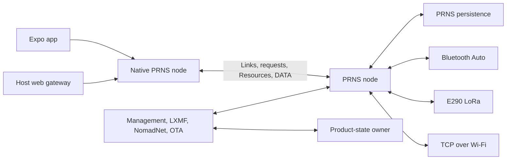

# Architecture

The firmware is a standalone Reticulum appliance. PRNS owns the Reticulum
node, every packet interface, and all network protocol state. Product code
registers ordinary Reticulum applications above PRNS and owns their durable
state. A phone, desktop process, or browser gateway is another Reticulum node,
not the runtime host for the appliance.

The design has five durable rules:

1. PRNS behavior remains independent of product applications and E290 policy.
2. Each hardware or persistent resource has one explicit owner.
3. Accepted product intent is persisted before product success is reported.
4. Reticulum proofs and receipts keep Python RNS and PRNS semantics; product
   durability does not redefine them.
5. Rust owns protocol and persistence types; generated bindings carry product
   operations to TypeScript and native platforms.

## Runtime

Bluetooth Auto, LoRa, and TCP are Reticulum packet interfaces with the same
application semantics. There is no separate BLE device-control protocol,
custom GATT/HDLC session, or TypeScript-owned Reticulum engine in the supported
design. USB Serial/JTAG remains a diagnostic and recovery channel.

## Applications and destinations

The default image derives three protocol destinations from one durable
Reticulum identity:

| Destination | Purpose | Policy |
| --- | --- | --- |
| `reticulum.appliance` | Public identity, authorized management, enrollment, and OTA | Ratcheted Links; privileged paths require an identified allow-listed requester; Resource reception starts closed |
| `lxmf.delivery` | LXMF delivery and announce | Python-compatible immediate proofs |
| `nomadnetwork.node` | Bounded NomadNet page service | Public request endpoint |

Opt-in RMAP publication adds `rnstransport.discovery.interface` as an
announce-only fourth destination. Destinations are protocol rows, not flash
partitions. Adding or removing an application does not create another physical
board layout.

Application behavior belongs above PRNS. Management request bodies, LXMF wire
and signature semantics, NomadNet content, RMAP payloads, OTA manifests, and
product retry policy do not belong in the PRNS engine.

## Portable and target-specific code

The exact PRNS revision pinned in `Cargo.toml` supplies the network engine,
routing, Links, requests, Resources, persistence, Bluetooth Auto, host and
embedded runtime adapters, and the generic live-engine inspection lane. This
repository supplies:

- E290 peripheral composition and memory placement;
- E290 configuration of PRNS's public LoRa and Bluetooth interfaces;
- application protocols and typed product request handlers;
- generic product-state quotas and application stores;
- native and host PRNS clients; and
- the Expo presentation layer.

An E290-specific fact remains here unless it is independently reusable by
other PRNS boards. A PRNS change requires a demonstrated generic gap that
cannot be expressed through its public API; preserving an alpha-era product
abstraction is not sufficient justification.

The complete appliance requires PSRAM. PRNS's bounded engine storage,
application-event copies, message indexes, and display framebuffer can live in
mapped external memory. Task stacks, synchronization primitives,
interrupt-visible state, controller memory, DMA buffers, and cache-off flash
state require audited internal memory.

## Ownership and concurrency

The target uses bounded lanes and sole owners:

- one PRNS node owner holds all Reticulum state;
- one interface task owns each LoRa, TCP, or Bluetooth Auto lane;
- one Trouble/ESP controller owner serves Bluetooth Auto and Wi-Fi coexistence;
- one product-store owner serializes application-state and OTA flash access;
- one independent PRNS persistence owner holds routes, ratchets, and timebase;
- one Wi-Fi task owns station association and IP configuration; and
- one display task owns its SPI bus, framebuffer, panel power, and refresh.

Application callbacks copy borrowed PRNS events into bounded owned lanes before
awaiting. Lane exhaustion is an observable product fault; it does not change
PRNS deduplication, proof timing, or retry behavior.

## Routing and interface roles

LoRa is an Internal interface and the public TCP uplink is a Boundary
interface. PRNS owns forwarding, path discovery, recursive path requests,
source-bound responses, receipts, and interface lifecycle. Product code does
not retain a second route table or special-case public TCP traffic onto LoRa.

Bluetooth Auto peers are dynamic PRNS interfaces. The E290 storage profile
retains one LoRa lane, one optional TCP lane, and one Bluetooth Auto fleet lane,
with four live Bluetooth peers and explicit bounded queue capacities.

## Durable messaging

Outbound LXMF intent is committed to the product journal before the appliance
reports application acceptance. The exact signed wire and LXMF message ID are
stable across product retries. Each PRNS send uses fresh transport state, and
an ordinary PRNS receipt advances the product's delivered marker. Product
acceptance does not claim socket completion, radio `TxDone`, or durable PRNS
custody.

Incoming LXMF follows Python behavior. PRNS may emit its immediate Reticulum
proof before the product parses or persists the message. Product code then
records the message as `validated`, `source unknown`, or `invalid`, deduplicates
by LXMF message ID, and commits it to the inbox. The residual power-loss window
between proof and persistence is accepted and tested; there is no deferred-
proof extension.

The client imports messages into an identity-bound SQLite database and advances
a separate durable collection watermark only after a contiguous import. Human
read state is app-local and distinct from board collection state.

## Storage

The bootloader sees only two OTA slots, `otadata`, one generic
`product_state` arena, and one independent `prns_state` arena. Typed quotas
inside `product_state` currently cover identity, network configuration,
management authorization, appliance settings, LXMF mailbox state, outbound
intent, and inbound payloads. The appliance label is product UI metadata, not
Reticulum application announce data. These are product-store format choices,
not partitions per app.

The alpha migration is a clean reset boundary. Earlier product formats and
client SQLite databases are not imported. See the
[partition contract](../partitions/README.md) for exact ranges.

## Management and security

An app owns a normal Reticulum identity and explicitly identifies its Link.
GPIO21 physical presence opens a short single-use enrollment window. The
product durably adds the identified peer hash to its bounded allow-list, then
asks PRNS to admit that requester on the privileged management and OTA paths.
PRNS remains the sole live request gate.

Link encryption and identified-requester authorization replace the old device
credential, possession-proof, and BLE-bond authority. Bluetooth bonding may be
a platform transport detail, but it is never application authorization.
Product and PRNS state are not encrypted at rest in the alpha image.

## OTA

OTA uses ordinary PRNS requests and Resources on the shared management
destination. One identified Link opens a session, then sends ordered 7 KiB
application chunks. PRNS verifies each bounded Resource; the product closes the
per-Link Resource gate, writes and reads back the chunk, and explicitly arms
the next one. The complete image digest and ESP structure are checked before
the inactive slot is selected.

Staging, activation, explicit reboot, the rollback-enabled bootloader build,
and a 30-second post-start health confirmation are implemented. The product
uses ESP-IDF's `otadata` state instead of maintaining an application-specific
last-known-good record. Generated app UI and powered Bluetooth Auto, LoRa, TCP,
and rollback qualification remain required. See [OTA updates](ota-updates.md).

## Clients

The native mobile module and host web service each own one persisted PRNS node.
They discover the public management path, establish and identify fresh Links,
and expose typed product operations to the existing Rust SQLite/sync actor.
TypeScript owns presentation and platform integration, not packet routing,
identity secrets, or durable message state.

The web build uses `appliance-service`; direct Web Bluetooth is not a supported
network implementation.

## Source of truth

- Python RNS 1.4.2 and Python LXMF 1.0.1 are compatibility authorities.
- The exact PRNS git revision in `Cargo.toml` and `Cargo.lock` is the network
  implementation input.
- Rust types and wire tests define product application protocols.
- The checked partition CSV defines physical flash geometry.
- Generated TypeScript, UniFFI, native bindings, and web assets must match their
  Rust sources.
- Powered behavior is proven only by the corresponding device/network test.
