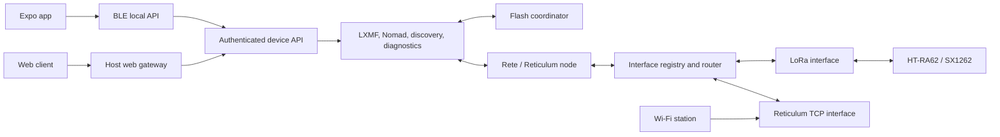

# Architecture

The firmware is a standalone Reticulum node. It owns routing, radio access,
application services, and durable state; a phone or browser is a client of the
node rather than the node's runtime host.

The design has four durable rules:

1. Reticulum behavior is independent of a particular packet interface.
2. Each hardware or persistent resource has one explicit owner.
3. Accepted application intent is persisted before success is reported.
4. Rust owns protocol and persistence types; generated bindings carry them to
   TypeScript and native platforms.

## Runtime

BLE and the host gateway are local control bearers. They carry the authenticated
device API and are not Reticulum packet interfaces. LoRa is interface 1 and the
outbound TCP client is interface 2. A future Ethernet, USB, BLE, or second-radio
packet interface joins the router beside those interfaces without changing
application or storage ownership.

A **control bearer** transports the authenticated device API to a nearby
client; a **packet interface** carries Reticulum traffic. The two terms name a
durable boundary. A future USB or RNode host-control bearer replaces only the
BLE bearer profile (`device-api-ble`) and reuses the portable framing, session,
and handoff crates, while a future BLE packet interface would be a new actor
beside LoRa and TCP, distinct from the BLE control bearer. See the
[crate index](reference/crates.md#control-bearer-vs-packet-interface) for the
package mapping.

## Portable and target-specific code

Portable crates contain Reticulum adaptation, LXMF, NomadNet, routing, device
API, persistence, and client behavior. Target crates contain board facts and
physical drivers. The E290 composition connects them and owns task scheduling,
memory placement, and peripheral construction.

The main ownership boundaries are:

| Layer | Primary packages |
| --- | --- |
| Reticulum protocol | `rns-rete`, `node-core`, `nomad-protocol` |
| Packet interfaces | `interface-router`, `tx-supervisor`, `tx-handoff`, `radio-*` |
| Durable messaging | `storage-*`, `submission-*`, `lxmf-*` |
| Local control API | `device-api` and its framing, session, pairing, credential, BLE, client, and adapter packages |
| Client data and sync | `appliance-store`, `appliance-sync`, `appliance-runtime` |
| Client adapters | `appliance-native`, `appliance-service`, `host-ble` |
| E290 target | `board-e290`, `board-e290-radio`, `firmware/e290` |

Keep a behavior in its owning package. Add a module or integration test before
creating another package; a new package should represent a durable ownership,
portability, or dependency boundary rather than a development milestone.

A new board should provide:

- an exhaustive pin and board-facts module;
- a radio wrapper for its module, oscillator, RF switch, and power path;
- a flash and memory profile;
- a firmware composition selecting portable services; and
- target and powered tests specific to that hardware.

The full appliance requires PSRAM. Large protocol objects, indexes, and the
display framebuffer can live there. Task stacks, synchronization primitives,
interrupt-visible state, Wi-Fi/BLE controller memory, DMA buffers, and
cache-off flash state require audited internal memory.

The fixed route-diagnostics snapshot and radio-trace ring are plain,
task-owned backing storage in PSRAM. The radio diagnostics mutexes, pending
correlation owner, and all interrupt-visible radio state remain in internal
memory; no trace or route backing is accessed from an interrupt or cache-off
flash path.

## Ownership and concurrency

The target uses bounded queues and sole owners instead of sharing mutable
drivers:

- one radio task owns the complete SX1262 lifecycle;
- one node task owns Rete and application protocol state;
- one interface actor owns each packet link's ingress, egress, generation, and
  completion outcomes;
- one flash coordinator serializes persistent mutations across stores;
- one task owns each active local API bearer;
- one Wi-Fi station task owns association and IP configuration, while one TCP
  task owns the upstream Reticulum stream; and
- one display task owns its SPI bus, framebuffer, panel power, and refresh.

Cancellation, timeout, queue rejection, and link loss must return or reconcile
the exact owner. An interface generation prevents work retained for an old
connection from being reused after reconnect.

Cancelling an in-flight SX1262 future is a destructive hardware boundary. Once
the dispatcher has returned the exact completion and crossed any authorized
frame durability gate, firmware may use one rate-limited software reset to
reconstruct the consumed radio owner. An early repeat stays contained as an
interface-local fail-stop rather than rebooting the independent appliance.

## Routing and interface roles

The router operates on stable interface IDs and explicit targets. Medium-
specific behavior stays in its actor: the LoRa actor owns RNode framing,
CAD/backoff, airtime authorization, RF deadlines, and physical `TxDone`; the
TCP actor owns name resolution, connection backoff, HDLC framing, and stream
credit.

Interface roles constrain discovery forwarding. The local LoRa mesh is an
Internal domain and the public point-to-point TCP uplink is a Boundary. Announce
propagation follows Reticulum's mode matrix: a Boundary announce cannot enter an
Internal interface, while an Internal announce may cross the Boundary.
Recursive unknown-path search is a separate policy. An Internal request searches
every other online interface, and a Boundary request searches only other
Boundary or Gateway interfaces; every recursive request excludes its ingress
interface, including a shared medium. With the current two-interface gateway,
this lets LoRa discovery query TCP without reflecting onto LoRa and prevents a
public TCP query from becoming LoRa traffic.

Path requests are deduplicated by their exact destination and tag. An unknown
recursive request retains its original requesting interface for 15 seconds,
even when no eligible egress is online, so a newly learned matching path returns
as an exact source-only `PATH_RESPONSE`. Known and local responses are likewise
source-bound. A `PATH_RESPONSE` can restore a missing path but is never queued
as an ordinary announce rebroadcast. The embedded pending-discovery and delayed-
response queues are bounded, coalesce by destination where Reticulum does, and
fail closed with observable counters when full. Addressed DATA, proofs, and
Links remain routed by Reticulum rather than by a bearer-specific shortcut.

## Durable messaging

Outbound application intent is committed before the device reports acceptance.
One durable submission remains the authority while Reticulum discovers a path,
sends opportunistically or through a direct Link, waits for a proof, retries,
and recovers after reboot. Automatic retry is board-owned so delivery continues
when every app is disconnected. A retry keeps the same signed LXMF message and
message ID while each Reticulum attempt gets fresh transport state.

Inbound LXMF uses the opposite barrier. A proof is retained until a validated
message is newly committed or confirmed already durable. Only then may the
proof leave the node. A sender therefore cannot observe delivery before the
receiving appliance can recover the message.

Each inbound record may retain its first-arrival interface and paired RSSI/SNR.
This is final-hop evidence measured by the receiver and may describe a relay;
it is not end-to-end hop history. A separate bounded radio trace records route
selection, DATA dispatch, physical frame completion, logical receive, and
proof/timeout events without retaining payload bytes.

The app imports messages into an identity-bound SQLite database and advances a
separate durable collection watermark only after a contiguous import. Human
read state is app-local and distinct from board collection state.

## Device API and clients

All local bearers expose the same bounded, versioned logical API. It covers
identity, capabilities, LXMF, NomadNet, nearby peers, network configuration,
announces, diagnostics, radio traces, and mailbox collection. Bearer framing,
authentication, and connection lifecycle sit below those operations.

The Expo UI does not implement Reticulum. Its native Rust owner holds device
credentials, authenticated sessions, per-appliance SQLite databases, and
message synchronization. Rust DTOs generate TypeScript with `ts-rs`; UniFFI
and the Expo TurboModule expose the native boundary. TypeScript owns
presentation, platform BLE calls, and opaque byte transport only.

The web build uses the same source tree through the supported host gateway. It
does not connect directly to BLE from the browser.

## Location and notifications

Three location concepts remain separate:

- an optional sender location signed into one LXMF message;
- private phone observations attached to local transmission diagnostics; and
- explicitly enabled public RMAP location.

None is board GNSS or Reticulum routing metadata. The receiver may combine a
message's sender location with its own import-time phone location for mapping,
distance, and elevation display.

The board's `NEW` indicator derives from durable uncollected ingress. The app
reconciles durable imported activity into local notifications while active or
resuming. Reliable locked-phone delivery needs a later native background BLE
lifecycle.

## Security boundary

Bluetooth bonding protects the nearby BLE link. A separate device credential
authorizes application operations. GPIO21 confirms physical presence and the
e-paper panel displays the Bluetooth passkey. Device credentials and Bluetooth
bonds are separate durable authorities.

The alpha stores identities, credentials, configuration, journals, and message
content without at-rest encryption. Public TCP peers can observe connection
metadata even though Reticulum protects application payloads end to end.
Multi-user policy, revocation, secure backup, credential rotation, background
mobile operation, and broader pairing fault coverage remain future work.

## Source of truth

- Rust types and wire tests define the device API.
- Checked partition CSV files define flash geometry.
- `Cargo.toml` and `Cargo.lock` define dependency resolution.
- Generated TypeScript and native bindings must match their Rust sources.
- This document defines current system boundaries rather than release claims.
