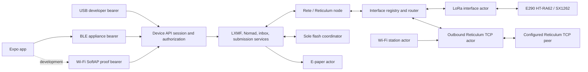

# Current architecture

The firmware is a standalone Reticulum node with one powered-qualified LoRa
packet interface, one outbound TCP packet interface with bounded powered
bring-up and stream evidence, and several local-client bearers. Its central
design rule is that Reticulum routing, application services, and persistence
do not depend on a particular board, radio, or phone connection.

The current E290 appliance combines:

- Rete-based Reticulum routing and Link behavior;
- one HT-RA62-HF/SX1262 LoRa interface;
- durable LXMF receive, client-collection watermark, and outbound-submission
  owners;
- a bounded Nomad/Micron request service;
- an authenticated BLE device API and secure onboarding path;
- durable Wi-Fi-station, outbound-TCP, announce, and public-discovery policy;
- an e-paper status/pairing actor; and
- a universal Expo client whose native core owns credentials and message
  databases.

## Runtime boundaries

USB, BLE, and the Wi-Fi SoftAP proof are local appliance-control bearers. The
Wi-Fi station is instead network access for a distinct outbound Reticulum TCP
client. LoRa uses packet-interface ID 1; the TCP actor uses ID 2. Its powered
proof covers connection, native ingress, and local announce writes. A future
BLE, USB, Ethernet, or second-radio Reticulum interface joins
beside them through the registry/router; it does not replace the local device
API or cause every packet to be broadcast on every bearer.

The second interface's bounded powered proof is not a standards-complete
border-routing claim. Pinned Rete lacks the complete public TCP **Boundary**
and LoRa **Access Point** mode behavior specified by Reticulum. Those semantics
and two-way public-network forwarding remain explicit qualification gates.

## Transport-neutral node

`reticulum-node-core`, `reticulum-interface-router`, and
`reticulum-tx-supervisor` operate on stable interface IDs and explicit packet
targets. Each interface owns:

- its ingress and egress queues;
- online generation and reachability state;
- MTU, bitrate, cost, and capabilities;
- completion and backpressure outcomes; and
- any medium-specific scheduling or airtime policy.

The router gives DATA and ordinary packets only to the selected interface
actor. Interface generations prevent stale owners from being silently reused.
The current LoRa implementation keeps RNode framing, SX1262 configuration,
CAD/backoff, airtime reservations, regional profile, and radio deadlines
inside its actor. The TCP implementation independently owns DNS resolution,
connection/backoff state, HDLC framing, bounded stream credit, and interface-2
online generations.

## Board and radio portability

Portable crates contain Reticulum, LXMF, storage, API, and routing behavior.
Board crates contain exhaustive pin ownership and hardware facts. Radio owner
crates bind a particular RF topology to the portable LoRa state machine.

This distinction matters even where boards use the same SX1262 pins. The E290
HT-RA62 owns internal DIO2 RF switching and DIO3 TCXO control, while the
Tracker V2 uses a different external front-end policy. A new board should add:

1. a board-facts/pin-ownership crate;
2. a radio wrapper for its module and RF path;
3. a partition/memory profile;
4. a firmware composition selecting portable services; and
5. host, target, and powered qualification specific to that hardware.

The full feature set is not constrained to boards without PSRAM. The complete
E290 appliance requires at least 8 MiB of detected PSRAM and fails closed
otherwise. Components remain feature-selectable so a separately qualified
smaller-board profile can omit client, display, storage, or service owners
without redefining the product architecture; maintaining a non-PSRAM full
profile is not a goal.

## Ownership and scheduling

The target uses bounded static channels and explicit sole owners rather than
shared mutable drivers:

- one LoRa task owns the radio and physical packet lifecycle;
- one node task owns Rete and application protocol state;
- one storage coordinator owns flash mutation and operation-scoped store
  access;
- one enabled management-bearer task owns each USB, BLE, or Wi-Fi SoftAP
  connection lifecycle;
- one Wi-Fi station task owns association and DHCP, while one TCP task owns the
  configured upstream Reticulum stream; and
- one display task owns SPI3, the framebuffer, panel rail, refresh, sleep, and
  completion handoff.

PSRAM holds the resident node/supervisor, large tables, replay scratch, message
indexes, and the display framebuffer. The active Xtensa stack, task pools,
channels, radio buffers, and IRQ/DMA/cache-off state remain internal. Control
paths and time-critical ownership stay bounded. Backpressure is explicit;
cancellation or a full queue must return or reconcile the exact owner rather
than leaking it.

PSRAM is not a substitute for strict internal controller memory. The former
72 KiB internal-heap profile reduced the Wi-Fi static RX pool from ten buffers
to four and its receive block-ack window from six to two. Wi-Fi/BLE station
builds now provide 120 KiB of strict internal heap and restore the pinned
driver's ten-buffer, six-window defaults. A powered 618-second coexistence run
kept BLE and public TCP online while completing 282 LoRa transmissions without
an allocation, station, TCP, BLE, panic, or reset fault. Longer pressure and
disconnect/recovery qualification remain open.

## Durable messaging

Outbound application intent is persisted before the device acknowledges
acceptance. A submission moves through durable states while Reticulum path
discovery, opportunistic DATA, or direct-Link delivery executes. Delivery
proofs update the same journal record.

An optional phone fix is part of that application intent, not an interface or
route property. The app commits it with the outbox material, API 1.17 carries a
typed snapshot, and the board encodes Sideband-compatible LXMF telemetry before
signing. Every retry reuses the same complete message and location. Reticulum
routers continue to treat the LXMF payload as opaque; only the client semantic
layer projects the recognized location for storage and display.

Inbound LXMF uses the opposite barrier: the Reticulum packet proof is retained
until the validated message is newly committed or a retransmission is
confirmed already durable. Only then may the firmware release the proof. This
prevents a sender from observing `Delivered` before the receiving appliance
can recover the message after reset.

LXMF physical format 2 commits the authoritative first-arrival interface and
optional paired RSSI/SNR with the message. Format-1 records remain readable but
have no such evidence. The values describe the receiver-local final hop and
may come from a relay. Once a format-2 record is appended, a format-1 firmware
rollback cannot safely mount the mixed store.

After the phone durably imports a contiguous inbox scan, it advances a separate
power-loss-safe appliance collection watermark. The watermark is bound to the
acknowledged message ID and exact wire digest so an erased/recreated LXMF store
cannot hide new messages behind a recycled numeric handle. It drives the
e-paper `NEW n` indicator but remains distinct from app-local human read state.

The current message storage design is append-only and bounded. Reclamation,
retention, compaction, migration, and encryption at rest remain separate
product work.

## Local device API

All local bearers expose the same logical request/response protocol:

- version and capability discovery;
- public appliance identity;
- durable submission and status;
- LXMF list/read/send plus durable mailbox collection status/acknowledgement;
- raw RNS qualification operations;
- peer announce projection;
- bounded Nomad page requests;
- redacted Wi-Fi/TCP, announce, and RMAP configuration;
- a coalescing manual service-announce request;
- bounded cross-interface, LoRa, Reticulum-counter, and retained-route
  diagnostics;
- the API 1.14 one-shot Reticulum path-and-proof probe;
- the API 1.16 boot-aware packet-correlated radio trace; and
- current API 1.17 optional Sideband-compatible location on basic LXMF send.

Bearer-specific framing and session suites sit below those semantic DTOs. The
credential authority, authorization snapshot, and service adapters remain
transport-neutral.

Diagnostics use a separate read-only `NodeDiagnosticsPort` and copy bounded
snapshots across the API boundary; they do not lend the app mutable access to
the router, radio, or actor owners. A retained route records local routing
evidence rather than peer reachability. Its last-local-use age is Rete's local
LRU activity, not last-heard time, and the LoRa last-RX signal is conservative
whole-packet metadata for the most recently accepted logical packet (the
field-wise weaker RSSI and SNR across both frames for a split packet).

The trace path keeps a 32-event boot-scoped ring beside that snapshot. Route,
terminal DATA dispatch and physical `TxDone`, logical LoRa RX, and
proof/timeout events cross the authenticated API in bounded pages without
payload bytes. The app imports them idempotently into the schema-7 trace tables
retained by current SQLite schema 8 and uses the
durable submission ID plus Reticulum attempt token to associate them with the
existing message attempt and its queue-time phone-location stamp. Board
monotonic time, app import wall time, and phone sample time remain separate.
Ring overwrite or reboot-before-import is surfaced as incomplete history.

The probe uses a separate volatile `ReticulumProbePort` and the ordinary
transport-neutral packet/proof path. It establishes reachability to an enabled
remote `rnstransport.probe` responder, not LXMF availability, throughput, or
remote request RSSI. The returning proof's signal is measured at this
appliance on its final hop and may describe a relay; public nodes may disable
the responder.

The current usable appliance profile selects BLE. USB remains a development
and recovery path, while the SoftAP is a separate proof bearer. Adding a
concurrent management bearer must preserve globally unambiguous connection
epochs, one pairing-exclusivity owner, and disjoint reply ownership.

## Gateway and public-discovery policy

Board-owned configuration retains up to four Wi-Fi profiles and one active
outbound TCP peer. That peer can be a literal IPv4 address or a hostname, which
is resolved again for each reconnect. A global Wi-Fi switch suppresses station
and TCP startup without deleting these saved values. Material mutations are
durable and apply only after reboot.

Automatic ordinary service announces are a separate policy. The authenticated
**Announce now** operation queues one spacing-aware primary, LXMF, and NomadNet
cycle even when that periodic policy is off; repeated requests coalesce while
one cycle is pending.

RMAP participation is a third, opt-in policy. When enabled, an announce-only
`rnstransport.discovery.interface` destination publishes signed and
proof-of-work-stamped `RNodeInterface` metadata every six hours. Optional
location is captured once from the phone in the foreground, rounded before
being stored as fixed E6 latitude/longitude, and published without altitude.
RMAP state can remain visible for up to seven days after the last announce, so
disabling it is not an immediate public retraction.

The app's endpoint presets are convenience metadata for the one active peer,
not trust anchors. Reticulum keeps application payloads end-to-end protected,
but a public TCP carrier can still observe the appliance IP, timing, volume,
and availability and can drop traffic.

## App boundary

The Expo UI does not implement Reticulum routing. The board continues
receiving, forwarding Reticulum packets, routing, and storing application data
while the app is absent. Reticulum transport forwarding here is distinct from
the future LXMF propagation service.

Rust is the source of truth on both sides of the native boundary:

- serialized API DTOs generate TypeScript through `ts-rs`;
- the native credential, authenticated session, SQLite profile, and LXMF state
  are exposed through UniFFI and a TurboModule; and
- TypeScript owns presentation, platform BLE operations, and bounded opaque
byte transport, but not credential bytes or duplicate wire types.

The app queries the same durable radio-trace rows globally and per message. A
complete paginated snapshot can be exported as JSON or RFC 4180 CSV. It is
local diagnostic evidence, not a synchronized two-appliance measurement: an
outgoing trace cannot supply the remote receiver's RSSI, and exported
queue-time coordinates may be older than the RF event.

Message location is a separate generated DTO. The composer may request a fresh
foreground phone fix for one message, while its durable default only chooses the
initial state of that per-draft switch. Sent and received timeline rows expose
the signed location with an OpenStreetMap action. It must not be conflated with
private queue-time field telemetry, public RMAP location, board GNSS, or RF
position.

Web uses the same-origin host service. Native iOS and Android builds embed the
Rust bridge and use foreground BLE by default. While the JavaScript process is
active or resumes, the app reconciles its durable inbound-import activity into
deduplicated local notifications. Taps select the owning appliance profile and
conversation. Reliable locked-phone delivery remains a later native BLE
restoration/companion-device phase; the board retains both the message and its
display indicator while the phone is absent.

## Security model

Bluetooth bonding authenticates the nearby radio link. A separate device API
credential grants appliance operations. GPIO21 physical presence binds the
selected GATT connection to onboarding, and the e-paper panel displays the
passkey.

The current alpha deliberately favors a usable core over final hardening:

- identity, credentials, journals, and messages are plaintext at rest;
- the wireless device API is authenticated but does not add a final
  application-level confidentiality layer;
- public TCP carriers are untrusted and expose connection metadata even though
  Reticulum payload protection remains end to end;
- RMAP identity, radio parameters, and enabled location are intentionally
  public and may outlive the current configuration in propagated map state;
- one durable BLE bond is retained per board;
- multi-phone authority, revocation, secure backup, credential rotation, and
  recovery UX remain open; and
- BLE background restoration and the full negative pairing matrix are not yet
  qualified.

## Firmware profiles

| Feature/profile | Purpose |
| --- | --- |
| `ble-api-proof` | Current turnkey E290 appliance: LoRa, BLE device API/onboarding, and display |
| default/no features | Headless USB-oriented developer composition |
| `display` | Display composition without BLE |
| `wifi-api-proof` | Wi-Fi SoftAP/local API proof |
| `wifi-tcp-proof` | BLE-managed Wi-Fi station plus outbound Reticulum TCP interface; bounded powered startup, connection, ingress, local-write, and 420-second stability proof, but not full border-routing qualification |
| `runtime-measurement-hil` | Instrumented memory, stack, scheduler, and durability HIL |
| `rns-inbox-commit-fault-hil` | Deliberate storage commit-fault qualification |

Exceptional HIL features are not production profiles and are intentionally
isolated in separate target directories.

## Further detail

- [Architecture decisions](../adr/README.md)
- [Interface router](../interface-router.md)
- [Permanent E290 dossier](../e290-node.md)
- [Device API](../api/device-api-v1.md)
- [Partition layout](../../partitions/README.md)
- [Current limits](../status.md)
- [Dependency provenance](../provenance.md)

The older [architecture and feasibility record](../firmware-architecture.md)
preserves the original research survey, compile experiments, staged design,
and revision-bound evidence. This overview is the canonical current system
description.
