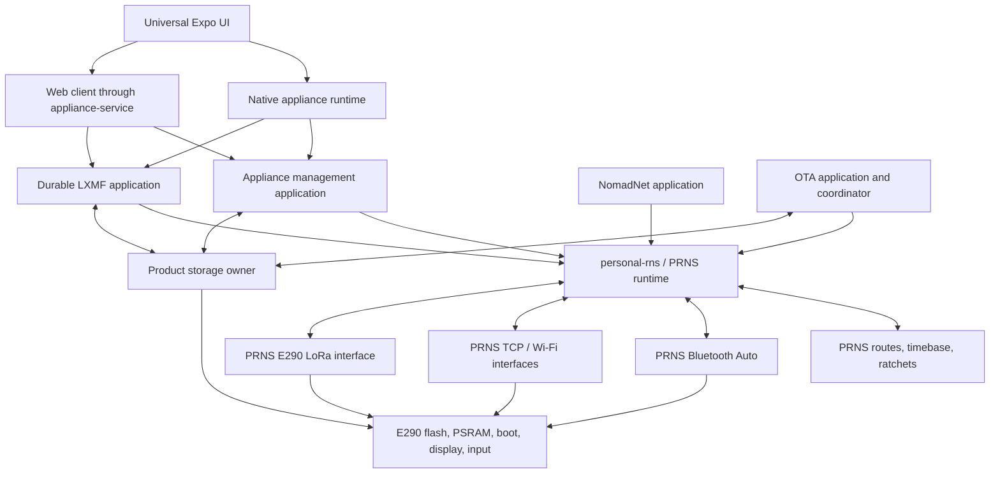

# Rete-to-PRNS migration plan

> Status: the source cutover is implemented in this worktree. The Rete source
> and dependency cleanup gates pass, and basic powered iOS/LoRa messaging works;
> clean-clone, full network/mobile interop, durability, and rollback
> qualification remain open. This document is not a permanent compatibility
> specification and does not authorize an external issue or pull request.

## Decision

PRNS becomes the only Reticulum implementation used by the firmware, native
clients, host service, tests, and documentation. The product does not preserve
the current Rete-shaped node, router, permit, or BLE abstractions as a lasting
facade.

The migration uses two repositories with a one-way dependency:

1. The `evelant/Prns` fork contains generic Reticulum behavior, runtimes,
   interfaces, reusable platform support, and changes suitable for contribution
   to upstream PRNS.
2. This repository contains the appliance's Reticulum applications and product
   policy: LXMF, management, enrollment, durable messaging, OTA, client state,
   E290 product composition, and the universal Expo application.

The product pins one exact PRNS fork revision until the required changes are in
an upstream release. It then moves to that exact released version. The checkout
under `reference/Prns` is review material, not a build input, vendored copy, or
source of locally patched product code.

This split gives PRNS ownership of the network and gives the product ownership
of what it does on that network.

The default engineering response to a mismatch is to simplify or reshape this
product around PRNS. Alpha-era product invariants are not requirements on
PRNS. A PRNS change is a last resort: the product must first demonstrate that
the capability cannot be expressed through unmodified public APIs, and the
proposed change must stand on its own for unrelated Reticulum applications or
boards. Product convenience, preservation of old architecture, or avoidance of
an alpha reset is not sufficient justification.

## Required outcomes

The migration is complete only when all of the following are true:

- No product target or client links a `rete-*` crate.
- `vendor/rete`, its submodule declaration, its Cargo patches, and its doctor
  checks are removed.
- PRNS owns destinations, packets, routing, path discovery, proofs, receipts,
  Links, requests, channels, Resources, route and ratchet persistence, and all
  Reticulum packet interfaces.
- PRNS Bluetooth Auto replaces the proposed custom RNS-over-GATT/HDLC interface
  on the E290 and in native mobile clients.
- Configuration, diagnostics, enrollment, mailbox access, LXMF, NomadNet,
  RMAP, probe orchestration, and OTA are explicit Reticulum applications above
  PRNS.
- The firmware still operates, receives, retries, routes, and stores without a
  connected app.
- Product-originated intent is durable before the product API reports
  acceptance. Reticulum receipt and proof timing remains exactly PRNS/Python
  behavior and is not treated as a durable application acknowledgment.
- Incoming delivery uses PRNS's immediate proof behavior. The product accepts
  the resulting crash window between Reticulum proof emission and application
  persistence instead of extending PRNS with deferred proofs.
- This alpha migration is a clean reset boundary. Old app SQLite schemas are
  rejected, and development boards are erased and reprovisioned instead of
  importing product, Rete, or PRNS state from an earlier image.
- Device API 6.0 and LXMF-store format 5 carry PRNS's complete eight-byte
  interface identity and PRNS-native interface/route diagnostics. API 4.x,
  earlier app schemas, and earlier LXMF-store
  formats are rejected rather than translating one-byte Rete interface slots.
- Python RNS and Python LXMF are the independent authorities for protocol and
  application compatibility.
- There is no permanent dual stack, compatibility facade, duplicate router,
  duplicate BLE owner, or old device-control bearer left behind.

## Authority and semantic rules

The currently checked-out authorities are:

- Python RNS 1.4.2, commit
  `b48b96e61676504e0a4e527b33b9a0b4495c6872`, under
  [`reference/Reticulum`](../../reference/Reticulum/).
- Python LXMF 1.0.1, commit
  `fab12ad9bf9f997797034950f289fe41a79dcf5a`, under
  [`reference/LXMF`](../../reference/LXMF/).
- The reviewed PRNS base is the `trunk` branch at fork/upstream commit
  `f7872d6fcad9c5ba33b942bc19bb183f2b4a0d13`, reporting `personal-rns`
  0.3.6, under [`reference/Prns`](../../reference/Prns/).

The product `Cargo.toml` and lockfile pin published PRNS commit
`b763fb5076a965d6eb411923c387e3805f47e40a` on
`codex/embassy-accepted-announce-observer`. It contains two generic commits
above the reviewed `trunk` base. The first adds a bounded Embassy query lane
for live route, link, and interface diagnostics. The second adds an
allocation-free borrowed callback for complete announces after ordinary PRNS
admission. Neither mirrors topology, introduces product DTOs, or changes
Reticulum protocol behavior. The exact revision is reachable from the recorded
fork and resolves in a clean checkout.

Two experimental candidates are review material and are not build inputs:

- `codex/link-binding-events` at
  `746253ccb2d48845337d5ef8d638434b910bc171` exposes the responder's local
  destination hash on borrowed Link-delivery events.
- `codex/announce-identity-events` at
  `07ed119e9f999ab84524f23be3acda9076aee18e` additionally carries the already
  verified public identity on accepted-announce diagnostics.

Neither candidate is a product build input.

Implementation starts from that unmodified `trunk` revision. The local
`codex/e290-prerequisites` branch is retained only as experimental review
history; its metadata, dependency-alignment, proof-order test, and Embassy
metric commits are not migration prerequisites or product build inputs. A
product inconvenience is not enough reason to change PRNS. First use PRNS's
public recipes, storage-layout extension point, events, and commands as they
exist. Propose a fork change only after a required capability cannot be
expressed through those APIs and the correction is independently useful to
other Reticulum applications or boards.

The Link-delivery attribution candidate records one possible public-API gap to
reevaluate when direct Link-based multi-application delivery is implemented.
PRNS retains the accepting destination in responder Link state while
unmodified `trunk` publishes only the Link ID with delivered Link data. The
product does not yet depend on a particular solution: it must first try the
ordinary application request, Resource, and Link lifecycle APIs and demonstrate
that a second authority would otherwise be unavoidable. Resource attribution
and other adjacent event fields are not added speculatively.

The accepted-announce callback in the selected revision supplies the complete
already-authenticated observation for bounded application projections. It does
not make an announce a prerequisite for LXMF delivery. Python LXMF accepts a
structurally valid message when its source identity is unknown, records that
signature state, and still invokes application delivery; invalid signatures
are likewise delivered with their state recorded. The product persists
`Validated`, `SourceUnknown`, or `Invalid`, keeps PRNS's optional
destination-identity cache disabled, and adds no identity-wait queue. Mobile
discovery consumes the accepted-announce callback and verifies management
candidates through the public application path.

The full selected PRNS commit, upstream base, and exact Python pins are recorded
in product lockfiles and interoperability metadata. An unpinned reference
checkout and PRNS itself are not protocol authorities.

### Python-derived decisions

| Concern | Python behavior | Product decision |
| --- | --- | --- |
| Delivery proofs | RNS resolves `PROVE_ALL`/`PROVE_APP` synchronously. Python LXMF proves a delivery packet before parsing or invoking the application delivery callback. | Use PRNS's existing immediate proof behavior without a deferred-proof extension. Durable application persistence happens after delivery and cannot redefine the Reticulum proof. |
| Outbound acceptance | Python creates a receipt after selecting and attempting an interface handoff; it does not wait for socket completion, radio `TxDone`, or durable driver custody. | A PRNS command is network work, not durable product acceptance. Persist product intent before issuing it and reconcile the existing PRNS settlement. Do not add a stronger egress-admission or physical-`TxDone` invariant to Reticulum. |
| Request authorization | A Python Link initiator explicitly calls `identify()`. The responder exposes the remote identity and can allow request handlers by identity. | Management and OTA run over an identified Link. The product allow-list contains Reticulum identity hashes, not a second bearer credential. |
| Resource acceptance | Python lets the application accept or reject an offered Resource, then the Resource protocol owns transfer and hash verification. | Use PRNS's existing in-memory Resource reception. OTA divides images into application-level bounded Resources and writes each verified Resource to flash before requesting the next. |
| Interface modes | Python owns forwarding and recursive path-request policy through interface modes, including Internal, Boundary, and Gateway. | Configure LoRa as Internal and the public TCP uplink as Boundary. Do not reimplement path policy in product routing code. |
| LXMF ownership | LXMF is an application over RNS and has independent parsing, signatures, stamps, message IDs, and routing policy. | Keep a separate LXMF application library and test it against Python LXMF. Do not put LXMF in PRNS core. |
| Application callbacks | Python callbacks may run synchronously or on background threads and do not provide embedded backpressure. | Use PRNS's existing callback/event behavior. Size product lanes explicitly and treat exhaustion as a product fault; do not change deduplication or proof timing to manufacture retryability. |

Product durability policy must remain above PRNS, be tested separately from
protocol conformance, and must not change PRNS state transitions, bytes, proof
timing, or peer-visible behavior.

## Target architecture



### Ownership rules

- One PRNS node owner holds all Reticulum state.
- One PRNS interface task owns each medium and its bounded lane.
- One Trouble/ESP Bluetooth owner serves Bluetooth Auto. A second firmware BLE
  stack is forbidden.
- One product storage coordinator owns application stores and OTA writes.
  PRNS persistence is a distinct client of the flash ownership boundary; it
  does not share mutable storage with application code.
- Application data uses one typed, versioned product store with bounded quotas,
  not a different flash partition layout for every enabled app combination.
  OTA executable slots are separate only because the ESP bootloader requires
  physical A/B image partitions.
- The default recipe has three protocol-required Single destinations:
  management/OTA, `lxmf.delivery`, and `nomadnetwork.node`. Opt-in RMAP adds an
  announce-only fourth row without changing storage. The old Rete-specific
  `rnstransport.probe` destination is not ported; path, receipt, Link, and
  command-settlement diagnostics come from PRNS itself.
- Application services consume owned, bounded events. They never retain a
  borrow into PRNS ingress storage across an await.
- TypeScript owns presentation and platform integration. Native Rust owns the
  mobile PRNS node, application clients, identities, and durable state.

## Repository boundary

### Changes that belong in the PRNS fork

The selected revision contains one generic Embassy parity change discovered by
exercising the unmodified public API: an allocation-free accepted-announce
observer equivalent to the existing Tokio observer. It reports PRNS-validated
announce evidence without application classification or routing mutation and
is independently tested in PRNS. Any further change is made only after the
public API has been exercised and a concrete blocking gap remains; it must be
generic, independently tested in PRNS, and free of appliance or LXMF policy.

1. **E290 platform support**
   - Keep Vision Master E290-HF product composition here first. Add reusable
     board facts or an e-paper driver to the Personal Hopspot board family only
     when another PRNS board can consume the same abstraction.
   - Configure and qualify PRNS's existing SX126x driver for the E290's TCXO,
     DCDC, RX gain, DIO2 RF switch, PA table, and raw `SetTxParams` values. The
     current PRNS rows already match the product's four qualified power points,
     and the current product intentionally leaves OCP at the chip default.
   - Add a generic driver change only for a demonstrated E290 hardware gap. Do
     not recreate the removed `lora-phy` overlay or alter PRNS engine behavior.
   - Port the independently valuable radio tests and powered acceptance
     evidence while keeping Python-compatible PRNS protocol behavior intact.

2. **Embedded Bluetooth dependency alignment**
   - Prefer PRNS's selected embedded graph and adapt the E290 composition to it.
     Change PRNS's ESP32 Bluetooth Auto graph only if the released PRNS graph
     cannot support a currently supported ESP platform.
   - Prefer an upstream release. Any temporary source pin or patch needs an
     owner and removal condition in the PRNS fork.
   - Preserve PRNS central/peripheral role negotiation, GATT/L2CAP fallback,
     Columba compatibility, peer capacity, and bounded backpressure.

3. **Generic mobile bridge improvements**
   - Consume the existing PRNS CoreBluetooth and Android BLE adapters first.
     Put a correction in PRNS only when it is independent of Expo and this
     product's lifecycle policy.
   - Keep Expo-specific DTO generation and product lifecycle policy here unless
     PRNS explicitly adopts a reusable React Native package.

Protocol and engine behavior stays on the selected PRNS `trunk` revision. Any
later fork change is limited to a demonstrated reusable platform gap, mobile
adapter correction, or Python-proven compatibility fix. It receives the narrow
owner tests plus the applicable PRNS oracle and live Python interop suites.
External publication waits for direct approval.

### Work that stays in this product repository

- LXMF wire parsing, signatures, stamps, announce data, message IDs, and other
  LXMF application semantics.
- NomadNet and RMAP application semantics, plus the product's probe and network
  evidence projections. Generic probe protocol behavior stays in PRNS when it
  already exists there.
- Durable inbox, outbox, mailbox collection, retry, and application
  deduplication. Incoming persistence does not delay PRNS proofs.
- Appliance management request paths, CBOR application payloads, diagnostics,
  network configuration, and physical-presence enrollment.
- The Reticulum identity allow-list and its durable product policy.
- OTA manifest policy, image validation, A/B partition ownership, activation,
  health confirmation, and rollback.
- The universal Expo UI, native product bindings, client SQLite store,
  synchronization, notifications, and profiles.
- Product display content, user input semantics, branding, and release
  packaging.
- Product-specific E290 composition, partitions, memory placement, diagnostics,
  and powered qualification.

No product crate may reach into private PRNS engine state. If an application
needs a generic fact, add a typed PRNS event, query, or command in the fork.

## Target product workspace

The workspace keeps only boundaries that have present product value. Protocol,
durable storage, client ownership, and board composition remain separate where
their tests and portability differ; phase-specific wrappers and one-off
migration crates are removed.

| Current package or module | Ownership |
| --- | --- |
| `lxmf-wire`, `lxmf-model`, `lxmf-ingress`, `lxmf-durable-ingress`, `lxmf-store`, `lxmf-mailbox-store` | Python-compatible LXMF parsing/composition plus product-owned durable inbox, outbox, deduplication, and collection policy |
| `device-api`, `network-config-store`, `peer-discovery`, `nomad-protocol` | Portable management, OTA, network configuration, discovery projection, and bounded NomadNet application protocols |
| `appliance-store`, `appliance-sync`, `appliance-runtime` | Client SQLite, application synchronization, scheduling, and presentation projections |
| `appliance-native`, `appliance-service` | Persisted mobile/host PRNS nodes and platform boundaries |
| `appliance-display-model`, `eink-ssd1680` | Portable display semantics and E290 panel driver |
| `firmware/e290` | E290 board facts, PRNS configuration, product identity/storage, applications, and hardware composition |
| `xtask` | Recurring build, package, ELF, and operator checks |

## Current-code disposition

### Removed alpha network graph

| Removed path | Current disposition |
| --- | --- |
| `vendor/rete` | Removed after its uncommitted request-preparation experiment was archived under ignored private evidence. Its stronger admission policy was not ported. |
| `crates/rns-rete`, `node-core`, `interface-router` | Removed. PRNS owns node state, routing, interface modes, and source-bound responses. |
| `crates/tx-supervisor`, `tx-handoff`, `radio-tx-dispatch` | Removed. PRNS commands, settlements, interface custody, pacing, and lifecycle are authoritative. |
| `crates/rns-interface-discovery`, `announce-clock` | Removed. PRNS Auto interfaces, persisted timebase, and announce pacing own network behavior; product service cadence remains application state. |
| `crates/device-identity-store` | Folded into `firmware/e290/product_identity`; this alpha reset provisions the product/PRNS identity without an old-state import path. |

### Replace legacy hardware abstractions through PRNS's public interfaces

Using a PRNS driver does not imply that PRNS must own this product's board
composition. E290 pins, power policy, partitioning, display integration, and
product diagnostics stay here by default. A piece moves to PRNS only if it is
already a natural extension of a public PRNS abstraction and is reusable by
other boards or applications.

| Former path | Current owner |
| --- | --- |
| `crates/board-e290` | Board facts are a module in `firmware/e290`; no PRNS E290 facade exists. |
| `crates/board-e290-radio`, `radio-interface`, `radio-lora-phy` | Removed. Product code configures PRNS's public SX126x driver and projects only product diagnostics. |
| `vendor/lora-phy-3.0.1` | Removed. PRNS's unmodified native SX126x driver is the sole radio implementation. |
| `crates/eink-ssd1680` | Retained as an independent product hardware crate with no Reticulum dependency. |

### Retained PRNS/application boundaries

| Current path | Current role |
| --- | --- |
| `crates/lxmf-wire`, `lxmf-model`, `lxmf-store`, `lxmf-mailbox-store` | Protocol and durable product state remain governed by Python LXMF vectors and application semantics. |
| `crates/lxmf-ingress`, `lxmf-durable-ingress` | Copy ordinary PRNS deliveries into bounded product ownership, then persist and deduplicate without delaying proofs. |
| `crates/network-config-store` | Persists product intent that `firmware/e290` translates into public PRNS interface configuration. |
| `crates/peer-discovery` | Projects accepted announces without retaining a second route or connection model. |
| `crates/nomad-protocol` | Remains an independent bounded Reticulum application. |
| `crates/appliance-store`, `appliance-sync`, `appliance-runtime` | Own client data and operations over one Reticulum session rather than physical transport-specific sessions. |
| `crates/appliance-native`, `appliance-service` | Own mobile/host PRNS nodes and expose product operations through existing Rust boundaries. |
| `crates/appliance-display-model` | Presents enrollment and PRNS-derived status without the removed passkey credential flow. |
| `firmware/e290` | Composes one PRNS recipe, PRNS interfaces, product applications, and the product storage owner. |

### Removed custom device bearer

The final management path is an application destination over a PRNS Link, not a
second encrypted protocol over a custom BLE GATT service.

| Former path | Current disposition |
| --- | --- |
| `crates/device-api` | Retains product operations and CBOR encoding without a transport session or bearer credential. |
| `device-api-adapter`, `device-api-ble`, `host-ble`, framing/handoff/session packages | Removed. PRNS Links, requests, Resources, and Bluetooth Auto replace the byte-stream stack. |
| credential, pairing, device-client, and bond-store packages | Removed. Identified-Link authorization, a durable identity allow-list, and physical-presence enrollment are the only supported management authority. |

Enrollment uses the ordinary Reticulum model:

1. The app discovers the appliance management destination over Bluetooth Auto.
2. It establishes a Link and identifies with its app-owned Reticulum identity.
3. The appliance accepts no privileged request from an unknown identity.
4. Physical presence opens a short, visible enrollment window.
5. An enrollment request durably adds the identified app identity hash to the
   allow-list before returning success.
6. Recovery or revocation mutates that allow-list under physical-presence and
   existing-authority policy.

No non-Reticulum bootstrap is present. Platform qualification must not add one
without a demonstrated platform limitation and an explicit architecture review.

## Migration phases

The migration runs on a dedicated branch. Intermediate commits may contain
temporary adapters, but no temporary Rete facade or dual control plane merges
into the final architecture.

### Phase 0: freeze and preserve evidence

1. Stop adding Rete-only BLE, Resource, routing, or mobile-node features.
2. Record the exact Rete, PRNS, Python RNS, and Python LXMF revisions.
3. Preserve the dirty `vendor/rete` diff and describe its intended behavior:
   preparing a single-packet request before its timeout starts.
4. Inventory Rete conformance tests, powered E290 evidence, RF policies, path
   rules, durability tests, and application tests. Assign every valuable
   assertion a destination in either the PRNS fork or product suite.
5. Mark records, partitions, generated APIs, and app databases that will reset.

Exit gate:

- No uncommitted Rete or ignored powered evidence can be lost by later removal.
- Every current invariant is classified as Python protocol behavior, generic
  embedded runtime policy, product application policy, or obsolete machinery.

### Phase 1: establish the PRNS fork and Python authority

1. Add the canonical upstream remote to the `evelant/Prns` fork and record its
   base commit.
2. Create focused fork branches only for platform dependency alignment, E290
   support, and reusable mobile adapters. Keep them independently reviewable.
3. Update this repository's RNS interoperability authority from 1.3.8 to the
   exact Python RNS 1.4.2 commit. Keep old 1.3.8 vectors only when they provide a
   named backward-regression case.
4. Keep the LXMF 1.0.1 environment independently pinned. Do not silently change
   its RNS dependency while updating the RNS core corpus.
5. Port valuable `rns_1_3_8` scenarios into PRNS's existing oracle/interop
   registry or a small product black-box suite. Assertions must name Python
   behavior, not Rete behavior.

Exit gate:

- The product can resolve one exact fork revision without `vendor/rete` being
  involved.
- PRNS core and applicable Python oracle/interop suites pass for every fork
  prerequisite merged into the selected revision.
- Product interoperability metadata rejects any unapproved RNS/LXMF version.

### Phase 2: qualify the existing PRNS runtime behavior

Use the selected PRNS `trunk` engine without product-specific state-machine
extensions:

1. Verify immediate `PROVE_ALL` and `PROVE_APP` behavior against Python.
2. Verify existing command, receipt, interface-handoff, and settlement behavior
   under full and disconnected interface lanes.
3. Verify the existing in-memory Resource strategy, application accept/reject
   callback, retries, cancellation, hash verification, and segment assembly.
4. Size product event and Resource stores for bounded operation. Product lane
   exhaustion is observable failure, not a reason to alter PRNS deduplication.
5. Add only diagnostic queries that expose generic facts without changing
   protocol behavior.

Exit gate:

- Immediate proofs and callback ordering match Python RNS 1.4.2.
- Existing PRNS lane-full and disconnected behavior is characterized and
  surfaced to product diagnostics without redefining acceptance.
- Resource transfers fit the declared in-memory capacity, and OTA's
  application-level chunk size stays within that capacity.

Current qualification uses the Python RNS corpus schema 3 proof cases to run
the released `Transport.inbound` path. They establish the exact callback order:
delivery then proof for `PROVE_ALL`, and delivery then synchronous application
decision then optional proof for `PROVE_APP`. PRNS core asserts the same
ordering, while its Tokio manifold test additionally proves that the delivery
event is published before the byte-identical RNS 1.4.2 proof appears on the
arrival lane. Tokio already counts unavailable, full, and missing egress
handoffs. The Embassy runtime exposes each static lane's
egress-pressure counter; an interface task that stops draining its bounded lane
therefore becomes visible as full-lane pressure without changing PRNS
settlement or retry behavior. The product records topology-construction
failures separately. The selected PSRAM-backed ESP32-S3 components retain one
incoming Resource with an 8,192-byte sealed-transfer ceiling. OTA limits each
Resource to 7 KiB of image data plus at most 512 bytes of packed metadata,
which seals to 7,760 bytes. The E290 product contract now fixes three physical
manifold lanes, four Bluetooth peers, nineteen outbound frames per lane,
sixteen owned application events, and a 32 KiB PSRAM payload pool. One
product-owned PRNS storage profile reserves sixteen application destinations
and sixty-four request handlers for every app combination; these are shared
bounded registry capacities, not app-specific partitions. Projection of lane
pressure into the management/display diagnostic model remains future work.
The generic inspection lane reads route and link facts directly from the live
engine through a separately bounded single-claimant query path; it does not
turn diagnostics into an engine command or retain a second route table.

### Phase 3: bring up one PRNS-native E290 node

1. Align the PRNS embedded dependency graph with the product's qualified ESP32
   graph. Do not run Trouble 0.6 and 0.7 or two ESP radio owners together.
2. Port E290 board facts and configure PRNS's native SX126x support. Extend the
   driver only if powered qualification demonstrates a hardware gap.
3. Create the E290 `PrnsNodeRecipe` with the product-owned implementation of
   PRNS's public `StorageLayout`, explicit capacities, transport identity,
   application registrations, persistence, and event lane. Keep one shared
   storage profile across every supported app combination.
4. Attach PRNS LoRa as Internal, outbound TCP as Boundary, and Bluetooth Auto.
5. Use PRNS embedded persistence for its timebase, routes, and self-ratchets.
   Keep the device's own Reticulum identity and application data in the typed
   product store; do not create a second persisted copy of PRNS routing state.
6. Project PRNS diagnostics into the existing display and diagnostic models;
   do not retain a second route/interface table.

Exit gate:

- Host and target builds fit the declared flash, internal RAM, PSRAM, IRAM,
  stack, and queue budgets.
- Powered E290 boot and stable identity are proven over USB diagnostics.
- A Python RNS 1.4.2 peer exchanges announces, DATA/proofs, Links, requests,
  responses, and a Resource over LoRa and TCP.
- Public Boundary path requests never fan into Internal LoRa, while eligible
  Internal discovery can use the Boundary.
- Routes and ratchets restore after reboot.
- Bluetooth Auto exchanges bidirectional Reticulum traffic with real iOS and
  Android PRNS nodes.
- Radio profile, PA/OCP, RX, CAD/contention, deadlines, recovery, RSSI/SNR, and
  sustained traffic match or improve the current powered evidence.

Current implementation composes the target through PRNS public APIs in
`firmware/e290`: one `PrnsNodeRecipe`, the native PRNS SX126x driver,
an Internal-mode LoRa interface, PSRAM-backed engine/event queues, and PRNS's
ordinary embedded flash persistence. The E290 board configuration maps the
existing four qualified output-power rows exactly, uses the module's TCXO,
DCDC, and DIO2 RF-switch controls, and accepts only PRNS's public 125/250/500
kHz bandwidth set after the alpha reset. It does not add an E290 board layer or
radio policy to PRNS.

The management diagnostics paths project live PRNS interface modes, lifecycle
states, byte and destination/link counts, route count, link count, direct or
via next-hop facts, receiving interface identity, and PRNS route ages. Paging
is explicitly best-effort because topology can change between reads. The
product does not invent route usability, resolution state, revisions, or a
stable snapshot contract.

One 1.5 MiB `prns_state` partition contains PRNS's two timebase sectors and two
compaction arenas. Its route and ratchet state is independent of which
applications are enabled. A single sixteen-row destination registry and
sixty-four-row request registry provide bounded headroom for future apps; no
destination or app combination receives a bespoke partition. One 4.43 MiB
`product_state` arena contains resettable, versioned internal quotas for the
device identity, network configuration, application registry/metadata, and an
initial 4 MiB LXMF payload log. Adding or removing applications does not alter
the physical partition table. Only the bootloader-required A/B firmware slots
remain separate from the two state arenas.

The E290 profile follows PRNS's ESP32-S3 precedent and leaves the optional
destination-identity cache disabled. Persisted route rows already restore the
full accepted announce, including public keys, ratchet, signature, and
application data, so Single sends and Link establishment do not require that
second table. Inbound LXMF does not create another identity table: it follows
Python LXMF by persisting the message together with `Validated`,
`SourceUnknown`, or `Invalid` signature state and never waits for an announce
before application admission.

The default E290 boot path now starts the PRNS-native composition instead of
the alpha Rete node. The sole `FlashStorage` value sits behind one ESP-aware,
non-reentrant physical owner, with disjoint product and PRNS regions exposed
through product-owned blocking and async views. The async view releases the
physical lock before yielding; PRNS's embedded journal is unchanged. The
gateway target links, and the ELF stack gate reports a 15,696-byte maximum
frame against a 71,924-byte usable CPU0 stack, leaving 56,228 bytes of policy
headroom. The LoRa/Bluetooth-only target links with 171,124 usable stack bytes,
and both profiles produce merged 16 MiB flash images. The product-owned
management request payload queue is allocated in mapped PSRAM; internal DRAM
remains available for startup, radio, and interface state without weakening the
reviewed 48 KiB nested-startup allowance.

Erased E290s boot the packaged gateway image from `ota_0`, qualify 8 MiB PSRAM,
restore the generic product and PRNS storage owners, bring the display to
`READY`, and start Internal LoRa plus Bluetooth Auto central and peripheral
roles. Two boards on the same radio profile expose LoRa routes and accepted
announces and exchange opportunistic LXMF with ordinary PRNS delivery
receipts. The signed Release iOS client enrolls with and manages both boards
over Bluetooth Auto. This establishes the basic powered iOS, LoRa, and
application path; it does not prove Python live-peer coverage, Android or host
Bluetooth, TCP Boundary behavior, multi-hop, route/ratchet restoration,
sustained traffic, or the remaining Phase 3 exit evidence.

### Phase 4: port applications, not Rete abstractions

Port one application at a time directly to PRNS events and commands:

1. **Management foundation**
   - Define the management destination and request paths.
   - Move identity summary, capabilities, configuration, diagnostics, and
     enrollment payloads into the management protocol.
   - Enforce Link identification and the durable identity allow-list.
2. **Durable outbound LXMF**
   - Persist the exact signed message and stable LXMF message ID before success.
   - Issue PRNS path, Link, send, and request commands with fresh transport
     state per retry.
   - Reconcile PRNS command settlements without persisting PRNS-private state.
3. **Durable inbound LXMF**
   - Parse with `reticulum-app-lxmf` and record the Python LXMF signature state
     as `Validated`, `SourceUnknown`, or `Invalid` without deferring delivery.
   - Copy the ordinary PRNS delivery into the application lane, then commit or
     confirm a duplicate in the durable inbox.
   - Keep LXMF message-ID deduplication and crash recovery in the product, while
     accepting that PRNS may already have emitted its immediate proof.
   - Start client SQLite at schema 13 after deleting the old app database. The
     adapter rejects every non-current schema without modifying it; there is no
     Rete-to-PRNS data migration path.
   - Use Device API 6.0, LXMF-store format 5, PRNS's complete eight-byte
     interface identity, and PRNS-native interface/route semantics throughout
     firmware, wire, SQLite, and presentation projections. Do not preserve the
     Rete one-byte slot or synthetic route state as the product model.
4. **NomadNet, RMAP, probe, and discovery**
   - Register the destinations and request handlers required by each public
     application protocol. Share a destination only when its identity,
     announce, proof, Link, ratchet, Resource, and authorization policies are
     genuinely the same.
   - Keep opt-in RMAP publication and its application payload out of PRNS core.
   - Use PRNS's generic probe behavior and retain only product scheduling,
     authorization, and presentation projections.
   - Project announce history without treating it as route or connection state.

The first inbound application seam now copies only opportunistic
`lxmf.delivery` Single deliveries from PRNS's synchronous borrowed event into a
sixteen-entry product channel backed by a 32 KiB aggregate PSRAM budget. The
copy occurs after ordinary PRNS admission and does not defer or suppress its
immediate proof. Queue or allocation exhaustion is surfaced as observable
product pressure. The owned event exposes an ordinary LXMF carrier directly to
the Python-compatible parser; node leases, retained proofs, identity-wait
queues, and PRNS types do not enter the application protocol boundary. No
compatibility event adapter remains. Direct LXMF over inbound Links remains
open until the product can implement and qualify it through unmodified PRNS
public APIs or demonstrate the narrowly generic Link-attribution gap described
above; it does not compensate with a second Link table or an LXMF-specific
PRNS patch.

Management uses three product paths on the existing PRNS destination. A public
read path exposes only capability and identity discovery under `AllowAll`; the
privileged Device API path starts with PRNS's empty `AllowList`; and the
enrollment path accepts an otherwise unknown identified Link long enough for
product policy to decide it. The allow-list is a typed two-sector quota inside
the common `product_state` metadata region, not another physical partition or
an app-combination layout. It stores at most eight complete Reticulum identity
hashes with commit-last mirrored generations, verified readback, torn-write
fallback, and fail-closed committed-corruption handling.

GPIO21 physical presence requires an observed release followed by a continuous
one-second hold. It opens one 60-second, single-use enrollment opportunity. An
enrollment request must carry the canonical empty value over an identified
Link. The product commits that requester identity first, then issues PRNS's
ordinary `AllowRequester` command and waits for PRNS's own settlement before
returning success. Boot replays every durable identity through the same public
command. PRNS remains the sole live request gate; the product adds no bearer
credential, duplicate authorization table, or PRNS change.

Device API 6.0 now represents every Reticulum interface identity as the full
eight-byte PRNS value: nearby peers, node and route diagnostics, LoRa packet
evidence, radio traces, probes, durable ingress metadata, Rust client
projections, generated TypeScript, and presentation joins. Transitional Rete
adapters do not survive the reset boundary, so no old numeric interface slot
can enter the new model. Identity comparisons and UI keys use the bytes rather
than JavaScript array identity. The v5 operation-body ceiling is 480 bytes, while
the message/framing ceiling remains 512 bytes, so the maximal four-interface
diagnostics snapshot fits without truncating PRNS identities. App data is
reset at this boundary, so no scalar-to-identity storage migration exists.

The E290's accepted-announce observer filters only destinations derived as
`lxmf.delivery` from the authenticated announced identity. It copies the latest
sixty-four destination observations into caller-backed slots in mapped PSRAM
and exposes them through authenticated `lxmf.peer_next` pages. This volatile
projection is explicitly separate from PRNS route state. The app groups by
LXMF destination for one contact card while retaining phone-versus-appliance
observer provenance, interface identity, hops, and age for every displayed
observation.

The product registry currently assigns an 8 KiB mirrored LXMF mailbox cursor
and a 256 KiB append-only outbound LXMF journal. The journal contains sixty-four
4 KiB immutable records and persists the exact signed LXMF wire, message ID,
principal-scoped idempotency key, destination, and digest before reporting
application acceptance. A later ordinary PRNS delivery receipt advances a
one-way application-delivered marker; it does not manufacture packet-prepared,
physical-custody, or radio-`TxDone` evidence. Ambiguous commit and delivered
marker writes are reconciled from flash, and exact-wire replay relies on
ordinary LXMF message-ID deduplication. Replay rounds raw-NOR reads up to the
backend's declared read geometry without adding padding to the signed wire.
After two ordinary receipt timeouts, the product asks PRNS to rediscover the
path on the Python LXMF stale-path recovery boundary; the durable intent stays
queued and no route, receipt, or proof state is copied into product storage.
Roughly 152 KiB of the common product registry remains unassigned for future
applications, without adding another physical partition or changing the
layout for an app combination.

Opportunistic outbound LXMF uses PRNS's public Single-packet plaintext ceiling.
The product composer rejects a basic message that is structurally valid under
Python LXMF's broader lane selection but cannot fit this particular ordinary
PRNS carrier. It does not request a PRNS exception or fragment an LXMF message
at the Reticulum layer. Direct Link delivery is the future carrier for larger
basic messages.

Exit gate:

- Python LXMF 1.0.1 exchanges opportunistic and direct messages with the board.
- Signed bytes and LXMF message ID stay stable across product retries.
- Power cuts at outbound persistence boundaries recover without false product
  acceptance or message loss. Inbound power-cut tests explicitly characterize
  the accepted proof-before-persistence loss window.
- The board continues all durable retries with no app connected.
- Management mutations are durable before their response reports success.
- No application crate imports Rete or PRNS private modules.

### Phase 5: replace the local bearer and embed PRNS in the client

1. Embed a native PRNS node in `appliance-native` for iOS and Android.
2. Integrate PRNS CoreBluetooth and Android Bluetooth Auto backends behind the
   native owner. Do not run the network engine in TypeScript.
3. Replace device-client sessions with typed management Link/request clients.
4. Replace custom pairing with the physical-presence identity enrollment flow.
5. Keep the web build behind `appliance-service`, which owns a native PRNS node
   and exposes the same typed product operations. Direct Web Bluetooth and a
   TypeScript-owned Reticulum engine are outside this migration; a later
   Rust/Wasm PRNS client would be a separately qualified platform adapter.
6. Keep the same Rust-owned SQLite and synchronization boundary. TypeScript
   consumes generated product DTOs and presentation state.

The native product pins the exact selected PRNS revision and owns one
process-wide persisted PRNS node. Its platform half uses PRNS's existing
CoreBluetooth adapter on Apple and public Android bridge on 64-bit Android
targets (`arm64-v8a` and `x86_64`). A generated Android debug application builds
both ABIs, compiles the Kotlin platform adapter, and retains all 23 required JNI
callbacks in each final shared library.

The native node retains PRNS's cloneable command handle and exposes typed
product operations for bounded announce candidates, public identity discovery,
enrolled identity checks, and physical-presence enrollment. PRNS's accepted
announce observer supplies the authenticated announced identity, destination,
app data, hop count, interface, and monotonic arrival time. Product code uses
those facts for bounded application projections only: management candidates
are still verified by successfully calling the public typed path, and LXMF
contact observations never become client-owned route state.

The shipped Expo runtime now starts that PRNS node directly and no longer
constructs the alpha custom GATT/HDLC connector. Its existing SQLite/sync actor
uses a typed request adapter over freshly identified PRNS Links. The adapter
downloads, hashes, parses, and cross-checks complete LXMF wire before local
commit, while API pressure remains a typed product response rather than a
transport fault. Candidate selection verifies the public management path;
already-enrolled identities reconnect without physical presence, and only an
unauthorized candidate invokes the board's enrollment path. A single logical
client connection is labelled `reticulum` because PRNS, not the product actor,
selects Bluetooth Auto, TCP, LoRa, or a multi-hop route.

The legacy credential, onboarding, host BLE, and byte-stream packages have
been removed. The host service starts the same persisted native PRNS node and
passes its typed requester into the existing Rust sync actor. Real iOS
enrollment, reconnect, management, discovery, and opportunistic messaging work
on development hardware. Android now starts its PRNS Bluetooth Auto platform
owner with the native crate lifecycle, but real Android and host Bluetooth Auto
qualification remains open.

Exit gate:

- Real iOS and Android devices enroll, configure, exchange LXMF, inspect
  diagnostics, disconnect, reconnect, and recover after process death.
- Foreground and declared background behavior are separately qualified; a
  foreground test cannot claim background support.
- No custom RNS GATT characteristics, HDLC stream, private device session, or
  host BLE transport remains in a supported path.
- Exactly one BLE controller owner exists on the E290 and each mobile process.

### Phase 6: add OTA as a Reticulum application

1. Finalize the A/B partition layout and explicit alpha reset/reprovisioning
   consequence.
2. Implement the transport-independent OTA coordinator: session, inactive-slot
   writer, ESP image checks, full manifest digest, activation, health window,
   and rollback.
3. Register OTA paths on the shared management destination and authorize an
   identified Link before accepting a Resource.
4. Divide the image into application-level chunks that each fit PRNS's declared
   in-memory Resource capacity. After PRNS verifies one ordinary Resource,
   write that chunk durably to the inactive slot before requesting the next.
5. Expose version, progress, running slot, last failure, and rollback state
   through management and the display.
6. Use the same PRNS Resource path over Bluetooth Auto, LoRa, and TCP; transports
   must not have separate OTA semantics.

The implemented foundation uses the existing shared management destination,
not a fourth OTA destination. Authorized paths start, arm, inspect, and reboot
one Link-bound session. Every destination starts with PRNS Resource admission
closed; product policy uses the public per-Link Resource-strategy command to
admit exactly one uncompressed chunk. PRNS verifies the ordinary Resource,
then product code closes the gate, copies the borrowed event into its bounded
lane, writes and read-verifies flash, and waits for the client to arm the next
chunk. The native sender retains the same identified Link for the complete
transfer and calls unmodified PRNS's public Resource API.

The portable OTA wire codec is shared by firmware and native clients in the
existing device-protocol crate. Its Resource metadata is a Python-compatible
MessagePack `bin8` value; PRNS treats it opaquely. The board validates the full
manifest SHA-256 and ESP32-S3 image structure before selecting the inactive
slot, marks its OTA image state `New`, and reboots only after a separate
authorized request. The packaged rollback-enabled bootloader changes the new
image to `PendingVerify`; after PRNS and the product application have remained
ready for 30 seconds, product code commits `Valid` and reads it back using the
existing ESP-IDF `otadata` record. Management/display health projection and
powered transfer and rollback evidence remain open. Generated app/native
bindings expose staged progress, slot, failure, and explicit reboot through
the native Settings flow, but the Phase 6 exit gate has not passed.

Exit gate:

- A valid image updates over Bluetooth Auto, LoRa, and TCP.
- An unauthorized identity, malformed manifest, wrong digest, interrupted
  transfer, flash failure, and unhealthy new image all fail safely.
- Powered tests prove rollback and recovery without USB intervention.
- Update traffic respects LoRa duty/contention policy and remains observable.

### Phase 7: source cleanup and collapsed boundaries

The Rete source/dependency graph, submodule data, duplicate router and
supervisor crates, custom BLE/session stack, old radio driver graph, and vendor
overlay are removed. E290 board facts and product identity storage live in the
firmware composition instead of one-crate facades. Public APIs use complete
PRNS interface identities and one `reticulum` client connection rather than
legacy interface slots or physical-bearer session variants. The obsolete
passkey display flow and its display-dependent admission gate are also removed;
physical presence authorizes identified-Link enrollment directly.

Generated outputs, current documentation, clean-clone resolution, and the full
verification matrix remain part of the exit gate rather than compatibility
workarounds.

Exit gate:

```sh
rg -n --hidden --glob '!reference/**' --glob '!.git/**' \
  'rete|rns-rete|EmbeddedNode|RNS_RX|RNS_TX' .
cargo tree --locked | rg 'rete'
```

Both searches must be empty except for an intentional historical migration
record outside build and product documentation. The normal workspace, app,
firmware, Python authority, PRNS fork validation, and powered E290 gates must
all pass from a clean clone without initializing `vendor/rete`.

## Storage and reset policy

This alpha migration chooses a clean reset rather than maintaining application
or board data. Delete the app SQLite database, erase the board's product and
network state, and reprovision both sides as part of migration. Repository
builds do not erase a connected board automatically; the operator performs the
reset against the deliberately selected development device.

Do not migrate:

- routes, path tables, link state, receipts, attempt tokens, announce queues,
  Rete ratchets, or interface generations;
- old custom BLE sessions, device credentials, possession proofs, or bonds as
  authorization;
- Rete-specific diagnostics or audit records;
- app chat, mailbox, contacts, outbox, configuration, device binding, or RF
  trace records;
- board identity, application journals, network configuration, routing,
  ratchets, or message stores from the pre-PRNS image.

If the OTA partition layout lands during the same migration, use one
coordinated full-flash reset rather than writing a one-off migration engine for
development devices. Preserve ignored powered-test evidence separately before
any worktree, submodule, target, or flash cleanup.

## Verification matrix

| Boundary | Required evidence |
| --- | --- |
| Python RNS authority | Exact-version vector generation, PRNS deterministic oracles, and live RNS 1.4.2 peers for packets, announces, routing, Links, requests, proofs, receipts, Resources, and interface modes |
| Python LXMF authority | Exact-version vectors and live opportunistic/direct LXMF delivery, signatures, stamps, fields, duplicate behavior, and message requests |
| PRNS fork | Owner tests, root workspace tests, applicable current-platform PR tier, E290 cross-build, and exact commit recorded in product lockfiles |
| Product host | Formatting, all workspace tests, clippy, management/LXMF storage fault injection, generated API verification, and app `bun run verify` |
| E290 build | `xtask doctor`, build, ELF budget checks, package generation, and exact profile/partition assertions |
| Powered network | LoRa, TCP, Bluetooth Auto, path-mode boundary, multi-hop, reconnect, route/ratchet restore, sustained traffic, app-absent operation, and serial diagnostics |
| Durability | Power cuts before/after product persistence, immediate PRNS proof, command settlement, mailbox collection, configuration commit, bounded Resource chunk staging, OTA activation, and health confirmation |
| Mobile | Real iOS and Android Bluetooth Auto, process death, identity persistence, enrollment/revocation, sync, foreground behavior, and separately evidenced background lifecycle |
| Cleanup | Clean clone, no Rete dependency/source/reference in active code, no duplicate BLE/router owner, no disabled migration tests, and current documentation matching the built architecture |

Narrow tests cannot satisfy broader gates. In particular, a host packet vector
does not prove powered E290 radio behavior, a simulator does not prove mobile
Bluetooth, and successful boot does not prove OTA rollback or durable recovery.

## Risks and responses

| Risk | Response |
| --- | --- |
| Immediate PRNS proof precedes durable inbox commit | Keep Python-compatible timing, deduplicate by LXMF message ID, and explicitly accept and test the residual power-loss window instead of extending PRNS. |
| PRNS Resource storage is too small for a firmware image | Define an OTA application chunk size within the configured PRNS capacity and durably write one verified Resource before requesting the next. |
| PRNS ESP dependencies conflict with the qualified product graph | Align them in the fork first and prove one controller/runtime graph on E290; do not compile parallel versions into the final image. |
| PRNS's native SX126x behavior omits an E290 hardware requirement | Add only the missing board-level capability and its tests, then require powered RF parity before deleting the existing driver. Do not change Reticulum state transitions. |
| Mobile PRNS examples are not an Expo package | Reuse their native engine/backends behind `appliance-native`; keep Expo as a presentation/client shell. |
| Custom BLE bootstrap survives through inertia | Make deletion the default exit criterion. Retain a minimal bootstrap only with a documented platform fact and no general operations. |
| Old crate boundaries become a permanent facade | Port vertical application behavior directly to PRNS, then consolidate. Do not add a long-lived `rns-prns` imitation of `rns-rete`. |
| Fork diverges from upstream | Keep generic commits narrow, test with Python, track their upstream status, and move to upstream releases promptly after acceptance. |

## Definition of done

The project is PRNS-based only when the final cleanup searches are empty, the
dependency graph contains no Rete, the product builds from a clean clone, and
the complete verification matrix has evidence. A PRNS packet parser compiling,
one E290 packet crossing LoRa, or the old product passing behind a compatibility
adapter is not completion.

The resulting repository contains applications and a product, not a second
Reticulum implementation.
