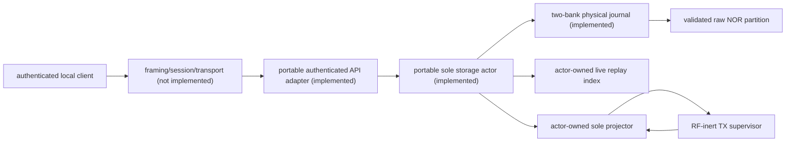
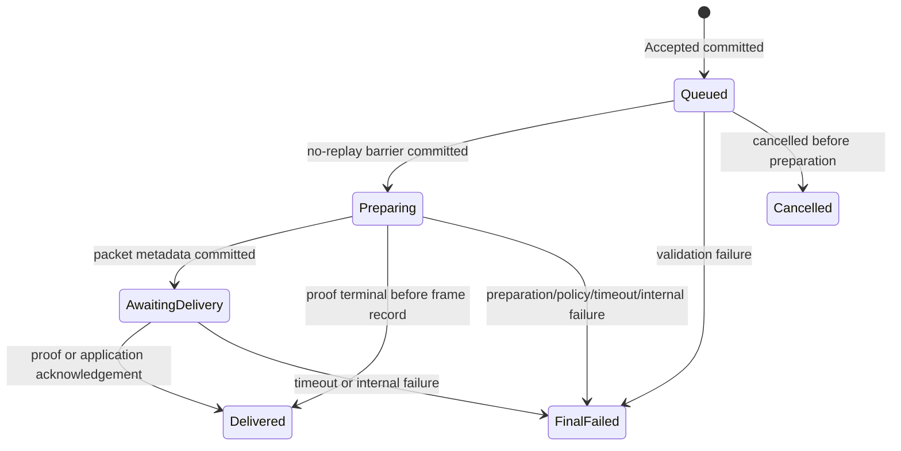

# Durable submissions and persist-before-ack projection

Status: portable semantic model, projector, physical two-bank journal, and sole
storage actor implemented and target-checked; portable authenticated device-API
dispatch implemented; isolated powered journal clean-path/software-reset HIL
passed on board E9:44. Permanent task, framing/session/transport and firmware
integration, controlled power-cut durability, endurance/soak, and at-rest
encryption remain unqualified.

## Claim boundary

`reticulum-storage-model` owns the project vocabulary for accepted outbound
work. It is allocation-free and `no_std`; it defines canonical records,
principal-scoped idempotency, lifecycle validation, complete-replay sealing,
and a fixed-RAM index. `reticulum-submission-projector` correlates those records
with volatile node/TX observations and withholds exact terminal or recovered-
owner acknowledgement until the corresponding record is known durable.

Neither semantic crate writes flash. `reticulum-storage-journal` supplies
the physical format, complete replay, commit/readback, lifetime admission, and
two-bank compaction mechanisms described in
[Physical submission journal](storage-journal.md). A canonical CBOR record is
still not durable merely because it encodes successfully, and the in-RAM index
is not a free-space or wear-level estimate. `reticulum-storage-actor` now owns
the NOR journal, replayed live index and sole projector, and connects an exact
plan to physical persistence before making an acceptance or acknowledgement
visible. See [Portable sole storage actor](storage-actor.md).

`reticulum-device-api-adapter` is the allocation-free authenticated dispatch
edge over that mounted owner. Default builds expose public capabilities and
principal-scoped status; missing and foreign IDs are indistinguishable, and
status returns `Internal` while the actor has ambiguous pending work or is
faulted rather than exposing a deliberately lagging index. Its
explicitly host-only `host-sim` feature copies the experimental borrowed payload
into an owned candidate and returns an ID only after `accept` reports durable
success or exact replay. Adapter-local capability restriction prevents a
separately unified codec feature from advertising that operation. The feature
is compile-forbidden on bare-metal targets. The adapter has no framing, session,
USB/BLE/Wi-Fi, node or radio path.

The physical backend's qualifying run is preserved at
`artifacts/storage-hil/20260716T211318Z-e944-7b47113` from source
`7b47113aeec6c7f0549cd5b264eceacef830fb4c`. Its strict two-boot serial check
covered A1 format, five appends, no-mutation retry/conflict, B2 compaction, a
software reset, and zero-write/zero-erase B2 replay. Independent raw-dump replay
confirmed one revision-4 `Delivered` submission across five committed records,
with the retired A manifest and unused B tail erased. This is isolated journal
clean-path evidence, not powered actor, powered-cut, API, or product-runtime
evidence.

The storage actor is the sole authority allowed to order physical commits and
mutate the live index. It also owns the one projector that carries bounded
volatile correlation. Callers receive only immutable projector inspection and
narrow actor-owned operations for the preparation barrier, node preparation
result, authorized frame, terminal, recovery, quarantine, and exact upstream
acknowledgement; they cannot obtain, replace, or extract the projector. Every
durable projector request returns through `persist_projector`, and every
mutating observation shares the actor's pending-write/fault gate. The node
supervisor remains the sole owner of native Rete state, packet buffers,
attempts, and TX typestates.

After complete mount/replay, `finalize_boot_recovery` also owns the conservative
boot edge. It returns queued and already-final decisions without writing, or
retains and durably commits the exact `InterruptedByReset` transition before
reporting `Finalized`. An ambiguous backend reply preserves the ID, boot
sequence, and plan for exact autonomous retry.

## Durable identity and records

Acceptance is scoped by the authenticated `PrincipalId` plus a client-chosen
`IdempotencyKey`. The content comparison uses a domain-separated SHA-256 over
the semantic destination and payload, not over API CBOR. Repeating the same
principal, key, and content returns the original `SubmissionId`; changing the
content under that key is a conflict and never mutates the original record.

The initial immutable journal vocabulary is:

- `Accepted`: submission ID, principal, idempotency key, semantic digest, and
  the complete bounded experimental RNS DATA intent;
- `StateTransition`: submission ID, exact next revision, and lifecycle state;
  a reboot-interrupted final transition carries its `BootRecoveryMarker`
  inside `InternalFailure::InterruptedByReset`;
- `Audit`: submission ID and exact next revision plus one transport-recovered
  or transport-quarantined observation containing the RNS attempt token,
  conservative transmission uncertainty, and an exact
  `TransportRecoveryReason`; its `CompletionFault` variant alone carries the
  unrestricted `u16` driver/control-plane completion code.

Boot recovery is not a separate audit event. The interruption evidence and
boot sequence are part of the immutable final lifecycle transition, so replay
cannot apply a free-standing boot marker before or after an unrelated state.

The complete encoded packet SHA-256 and the RNS attempt token are distinct
types. Node-core hashes every encoded packet byte immediately after successful
preparation and retains that digest with the queued attempt. The authorized
sink independently rehashes the exact borrowed frame, and the projector
requires both values to agree before planning prepared metadata. The RNS token
instead covers Reticulum's protocol-defined hashable bytes for proof
correlation. They are never interchangeable.

`AttemptHandle`, packet-buffer slot, dispatch generation, monotonic deadline,
native receipt object, and every reference remain volatile. Persisting any of
them would create a false promise that a reset node incarnation can rehydrate
an old lease or Rust owner.

Records use strict definite-map indexed CBOR with schema version 1 and a
512-byte ceiling. Transport recovery records contain a semantic reason
discriminant; only `CompletionFault` carries a separate unrestricted `u16`
driver/control-plane completion code, so no such code can collide with
deadline, cancellation, identifier-exhaustion, or invariant reasons. Decoding
re-encodes and byte-compares the value, rejecting noncanonical integers,
trailing data,
malformed lengths, mismatched semantic digests, and invalid state combinations.
Physical atomicity, integrity chaining, and torn-write detection are supplied
by `reticulum-storage-journal`. Its SHA-256 values are unkeyed corruption
detection, not tamper authentication or confidentiality; either property would
require a separate reviewed design.

## Lifecycle

`Queued` is the only replay-safe state. The `Queued -> Preparing` record must be
durable before node preparation starts. A reboot that finds `Preparing` or
`AwaitingDelivery` finalizes the submission as an internal
`InterruptedByReset` failure rather than risk duplicate RF. A reboot may replay
`Queued` work only after the backend has integrity-validated the complete
journal through its known end-of-log and the replay has been sealed; the replay
builder structurally exposes no planning or boot decision before that point.

Transport recovery and quarantine are revisioned audits, not lifecycle states.
They are illegal before the preparation barrier, retain the durable RNS attempt
token, and contribute to an accumulated `may_have_transmitted` value using
monotonic OR. An exact transport observation with `false` is valid even when an
earlier lifecycle transition already made the aggregate `true`; applying it
does not weaken the retained uncertainty. A contradictory token or second
transport audit is rejected during preflight and replay.

Crossing into `AwaitingDelivery`, direct delivery from `Preparing`, a delivery
timeout after the preparation barrier, or reset interruption after that barrier
sets the accumulated transmission uncertainty. These transitions may follow
authorization even when a frame observation was not yet durably projected, so
replay conservatively retains possible transmission.

## Two-phase mutation protocol

Every new record follows the same ordering:

1. Read the complete live index and construct the exact next transition or
   audit.
2. Ask the model to preflight it without mutation. A successful result is an
   opaque `PlannedMutation` containing the exact immutable record.
3. Ask the backend to reserve and commit that exact record under an idempotent
   logical key.
4. After commit or readback-equivalence is proven, apply the same opaque plan
   to the live index.
5. Only then publish acceptance, update client-visible state, or unlock the
   exact node/supervisor acknowledgement.

Retryable or ambiguous storage failure retains the identical plan and never
acknowledges upstream state. Contradictory readback, a different reply handle,
or an index mutation that violates sole-actor serialization latches a fault and
does not acknowledge. Planning catches revision, lifecycle, token, and index
errors before bytes are allowed to enter the journal, so a rejected mutation
cannot poison every later replay.

The implemented actor holds one optional pending mutation. Acceptance retains
the complete opaque plan; projector persistence retains only a compact handle
whose exact request remains in the actor-owned projector. Public
`drive_pending()` can resume either form after an ambiguous backend result
without receiving the original candidate, request, or another projector. The
actual `Option<PendingMutation>` layout is exposed as `PENDING_MUTATION_BYTES`
and compile-time constrained to at most 512 bytes. Unrelated requests receive
`Busy` until the retained mutation resolves, and invariant violations latch a
fail-closed bounded fault.

## Volatile correlation and acknowledgements

After the preparation barrier is durable, the projector binds one
`SubmissionId` to the generation-checked `AttemptHandle` and complete
`AttemptToken`. It records neither value until that barrier is committed, and
it never serializes the handle.

Node-core's queued metadata supplies the preparation-time packet length and
SHA-256 of all encoded bytes. The current RF-inert dispatcher independently
rehashes the frame at its one authorized byte boundary and supplies the neutral
observation: attempt handle, RNS token, packet length, and complete-frame
SHA-256. A later guarded radio backend must supply the same scalar contract.
The projector cross-checks the two digests and lengths; repeated fan-out
observations are idempotent only when all durable packet metadata is identical.

Terminal outcomes map as follows:

| Node outcome | Durable disposition |
| --- | --- |
| valid proof/application acknowledgement, including before a frame record | `Delivered` with exact preparation metadata |
| native receipt timeout after preparation, including before a frame record | `Failed(DeliveryTimeout)` |
| policy denial or final definitely-unpermitted hop | `Failed(Rejected)` |
| queue rollback, retained recovery, or invariant/control failure | `Failed(Internal)` |

Unknown destination or an empty eligible route maps to `NoPath`. Ledger/receipt
pressure and a generated receipt collision remain same-boot retry conditions
while the durable state stays `Preparing`; a reboot still terminates that
replay-unsafe state conservatively.

A real proof can establish `Delivered` while durable state is still
`Preparing`; the projector constructs the exact packet details from the
node-core preparation binding and commits a direct final transition. A timeout
can likewise become final before the frame record. A later exact frame
observation is idempotent against either final state and cannot reopen it.

The projector can expose two independent exact acknowledgements:

- terminal tombstone acknowledgement after the final disposition is durable;
- recovered-buffer acknowledgement after its transport audit is durable.

`PacketStillBound` is retryable ordering, not permission to discard the action.
Terminal and recovery acknowledgements may arrive in either order and neither
may erase the other's correlation. Quarantine has no release acknowledgement;
its unique owner remains fail-closed. A recovery-correlated owner trapped inside
a permanently disabled DATA-machine residue is exposed by the supervisor only
as a quarantine observation and follows that no-release path; its residue kind
and supervisor fault remain separate diagnostics.

## Crash and retry expectations

| Interruption | Required result after recovery |
| --- | --- |
| before `Accepted` commit | no submission ID was published |
| after `Accepted` commit but before reply | readback/dedup returns the same ID |
| before `Preparing` commit | submission remains replay-safe `Queued` |
| after `Preparing` commit | reboot finalizes internal; it never blindly resends |
| after a later record commit but before storage reply | retry/readback proves the exact logical record; no duplicate semantic transition |
| after final/audit commit but before node acknowledgement | the exact acknowledgement remains withheld/retried; the owner or tombstone is not reused |
| while a record prefix/marker is torn | full scan ignores the uncommitted hole, consumes its physical position, and never reports it committed |
| while a committed record is corrupt or contradictory | mount fails closed and exposes no valid-looking replay prefix |

Host tests inject lost replies, repeated observations, conflicting metadata,
wrong generation handles, retryable acknowledgement ordering, and terminal /
recovery arrival in both orders. The physical journal's fake-NOR tests also
inject partial and lost-reply writes/erases across append and compaction phases.
The powered clean-path/software-reset HIL has passed, but powered flash fault
injection is still a separate acceptance gate.

## Backend and actor contract

The physical journal implements the record-level portions below. The portable
sole storage actor now preserves them while adding one serialization cell,
projector ownership, exact autonomous retry, live-index ordering, and a bounded
fault latch. Runtime coordination with device API transports, watchdogs, OTA,
other flash users, and radio timing still belongs to the future permanent task.

1. **Complete replay before action.** Scan and integrity-validate records to a
   known end-of-log, then consume `SubmissionReplay` into the live index. No queued
   work, boot recovery, or device response is allowed during a partial scan.
   The first semantic record rejection poisons the replay builder, and replay
   completion returns that error rather than exposing a valid-looking prefix.
2. **Idempotent logical records.** Key every revisioned record by submission
   and revision, with the acceptance's principal/idempotency key indexed
   separately. A transition and audit at the same revision conflict rather than
   forming two keys. After an ambiguous write result, read before rewriting;
   identical bytes are equivalent and different bytes are a fault. Blind
   duplicate append is insufficient because it consumes physical space that the
   semantic index cannot see.
3. **Real admission reservation.** Before publishing `Accepted`, reserve
   physical space for the complete worst-case lifecycle and a possible
   transport audit. Schema 1 permits at most five
   committed semantic records per submission: one `Accepted`, at most three
   state transitions, and at most one transport audit. The physical journal
   contains 812 slots and admits at most 162 acceptances, reserving 810
   lifetime records and leaving two slots. Torn holes trigger packing compaction
   rather than consuming semantic reservation permanently.
4. **Power-fail integrity and order.** Use a cryptographic digest (or another
   explicitly justified corruption-detection code), explicit commit markers,
   monotonically ordered record identity, and scan
   rules for erased, torn, corrupt, duplicate, and stale records.
5. **Permanent retention and compaction.** Schema 1 compaction copies every
   committed record, including principal/idempotency history, and provides no
   eviction or garbage collection. The manifest and future schema-migration
   rules must preserve that guarantee. The submission journal is not the
   separate long-term message/blob archive.
6. **Serialized non-cancellable writes.** The portable actor owns flash and
   performs each backend attempt synchronously, retaining an exact pending
   mutation whenever the result is ambiguous. The future permanent task must
   additionally coordinate OTA/GC/watchdogs and radio timing and must not expose
   cancellation across an actor call.

## Selected schema-1 physical design

Schema 1 uses the implemented project-owned fixed-slot, two-bank NOR journal in
a dedicated 1 MiB `retlog` partition. The partition reserves two 4 KiB manifest
sectors and divides the remaining erase-aligned space into two 127-sector
banks. Each bank has 812 640-byte physical slots and a required 512-byte erased
tail. A slot contains a 64-byte versioned header, maximum 512-byte canonical
semantic body, 32-byte SHA-256 chain value, and 32-byte commit marker. See
[Physical submission journal](storage-journal.md) for exact offsets and fields.

For each append, the journal writes the header, canonical body, and integrity
fields, reads those pre-commit bytes back exactly, and writes the commit marker
last. A record is visible to replay only after that sequence. Boot validates the
selected bank as a whole against its superblock/manifest and then feeds every
committed record through the semantic replay builder. A corrupt or
contradictory committed record fails the bank; replay never salvages a
valid-looking prefix and starts node/API work from it.

Compaction is record-bank-preserving and manifest-proved. It first commits a
handoff inside the selected source manifest, then erases and streams every
retained record into the inactive target, reads each commit back, and commits
the target manifest last. That seal makes the consecutive newer generation
authoritative. Append remains blocked until a third erase retires only the old
manifest sector; the old record bank stays intact. A torn or committed handoff
blocks append and makes the copy resumable, while a power loss during manifest
retirement resumes that one erase without creating another generation. Once
retired, the old bank cannot be selected as fallback, so corruption of the sole
active manifest fails closed and a later suffix cannot disappear through
rollback. Schema 1 retains every accepted submission and revision permanently
and exposes no eviction or garbage-collection policy. Admission fails when the
fixed index or 162-submission lifetime reservation cannot support another
submission.

The portable implementation uses raw NOR semantics through `embedded-storage`.
The Tracker HIL adds a checked partition-relative `esp-storage` adapter; it does
not use generic byte-oriented `Storage::write` or the pinned ESP-IDF
`FlashRegion`. The current format requires exact 4-byte read/program alignment,
4 KiB erase alignment, and `MultiwriteNorFlash`. Formatting is explicit and
only accepts a completely erased partition; it never erases or reformats an
unknown nonblank partition.

`sequential-storage 8` remains useful research and differential-test material,
but it is not an open contender for the schema-1 journal implementation.

## Capacity and ESP32-S3 constraints

The current intent owns up to 383 payload bytes; an `Accepted` record is close
to the 512-byte record ceiling, and each in-RAM indexed submission retains that
intent plus lifecycle metadata. Submission counts therefore need explicit
static layout, stack, heap, boot-scan-time, and linked-image measurements on
the no-PSRAM Tracker profile. The codec currently uses a 512-byte canonical
scratch value during strict decode, so the eventual storage task must use a
deliberately sized stack or caller-owned static scratch rather than rely on a
large incidental async frame.

The current projector is also intentionally correctness-first rather than a
finished Tracker RAM profile: the current ESP32-S3 layout measures about 1,288
bytes for `SubmissionSlot` and about 640 bytes for its retained
`PendingRecord`. The actor now serializes physical writes through one global
pending-mutation cell rather than adding another complete plan per submission;
its actual optional cell is compile-time capped at 512 bytes. This does not cap
the projector slots, live index, complete actor, or future task stack. Measure
that full static layout and stack before selecting a Tracker capacity. Completed
correlations also cannot be retired automatically until the runtime proves
that every terminal and transport observation source has been drained.

Profiles on larger boards may enable a larger index and richer clients. The
semantic feature set remains portable; constrained boards may disable local
LXMF/NomadNet/UI services without redefining the durable protocol.

## Remaining implementation gates

1. Extend the completed clean-path/software-reset Heltec qualification with
   controlled powered cuts at the relevant program/erase boundaries, preserving
   each image, readback, continuous serial capture, and raw-partition result as
   a separate evidence set.
2. Place the portable sole actor in one permanent Embassy task, connect a
   checked product `esp-storage` partition adapter, gate service on complete
   mount/replay and definitive `finalize_boot_recovery` results for every
   submission, and serialize it with other flash users.
3. Connect the implemented authenticated device-API adapter to framing,
   sessions and a firmware transport, then merge projection with the sole node
   runtime; do not run the current supervisor's pass-discarding convenience loop
   when projection observations are required. Add a proved retirement handshake
   before reusing any completed projector slot.
4. Measure static layout, journal scan/compaction time, stack, erase endurance,
   soak behavior, and watchdog impact on ESP32-S3 and larger profiles.
5. The two attached antenna-equipped boards are cleared for NA915 development
   TX. Preserve an explicit regional/airtime profile and sole radio owner when
   connecting this persistence path to real transmission.
