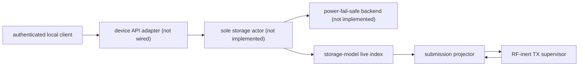
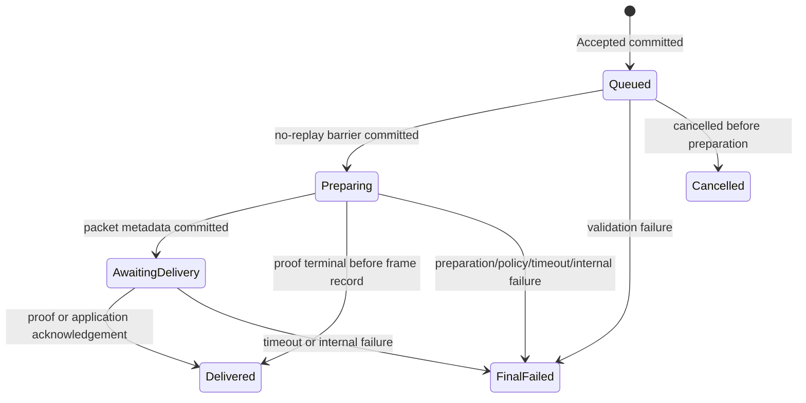

# Durable submissions and persist-before-ack projection

Status: portable semantic model and host-tested projection boundary. No flash
backend, device-API adapter, firmware dependency edge, or claim of powered
durability is included in this slice.

## Claim boundary

`reticulum-storage-model` owns the project vocabulary for accepted outbound
work. It is allocation-free and `no_std`; it defines canonical records,
principal-scoped idempotency, lifecycle validation, complete-replay sealing,
and a fixed-RAM index. `reticulum-submission-projector` correlates those records
with volatile node/TX observations and withholds exact terminal or recovered-
owner acknowledgement until the corresponding record is known durable.

Neither crate writes flash. In particular, a canonical CBOR record is not
durable merely because it encodes successfully, and the in-RAM index is not a
free-space or wear-level estimate. A later sole storage actor must supply the
physical guarantees in [Backend contract](#backend-contract) before an
acceptance response or TX acknowledgement can be published.

The storage actor is the sole authority allowed to order physical commits and
mutate the live index. The projector owns only bounded volatile correlation;
the node supervisor remains the sole owner of native Rete state, packet
buffers, attempts, and TX typestates.

## Durable identity and records

Acceptance is scoped by the authenticated `PrincipalId` plus a client-chosen
`IdempotencyKey`. The content comparison uses a domain-separated SHA-256 over
the semantic destination and payload, not over API CBOR. Repeating the same
principal, key, and content returns the original `SubmissionId`; changing the
content under that key is a conflict and never mutates the original record.

The initial immutable journal vocabulary is:

- `Accepted`: submission ID, principal, idempotency key, semantic digest, and
  the complete bounded experimental RNS DATA intent;
- `StateTransition`: submission ID, exact next revision, and lifecycle state;
  a reboot-interrupted final transition carries its `BootRecoveryMarker`
  inside `InternalFailure::InterruptedByReset`;
- `Audit`: submission ID and exact next revision plus one transport-recovered
  or transport-quarantined observation containing the RNS attempt token,
  conservative transmission uncertainty, and an exact
  `TransportRecoveryReason`; its `CompletionFault` variant alone carries the
  unrestricted `u16` driver/control-plane completion code.

Boot recovery is not a separate audit event. The interruption evidence and
boot sequence are part of the immutable final lifecycle transition, so replay
cannot apply a free-standing boot marker before or after an unrelated state.

The complete encoded packet SHA-256 and the RNS attempt token are distinct
types. Node-core hashes every encoded packet byte immediately after successful
preparation and retains that digest with the queued attempt. The authorized
sink independently rehashes the exact borrowed frame, and the projector
requires both values to agree before planning prepared metadata. The RNS token
instead covers Reticulum's protocol-defined hashable bytes for proof
correlation. They are never interchangeable.

`AttemptHandle`, packet-buffer slot, dispatch generation, monotonic deadline,
native receipt object, and every reference remain volatile. Persisting any of
them would create a false promise that a reset node incarnation can rehydrate
an old lease or Rust owner.

Records use strict definite-map indexed CBOR with schema version 1 and a
512-byte ceiling. Transport recovery records contain a semantic reason
discriminant; only `CompletionFault` carries a separate unrestricted `u16`
driver/control-plane completion code, so no such code can collide with
deadline, cancellation, identifier-exhaustion, or invariant reasons. Decoding
re-encodes and byte-compares the value, rejecting noncanonical integers,
trailing data,
malformed lengths, mismatched semantic digests, and invalid state combinations.
Physical integrity, optional tamper authentication, atomicity, and torn-write
detection remain backend responsibilities.

## Lifecycle

`Queued` is the only replay-safe state. The `Queued -> Preparing` record must be
durable before node preparation starts. A reboot that finds `Preparing` or
`AwaitingDelivery` finalizes the submission as an internal
`InterruptedByReset` failure rather than risk duplicate RF. A reboot may replay
`Queued` work only after the backend has integrity-validated the complete
journal through its known end-of-log and the replay has been sealed; the replay
builder structurally exposes no planning or boot decision before that point.

Transport recovery and quarantine are revisioned audits, not lifecycle states.
They are illegal before the preparation barrier, retain the durable RNS attempt
token, and contribute to an accumulated `may_have_transmitted` value using
monotonic OR. An exact transport observation with `false` is valid even when an
earlier lifecycle transition already made the aggregate `true`; applying it
does not weaken the retained uncertainty. A contradictory token or second
transport audit is rejected during preflight and replay.

Crossing into `AwaitingDelivery`, direct delivery from `Preparing`, a delivery
timeout after the preparation barrier, or reset interruption after that barrier
sets the accumulated transmission uncertainty. These transitions may follow
authorization even when a frame observation was not yet durably projected, so
replay conservatively retains possible transmission.

## Two-phase mutation protocol

Every new record follows the same ordering:

1. Read the complete live index and construct the exact next transition or
   audit.
2. Ask the model to preflight it without mutation. A successful result is an
   opaque `PlannedMutation` containing the exact immutable record.
3. Ask the backend to reserve and commit that exact record under an idempotent
   logical key.
4. After commit or readback-equivalence is proven, apply the same opaque plan
   to the live index.
5. Only then publish acceptance, update client-visible state, or unlock the
   exact node/supervisor acknowledgement.

Retryable or ambiguous storage failure retains the identical plan and never
acknowledges upstream state. Contradictory readback, a different reply handle,
or an index mutation that violates sole-actor serialization latches a fault and
does not acknowledge. Planning catches revision, lifecycle, token, and index
errors before bytes are allowed to enter the journal, so a rejected mutation
cannot poison every later replay.

## Volatile correlation and acknowledgements

After the preparation barrier is durable, the projector binds one
`SubmissionId` to the generation-checked `AttemptHandle` and complete
`AttemptToken`. It records neither value until that barrier is committed, and
it never serializes the handle.

Node-core's queued metadata supplies the preparation-time packet length and
SHA-256 of all encoded bytes. The current RF-inert dispatcher independently
rehashes the frame at its one authorized byte boundary and supplies the neutral
observation: attempt handle, RNS token, packet length, and complete-frame
SHA-256. A later guarded radio backend must supply the same scalar contract.
The projector cross-checks the two digests and lengths; repeated fan-out
observations are idempotent only when all durable packet metadata is identical.

Terminal outcomes map as follows:

| Node outcome | Durable disposition |
| --- | --- |
| valid proof/application acknowledgement, including before a frame record | `Delivered` with exact preparation metadata |
| native receipt timeout after preparation, including before a frame record | `Failed(DeliveryTimeout)` |
| policy denial or final definitely-unpermitted hop | `Failed(Rejected)` |
| queue rollback, retained recovery, or invariant/control failure | `Failed(Internal)` |

Unknown destination or an empty eligible route maps to `NoPath`. Ledger/receipt
pressure and a generated receipt collision remain same-boot retry conditions
while the durable state stays `Preparing`; a reboot still terminates that
replay-unsafe state conservatively.

A real proof can establish `Delivered` while durable state is still
`Preparing`; the projector constructs the exact packet details from the
node-core preparation binding and commits a direct final transition. A timeout
can likewise become final before the frame record. A later exact frame
observation is idempotent against either final state and cannot reopen it.

The projector can expose two independent exact acknowledgements:

- terminal tombstone acknowledgement after the final disposition is durable;
- recovered-buffer acknowledgement after its transport audit is durable.

`PacketStillBound` is retryable ordering, not permission to discard the action.
Terminal and recovery acknowledgements may arrive in either order and neither
may erase the other's correlation. Quarantine has no release acknowledgement;
its unique owner remains fail-closed. A recovery-correlated owner trapped inside
a permanently disabled DATA-machine residue is exposed by the supervisor only
as a quarantine observation and follows that no-release path; its residue kind
and supervisor fault remain separate diagnostics.

## Crash and retry expectations

| Interruption | Required result after recovery |
| --- | --- |
| before `Accepted` commit | no submission ID was published |
| after `Accepted` commit but before reply | readback/dedup returns the same ID |
| before `Preparing` commit | submission remains replay-safe `Queued` |
| after `Preparing` commit | reboot finalizes internal; it never blindly resends |
| after a later record commit but before storage reply | retry/readback proves the exact logical record; no duplicate semantic transition |
| after final/audit commit but before node acknowledgement | the exact acknowledgement remains withheld/retried; the owner or tombstone is not reused |
| while a record is torn or corrupt | backend scan rejects/isolates it and never reports commit |

Host tests inject lost replies, repeated observations, conflicting metadata,
wrong generation handles, retryable acknowledgement ordering, and terminal /
recovery arrival in both orders. Powered flash fault injection is still a
separate acceptance gate.

## Backend contract

The physical storage implementation must provide all of the following:

1. **Complete replay before action.** Scan and integrity-validate records to a
   known end-of-log, then consume `SubmissionReplay` into the live index. No queued
   work, boot recovery, or device response is allowed during a partial scan.
   The first semantic record rejection poisons the replay builder, and replay
   completion returns that error rather than exposing a valid-looking prefix.
2. **Idempotent logical records.** Key every revisioned record by submission
   and revision, with the acceptance's principal/idempotency key indexed
   separately. A transition and audit at the same revision conflict rather than
   forming two keys. After an ambiguous write result, read before rewriting;
   identical bytes are equivalent and different bytes are a fault. Blind
   duplicate append is insufficient because it consumes physical space that the
   semantic index cannot see.
3. **Real admission reservation.** Before publishing `Accepted`, reserve
   physical space for the complete worst-case lifecycle, a possible transport
   audit, torn-write loss, and compaction headroom. Schema 1 permits at most five
   committed semantic records per submission: one `Accepted`, at most three
   state transitions, and at most one transport audit. The model intentionally
   reports no flash capacity; the backend must reserve physical failure
   headroom in addition to those five logical records.
4. **Power-fail integrity and order.** Use a cryptographic digest (or another
   explicitly justified corruption-detection code), explicit commit markers,
   monotonically ordered record identity, and scan
   rules for erased, torn, corrupt, duplicate, and stale records.
5. **Permanent retention and compaction.** Schema 1 compaction copies every
   committed record, including principal/idempotency history, and provides no
   eviction or garbage collection. The manifest and future schema-migration
   rules must preserve that guarantee. The submission journal is not the
   separate long-term message/blob archive.
6. **Serialized non-cancellable writes.** One actor owns flash, coordinates
   OTA/GC/watchdogs and radio timing, and never exposes cancellation across a
   write whose outcome could be ambiguous.

## Selected schema-1 physical design

Schema 1 uses a project-owned fixed-slot, two-bank NOR journal in a dedicated
1 MiB `retlog` partition. The partition reserves two 4 KiB superblocks and
divides the remaining erase-aligned space into two equal banks. Each bank uses
640-byte physical slots: enough for the maximum 512-byte canonical semantic
record plus a versioned physical header, integrity material, and an explicit
commit marker. Any tail that cannot hold a complete slot remains unused rather
than creating a second record shape.

For each append, the actor writes the header, canonical body, and integrity
fields, reads those pre-commit bytes back exactly, and writes the commit marker
last. A record is visible to replay only after that sequence. Boot validates the
selected bank as a whole against its superblock/manifest and then feeds every
committed record through the semantic replay builder. A corrupt or
contradictory committed record fails the bank; replay never salvages a
valid-looking prefix and starts node/API work from it.

Compaction is also whole-bank and manifest-proved: write all retained records to
the inactive bank, read back and verify them, commit a manifest proving the
complete bank image, and only then make that generation selectable. Schema 1
retains every accepted submission and revision permanently and exposes no
eviction or garbage-collection policy. Admission fails when the fixed index,
semantic reservation, or permanent journal capacity cannot support another
submission.

This freezes the first implementation shape, not its physical fault budget.
The actor still needs explicit per-admission reservation for the maximum five
semantic records, torn-slot loss, an interrupted append, inactive-bank
compaction, and superblock failure; those quantities must be proved before the
device API publishes acceptance. The implementation edge should use NOR-flash
semantics through `embedded-storage` and a reviewed `esp-storage` adapter. It
must not assume a generic byte-oriented `Storage::write` or an ESP-IDF
`FlashRegion` provides the required partition bounds, encryption, multiwrite,
or commit guarantees.

`sequential-storage 8` remains useful research and differential-test material,
but it is not an open contender for the schema-1 journal implementation.

## Capacity and ESP32-S3 constraints

The current intent owns up to 383 payload bytes; an `Accepted` record is close
to the 512-byte record ceiling, and each in-RAM indexed submission retains that
intent plus lifecycle metadata. Submission counts therefore need explicit
static layout, stack, heap, boot-scan-time, and linked-image measurements on
the no-PSRAM Tracker profile. The codec currently uses a 512-byte canonical
scratch value during strict decode, so the eventual storage task must use a
deliberately sized stack or caller-owned static scratch rather than rely on a
large incidental async frame.

The current projector is also intentionally correctness-first rather than a
finished Tracker RAM profile: the current ESP32-S3 layout measures about 1,288
bytes for `SubmissionSlot` and about 640 bytes for its retained
`PendingRecord`. A sole runtime should serialize physical writes through one
global pending-write cell
instead of multiplying a complete plan per submission, then measure the whole
task's static storage and stack before selecting a Tracker capacity. Completed
correlations also cannot be retired automatically until the runtime proves that
every terminal and transport observation source has been drained.

Profiles on larger boards may enable a larger index and richer clients. The
semantic feature set remains portable; constrained boards may disable local
LXMF/NomadNet/UI services without redefining the durable protocol.

## Remaining implementation gates

1. Specify the selected slot/superblock fields and finalize physical
   reservation, torn-slot, compaction, and superblock fault budgets.
2. Build a host power-cut harness for every byte/commit boundary, then the sole
   async two-bank storage actor using the same backend contract.
3. Connect acceptance/status through device API v1 and merge projection with
   the sole node runtime; do not run the current supervisor's pass-discarding
   convenience loop when projection observations are required. Add a proved
   retirement handshake before reusing any completed projector slot.
4. Measure static layout and stack on ESP32-S3, then flash an RF-inert image to
   validate replay and power-cut behavior on a dedicated data partition.
5. Keep RF transmission disabled until antenna/load and regional profile are
   explicitly confirmed.
