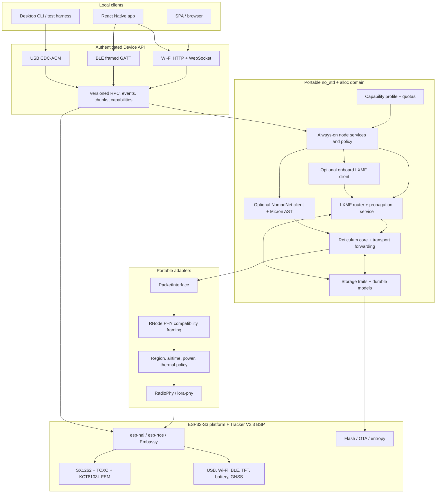

# Standalone Reticulum LoRa Firmware: Architecture and Feasibility

**Status:** accepted architecture; Phase-1 receive-only path target-linked;
physical submission journal implemented; powered semantic ANNOUNCE HIL passed;
isolated powered storage clean-path/software-reset HIL passed<br>
**Date:** 2026-07-16<br>
**Initial target:** Heltec Wireless Tracker V2.3, ESP32-S3FN8 + SX1262 + KCT8103L<br>
**Product goal:** an always-on, self-contained Reticulum transport and LXMF store-and-forward node, with optional onboard messaging and NomadNet clients controlled over USB, BLE, or Wi-Fi

Implementation is governed by [ADR 0001](adr/0001-phase-0-scaffold.md),
[ADR 0002](adr/0002-rete-provisional-foundation.md) and the
[Phase-0 validation contract](phase-0-acceptance.md). Those documents narrow
the first workspace and establish Rete as the provisional RNS foundation
without reducing the product scope described here.

## Executive decision

The full product is plausible, but no examined repository is a drop-in firmware and no build yet combines an embedded RNS transport, an embedded LXMF propagation router, durable storage, USB, Wi-Fi, BLE, and local clients. The Tracker V2.3 is a valuable first target, not the feature ceiling. Its ESP32-S3FN8 has 8 MB flash and no PSRAM, so it may run a constrained node profile while a later PSRAM board runs the complete appliance profile.

The broader Rust survey changes the recommended path:

1. Adopt [`rete`](https://github.com/s-retlaw/rete) as the provisional **RNS** foundation and retain Leviculum as an independent protocol oracle and fallback. At the reviewed upstream selection snapshot, `rete-core`, `rete-transport`, `rete-stack`, and `rete-lxmf-core` passed a generic bare-metal check, 391 focused host tests passed, and the then-current ESP32-S3/SX1262/Wi-Fi example compiled with the installed ESP toolchain. It is pre-release, its checked-in Python peer predates Reticulum 1.3.8, and its Resource and failure paths need bounded-memory and backpressure hardening before production acceptance. Leviculum remains available for targeted differential tests and as the alternative if Rete meets an explicit ADR 0002 abandonment criterion.
2. Reuse existing LXMF work instead of starting from an empty crate. `LXMF-rs` contains directly useful constants, announce codecs, message packing/signing, delivery selection, propagation envelopes, paper messages, fixtures, and state semantics. Its full feature graph and runtime are not directly embeddable, so extract/refactor protocol pieces behind an RNS identity adapter rather than importing its Tokio/SQLite runtime. Do **not** use `rete-lxmf-core` as the compatibility authority in its present form: despite compiling `no_std`, it currently uses 2-byte stamps/tickets where current LXMF uses 32-byte stamps and 16-byte tickets, and its `u8 -> bytes` field model cannot preserve arbitrary MessagePack values. `rsLXMF` is the most complete AGPL propagation/router reference found, while `precursor-lxmfchat` is the closest embedded Rust precedent for a combined LXMF, NomadNet and Micron client.
3. Make two infrastructure roles first-class: Reticulum transport forwarding and an LXMF propagation node. Both are configurable and quota-bound, but neither is defined out of the product merely because the initial board is constrained. An infrastructure profile remains in LoRa receive and processes/forwards traffic whenever the device is powered; only an explicitly selected leaf/standby state opts out and reports that loss of reachability.
4. Treat onboard LXMF conversation UI, NomadNet browsing, a SPA, and a native mobile app as optional capability modules. They make the device turnkey, but the node is useful without them and constrained builds may omit them.
5. Use only the bare-metal `esp-hal`/`esp-rtos`/Embassy platform path. The working Tracker-specific `microReticulum_Firmware` checkout is sufficient evidence that the board, radio, FEM, and ESP32-S3 can support the hardware role; an additional C++/ESP-IDF comparison would not retire the important Rust risks.
6. Put `lora-phy` behind a radio trait, add a Tracker-specific board adapter, and keep an explicit RNode-compatible split/reassembly layer. It must distinguish the standard 500-byte RNS MTU from RNode's 508-byte physical interface capacity.
7. Keep identities, transport/LXMF state, messages, and propagation storage on the device. USB, BLE, and Wi-Fi clients use one authenticated, versioned device API; they do not run duplicate network stacks or own the node identity.
8. Model hardware profiles as feature/capability compositions. Compile-time features remove code and static memory; runtime quotas bound tables, links, resources, stored messages, local sessions, and airtime. Full-stack acceptance may occur first on PSRAM hardware without narrowing the product architecture.

Licensing is not a foundation-selection blocker. The project accepts the Reticulum License and ordinary FOSS licenses including MIT, Apache-2.0, EPL-2.0, GPL and AGPL, provided each component's actual terms and notices are followed. The Reticulum **protocol** is public domain; the Python reference source remains under the separate Reticulum License. That license grants broad use, modification and redistribution rights subject to its no-purposeful-harm, no-AI-training-dataset and notice conditions, all of which are accepted for this product.

The preferred `rete` + LXMF-rs product path should use a straightforward multi-license layout without delaying engineering: license project-owned crates `MIT OR Apache-2.0`, consume `rete` under Apache-2.0, and keep copied or modified LXMF-rs files/crates under EPL-2.0. The firmware distribution carries all applicable notices and corresponding EPL source; it does not directly link copied AGPL implementation code. The same permissively licensed project crates can participate in a separately coherent Leviculum/rsLXMF AGPL build. Missing upstream license files or root grants remain provenance tasks for the affected source, not reasons to reject otherwise accepted license families.

## Product boundary

“Standalone” should have a precise meaning:

- The device owns its Reticulum identity and LXMF delivery destination.
- It performs path discovery, packet processing, transport forwarding, link/resource transfers, receipts, retries, and durable message queuing without a phone or computer.
- When the profile enables it, it operates an LXMF propagation destination, persists store-and-forward traffic, retrieves messages for clients, and peers with other propagation nodes.
- A client-capable profile can browse NomadNet nodes and render Micron content through a local client.
- It remains capable of receiving LoRa traffic when no local UI is connected.
- A phone, browser, or desktop is a view/controller for the device, not a required protocol host.

This is different from an RNode. An RNode is a host-controlled modem; the proposed product is a Reticulum endpoint that directly owns the SX1262. An optional RNode-compatible bridge mode may be useful later, but it must be a separate boot/runtime mode because there can be only one owner of the radio and identity state.

The product is an infrastructure node with optional local clients, not merely a handheld endpoint:

- Reticulum transport forwarding is a core product capability. It is enabled in mains/relay profiles and can be quota-limited or disabled in a battery-constrained profile, but it must be implemented and tested early.
- LXMF includes both the local router/client path and the propagation-server path: deposit, durable store, retrieval, peer offers/synchronisation, stamps/tickets, culling, and abuse controls. The Tracker profile may use small quotas or compile the service out if measurements require it; the full product profile may require PSRAM hardware.
- LXMF paper delivery is a later app-assisted import/export feature: the device encodes/validates the paper payload while the SPA/native app displays or scans QR/text. It is not silently omitted from the long-term client scope, but it is not required before ordinary radio delivery works.
- The optional NomadNet client browses pages and downloads bounded resources. A static NomadNet node page is reasonable; executing arbitrary remote or server-side programs remains out of scope on microcontrollers.
- GNSS is represented now by a disabled `LocationProvider` capability and board/power hooks. Actual parsing, fixes, telemetry/location fields, maps, and time-source integration are deliberately deferred until after the network, propagation, storage, and local API are stable.

## Research baseline

### Local reference snapshots

The local repositories were inspected at these revisions. These are moving projects, so the implementation should pin reviewed commits and repeat the compile/interoperability gates before adopting updates.

| Reference | Snapshot | License | Useful material | Verdict |
| --- | ---: | --- | --- | --- |
| `reference/rete` | `f6f5fb0` integration fork, based on `9bcb7d3e` | MIT OR Apache-2.0 declared in Cargo/README; license texts absent | Runtime-agnostic `no_std` RNS, bounded transport storage, RNode LoRa interface, compiling Embassy ESP32-S3/SX1262/Wi-Fi example, canonical local LINKREQUEST validation, transactional owned-Link admission, endpoint announce policy, caller-owned DATA preparation, allocation-atomic receipt terminals and full-hash/Link-ID-bound DATA/channel terminal candidates | Provisional RNS foundation; pre-release, Resource is whole-buffered, relay admission remains non-transactional, channel receipt capacity/retransmission is not yet reliable, and current LXMF is wire-incompatible; missing canonical license files are notice/provenance hygiene, not an evaluation blocker |
| `reference/leviculum` | `5fb1db0` | AGPL-3.0-or-later | Complete sans-I/O RNS core, strong tests, RNode framing, nRF Embassy firmware, current Micron parser and substantial NomadNet client | Independent RNS oracle and fallback; no LXMF |
| `reference/LXMF` | `fab12ad9` | accepted Reticulum License | Current authoritative Python LXMF behavior, router, propagation node and fixtures | Primary pinned compatibility peer; source may also be reused when useful with its conditions/notices preserved |
| `reference/LXMF-rs` | `0859680` | EPL-2.0 | Broad LXMF/RNS behavior, wire formats, parity fixtures, announce codecs, paper messages, stamps/tickets, router semantics | Approved direct-reuse source for the EPL product path; several wire/state modules are extractable, while the full runtime still needs a substantial bare-metal refactor |
| `reference/rsReticulum` + `reference/rsLXMF` | `46b699af` / `20ef8342` | AGPL-3.0-or-later | Active Rust RNS/LXMF daemon, complete delivery methods, propagation deposit/retrieve/peering/sync, stamps/tickets, persistence and culling | Best AGPL propagation/router source and host oracle; use directly in an AGPL build, or as an executable interoperability peer for the EPL product build |
| `reference/precursor-lxmfchat` | `8cd7fa46` | no root license grant; vendored Xous tree has Apache-2.0 text | Hardware-tested Rust LXMF client, links/resources and propagation sync, constant-memory stamp mining, plus a working NomadNet browser and bounded Micron parser | Closest embedded all-in-one client precedent; not a transport/propagation server, uses Xous `std`, and source reuse needs license clarification |
| `reference/doubleailes-LXMF-rs` | `81be7fdf` | AGPL-3.0-or-later | Existing LXMF-to-Leviculum adapter and direct Link/Resource bridge | Useful adapter reference; restricted field model and propagation transfer/sync/storage TODOs prevent adoption as the full layer |
| `reference/rns-rs` | `d67d1d5` | accepted Reticulum License | Current RNS 1.3.8 parity work and an ESP-IDF ESP32-S3/SX1262 firmware | Valuable ESP/reference source; `no_std` gaps, stale ESP-IDF setup and missing LXMF—not its accepted license—block adoption as the foundation |
| `reference/microReticulum` | `7a1d5b3` | Apache-2.0 | C++ RNS behavior, storage/provisioning patterns, Tracker bring-up | Secondary behavior reference, not a Rust base; incomplete protocol areas and a LoRa framing regression |
| `reference/microReticulum_Firmware` | `b846d93` | GPL-3.0-or-later | Working Tracker V2 board/radio/FEM baseline, RNode framing, USB/BLE/TCP concepts | User-verified hardware oracle; removes the need for a separate ESP-IDF/C++ feasibility build |
| `reference/NomadNet` | `ad103015` | GPL-3.0 | Authoritative page/file request behavior and Micron grammar | Black-box/source oracle; not a firmware dependency |
| `reference/micron-parser-js` | `33feb105` | Unlicense | Parser used by web Nomad browsers, current grammar and SPA behavior | Strong SPA parser/reference, still requires sanitisation and device-side limits |
| `reference/micron-rs` | `a6468af` | AGPL-3.0-or-later | Rust lexer/event parser, HTML renderer, malformed/guide corpus | Differential oracle; grammar coverage lags current NomadNet |
| `reference/micronaut` | `21c02c67` | MIT | Rust parser plus renderer-neutral forms, history, cache and partial state | Useful parser/browser-state design; `std`, missing some current grammar, two all-feature renderer tests fail |
| `reference/foxhole` | `d67fe524` | AGPL-3.0-or-later | Focused Rust LXMF terminal and Nomad browser with separate Micron parser/renderer, forms, history and tests | Useful licensed host client/UI reference and negative interop evidence; `std`/Tokio/ratatui, not firmware code |
| `reference/esp-hal` | `5e055e49` | MIT/Apache-2.0 | ESP32-S3 HAL, radio/RTOS, USB, Wi-Fi AP, BLE, coexistence, OTA examples | Preferred bare-metal platform, with unstable ancillary crates |
| `reference/embassy` | `58248a338` | MIT/Apache-2.0 | Executor, synchronization, USB, networking, embedded patterns | Preferred portable async infrastructure |

### Surveyed but not retained locally

These research clones were removed after their useful conclusions were captured here. Re-clone the pinned revision only if a future investigation needs to reproduce a specific negative case.

| Removed clone | Reviewed snapshot | Reason not retained |
| --- | ---: | --- |
| [`lelloman/lxmf-rs`](https://github.com/lelloman/lxmf-rs) | `2e312b62` | Embedded path currently fails and its useful LXMF surface is redundant with retained LXMF-rs/rsLXMF/rns-rs references; its accepted Reticulum License was not the reason for removal |
| [`TeskesLab/nomadnet-rs`](https://github.com/TeskesLab/nomadnet-rs) | `0bb60414` | Negative evidence only: host/Tokio coupling plus noncanonical request, response-matching and Micron behavior |
| [`omensealed/omenbrowser`](https://github.com/omensealed/omenbrowser) | `ce3a964c` | Host-only desktop UX, absent root license text, and redundant with the retained embedded Precursor and licensed Foxhole clients |
| [`espup`](https://github.com/esp-rs/espup) | `26bafc6` | Installed development utility, not a firmware/library dependency; upstream source can be fetched if toolchain debugging ever requires it |

The supplied Tracker V2.3 datasheet, schematic, and pin map were also rendered and inspected. They agree with the pinout below and, importantly, show that the radio is not a generic SX1262 module: it has a KCT8103L external front end, controlled power rails, and a board-specific output-power relationship.

### Reproducible compile checks

Claims in READMEs were not treated as proof of embedded portability.

| Check | Result | Meaning |
| --- | --- | --- |
| `rete-core`, `rete-transport`, `rete-stack`, and `rete-lxmf-core`, no defaults, `thumbv6m-none-eabi` | Pass | The layers are genuinely bare-metal buildable; compilation does not cure the LXMF correctness gaps documented below |
| Focused `rete` core/transport/LXMF host suites at the reviewed upstream snapshot | 391 pass | Historical selection evidence for wire, crypto, forwarding, link/resource, and LXMF codec behavior; this is not evidence for the later lifecycle patch or a complete Python/RF conformance claim |
| Exact `f6f5fb0` receipt/LXMF lifecycle library suites | 502 pass | CI checks the pinned fork directly: 151 transport, 124 stack, 143 LXMF and 84 daemon tests, plus all-target host and `thumbv6m-none-eabi` checks |
| `reticulum-node-core`, generic bare-metal and ESP32-S3 Xtensa | Pass | External-buffer dispatch metadata, exact attempt ledger, deterministic routing, opaque permit/completion typestates, exact deadlines and retained recovery compile without `std` on both targets; 43 focused host tests have no async or radio linkage and the current receive-only firmware intentionally does not link it |
| `reticulum-tx-handoff`, host, generic bare-metal and ESP32-S3 Xtensa | Pass | Static one-time channel-role splitting, exact owner returns, depth-one permit control, and cancellation-safe receive behavior compile on both targets; a host-only manually stepped no-RF harness exercises representative routed DATA paths across the real ports; graph policy keeps the crate outside firmware |
| `reticulum-tx-dispatch`, host, generic bare-metal and ESP32-S3 Xtensa | Pass | The firmware-excluded RF-inert dispatcher, permit server, and exact-owner-bound fixed per-slot node DATA machine retain owners/control values across backpressure, synchronously prepare from parked owners, use cancellation-safe short waits, park recovered owners until exact acknowledgement, and fail closed at the permit recovery grace; 33 focused tests exercise these boundaries and graph policy keeps the crate outside firmware |
| `reticulum-tx-supervisor`, host, generic bare-metal and ESP32-S3 Xtensa | Pass | The firmware-excluded permanent aggregate and async runner own node-core plus all TX machines, require common-origin/full-seed construction, sample the clock separately for every lane, wait on exact owner/grace deadlines, yield after at most 16 productive passes and every selected wake, and use phase-gated cancellation-safe selection; 12 tests cover its RF-inert lifecycle, timing, faults, cancellation, and static construction, and graph policy keeps it outside firmware |
| `reticulum-storage-model`, host, generic bare-metal and ESP32-S3 Xtensa | Pass | The allocation-free semantic journal model enforces canonical bounded records, principal-scoped idempotency, exact preflight/apply plans, monotonic conservative transmission uncertainty, and fail-closed complete replay; 22 integration tests plus one compile-fail doctest cover the boundary, which intentionally makes no physical-durability or flash-capacity claim |
| `reticulum-submission-projector`, host, generic bare-metal and ESP32-S3 Xtensa | Pass | The fixed-capacity projector correlates volatile attempts with semantic records and withholds terminal/recovery acknowledgement behind exact persistence replies; 24 focused tests cover ordering, retries, proof/timeout-before-frame races, faults and conservative reboot behavior, while graph policy keeps it outside firmware |
| `reticulum-storage-journal`, host, generic bare-metal and ESP32-S3 Xtensa | Pass | The allocation-free physical backend fixes the 1 MiB/two-bank schema-1 format, full-bank replay, commit-last exact-readback append, a 162-acceptance lifetime ceiling, and source-preserving handoff compaction; fake-NOR tests cover torn/lost append and compaction, while the separate powered HIL qualifies only the clean raw-flash path and software-reset replay |
| `reticulum-heltec-tracker-v2-storage-hil`, ESP32-S3 Xtensa | Pass (target and powered clean-path HIL) | On E9:44, source `7b47113` passed strict continuous two-boot serial verification of A1 format, five appends, no-mutation retry/conflict, B2 compaction and `0/0` B2 replay after `CoreSw`; independent raw-dump replay confirmed generation 2, five records/slots, one revision-4 `Delivered` submission, erased A manifest and erased B tail. Controlled power cuts, endurance/soak, encryption and product-runtime integration remain open |
| `reticulum-heltec-tracker-v2-tx-hil --features semantic-announce-hil`, ESP32-S3 to RNode 1.86 plus pinned Python RNS 1.3.8 | Pass (powered conformance HIL) | E9 emitted one deterministic signed ANNOUNCE and became radio-inert; E0 delivered exactly one 167-byte ordinary RNode packet and Python validated its first-hop signature and destination binding. This does not exercise a product identity, full Reticulum instance, live transport admission, node-core RX/router ownership or LXMF |
| `reference/rete/examples/esp32s3`: `cargo +esp check --release` | Pass with warnings | Current bare-metal ESP32-S3/SX1262/Wi-Fi integration compiles with the installed ESP toolchain; it targets Heltec WiFi LoRa 32 V3/V4 pins, not the Tracker BSP |
| Precursor `reticulum-core`/`lxmf` host suites; `micron` host suite | 70 pass; 17 pass | Strong embedded-client interop and hostile-input evidence, including real Nomad/Micron fixtures; the Xous crates still use `std` and are not a bare-metal dependency as-is |
| `foxhole-micron` host suite | 24 pass | Focused confirmation of links, fields, colors, sections, literal/comment handling and control-character sanitisation; it remains a ratatui/`std` comparison parser |
| `cargo check -p leviculum-core --no-default-features --target riscv32imac-unknown-none-elf` | Pass | The full Leviculum core builds for this generic bare-metal target |
| `cargo +esp check -p reticulum-rns-leviculum --target xtensa-esp32s3-none-elf` | Pass | The isolated comparison graph compiles for ESP32-S3; a runtime/radio adapter is still unimplemented |
| `cargo test -p leviculum-core --target aarch64-apple-darwin` | 1,389 pass, 1 ignored | Strong host confidence, including Python vectors and property/integration tests |
| LXMF-rs `reticulum-rs-core`, no defaults, bare-metal target | Fail | `std` leaks through `hex`, `serde_core`, `signature`, and `getrandom` |
| LXMF-rs `lxmf-embedded-mini`, `rns-embedded-core`, and `rns-embedded-runtime` | Pass | Narrow profiles compile, but do not provide the requested full interoperable stack |
| LXMF-rs `rns-embedded-mininode`, no defaults | Fail | It reaches back into the non-portable full cores |
| `rns-rs` `rns-crypto`, no defaults | Pass | Crypto crate is portable |
| `rns-rs` `rns-core`, no defaults | Fail | Current source is missing required `alloc::vec`/`Vec` imports |
| `rns-rs/rns-esp32` host tests | 26 pass | Useful logic tests, but not an on-device build or RF test |

The local `rns-rs` ESP-IDF target check did not reach Rust source compilation: its managed ESP-IDF 5.2.3 environment is now deprecated and failed Python dependency setup. That is an ecosystem-maintenance warning, not evidence that ESP-IDF itself is unsuitable.

The research shell originally exposed a moving global nightly toolchain. The
scaffold now pins host Rust 1.97.0 in `rust-toolchain.toml`. The
`cargo run -p xtask -- doctor` command verifies the resulting host and
Espressif Rust 1.95.0.0 compiler fingerprints, `espflash` 4.5.0 and availability
of the Xtensa GCC linker; it does not verify the version of the `espup` installer
used to obtain them. CI bootstraps the ESP toolchain with a checksum-pinned
`espup` 0.16.0 binary and verifies the exact GCC fingerprint. Phase-1
qualification tooling performs the stricter complete compiler, Cargo,
`espflash` and Xtensa-binutils fingerprint check before building evidence.
Builds no longer rely on the developer's global default.

### Authoritative compatibility targets

Pin interoperability to current releases rather than an abstract notion of “Reticulum compatible”:

- [Reticulum 1.3.8](https://github.com/markqvist/Reticulum/releases) and the [Reticulum manual](https://reticulum.network/manual/) are the primary RNS behavior authority.
- [LXMF 0.9.6](https://github.com/markqvist/LXMF/releases) is the latest published LXMF baseline. The cloned `master` snapshot already reports 1.0.1, so CI should have a released-baseline lane and a forward-compatibility lane rather than conflating `master` with a release. Propagation compatibility changed in LXMF 0.9.0 and must have its own versioned test lane.
- [NomadNet 1.2.0](https://github.com/markqvist/NomadNet/releases) is the latest published page/Micron baseline; the cloned `master` snapshot reports 1.2.3 and belongs in the forward-compatibility lane.
- [RNode Firmware 1.86](https://github.com/markqvist/RNode_Firmware/releases) is the primary LoRa framing and RF behavior oracle.

The [Reticulum protocol was dedicated to the public domain](https://reticulum.network/manual/whatis.html), while the Python reference source uses the separate [Reticulum License](https://reticulum.network/manual/license.html). Both routes are acceptable here: independently implement public-domain protocol behavior where that is technically cleaner, and reuse reference source where it is useful while preserving its conditions and notices. Python implementations should still normally run as pinned black-box peers in CI because linking a host Python runtime into firmware is technically unattractive, not because the source license is rejected.

## Reference and alternative assessment

### rete

`rete` is the strongest missed embedded RNS candidate. Its layering closely matches this design: `rete-core` is `no_std`/no-alloc packet and crypto code, `rete-transport` is a sans-I/O `no_std + alloc` state machine with fixed-capacity embedded storage types, `rete-stack` provides runtime-neutral interfaces, and `rete-embassy` supplies the executor integration. Its LoRa adapter implements RNode-compatible 254-byte splitting and CSMA over `lora-phy`. The ESP32-S3 example drives an SX1262 directly, enables Reticulum transport, creates a Wi-Fi AP/HTTP service, persists configuration, and compiled successfully in this environment.

The current product pin composes three focused fixes based directly on the
reviewed upstream revision: canonical direct/local LINKREQUEST validation in
[draft PR 7](https://github.com/s-retlaw/rete/pull/7) and transactional owned-Link
admission in [draft PR 9](https://github.com/s-retlaw/rete/pull/9), plus released-
Python endpoint announce-rebroadcast policy in
[draft PR 11](https://github.com/s-retlaw/rete/pull/11). They do not change
Reticulum wire bytes or include the still-open relay-table work.

This is evidence for choosing it as the RNS phase-0 leader, not a production declaration:

- The repository calls itself pre-release, has no releases, and the reviewed snapshot has no `LICENSE`/`LICENSE-APACHE`/`LICENSE-MIT` files even though Cargo and the README declare `MIT OR Apache-2.0`. Record that declaration and include canonical MIT/Apache texts in third-party notices when vendoring; an upstream license-file commit would improve provenance but is not a technical-selection gate.
- Its ESP example targets Heltec WiFi LoRa 32 V3/V4. The radio SPI pins happen to align, but it does not implement the Tracker TFT/GNSS/Vext/KCT8103L BSP.
- Transport tables have useful fixed-capacity storage abstractions, but Resource send/receive still clones segments, retains all parts, and materializes an assembled buffer. It needs the same flash-streaming and allocation-failure work required of Leviculum.
- `rete-lxmf-core` compiles on an MCU but is not a current LXMF correctness base: `STAMP_SIZE` and `TICKET_LENGTH` are both 2 instead of 32 and 16; all field keys are forced to `u8`, all values to MessagePack binary, and already-encoded ticket arrays are wrapped inside binary values. Its tests mostly use empty/simple fields and did not catch this. The hosted outbound queue also explicitly leaves propagated delivery unimplemented.

Rete now sits behind the owning `EmbeddedNode` boundary in `crates/rns-rete`.
The raw `NodeCore` and mutable transport do not escape into firmware. The
adapter caps base-profile ingress at 500 bytes, resolves source-relative
routing while the source interface is known, quotas additional destinations,
preflights product quotas for owned Links and receipt tables, and exposes
allocation-free numeric metrics. Native owned-Link admission is now also
transactional. The adapter deliberately rejects Resource contexts and relayed LINKREQUESTs
until Rete has bounded Resource handling and transactional relay-table
admission. These are temporary capability gates recorded in the
[upstream hardening backlog](rete-upstream-backlog.md), not reductions of the
full product requirements. If Rete's RNS parity or memory gates ultimately
fail, switch the adapter to Leviculum rather than carrying two active cores.

The reviewed upstream base had a sustained outbound-DATA blocker:
`NodeCore::build_data_packet()` could release a packet after silently failing
to retain its receipt, and proof/timeout terminal state was not reclaimed
through a caller-reservable boundary. The current project pin
`f6f5fb0637d00691e09fa0105be4df902405fee4` closes that generic lifecycle. DATA
preparation can write into caller-owned storage, returns a full receipt token,
and rejects bounded-table admission transactionally. Valid-proof processing
first identifies the exact DATA or channel candidate, while destination-DATA
timeout processing identifies the exact DATA candidate. Both reserve terminal
capacity; if reservation fails the receipt and proof/dedup state remain unchanged, while
a successful candidate-bound reservation makes removal and notification commit
infallible. Link-typed channel proofs are disambiguated before ordinary DATA
receipts, so even a colliding truncated DATA key cannot bind the wrong terminal
record. A channel terminal also requires the stored full outbound hash and
destination Link ID, while HEADER_2 proofs handled by the relay path do not
reserve local terminal capacity. Channel timeout/retransmission reliability is
still blocked on bounded receipt admission and hash re-registration. The hosted LXMF
router retains every live retry hash and accepts delayed sibling proofs. Its
core-aware handler, used by the daemon, cancels remaining receipts after
delivery and emits one final failure only after the last live attempt fails;
the legacy handler without mutable core access leaves siblings to timeout.

The project adapter exposes the new path without native Rete receipt or error
types. `EmbeddedNode::prepare_data_into()` accepts exactly one 500-byte output
array and returns Copy length/target/receipt metadata. Alongside its RNS owner,
`crates/node-core` stores fixed dispatch metadata and the fixed attempt ledger;
firmware allocates each `TxPacketBuffer`, registers it once, and supplies its
unique mutable reference to `prepare_data_into_slot()`. A
`PrepareDataRequest` whose deadline is at or before `owner_now` is rejected
before reservation, entropy use, or RNS mutation. Node-core reserves dispatch,
attempt, and hop identifiers before invoking Rete, prepares directly into the
external array, hashes the complete encoded packet, resolves the target against
an enabled-interface snapshot, and returns a unique routed `TxJob`. A sink later
independently rehashes the exact authorized frame, and projection requires both
digests to agree. Multi-interface fan-out is deterministic and
serialized through the same buffer. Candidate-bound
proof/timeout reservation changes the exact active ledger slot into a retained
`Delivered` or `DeliveryTimeout` tombstone before Rete removes its receipt.
Opaque non-`Copy` permit requests/replies bind node incarnation, dispatch and
hop. Issuance is the irreversible possibly-transmitted linearization point;
only the matching `AuthorizedTx::frame(now)` exposes bytes once, before the
exact deadline. A delayed grant becomes byte-inaccessible
`ExpiredAuthorizedTx`. Completion either advances deterministic fan-out,
returns an available buffer, finalizes a matching late owner as `Recovered`, or
returns an owning quarantine for a fault/invariant. A cumulative prior
authorization keeps the exact receipt live and forbids definitely-unsent
rollback. A proof or timeout may become terminal while the job remains bound,
and acknowledgement is blocked until the buffer returns. A layout regression
guard keeps packet-sized storage outside node-core. Focused tests plus strict
host Clippy, generic bare-metal, and ESP32-S3 checks cover this portable slice.

The product now has an allocation-free durable-submission semantic model,
persist-before-ack projector, and independent physical flash journal, but it
still has no actor connecting those pieces or any authorized RF TX graph. The
in-RAM node ledger cannot rehydrate Rete receipts
after reboot and ordinary RNS actions are still allocation-backed. The firmware-excluded
`reticulum-tx-dispatch` crate now drives the portable typestates and handoff as
an RF-inert persistent state machine, with cancellation-safe short waits and a
node-side permit server. Its node DATA-owner machine validates the complete
registered pool into a fixed per-slot table, reconciles completions, withholds
recovered buffers until exact record acknowledgement, and retains/retries
serialized `Next` jobs unchanged. It now prepares fresh DATA synchronously from
the lowest available parked owner, gives known returns and continuations
priority, and preserves the exact owner through rejection, pressure, and
fresh-clock rollback. The crate has no executor, clock, TX-capable driver/HAL,
or pluggable byte sink; node-core's transitive portable RX/framing edge supplies
no TX capability. The scalar dispatch record remains
authoritative when an owner misses its deadline; a matching late return
finalizes/reclaims the exact buffer, while faults and same-lease invariants
retain an owning quarantine. Missing ownership is never fabricated or
force-reused.

The firmware-excluded `reticulum-tx-supervisor` now owns one exact node-core,
DATA machine, permit server, RF-inert dispatcher, authorization policy, and
monotonic clock contract in a permanent aggregate. Its async runner samples
the clock freshly before maintenance and every machine lane, combines the
earliest live owner deadline with permit-recovery grace, yields after at most
16 productive passes and after every selected wake, and selects only phase-
compatible cancellation-safe waits. `RfInertTxPolicy` rejects every RF
authorization. Faults stop fresh
preparation and policy while owner-draining DATA/dispatcher transitions
continue where possible.

Separately, the explicitly hazardous semantic TX HIL has crossed the
hardware/reference-parser boundary. In the preserved coordinated run at
`artifacts/hil/tx-hil/20260716T183805Z-e944-rete-announce-to-e040-rnode/attempt-02-coordinated`,
E9 logged one validated 167-byte deterministic Rete ANNOUNCE, one physical-frame
transmission and then `radio_active=false`. E0's RNode 1.86 ordinary receive
path delivered exactly one matching 167-byte packet, and pinned Python RNS
1.3.8 validated its zero-hop first-hop syntax, signature, public identity and
destination/name-hash binding. The Python observer explicitly did not start a
full Reticulum instance. This is conformance-fixture evidence only: it does not
exercise persisted product identity/time/entropy, live transport admission,
the product node-core receive/router path, forwarding, LXMF or the supervisor's
ownership and permit path.

`reticulum-storage-model` now defines canonical accepted intents, lifecycle and
audit records, complete-replay sealing, and exact preflight/apply plans.
`reticulum-storage-journal` implements the fixed 1 MiB two-bank physical format,
full scan and semantic replay, exact idempotent append, lifetime admission, and
source-preserving compaction. `reticulum-submission-projector` binds semantic
records to volatile
`AttemptHandle` values, prepared-frame metadata, terminal outcomes and recovery
observations; it unlocks exact acknowledgements only after the intended record
is reported committed or read-back equivalent. The semantic model and projector
do not write flash; the journal does, but no permanent actor yet translates
projector plans into journal operations.

The journal's isolated powered clean path passed on E9:44 from source
`7b47113`. Strict serial verification covered A1 format, five appends,
mutation-free retry/conflict, B2 compaction, a software reset, B2 replay with
raw counters `0/0`, and two final heartbeats. Independent raw-dump replay
confirmed the same five-record revision-4 `Delivered` state plus erased retired
manifest and tail regions. The evidence is preserved at
`artifacts/storage-hil/20260716T211318Z-e944-7b47113`. This result does not
qualify controlled power cuts, endurance/soak, at-rest encryption, or a product
runtime.

The next product-code slice is the radio-independent sole storage actor and
persist-before-accept device-API adapter. It is deliberately next because the
semantic HIL retired packet/RF uncertainty but did not make externally accepted
submissions durable. This is
followed by integration with ordinary RNS tick/actions and RX ingress in the
eventual sole node owner. Current product-candidate graphs remain TX-free only
because the sole radio-owner path is not integrated. The two attached
antenna-equipped boards are cleared for NA915 development TX/RX, so a bounded
integration image may transmit when useful; the semantic TX HIL and derived
RNode peer remain development artifacts, not product graphs.

LXMF message and sibling-attempt state must ultimately be persisted before an
outward terminal event can be lost. The future device-API intent queue remains
separate from this prompt dispatch path: it copies an accepted request before
RNS mutation because Rete starts the receipt timeout at preparation, not at
radio completion.

### Leviculum

Leviculum 0.7.1 is the closest match to the desired internal architecture:

- `#![no_std]` plus `alloc` is real, not aspirational.
- `NodeCore` is a deterministic, sans-I/O state machine that emits actions.
- Clock, entropy, storage, and interfaces are injected.
- It covers identity, destinations, paths, transport, links, resources, channels, ratchets, tunnels, IFAC, and RNode framing.
- Its nRF52840 firmware already demonstrates a standalone core connected to LoRa, USB, and BLE through Embassy.

It is still explicitly not production-ready, has active single-maintainer risk, and lacks LXMF. Its embedded storage backend is fixed-capacity RAM storage rather than the durable store this product needs. The existing BLE and USB surfaces expose Reticulum interfaces, not a local application API.

`no_std + alloc` is not the same as bounded memory. Leviculum currently uses heap-backed `BTreeMap`, `VecDeque`, `Vec`, action outputs, and link/resource buffers in core paths. Before adoption, enumerate every allocation influenced by a packet, peer, resource, timer, or application request; set caps/eviction and maximum transient bytes; and test with a failing/counting allocator. The result may require a maintained embedded-profile fork or upstream refactor. This is part of the foundation gate, not later optimization.

Its current Resource implementation is also not flash-streaming: incoming transfers retain an option slot per part and can materialize complete ciphertext, decrypted plaintext, decompressed output, and hash input; outgoing compression/encryption similarly creates multiple full buffers. The optional BZ2 feature was not included in the generic no-default compile check. Large LXMF attachments and NomadNet pages therefore require an Xtensa compile/peak-memory experiment and probably a flash-backed, incremental Resource refactor before Leviculum satisfies this document's streaming rule.

AGPL is accepted, so Leviculum's license is not an adoption blocker. It remains the coherent foundation for an alternative AGPL build, which would carry the required notices, corresponding-source workflow and network-use compliance. Because the preferred direct LXMF-rs path is EPL-2.0 without a Secondary License notice, do not link both implementations into one binary by accident; the `rns-adapter` boundary supports choosing one coherent build path.

### LXMF-rs

LXMF-rs is substantially more reusable than a simple host-side oracle. Its `lxmf-wire` crate contains concrete protocol work that should be evaluated module by module:

- constants and packet/link/paper MDU calculations;
- delivery and state enums plus opportunistic/direct/propagated/paper selection thresholds;
- canonical message payload/wire packing, IDs, signatures, transient propagation envelopes, encryption and `lxm://` paper encoding;
- delivery and propagation announce app-data codecs, display names, stamp costs and validation;
- inbound destination restoration/normalisation, field constants and compatibility fixtures.

The full crate does not currently honour its intended `no_std + alloc` boundary. `rmp-serde`/`rmpv`, default-enabled Serde/base64/hex/ed25519 features, `getrandom`, and the full RNS core leak `std` on a real bare-metal target. Its dynamic `rmpv::Value` trees and whole-message clones are also inappropriate as-is. The minimum useful extraction is a bounded arbitrary-MessagePack value/codec, injected clock/RNG, and an identity/crypto adapter to the selected RNS core. File helpers and the host runtime remain outside the firmware.

The compiling `lxmf-embedded-mini` is only an unstamped four-item heapless codec and queue. The caller supplies signatures; it has no signing/verification, links, Resources, stamps/tickets, propagation, or durable delivery. Its RNE1 profile is explicitly not external Reticulum wire compatibility. Reuse its bounded patterns and tests, but do not treat it as a complete embedded LXMF layer.

Full propagation semantics in this repository live mainly in the `reticulumd`/RPC/SQLite application code. Deposit/retrieve, control, peer sync, stamp validation and culling logic are valuable extraction sources, but the crates are not liftable into firmware unchanged. The checked-in LXMF fixture corpus is particularly valuable. Direct reuse is approved for the EPL product path: preserve EPL headers/notices, publish modified EPL source as required, and keep copied AGPL implementation code out of that binary unless upstream later adds a compatible Secondary License or grants permission.

The repository history introduced the Rust work while the root carried Reticulum/MIT-era licensing and later changed the workspace to EPL-2.0. Both license families are accepted here, so this is provenance rather than a selection blocker: pin the adopted commit, retain the current EPL grant and the historical Reticulum license text in the third-party record, and keep copied/adapted files traceable.

### Other Rust LXMF implementations

| Project | Best use here | Limitation |
| --- | --- | --- |
| `rsLXMF` | Primary AGPL semantic implementation and executable peer for router lifecycle, all delivery methods, propagation sync, stamps/tickets, culling and persistence; it can also back a separately coherent AGPL firmware path | Host/`std`, Tokio and sibling `rsReticulum`; do not source-port it into the preferred EPL binary without a compatible grant, and redesign its allocation/storage model for firmware |
| `precursor-lxmfchat` | Hardware-tested compact MessagePack/LXMF client, direct links/proofs, Resources, propagation fallback/sync, tickets/stamps, persistent chats, and streaming SHA-256-midstate mining that generates the 256/768 KB logical workblock without retaining it | Leaf/client subset on Xous `std`; no full Reticulum transport or propagation server, and root licensing is unclear |
| `doubleailes/LXMF-rs` | Existing AGPL Leviculum adapter, especially direct Link/Resource mapping | Restricted fields and unfinished propagation transfer/sync/storage |
| [`lelloman/lxmf-rs`](https://github.com/lelloman/lxmf-rs) | Independent wire/router/propagation comparison and crates.io ecosystem evidence | Surveyed but not retained: failed embedded build and no unique implementation advantage; its accepted Reticulum License was not a factor |
| `splee/lxmf-rs` and other new host ports | Additional negative/cross-check cases | Lower provenance confidence, host-only, absent/incomplete license files, or no unique reusable boundary |

The recommended LXMF path is therefore not “write it all again”: start from a project-owned bounded codec/state model, port or adapt the verified pieces above under compatible terms, and differential-test every feature against released Python LXMF plus its current `master` lane. Precursor is especially important because it proves that one embedded Rust application can combine LXMF delivery/propagation-client behavior, durable conversations, NomadNet browsing and Micron rendering on real hardware; what it does not prove is an always-on RNS transport or LXMF propagation **server** on a bare-metal MCU.

### rns-rs

`rns-rs` has a relevant `rns-esp32` application for the Heltec WiFi LoRa 32 V3, also an ESP32-S3/SX1262 board. Its ESP-IDF initialization, LoRa driver, NimBLE NUS service, NVS state, and standalone/RNode mode controller are useful same-family references.

It has no LXMF or NomadNet client. Its current `no_std` core check fails and its ESP-IDF environment is stale. Its Reticulum License terms are accepted, so source reuse is allowed when useful; the reasons not to select it as the foundation are technical redundancy and portability/maintenance gaps.

### microReticulum and firmware

The Apache-2.0 microReticulum core contains useful behavior and tests, but an FFI integration would bring C++17, exceptions, STL containers, pervasive dynamic allocation, shared pointers, global/static state, and incomplete features into the firmware. Ratchets, Channel/Buffer, bzip2 resources, shared-instance behavior, and several cleanup paths are incomplete. It contains no LXMF router and its NomadNet example is only a hardcoded request/page demonstration, not a Micron browser.

The companion firmware is GPL-3.0-or-later. Its schema-driven, transport-neutral provisioning model is a good product idea, but the implementation's authentication boundary, dual legacy/provisioning sources of truth, and power-loss behavior should not be copied.

Its repository also contains a roughly 225 KB dependency-free web console with Serial/BLE/WebSocket transports, provisioning, and self-tests. That is a useful UX/protocol reference, not proof of an onboard Tracker SPA: the current Tracker build does not define the console/WebSocket features and its ELF contains USB/BLE plus optional single-client Wi-Fi TCP paths, not the advertised HTTP/WebSocket console.

Two local-fork findings define how to use this evidence:

- The microReticulum LoRa example implements split framing with bit `0x08` and a low-three-bit sequence. Longstanding RNode framing uses split bit `0x01` and the upper nibble as sequence. Single frames happen to interoperate; packets over 254 bytes do not. Leviculum and current rsCardputer independently match RNode. The firmware must golden-test every length boundary against real RNode behavior.
- The user has run the Tracker-targeted microReticulum firmware successfully on this hardware. That is sufficient electrical/RF/platform feasibility evidence and makes a separate ESP-IDF comparison build unnecessary. It does not validate the broken long-frame split path, prove Python/RNode interoperability at every boundary, or predict Rust memory use; retain those focused HIL gates.

### Broader ecosystem sweep

The July 2026 sweep covered GitHub/Codeberg repositories and current crates.io searches for Reticulum, RNS, LXMF, NomadNet and Micron. Among the newly found projects, `rete` uniquely combines a real `no_std` RNS core, an embedded runtime, RNode-compatible LoRa framing and a compiling ESP32-S3/SX1262 example. The rest still add useful evidence:

| Project group | What it contributes | Decision |
| --- | --- | --- |
| [rsCardputer](https://github.com/ratspeak/rsCardputer) / rsDeck / rsPager | Working C++ standalone Reticulum/LXMF products, hard resource limits, UI flows and correct split framing | Product/memory oracle only; C++/board-specific and no NomadNet browser |
| `ReticulaLabs/reticulum-sdk` and `reticulum-router` | Current MIT RNS router, SPI-LoRa and a small Nomad page server | Host Tokio/tonic stack; “direct SPI” is Linux spidev, not bare-metal firmware |
| `ferret-rns`, `rinse`, Beechat Reticulum-rs | Independent Rust RNS/shared-instance implementations and interop tests | Host-oriented; useful test/behavior references, no embedded full LXMF node advantage |
| `retinue` | Early MIT/Apache endpoint-scoped identity/announce/link/resource crate | Explicitly not a router and currently `std`; wrong product boundary |
| `styrene-rs` | Active RNS/LXMF fork and crates | Forked from EPL `LXMF-rs` while declaring MIT; provenance/relicensing needs clarification before reuse |
| FreeTAK mobile emergency management and `react-native-lxmf` | Concrete mobile consumers of split `LXMF-rs` crates through Rust FFI/JNI/Swift | Proof that the crate boundaries are reusable, but both lack a complete root license grant; architecture examples only |
| Reticulum MeshChat and newer desktop Nomad browsers | Mature conversation/page UX and client workflows | Host UX oracle; do not inherit parser/runtime or unclear derivative licensing blindly |
| [Meshtastic firmware](https://github.com/meshtastic/firmware) | Independent Tracker V2 hardware support and mature embedded product patterns | Different protocol and GPL; hardware oracle only |
| [lora-rs / lora-phy](https://github.com/lora-rs/lora-rs) | Maintained generic Rust SX126x/SX127x async PHY | Adopt behind the radio adapter; it supplies no RNode framing, Reticulum or Tracker FEM policy |

No surveyed project is a drop-in full embedded transport plus LXMF propagation server plus local Nomad client. The search nevertheless removes a large amount of greenfield work: RNS can begin from `rete`/Leviculum, LXMF from LXMF-rs/rsLXMF/Precursor, and Nomad/Micron from Precursor and Leviculum plus the differential parsers below.

## Licensing and provenance decision

License acceptance is resolved: the project may use the Reticulum License and FOSS licenses such as MIT, Apache-2.0, EPL-2.0, GPL and AGPL. Licensing is a compliance and packaging constraint, not a reason to discard `rete`, LXMF-rs, rns-rs, Python LXMF or the other technically useful sources.

Acceptance is not the same as automatic compatibility inside one statically linked firmware image. The official [EPL-2.0 FAQ](https://www.eclipse.org/legal/epl-2.0/faq/) states that EPL and GPL-family code are not compatible in a linked/derivative work unless the EPL source carries an applicable Secondary License notice. The reviewed LXMF-rs snapshot carries EPL-2.0 but no such notice. This does **not** prevent using LXMF-rs: use it under EPL-2.0 in the preferred product build, instead of trying to relicense that build wholesale as AGPL.

Recommended repository/distribution model:

| Build or source set | License treatment |
| --- | --- |
| Preferred firmware: `rete` + adapted LXMF-rs + project code | License project-owned crates `MIT OR Apache-2.0`, select Apache-2.0 for `rete`, retain copied/modified LXMF-rs files or crates under EPL-2.0, and ship the result as a documented multi-license distribution |
| Alternative firmware: Leviculum and/or directly adapted rsReticulum/rsLXMF | Permissive project code may be included in the AGPL-3.0-or-later combined work; publish corresponding source and satisfy AGPL network-use terms, while excluding EPL-only LXMF-rs source unless a compatible grant is later added |
| Reticulum/LXMF/rns-rs source under the Reticulum License | Direct reuse is accepted in a separately identified source component; preserve copyright/permission text and comply with the no-purposeful-harm and no-AI-training-dataset conditions. For an AGPL combined binary, prefer a public-domain protocol reimplementation unless compatibility of the additional conditions is affirmatively established |
| Python, desktop and test peers | May retain their own GPL, AGPL, Reticulum or other accepted licenses because they are separate executables/test fixtures rather than code linked into the firmware image |

Project-owned portable, board and platform crates should start as `MIT OR Apache-2.0`. Keep EPL-derived work in visibly separate EPL files/crates instead of blending it into permissive files. This preserves both technically plausible implementation paths without claiming that third-party EPL and AGPL code have been relicensed. Every produced binary should have a generated bill of materials and notice bundle identifying its exact third-party components and obligations.

| Source | License consequence |
| --- | --- |
| Leviculum, rsReticulum/rsLXMF, standalone Ratspeak firmware, `micron-rs` | AGPL-3.0-or-later; directly reusable in AGPL binaries/tools with corresponding-source and notice obligations |
| `rete` | Direct use is approved under the `MIT OR Apache-2.0` declaration in Cargo/README. Record the reviewed commit and ship canonical license texts/notices; still encourage upstream to add the missing files |
| LXMF-rs | Direct use and modification are approved under EPL-2.0 for the primary firmware path; keep covered source and modifications available under EPL and preserve notices |
| `micronaut` | MIT; keep its host-only dependencies out of portable crates |
| `micron-parser-js` | Unlicense; suitable as a SPA/parser source or compatibility oracle with provenance retained |
| `precursor-lxmfchat` | Useful implementation evidence, but the reviewed root lacks a clear matching grant for the added crates; acceptance of permissive licenses cannot supply a missing grant, so copy only after clarification |
| `foxhole` | AGPL-3.0-or-later with a complete license file; directly reusable in the AGPL path and as a separate host peer |
| microReticulum core | Apache-2.0; reusable with attribution, although a Rust semantic port is preferable to FFI |
| RNode Firmware, NomadNet, microReticulum firmware/UI | GPL-3.0; accepted for deliberate GPL-compatible components, otherwise convenient behavior/HIL oracles |
| Python Reticulum/LXMF and `rns-rs` | Reticulum License terms are accepted for direct reuse; distinguish that source grant from the public-domain protocol dedication and retain its conditions/notices |
| esp-rs, Embassy, lora-phy, RustCrypto | Generally MIT/Apache-2.0; suitable platform dependencies |

Recommended policy:

- Proceed with `rete` and direct LXMF-rs extraction; neither waits on a philosophical license decision.
- The repository now carries `LICENSE-MIT`, `LICENSE-APACHE`, `NOTICE` and `docs/provenance.md`. Keep that source-origin registry current for every imported constant, fixture, behavior translation and board table, including whether material is copied, adapted, independently derived or observed through interoperability.
- Keep copied/adapted code in traceable files or crates instead of blending origins. Preserve upstream copyright and license headers.
- Make CI reject a product feature graph that links EPL-only LXMF-rs source with AGPL-only implementation crates. Host interoperability tools can coexist as separate licensed executables.
- Before the first public firmware distribution, run a dependency-license allowlist (`cargo-deny` or equivalent) and emit a per-binary third-party notice bundle, an SPDX/CycloneDX-style SBOM and exact corresponding-source URLs for each release tag. Add file-level SPDX identifiers wherever copied or adapted source requires a distinct grant.
- Expose firmware version, source URL, component licenses and notices through the device API and the SPA/native application's About/Licenses view.
- Record Reticulum-Licensed reuse and its restrictions explicitly; public-domain protocol status does not erase the source-code conditions.
- A missing or ambiguous license **grant**, as with the reviewed Precursor root, remains a copying blocker for that particular source. A known accepted license family is not.

This is an engineering compliance plan, not a legal opinion. Audit the exact dependency/source graph before the first public binary, but treat that as a routine release gate rather than a phase-0 technology-selection gate.

## Proposed architecture



### Architectural rules

1. **The protocol core performs no I/O.** It accepts time, entropy, packets, and completed storage operations, then emits actions. This makes host simulation, deterministic testing, and other-MCU ports possible.
2. **Async belongs at the edge.** Embassy tasks wait on radio IRQs, USB, sockets, BLE, and flash. They translate results into bounded domain events. The core must not depend on an executor.
3. **Every queue and table is bounded in the device profile.** A heap-backed collection is allowed only when a checked runtime cap and eviction/rejection policy make its worst case explicit. No attacker-controlled `Vec`, map, message queue, attachment, page, action output, or client buffer may grow without that cap.
4. **Large data is streamed.** Resources, attachments, page responses, SPA uploads, and firmware images move through fixed chunks into flash. They are never assembled twice in RAM.
5. **One state owner per concern.** A node actor owns RNS/LXMF state; a flash actor owns mutations; a radio actor owns TX/RX; a local-session actor owns authentication. Callbacks do not mutate these domains from arbitrary tasks.
6. **Board knowledge stops at the BSP.** Protocol and node crates cannot mention ESP GPIOs, SX1262, Heltec, Wi-Fi, or Embassy.
7. **The device API is not a Reticulum interface.** It exposes application operations and events. An optional raw RNS/RNode bridge is a separate capability and mode.
8. **Infrastructure does not depend on a local UI.** Transport forwarding and LXMF propagation run headless. Messaging, NomadNet, SPA, BLE and GNSS are separately removable capabilities.
9. **Profiles change capacity, not protocol truth.** A constrained profile may have fewer paths, links, stored messages or simultaneous clients, or omit a component entirely. An enabled component must remain wire-compatible; it cannot silently substitute a reduced private protocol.

## Suggested workspace layout

```text
Cargo.toml                         # workspace only
firmware/
  heltec-tracker-v2/              # ESP32-S3 binary, linker/partition config
crates/
  node-core/                      # orchestration, policy, capabilities
  rns-adapter/                    # selected RNS core integration boundary
  rns-rete-rx/                    # opaque product receive-only Rete façade
  lxmf-wire/                      # no_std+alloc arbitrary-MessagePack wire model
  lxmf-router/                    # delivery queues, links/resources, retries
  lxmf-propagation/               # deposit/retrieve/peer sync/culling state machine
  nomad-protocol/                 # node/path/form/file/cache state, no renderer
  micron-parser/                  # bounded safe AST/event parser
  local-clients/                  # optional conversation/Nomad application services
  device-api/                     # request/response/event schema
  device-api-framing/             # COBS/length framing and chunk transfer
  storage-model/                  # semantic records, index and complete replay
  submission-projector/           # persist-before-ack TX correlation
  radio-interface/                # RNode-compatible split framing and CSMA
  radio-lora-phy/                 # generic lora-phy adapter
  board-api/                      # Board, Power, Display, Entropy traits
  board-heltec-tracker-v2/        # pins, FEM, display, battery, Vext
  tx-handoff/                     # bounded Embassy TX ownership edge
  tx-dispatch/                    # persistent RF-inert packet-interface edge
  tx-supervisor/                  # permanent RF-inert TX aggregate/run loop
  platform-esp32s3/               # esp-hal/rtos/USB/radio/flash adapters
  simulator/                      # std host runtime and fault injection
clients/
  typescript-sdk/                 # generated/handwritten device API client
  web/                            # SPA, precompressed into firmware
  mobile/                         # optional React Native shell
interop/
  python/                         # pinned RNS/LXMF/NomadNet peers
  vectors/                        # provenance-tagged golden data
xtask/                            # build, size, asset, flash, HIL commands
docs/
  firmware-architecture.md
  tx-supervisor.md                # RF-inert aggregate/run-loop boundary
  provenance.md                   # added at implementation start
```

`node-core`, `tx-handoff`, `tx-dispatch`, `tx-supervisor`, `lxmf-wire`,
`lxmf-router`, `lxmf-propagation`, `nomad-protocol`, `micron-parser`,
`device-api`, `storage-model`, `submission-projector`, and `radio-interface`
should compile on at least one `*-unknown-none-*` target in CI whenever their
feature is enabled. ESP dependencies appear only in the firmware/platform/BSP
crates.

The initial `node-core` implementation now owns fixed DATA dispatch metadata
and the attempt ledger described in
[Bounded node-core external-buffer DATA dispatch](node-core-outbox.md). The
500-byte `TxPacketBuffer` is caller-owned: firmware registers it once, supplies
it to a synchronous preparation transaction, and receives a unique routed
`TxJob`. Node-core resolves the target deterministically, owns the scalar
permit/completion state, enforces exact deadlines, and retains lease-scoped
recovery records including `NodeInstanceId`. Only a matching, non-`Copy` permit
reply can produce `AuthorizedTx`, and only its one-shot `frame(now)` accessor
borrows packet bytes. Node-core remains independent of `device-api`; a later
dispatcher maps authenticated wire requests into separately bounded intents.

`reticulum-tx-handoff` now moves these static owning typestates through
pool-sized Embassy job/return channels and separate depth-one permit channels.
Its split-once, non-`Clone` capabilities expose only ownership-preserving
`try_send` and receive operations. A host-only manually stepped no-RF harness
exercises representative DATA owner, permit, one-shot frame, completion,
recovery, and fan-out paths over those ports. `reticulum-tx-dispatch` now owns
the dispatcher ports in a compact persistent state enum and provides the
node-side permit server plus `NodeTxDataMachine`. The latter consumes the node
job/return ports, validates and parks the full registered pool by stable slot,
reconciles completions through node-core, and retries exact `Next` continuations
under pressure. It synchronously prepares fresh DATA from the lowest available
slot after prioritizing queued returns and retained transitions; queue preflight
avoids mutation, and rejection or failed authoritative enqueue preserves the
exact owner. Synchronous one-transition steps restore exact values; short
receive waits store a ready value in persistent state before returning. On the
first dispatcher step sampling at or after its configured grace threshold, any
observable exact reply wins regardless of enqueue time. With no observable
reply, the dispatcher returns its exact owner as a recovery fault,
disables/quarantines the path, and never guesses authorization.

`reticulum-tx-supervisor` now provides the permanent aggregate and async run
loop around those components. Every complete pass takes a distinct checked
clock sample before `maintain_tx()`, DATA, permit/policy, and dispatcher work.
The runner waits for the exact earlier node-owner deadline or permit grace,
uses phase-gated cancellation-safe selection, and yields after at most 16
immediately productive passes and after every selected wake. Its initial policy
is explicitly RF-inert, and retained
faults stop fresh preparation/policy while continuing exact-owner drain where
possible.

The chosen next bounded product integration is a sole storage actor around the
implemented physical journal, plus the device API adapter that publishes
acceptance only after commit or exact readback equivalence. The projector
already maps volatile prepared-frame, terminal and recovery observations to
planned semantic records and exact post-persistence acknowledgements, and the
journal can persist those records, but no permanent component yet connects
those boundaries or maps them to device API v1.
Ordinary RNS tick/actions, RX ingress and submission handling must then merge
into the eventual sole node owner. Firmware integration, driver/RF behavior,
safe projector-slot retirement and product-runtime powered reboot recovery also
remain open. The isolated journal clean-path/software-reset replay is already
qualified separately and does not close these integration gates.
Current product-candidate firmware graphs remain TX-free because no concrete
sole radio owner consumes this path yet. Development TX is authorized on the
two attached antenna-equipped boards under the explicit NA915 profile; future
integration images need not remain inert once they preserve the same bounded
ownership and regional/airtime policy. The semantic TX HIL and derived RNode
peer remain development artifacts rather than product dependencies.

## Core traits and event model

The exact Rust syntax should follow the chosen core, but the dependency direction should resemble:

```rust
trait Clock {
    fn monotonic_ms(&self) -> u64;
    fn unix_time(&self) -> Option<i64>;
}

trait Entropy {
    fn fill(&mut self, out: &mut [u8]) -> Result<(), EntropyError>;
}

trait PacketInterface {
    fn capabilities(&self) -> InterfaceCaps;
    fn enqueue(&mut self, frame: PacketBuf) -> Result<TxToken, Backpressure>;
}

trait DurableStore {
    fn submit(&mut self, op: StoreOp) -> Result<StoreToken, Backpressure>;
}

trait RadioPhy {
    fn configure(&mut self, profile: ValidatedRadioProfile) -> Result<(), RadioError>;
    fn start_rx(&mut self) -> Result<(), RadioError>;
    fn start_tx(&mut self, frame: RadioTxFrame) -> Result<TxToken, RadioError>;
}
```

All operations that can block return tokens and later completion events. `RadioTxFrame` is an owning handle into a fixed pool; the radio actor retains or explicitly returns it only after the hardware has copied the frame or TX-done has completed. No nonblocking operation retains a caller's temporary borrow. Domain actions should be explicit enough to record and replay in the simulator.

## Reticulum layer

The RNS core must cover both the complete endpoint path and an always-on transport node:

- identity, destination, announces, path discovery, proofs, receipts;
- encryption/signatures and identity recall;
- links, channels, requests, resources, ratchets;
- transport identity, path/reverse/link tables, announce/path-request propagation and forwarding between enabled interfaces;
- interface modes, IFAC, announce rate limiting, duplicate suppression;
- MTU discovery and the fixed hardware constraints of LoRa.

Recommended runtime model:

- A single project-owned `reticulum-node-core::NodeCore` owns the adapter's
  private `EmbeddedNode`, which in turn owns Rete's mutable protocol state;
  firmware has no `inner_mut`, `Deref`, or raw transport escape hatch.
- A periodic tick plus input events produces outgoing packets, storage changes, timers, and application events.
- Ingress resolves Rete's `SourceInterface`/`AllExceptSource` actions into
  concrete interface identifiers before an action can enter an asynchronous
  queue.
- Interface adapters report exact MTU, bitrate estimate, RSSI/SNR metadata, and online state.
- Path/announce/receipt/resource tables use compile-time or profile bounds and explicit eviction policies.
- Outbound intent admission reserves both the product queue and a prepared-
  packet slot before protocol mutation. A successful RNS packet build commits
  into that reservation without a fallible second enqueue; queue-full paths do
  not consume entropy, touch paths or register receipts.
- `transport_enabled` is a profile capability. It is on by default for the intended powered node/full-appliance profiles and may be off for a deliberately constrained portable/leaf build.

Ordinary announce/data forwarding is available in the transport role. Link
relay is currently fail-closed because Rete does not expose relay-table count,
lookup or insertion failure. `EmbeddedNode` likewise rejects native HEADER_2
classes that Rete would dispatch to another transport or misroute when the
final destination terminates locally, and it preflights the reverse table
before admitted ordinary H1/H2 DATA forwarding. Enabling the full powered-node
profile requires focused upstream fixes for those gates; silently forwarding a
packet without retained reverse state is not an acceptable approximation.

Do not persist everything. Identities, ratchets, tickets, durable delivery state, selected paths and the minimum state needed for correct propagation recovery matter. Duplicate caches, live links, transient CSMA state, reverse tables and most routing observations should be rebuilt unless protocol semantics require survival.

## LXMF layer

The LXMF crate should be a first-class state machine, not a thin `pack()` helper. It owns:

- delivery identity/destination and announce application data;
- message envelope encoding, signing, validation, message IDs, and field bounds;
- opportunistic, direct, and propagated delivery state;
- path discovery, link/resource selection, receipts, retry/backoff, cancellation;
- incoming deduplication and replay policy;
- tickets, stamps, ratchets, propagation-node selection, and versioned persistence;
- propagation-node deposit/retrieve endpoints, peer offers/synchronisation, message culling, access policy, size/stamp enforcement and recovery after reboot;
- user-visible delivery states that survive reboot.

Delivery state is message-scoped but receipt state is attempt-scoped. A
message may have several released attempts under loss, so its durable record
contains a bounded set of receipt tokens and accepts a proof for any member.
Queue-full, receipt-full and interface-backpressure results do not create an
attempt. Retry deadlines must not overlap outstanding receipts unless policy
explicitly permits redundant transmission, and delivery/cancellation/final
failure reclaims every associated receipt.

LXMF signatures and message IDs depend on exact serialized bytes. A convenient Serde/MessagePack encoding is not automatically canonical or compatible. The fields map must preserve arbitrary MessagePack keys/values and unknown extensions; forcing every key to `u8` or every value to binary corrupts current tickets and structured fields. Use a protocol-specific bounded encoder/decoder, or prove every encoding choice against golden Python bytes, including integer width, array shape, map ordering, optional fields, 32-byte stamps, 16-byte tickets and unknown values. Add explicit regression vectors for the current `rete-lxmf-core` failures so a merely self-consistent Rust round trip cannot pass.

Implementation order should be wire/announce compatibility, opportunistic receive/send, direct Link/Resource delivery, remote propagation client, then the durable propagation server and peer sync. App-assisted paper import/export and onboard conversation UX can follow. This is an implementation sequence, not a permanent feature reduction.

Stamp generation is a special embedded problem. A normal 3,000-round workblock is roughly 768 KB and a propagation-node workblock is roughly 256 KB, both larger than this MCU's useful free RAM. The Precursor implementation demonstrates the correct direction: generate each HKDF block, fold it into a SHA-256 midstate, discard it, then mine 32-byte candidates from the cached midstate. Port and cross-check that constant-memory construction instead of allocating the logical workblock. Run stamp work under cooperative budgets so mining cannot starve LoRa RX, forwarding or watchdog service.

Attachments are flash-backed blobs with size policy. The message database contains metadata and content hashes, not repeated owned byte vectors. Initial caps should be conservative and surfaced through the device capability response.

The propagation store is also flash-backed. Define `MessageStore`, `PeerStore`, `TicketStore`, `Clock`, `Entropy`, `TransportPort` and culling-policy traits around a cooperative router. Deposits become durable before acknowledgement; retrieval deletion/confirmation and peer offers are journalled idempotently; storage-full behavior culls or rejects according to an explicit weighted policy. A RAM-only `HashMap<Vec<u8>>` implementation is suitable only for host simulation.

## NomadNet layer

NomadNet has two related but separate application paths:

- Messaging uses LXMF.
- Page browsing uses an RNS link request/resource response to a `nomadnetwork.node` destination, commonly beginning with `/page/index.mu`.

The embedded client therefore needs:

1. node discovery and remembered destinations;
2. link establishment and bounded request/response/resource handling;
3. canonical path/form-variable handling;
4. a streaming Micron parser producing a safe, normalized AST;
5. link/action nodes represented as structured device-API objects;
6. a renderer in the SPA/mobile app;
7. bounded file downloads written directly to the blob store.

The device must not send arbitrary HTML or executable content from a remote NomadNet node to the browser. The parser should reject excessive nesting, element counts, line lengths, decoded image sizes, and malformed escape sequences. The local renderer maps the safe AST into fixed components and sanitizes every URI/action.

The existing Rust work removes most of the grammar-discovery burden:

- Leviculum's `leviculum-micron` is the primary parser starting point. It is render-agnostic, dependency-free, well tested, and covers tables, partials, anchors, fields, current `FT`/`BT` truecolor, literals, comments and lenient malformed input. Its portability work is mainly replacing `std` collections/memory imports with `alloc`/core and adding bounds.
- Leviculum's `lnomad` already contains useful URL/form handling, discovery, fetch state, history/cache, anchor navigation, partial refresh and download semantics. Extract those pure state/protocol pieces; keep its Tokio and concrete RNS shell host-only.
- `micronaut` contributes a clean renderer/browser abstraction with forms, history, cache and partial state, but is `std` and lacks some current tables/anchors/truecolor/control behavior. Its 161 passing all-feature tests plus two failing renderer alignment tests make it a useful differential/negative corpus, not the primary parser.
- `micron-rs` contributes an independent AGPL lexer/event parser, HTML renderer and malformed/guide corpus. Its 37 tests pass, but its grammar is older.
- `micron-parser-js`, identified by the Reticulum manual as the parser used by most web Nomad browsers, is the best SPA compatibility reference. Remote content still passes through a device-side validator and bounded AST; do not trust DOM output or an old vendored sanitizer as the firmware security boundary.
- Precursor's embedded browser is the closest end-to-end precedent: it discovers `nomadnetwork.node`, opens anonymous links, handles small and Resource-backed pages, URL variables, history/cache/bookmarks and bounded Micron input. Its parser caps pages at 64 KiB/2,000 lines and passed its real-page/hostile-input suite. Port the flow and limits, not its Xous `std` shell, and clarify its root license before copying source.
- `foxhole` contributes a properly AGPL-licensed host browser flow and a focused `foxhole-micron` parser/ratatui renderer with links, fields/forms, colors, sections, sanitisation and history. It also documents a direct-delivery proof issue in its pinned Rust stack, making it useful as a regression/negative-interoperability source rather than a firmware dependency.
- [`nomadnet-rs`](https://github.com/TeskesLab/nomadnet-rs) was inspected but not retained locally. It emits several noncanonical Micron constructs, encodes form convenience data differently from the reference MessagePack request, and matches responses FIFO per link rather than by request ID; the retained sources cover all of its useful behavior more accurately.

The current Leviculum parser still consumes a full `&str` and builds an owned document tree; it is not the streaming parser proposed here. Until an incremental/arena-backed parser exists, enforce a small raw-page limit and budget raw bytes, owned AST and API serialization simultaneously. The preferred refactor emits bounded/paginated AST events, keys pending requests by request ID, preserves canonical MessagePack form values/file metadata, and spills large text/assets to the blob store rather than retaining three representations.

Current NomadNet peers can deliver BZ2-compressed Reticulum resources. Leviculum has a pure-Rust `libbz2-rs-sys` feature, but its convenient resource wrappers allocate whole output vectors. Precursor is the better constrained-memory reference here: its decoder was patched to avoid the roughly 3.6 MiB allocation induced by Python-compatible `BZh9` blocks, cap hostile output, and operate within a 256 KiB application Resource limit. Port and differential-test that technique, not the product-specific 256 KiB ceiling. Treat compressed-resource receive as a measured streaming/bounded-memory milestone; disabling compression permanently would make otherwise normal NomadNet pages fail, as seen in the local microReticulum example.

Nomad hosting is a separate optional capability from browsing. A small static `/page/index.mu` and bounded file service are reasonable for a full appliance profile. Dynamic executable pages are not: do not embed a general Python/Rhai/shell equivalent merely to mimic host NomadNet nodes.

## LoRa and RNode PHY compatibility

Reticulum uses raw LoRa P2P, not LoRaWAN. A compatible radio profile includes frequency, bandwidth, spreading factor, coding rate, preamble, explicit/implicit header mode, low-data-rate optimization, chip-specific sync-word register encoding, CRC, IQ mode, TX power, and access/airtime behavior. The Tracker BSP must additionally lock regulator mode, PA configuration, ramp time, OCP, TCXO timing, RX boost/calibration, and FEM sequencing to characterized values. Two devices that merely contain SX1262 chips will not interoperate safely unless the wire-affecting settings match and the remaining RF settings are valid for the hardware.

The SX1262 accepts at most 255 payload bytes. The standard Reticulum MTU is 500, while RNode advertises a physical `HW_MTU` of 508 because two physical frames can carry `2 × 254` data bytes. RNode solves this below RNS:

- Each physical LoRa packet begins with a one-byte RNode header.
- The upper nibble is a random/rolling split sequence value.
- Low bit `0x01` marks a split packet.
- Up to 254 bytes of RNS data follow the header.
- A 255–508-byte interface frame is sent as two LoRa packets carrying the same header and reassembled before RNS sees it. Normal RNS packets remain bounded by the protocol's 500-byte MTU.

This must be a named `RNodePhyCompat` layer with a timeout, loss behavior, half-duplex locking, and buffer ownership. Test lengths `0`, `1`, `253`, `254`, `255`, `256`, `499`, `500`, `501`, `507`, `508`, `509`, and malformed/duplicate/reordered fragments against real RNode Firmware. The adapter must reject 509; the RNS layer must separately reject packets over 500. Both halves carry the same four-bit sequence and no fragment index, so official framing cannot reliably distinguish every duplicate or reordering; compatibility tests must match official behavior and ensure ambiguous state times out/resets safely rather than promising robust reordering. The local microReticulum example is specifically not an oracle for split packets. If the selected core already contains this framing, keep it behind this explicit boundary and run the same tests rather than reimplementing it gratuitously.

The receive boundary now lives in `crates/radio-interface` as a fixed-capacity
`RnodeRxReassembler` wrapped by `TimedRnodeRx`. The ingress actor owns that
state, its caller-owned 508-byte scratch buffer, the monotonic expiry timer and
RSSI/SNR aggregation; Rete `NodeCore` sees only a completed packet after the
independent 500-byte RNS guard. The Phase 1 `ReceiveOnlyRete` façade and its
private `ReceiveOnlyIngress` composition
also owns a five-second Rete maintenance schedule, fixes endpoint/Link policy,
drops stale queue items and exact-deadline collision frames, and exhaustively
destroys every Rete action before returning scalar diagnostics. It currently
sits next to the Rete adapter for the vertical slice; move that RNode-plus-RNS
composition into the planned `node-core` crate when broader orchestration is
scaffolded. This small local boundary is presently
necessary because Rete's `SplitReassembler::feed()`
uses `None` for empty input, pending continuation, and output-buffer failure,
and `LoRaInterface::recv()` has no pending-fragment deadline. Those generic
error/timeout improvements are candidates to contribute upstream before the
hardware adapter is collapsed onto Rete's interface crate.

[`lora-phy` 3.0.1](https://docs.rs/lora-phy/3.0.1/lora_phy/) is the preferred generic radio crate: it is maintained, `no_std`, asynchronous, built on embedded-hal 1.0, and supports SX1261/2 and SX127x. Its responsibilities stop at the Semtech PHY. The project must add:

- RNode-compatible framing and exact modulation presets;
- DIO1 IRQ, BUSY, reset, DIO2/DIO3 configuration;
- external FEM power and TX/RX sequencing;
- RSSI/noise-floor calibration with the external LNA;
- channel assessment, randomized backoff, queueing, and airtime accounting;
- regional frequency/power/duty/access enforcement;
- RF/thermal fault handling and conservative power limits.

Fallbacks exist but are less attractive: [`sx126x-rs`](https://github.com/tweedegolf/sx126x-rs) is a lower-level blocking driver, while the newer [`SX1262`](https://github.com/BroderickCarlin/SX1262) crate still depends on an embedded-hal 1.0 alpha generation. Keep the `RadioPhy` boundary narrow enough to run a driver bake-off if `lora-phy` cannot express the Tracker's IRQ/FEM behavior; do not let that bake-off leak Semtech types into the RNS core.

At slow rates a 500-byte RNS frame becomes two long LoRa transmissions and can occupy the channel for many seconds. All TX, including protocol control traffic, must pass through one `RegionPolicy`/`AirtimeGovernor`. Reboot must not trivially reset regulatory quota.

## Heltec Wireless Tracker V2.3 BSP

The first board profile should encode the following rather than scattering pin constants through the radio and display drivers.

| Function | GPIO / behavior |
| --- | --- |
| SX1262 SCLK / MISO / MOSI / NSS | 9 / 11 / 10 / 8 |
| SX1262 reset / BUSY / DIO1 IRQ | 12 / 13 / 14 |
| SX1262 TCXO | DIO3, 1.8 V |
| SX1262 internal RF switch control | DIO2 wired directly to KCT8103L `PA_CPS`; GPIO46 is a separate header breakout |
| KCT8103L VFEM power | GPIO 7, active high |
| KCT8103L chip enable / CSD | GPIO 4, active high |
| KCT8103L CTX | GPIO 5, low RX / high TX |
| USB D- / D+ | GPIO 19 / 20 |
| TFT reset / CS / SCLK / MOSI / DC / backlight | 39 / 38 / 41 / 42 / 40 / 21 |
| Vext rail | GPIO 3, active high; supplies built-in TFT and GNSS |
| Battery ADC / divider enable | GPIO 1 / GPIO 2 active high |
| User/boot button | GPIO 0 |
| GNSS module TX → MCU RX / module RX ← MCU TX / reset / PPS | GPIO 33 / 34 / 35 / 36 |

The direct DIO2/CPS ownership and separate GPIO46 header route come from the
rendered schematic hidden netlist and pin map, whose exact digests are recorded
in [Dependency and source provenance](provenance.md#hardware-reference-evidence).

Radio initialization sequence:

1. Configure the radio SPI and control pins without glitches.
2. Reset and initialize the always-powered SX1262 while VFEM and CSD remain
   disabled; wait for BUSY, configure DIO3 for the 1.8 V TCXO and DIO2 RF
   switching, then configure raw LoRa modulation, CRC, preamble, sync word,
   regulator, calibration and IRQs.
3. Keep CTX low, assert VFEM power, wait the measured/provisional settle time,
   assert CSD, and wait again. Header GPIO46 is unrelated to the RF path.
4. Enter RX only after the external path is stable in RX state.
5. For TX, acquire the PHY lock, pass region/airtime/power policy, switch CTX to TX, transmit, wait for TX done, return CTX to RX, and re-arm receive even after errors.

The native SX1262 is limited to +22 dBm. The board's claimed +28 dBm comes from the external FEM. Adapt [Heltec's MIT-licensed board gain table](https://github.com/HelTecAutomation/Heltec_ESP32/blob/9c034ecd4afa02e624208cb45456f9e09f63ced5/src/driver/sx126x.c#L478-L499) with attribution, representing the API as requested antenna/profile power and mapping it to SX1262 conducted power. Never pass `28` to a plain SX1262 driver. Begin development at or below +22 dBm effective target until conducted/radiated output, harmonics, LNA behavior, current, and temperature are measured.

Vext powers both the display and GNSS, so a simple “display off” action may still leave GNSS powered. The power manager must model rail consumers. The panel is treated as an ST7735-compatible 160×80 TFT in the local firmware; verify controller, rotation, offsets, and maximum SPI rate on the purchased revision. Use line/tile rendering rather than a full framebuffer; even an 80×160 RGB565 buffer consumes 25.6 KB.

Treat `V2.3` as a distinct revision. At boot or manufacture, expose a board revision/capability identity and refuse unknown high-power mappings. Validate every production PCB revision against its schematic and at least one RF sample.

### Deferred GNSS/location capability

Reserve a small portable boundary now, but do not implement the GNSS stack in the initial phases:

```rust
trait LocationProvider {
    fn status(&self) -> LocationStatus;
    fn latest_fix(&self) -> Option<LocationFix>;
}
```

`LocationFix` should be a versioned domain type with latitude/longitude, optional altitude/speed/course/accuracy, fix time and source quality. It must not mention a UART, a particular GNSS sentence/protocol or LXMF fields. The Tracker BSP owns UART/reset/PPS/Vext details; a later adapter can publish selected fixes through standard LXMF telemetry/location fields and optionally raise wall-clock quality.

Until the late location phase, the implementation is a `DisabledLocationProvider`, the capability response reports unavailable/disabled, and no GNSS parser/task or always-on UART buffer is linked. Preserve the shared Vext power model so enabling the display does not accidentally make GNSS data authoritative or enabling GNSS prevent intended display/rail shutdown.

## Platform choice: bare-metal Rust

Pin compatible versions after the first working lockfile rather than floating across unstable APIs.

| Concern | Candidate | Current status / reason |
| --- | --- | --- |
| MCU HAL | `esp-hal ~1.1` | Current stable HAL line; platform-specific only |
| scheduling/radio integration | `esp-rtos 0.3`, Embassy executor/sync/time | Needed by current ESP radio stack; portable task model |
| portable I/O traits | `embedded-hal`, `embedded-hal-async`, `embedded-io-async` | Keeps drivers and stream adapters independent of ESP/Embassy executors |
| bounded/static utilities | `heapless`, `static_cell`, `portable-atomic` | Fixed-capacity collections and explicit static ownership; use only where their memory is visible in the profile |
| Wi-Fi/BLE controller | [`esp-radio 1.0.0-beta.0`](https://docs.espressif.com/projects/rust/esp-radio/1.0.0-beta.0/esp32s3/esp_radio/) | Current bare-metal route; beta, binary blobs, dynamic allocation, unstable coexistence |
| TCP/IP | `embassy-net` | Portable async network stack; AP/DHCP examples exist |
| USB | `embassy-usb 0.6` | CDC-ACM now; CDC-NCM/WebUSB/DFU candidates later |
| BLE host | `trouble-host 0.7` | Rust GATT host, not yet Bluetooth-qualified |
| HTTP/WebSocket | `picoserve 0.18` | Small `no_std` server with Embassy support; exact-pin and stress-test |
| flash | `esp-storage 0.9` | Raw, currently unencrypted flash access; storage/security supplied above it |
| boot/OTA | `esp-bootloader-esp-idf 0.5` | A/B OTA path used by current examples |
| radio | `lora-phy 3.0.1` | Maintained generic SX126x/SX127x async driver |
| schema-1 submission journal | project-owned fixed-slot log over `embedded-storage` / reviewed `esp-storage` adapter | Selected two-bank NOR design; exact readback, commit-last records and manifest-proved compaction |
| optional filesystem | `littlefs2 0.8` | Only if file semantics are truly needed |
| API serialization | indexed CBOR via `minicbor`, COBS/length framing | Numeric fields can be skipped for mixed-version clients; do not expose a dynamic JSON model on BLE/USB |
| RNS/LXMF MessagePack | minimal `rmp`-based or project codec | Bound depth/length and avoid dynamic `Value` trees |
| crypto | RustCrypto/dalek `no_std` crates | Match RNS byte-for-byte before optimization |
| embedded graphics | `embedded-graphics` plus a small TFT driver | Status, pairing, and diagnostics only |

Current local esp-hal examples already demonstrate ESP32-S3 Wi-Fi AP with DHCP/TCP, AP+STA, BLE GATT, Wi-Fi/BLE coexistence, USB CDC-ACM, and USB CDC-NCM serving `picoserve` at `10.42.0.1`. Those are feasibility evidence, not an assurance that their combined memory use fits this product.

The user-verified `microReticulum_Firmware` Tracker build establishes that the ESP32-S3/SX1262/FEM hardware path is viable. Phase 0 should spend its effort validating and hardening Rete against current Python, embedded memory and real RF interoperability, using Leviculum only where an independent result or fallback spike is useful, rather than reproduce the same board proof in C++/ESP-IDF. If a future bare-metal dependency presents a specific blocking defect, evaluate that defect and alternatives then; do not maintain a second platform implementation pre-emptively.

## Local Device API

The initial allocation-free logical slice is implemented in
`reticulum-device-api` and frozen in
[`docs/api/device-api-v1.md`](api/device-api-v1.md). It currently proves the
bounded indexed-CBOR envelope, capability/status responses, trusted out-of-
band authorization context and a host-simulation-only accepted-submission
shape. Immediate capacity exhaustion and principal-scoped idempotency conflict
are distinct from an accepted submission's later delivery timeout, and the
awaiting-delivery state does not imply that an external packet buffer remains
bound.
Its encoded-packet SHA-256 type is deliberately distinct from node-core's RNS
proof-correlation token. It has no framing, dispatcher, Rete dependency,
packet-byte output or radio-TX path; those boundaries remain later milestones.

All transports carry the same logical protocol:

- a version/capabilities handshake;
- request IDs and idempotency keys;
- typed request/response errors;
- an ordered event stream with resume cursor;
- credit-based flow control;
- chunked blob upload/download with hashes;
- session authentication and authorization;
- explicit cancellation and timeout semantics.

Suggested operation groups:

```text
system.*       version, health, time, metrics, logs, reboot, update
session.*      pair, authenticate, resume, revoke
identity.*     summary, announce, backup, restore, erase
contacts.*     list, put, remove, discovered
messages.*     list, get, send, retry, cancel, mark_read
nomad.*        nodes, fetch, submit, download, history
radio.*        profile, status, scan metrics, region policy
config.*       get, stage, validate, commit, rollback
events.*       subscribe, resume
```

Use a generated schema or a single Rust source of truth that emits TypeScript types. Unknown fields and operations must be forward-compatible. The device reports hard limits so the UI can disable impossible attachment/page sizes rather than discovering them through OOM.

Use indexed numeric CBOR fields and reserve ranges for future additions so old clients can skip unknown fields and new clients can tolerate omitted ones. `postcard` remains reasonable for explicitly version-locked internal records, not this mixed-version public device API.

`postcard-rpc` is worth studying for endpoint/schema ideas, but its current release pins older Embassy USB and embedded-I/O generations than this design, and its postcard encoding is not the desired evolution contract. Do not accept duplicate async ecosystems just to gain its macros during the initial USB/API work; use a small project-owned dispatcher over `minicbor` plus COBS/length framing, or revisit after dependency convergence.

Authentication cannot be delegated to the transport:

- USB still needs a first-use trust decision because any local process may open the device.
- BLE link encryption/pairing varies by client and does not replace application authorization.
- A Wi-Fi AP is a hostile local network boundary; protect WebSocket upgrade, origins, CSRF-sensitive actions, and session tokens.

Recommended onboarding is physical presence plus a short-lived on-screen code or device button confirmation, producing a revocable client key. Private Reticulum keys never leave the device by default. Identity export is an explicit, encrypted, physically confirmed flow.

There are two local-client trust profiles:

- **Convenience browser:** the device remains the SoftAP and uses a unique random per-device WPA2 passphrase revealed through physical access. HTTP plus application authorization is protected only by that local Wi-Fi trust domain. It does not defend against an active attacker who already knows the AP credential and can spoof/relay the HTTP application.
- **High assurance:** USB or a native app pins the device public key during physically confirmed pairing, then the device API uses an authenticated encrypted session. Identity export/restore, trust-root changes, security provisioning, and other secret-bearing administration require this profile. A browser loaded over unauthenticated HTTP cannot securely bootstrap it.

If the browser must perform high-assurance operations, the Wi-Fi SPA milestone must first solve device HTTPS certificate/name enrollment or another independently reviewed pinned-origin design. Do not claim that a login token alone closes this gap.

## USB, Wi-Fi, BLE, and client strategy

### USB

Start with CDC-ACM carrying the framed device API. It is the lowest-RAM path, works for manufacturing and recovery, and gives a deterministic test harness. Keep logs on a separate CDC interface or multiplex them explicitly so debug output can never corrupt RPC framing.

The Tracker uses the ESP32-S3's native USB rather than a separate USB/UART bridge. A broken descriptor/USB task can therefore remove the normal control path, and host DTR/open behavior can reset or reconnect the board. Preserve a documented GPIO0 ROM-download recovery path, test every supported host's reconnect behavior, and never tie one-time identity generation to an ordinary USB-induced reset. Treat native-USB logs as reset-minimizing post-boot diagnostics, not proof of the original power-on sequence. Cold-power qualification uses the existing `esp-println` automatic UART0 fallback with USB data disconnected and an RX-only, non-back-powering capture on the exposed GPIO43/U0TXD pin.

CDC-NCM USB Ethernet is attractive later: the current esp-hal example serves an HTTP page directly at a fixed address, which could provide the SPA over USB. Host behavior across macOS, Windows, Linux, Android, iOS, and browser captive-network handling needs a dedicated compatibility matrix. Do not make it a phase-1 requirement.

### Wi-Fi

Initial UI mode is a per-device WPA2 SoftAP with DHCP, DNS convenience, static compressed assets, and a binary WebSocket device API. Optional station mode and AP+STA bridging come later. The SPA should work fully offline and never depend on a CDN. Current bare-metal `esp-radio` does not support WPA3, so application authentication remains necessary even when the AP passphrase is strong.

An HTTP page at a private device address is not a browser “secure context”. Service workers, installability, and some device APIs will be unavailable, so the first UI should be specified as an offline SPA rather than promising PWA behavior. HTTPS on an appliance introduces certificate enrollment and name-discovery UX; evaluate it as a separate security/product spike. A native app can pin device credentials, but a general browser cannot silently trust a self-signed certificate.

The Wi-Fi management network is not implicitly a Reticulum interface. A future TCP/UDP/AutoInterface bridge must be a separately configured `PacketInterface` with its own mode, IFAC, rate limits, firewall, and loop tests. This avoids silently exporting the local control AP into the Reticulum topology or treating an authenticated device API session as a network peer.

Compile precompressed SPA assets into the application image so OTA updates code and UI atomically. Serve immutable hashes with long cache lifetimes and a tiny uncached bootstrap. Avoid a writable filesystem just for assets. In the convenience-browser profile, keep secret export/restore and security provisioning out of the SPA; accept only signed update images and require physical confirmation for disruptive administration.

### BLE

BLE uses a custom framed service with control, client-to-device, device-to-client notify/indicate, and optional bulk characteristics. Negotiate MTU, use chunk sequence numbers and credits, and make reconnect/resume first-class. Do not expose an unauthenticated serial pipe.

Web Bluetooth is not a universal mobile answer, especially on iOS. A React Native shell is the likely BLE client. It should reuse the TypeScript SDK, domain models, message renderer, and Micron components from the SPA, while native modules provide BLE and background lifecycle behavior.

### Recommended order

1. USB CDC-ACM CLI/test client.
2. Wi-Fi SPA using the same schema.
3. BLE transport and a minimal React Native shell.
4. Optional USB NCM SPA and desktop packaging.

The default runtime profile should enable USB and LoRa, bring Wi-Fi up on demand, and bring BLE up for pairing or an active configured session. Wi-Fi and BLE share the ESP32-S3 2.4 GHz radio; current bare-metal coexistence is unstable and consumes significant heap. “Supported” does not need to mean “all active forever.”

## Capability and hardware profiles

Do not collapse product scope into one monolithic Tracker binary. Define orthogonal Cargo features plus runtime quotas:

| Capability | Role | Dependency rule |
| --- | --- | --- |
| `rns-core` | identity, endpoint protocol, links/resources | Mandatory for every network build |
| `rns-transport` | path/announce/link forwarding | Core product role; independent of LXMF and UI |
| `lxmf-router` | wire, delivery destination, direct/opportunistic/remote-PN client | Depends on RNS, not on a local conversation UI |
| `lxmf-propagation` | deposit/retrieve/store/peer sync/culling | Depends on LXMF router plus durable blob store; never depends on SPA/Nomad |
| `local-messaging` | contacts/conversations/composer/read state | Optional turnkey client over the same LXMF router |
| `nomad-client` / `micron` | node discovery, page/file requests and safe AST | Optional; depends on RNS Link/Resource, not LXMF propagation |
| `nomad-server` | bounded static pages/files | Optional and separate from browsing |
| `usb-api`, `wifi-api`, `ble-api`, `spa` | local administration/client transports | Independently selectable; at least USB in development/recovery builds |
| `display` | status/pairing/diagnostics | Optional; never required for headless networking |
| `gnss-location` | future location/time provider | Stub trait and capability bit only until a late phase |

Initial example compositions:

| Profile | Intended composition |
| --- | --- |
| `tracker-core-node` | LoRa + USB, RNS endpoint/transport, durable identity/state, LXMF router; add a tightly capped propagation store only if measurement passes |
| `tracker-headless-infrastructure` | RNS transport + LXMF propagation with maximum RAM/flash left for network tables/store; no SPA, Nomad, BLE or local conversation UI |
| `tracker-turnkey` | RNS transport + LXMF router/local messaging + USB and on-demand Wi-Fi SPA; optional components selected from measured headroom |
| `full-appliance-psram` | RNS transport, full LXMF propagation, local messaging, Nomad client/server, SPA, BLE/Wi-Fi/USB, display and later GNSS |
| `portable-leaf` | Endpoint/LXMF client with forwarding/propagation deliberately disabled for battery or regulatory policy; supported but not the product-defining profile |

The full product acceptance matrix is the union enabled in `full-appliance-psram`, not whatever fits the first Tracker binary. Conversely, an enabled capability must be complete and interoperable; do not advertise a “mini LXMF” private wire format. Every published firmware reports its capabilities and hard quotas through the device API.

Compile-time removal handles code/static-RAM pressure. Runtime profiles then bound path/link/reverse/receipt tables, Resource size/window, propagation peers/messages/bytes, message history, API sessions and parser nodes. Disabling a feature must preserve or safely ignore its durable records so switching firmware profiles does not erase identities/messages unexpectedly.

## Concurrency and memory discipline

Suggested Embassy tasks/actors:

- `radio_irq_rx`: drains SX1262 IRQs and returns immediately to RX;
- `radio_tx`: serializes CSMA, airtime policy, split frames, FEM mode, and TX completion;
- `node`: sole owner of Reticulum and LXMF state;
- `storage`: sole flash writer and garbage collector;
- `usb`, `wifi`, `ble`: transport adapters with per-session credits;
- `api`: authorization, dispatch, event fan-out, and slow-client eviction;
- `display_power`: status UI, rail control, button, battery, watchdog;
- `ota`: inactive unless an authenticated update is in progress.

Rules:

- ISRs enqueue only compact descriptors; no crypto, parsing, allocation, logging, or flash.
- Expensive signature checks, resource hashing, compression, Micron parsing, and stamp work run under explicit per-tick budgets and yield; hostile traffic cannot hold the node actor until the watchdog fires.
- Give each task an explicit stack budget and measure high-water marks.
- Use fixed pools for RNS packets, LoRa fragments, crypto scratch, API frames, and storage chunks.
- A slow browser/BLE client loses/resumes events; it cannot retain protocol-owned buffers.
- Put maximum lengths in types/configuration and validate before allocation.
- Use a tile/line display buffer, never an application-sized framebuffer.
- Compile out local clients, GNSS, page serving, display, BLE/Wi-Fi and bridge mode as needed in constrained profiles; keep transport/propagation independently selectable so infrastructure-first builds can devote memory to them.

Current `esp-radio` documentation puts ordinary Wi-Fi modes in roughly the 47–63 KiB heap range before the rest of this product; coexistence adds more dynamic pressure. Establish release gates for image size, static RAM, idle free heap, minimum-ever heap, allocation failures, and stack high-water marks. A working build that survives only under ideal traffic is not a milestone pass.

## Power modes

An always-reachable transport/propagation node cannot also spend most of its time in deep sleep. Make that tradeoff visible instead of advertising a single misleading battery-life number:

- **Powered infrastructure:** SX1262 receive, Reticulum transport and enabled LXMF propagation service remain active; larger tables/store/airtime budgets are available. This is the product-defining always-on mode and external or large-battery power is recommended.
- **Portable connected:** SX1262 remains in receive, display/GNSS off and Wi-Fi/BLE on demand. Transport/propagation follow the selected capability profile and smaller quotas; reachability still costs continuous power.
- **Leaf:** forwarding/propagation are intentionally disabled, but endpoint/LXMF delivery remains reachable. This is a battery/regulatory profile, not the definition of the full device.
- **Standby:** an explicit user-selected opt-out state in which MCU/radio sleep aggressively and local wake remains available, but the device stops being a reachable node while asleep. Powered infrastructure profiles never enter this state automatically.
- **Interactive/setup:** Wi-Fi or BLE plus display is active for a bounded session, then returns to the configured connected mode.

The supplied datasheet's tens-to-hundreds-of-milliamps Wi-Fi/BLE/GNSS operating figures and microamp battery sleep figure describe different availability states. Build per-mode current and battery-life measurements after the radio/FEM and enclosure are fixed. A battery UI should show which subsystem is preventing sleep and whether the device is currently reachable.

## Persistence and flash layout

Use one transactional/log-structured authority for application/protocol state, not a mix of NVS, loose files, and legacy EEPROM values that can disagree. Bootloader/OTA metadata, eFuses, crash data, and minimal manufacturing records necessarily remain separate platform stores; they may reference an application-state generation but must not duplicate mutable identity, radio, pairing, or message values as competing sources of truth.

Logical stores:

- `secrets`: device identity, release trust key, pairing roots; double-recorded, generation-numbered, CRC/authenticated, and recoverable after power loss;
- `config`: staged/validated/committed records with schema version and migration;
- `protocol`: ratchets, tickets, selected paths, delivery state;
- `messages`: append-only message metadata/status journal plus indexes rebuilt at boot;
- `propagation`: transient IDs, destination indexes, peer/sync cursors, stamp/culling metadata and idempotent deposit/retrieve journal;
- `blobs`: content-addressed chunks for attachments, resources, and downloaded pages;
- `telemetry`: bounded crash/health records with privacy-aware retention.

The first project-owned semantic slice is now implemented in
`reticulum-storage-model` with its persist-before-ack bridge in
`reticulum-submission-projector`; see
[Durable submissions and persist-before-ack projection](durable-submissions.md).
It provides strict canonical records, principal-scoped idempotency, an explicit
complete-replay typestate, a fixed-RAM index, and preflighted opaque mutations.
It deliberately provides no flash-capacity estimate, reservation, compaction,
retention, or durability claim. Those are requirements on the sole physical
storage actor, not properties of the semantic CBOR model.

The schema-1 backend is now implemented as `reticulum-storage-journal`; its
complete format and recovery contract are specified in
[Physical submission journal](storage-journal.md). The dedicated 1 MiB
`retlog` contains two 4 KiB manifest sectors and two 127-sector record banks.
Each bank holds 812 fixed 640-byte slots (64-byte header, maximum-512-byte
canonical body, 32-byte SHA-256 chain value, and a separately programmed
32-byte commit marker) plus a 512-byte erased tail. The five-record schema
budget gives a hard lifetime ceiling of 162 accepted submissions; compaction
retains that history, and a profile's fixed-RAM semantic index may impose a
lower ceiling.

Append scans the entire selected bank, writes and reads back the protected
prefix, then commits and reads back the marker. Exact retry is no-write
idempotent; a conflicting record at the same logical key fails without
mutation. Compaction first seals a source-side handoff, erases and streaming-
copies only the inactive bank, and seals the target manifest last. That seal
makes the newer generation authoritative; append stays blocked until a third
erase retires only the old manifest sector, leaving its record bank intact. A
torn or complete handoff can be resumed, and retirement-only recovery keeps
the same generation. Once retirement permits appends, no older manifest remains
as a rollback fallback. Committed corruption, duplicate logical keys, an
invalid semantic replay, or inconsistent manifest/baseline fails closed. The
SHA-256 chain is corruption detection, not keyed tamper authentication or
encryption.

The physical crate uses NOR semantics through `embedded-storage`; the Tracker
HIL supplies a checked partition-relative `esp-storage` adapter and never uses
the sector-rewriting byte-storage path. The missing product boundary is the
sole permanent actor that consumes projector plans, serializes journal access,
coordinates OTA/watchdogs/other stores, and publishes device-API acceptance
only after commit or exact equivalence. `sequential-storage` remains research/
reference material, not an open contender for this first journal. A separate
small blob log can be evaluated later. Use littlefs only if later requirements
genuinely need mutable file semantics.

[`ekv`](https://github.com/embassy-rs/ekv) is a transactional, fuzzed LSM alternative worth retaining for a later benchmark, especially if the key count grows beyond roughly a thousand. Its erase behavior per write transaction makes it less attractive for the first high-churn message/status journal. Benchmark recovery time, write amplification, RAM, and schema migration with real ESP flash before changing the storage choice.

A provisional 8 MB partition plan can copy the proven shape used by rsCardputer, then change only after measuring the Rust image:

| Partition | Approximate size | Purpose |
| --- | ---: | --- |
| boot metadata/NVS/OTA data | 64–96 KiB | boot state, minimal manufacturing data |
| application A | 3 MiB | firmware + compressed SPA |
| application B | 3 MiB | OTA candidate/rollback |
| submission `retlog` | 1 MiB | selected two-superblock/two-bank schema-1 journal |
| other durable data/blob log | about 0.8 MiB | identities, configuration, messages, bounded resources |
| coredump/health reserve | 64 KiB | crash triage |

This is deliberately not a promise of large attachment storage. The first release should expose a message count and byte quota, garbage-collect acknowledged/expired blobs, and support encrypted export/backup over the local API.

Flash writes are unavailable or hazardous during some execution/cache states on ESP chips. The storage actor must coordinate OTA, GC, radio timing, and watchdog behavior. Test power removal at every record transition and during migration, not only clean reboots.

## Entropy, cryptography, and secret handling

Match the current [Reticulum cryptography specification](https://reticulum.network/crypto.html): X25519, Ed25519, HKDF, AES-256-CBC, HMAC-SHA256, SHA-256, and SHA-512. Use `x25519-dalek`, `ed25519-dalek`, and RustCrypto AES/CBC/HKDF/HMAC/SHA crates with default features disabled. Use `subtle` and `zeroize` where applicable. Do not substitute a hardware primitive until golden vectors and side-channel behavior are understood.

ESP32-S3 entropy has an important qualification: the hardware RNG is guaranteed true-random only while Wi-Fi/BLE RF is active, the bootloader/SAR entropy source is explicitly enabled, or during the second-stage bootloader. Entropy is therefore a boot-and-runtime service, not a one-time manufacturing concern. Every boot must acquire qualified entropy before ordinary ADC/radio sequencing, seed a reviewed DRBG with domain separation, and reseed when a qualified source is available. Later links, IVs, protocol challenges, stamps, and other random operations draw from that service even when Wi-Fi/BLE is off.

First-boot identity generation atomically persists the complete identity only after the entropy service is healthy. If qualified boot entropy fails, fail closed for key generation and outbound operations that need fresh randomness while allowing only explicitly safe diagnostics/recovery. Add repetition, rollback, rapid-power-cycle, DRBG state-compromise/reseed, and simulated entropy-failure tests. Battery sensing shares SAR-related resources, so entropy acquisition, ADC use, and radio initialization need an explicit sequence. See Espressif's [ESP32-S3 random-number guidance](https://docs.espressif.com/projects/esp-idf/en/stable/esp32s3/api-reference/system/random.html).

Raw [`esp-storage`](https://docs.espressif.com/projects/rust/esp-storage/0.9.0/esp32s3/esp_storage/) is unencrypted flash. Production at-rest protection therefore requires a separately proven design:

- validated ESP secure boot/flash-encryption integration exposed through the selected bare-metal build/provisioning flow; or
- application-layer authenticated encryption using a device-bound key.

eFuse keys, secure boot, and flash-encryption modes are irreversible manufacturing decisions. Keep them out of casual development scripts and require an audited provisioning tool plus recovery strategy.

## Time model

Protocol deadlines must use a monotonic clock and must never depend on NTP, GNSS, a phone, or an unset wall clock. Human message timestamps, LXMF ticket/stamp validity, persistence expiry, and UI ordering do need an explicit wall-time quality model.

Represent time as both a value and a provenance/quality state such as `Unset`, `RestoredApproximate`, `UserSet`, `Ntp`, or `Gnss`. Never accept remote LoRa content as authoritative clock input. Persist the last trustworthy wall time plus a generation counter and prevent time from moving backward within a boot.

Degraded behavior must be explicit. RNS receive, path discovery, and local storage can continue with wall time `Unset`; records are ordered by monotonic sequence and their human timestamp remains unknown. Outbound LXMF envelopes, new ticket issuance, and other operations that require a defensible timestamp are blocked until time is user-set, obtained from GNSS/NTP, or restored by a separately proven safe policy. After a cold reboot with uncertain off-time, treat ticket/expiry state conservatively rather than pretending the stored instant is current. Add cross-reboot/time-jump tests for tickets, retries, message ordering, and expiry.

During offline onboarding, an authenticated paired client may propose `UserSet` time; large backward/forward changes require physical confirmation and generate an audit event. GNSS or NTP can later raise the quality state without making network access a boot dependency.

## OTA, recovery, and diagnostics

The initial boot flow should follow Espressif's current [Rust OTA guidance](https://docs.espressif.com/projects/rust/book/application-development/ota.html), while treating image authenticity and rollback policy as product responsibilities:

- Use A/B application slots with a signed manifest, image hash, board/revision constraint, monotonic version policy, boot-health confirmation, and automatic rollback.
- Begin with USB and Wi-Fi updates. LoRa firmware distribution is not an initial feature.
- Keep identity/messages in a data partition unaffected by application rollback, with forward/backward storage-schema compatibility across the rollback window.
- Provide a physical recovery boot path that does not require the normal SPA or identity store.
- Separate release-signing keys from Reticulum identities.
- Record reset reason, firmware hash, schema version, minimum heap, task high-water marks, radio faults, and last safe boot phase.
- Redact keys, message bodies, tokens, and remote content from logs by construction.

## Regulatory and RF safety policy

The board's 28 dBm hardware capability is not a globally legal default. Region policy must constrain frequency, bandwidth, access method, antenna gain, conducted power plus FEM gain, EIRP, rolling airtime/duty, and invalid combinations before every TX.

In the United States, fixed 125/250 kHz LoRa at high power is not automatically permitted just because it is within 902–928 MHz. [47 CFR Part 15](https://www.govinfo.gov/link/cfr/47/15?link-type=pdf&volume=1&year=mostrecent) has different requirements for digital modulation, hopping, bandwidth, power spectral density, dwell time, antennas, spurious emissions, and product authorization. Amateur rules also generally prohibit messages encoded to obscure meaning, which conflicts with always-encrypted Reticulum traffic ([47 CFR §97.113](https://www.ecfr.gov/current/title-47/part-97/section-97.113)). European SRD limits and access rules vary by band and national implementation.

Engineering requirements:

- no free-form frequency/power UI without a validated expert/development unlock;
- immutable signed region profiles with a conservative safe default;
- rolling quota persisted often enough that reboot cannot bypass it;
- thermal/current/battery derating at high power and slow modulation;
- spectrum/power/harmonics testing with the actual enclosure, antenna, and cable;
- regulatory review and intentional-radiator certification before marketing claims.

## Security model

Threats include a hostile nearby LoRa sender, malicious NomadNet content, an untrusted Wi-Fi client, a stolen paired phone, physical flash access, malformed persisted data, interrupted update, and resource-exhaustion traffic.

Minimum controls:

- validate and bound every radio, MessagePack, Micron, API, and stored record before allocation;
- rate-limit announces before expensive signature verification;
- use bounded duplicate/replay caches and fair work budgets;
- pair clients through physical presence and support revocation;
- authorize every state-changing API call and protect browser origins/sessions;
- never render remote markup as raw HTML;
- verify updates before writing the bootable state and prevent unintended downgrade;
- make identity backup opt-in, encrypted, and physically confirmed;
- provide a secure erase operation with clear limits on flash remanence;
- fuzz all parsers and run long hostile-input/low-memory soaks.

## Verification strategy

### Host and static gates

- Bare-metal `cargo check` for every portable crate on at least one `*-unknown-none-*` target.
- `cargo tree -e features` policy that rejects accidental `std`, `getrandom`, Tokio, OS sockets, filesystem, or duplicate async generations from portable crates.
- Deterministic simulator with virtual time, seeded entropy, multiple interfaces, loss, duplication, reordering, reboot, and power-cut storage faults.
- Golden RNS/LXMF vectors tagged with source version and provenance.
- Differential tests against pinned Python Reticulum 1.3.8 and LXMF 0.9.6 peers.
- Fuzz RNS packets, RNode fragments, MessagePack/LXMF, Micron, API frames, storage recovery, and migrations.
- Release size/RAM regression budgets and dependency/license audit.

### Hardware-in-the-loop gates

- Two Tracker V2.3 boards plus an established RNode and a Python host.
- SPI/IRQ/BUSY/TCXO/FEM logic-analyzer traces.
- RNode on-air framing across every MTU boundary, including lost/reordered split halves.
- Frequency/BW/SF/CR/preamble/header-mode/LDRO/sync-register/CRC/IQ matrix, plus regulator/ramp/OCP/TCXO/RX-boost configuration and real cross-implementation packets.
- Path discovery, announce, proof, link, request, resource, channel, ratchet, and multi-hop cases.
- LXMF opportunistic/direct/resource/propagated delivery and paper import/export with reboot at every durable state transition.
- NomadNet pages, forms, malformed Micron, compressed and multi-segment resources, and file limits.
- USB reconnect/reset behavior on macOS, Windows, and Linux; mobile matrices later.
- Wi-Fi AP/SPA/WebSocket soak; BLE pairing/reconnect/MTU/credit soak; coexistence soak.
- Flash power-cut rig, OTA rollback, full-store GC, and migration/rollback compatibility.
- 24-hour and multi-day radio/network soaks with heap/stack high-water telemetry.
- Conducted RF power and spectrum testing at every allowed profile, plus temperature/current characterization.

Passing unit tests is not an RF interoperability claim. Every release should publish the exact compatibility matrix and known limitations.

## Staged implementation plan

### Phase 0 — RNS foundation and conformance spike

Deliverables:

- establish the project-owned `MIT OR Apache-2.0` policy, EPL-derived crate/file boundary, third-party notice/BOM format and CI feature-graph guard; record `rete`'s declared terms and LXMF-rs as an approved EPL source;
- pin Rust/ESP tools and create the workspace/CI target matrix;
- run Rete through the ESP32-S3 compile, Python 1.3.8 interop, hostile-input, code-size and peak-memory harness; use Leviculum for targeted differential evidence and retain it as the fallback rather than requiring an equal adapter;
- add Python-generated LXMF canonical vectors, including arbitrary structured fields, 32-byte stamps and 16-byte tickets, so the known `rete-lxmf-core` errors fail immediately;
- audit/refactor Rete's network-controlled allocations, publish per-profile caps and maximum transient bytes, and pass allocator-exhaustion tests;
- compile and benchmark encrypted/compressed Resource receive/send on the real target, quantify duplicate full buffers and BZ2 working memory, and scope the flash-streaming refactor;
- adapt the existing bare-metal Rust ESP/SX1262 proof rather than build a parallel C++/ESP-IDF implementation;
- produce flash/static-RAM/heap/stack/current numbers for `tracker-core-node` and define the PSRAM full-appliance target criteria;
- create released and forward-`master` Reticulum/LXMF/Nomad compatibility lanes plus the provenance policy.

Exit: Rete passes the real ESP32-S3 target build, independent Python 1.3.8 interoperability, allocation/exhaustion tests and a realistic measured memory model; its firmware graph also emits a complete license/provenance manifest. If an ADR 0002 abandonment criterion is met instead, Phase 0 preserves the evidence and continues the failing contract and minimum product slice against Leviculum or another qualified fallback rather than weakening the gate.

### Phase 1 — Tracker BSP and interoperable LoRa interface

The first radio-bearing increment is specified separately in the
[receive-only vertical-slice contract](phase-1-rx-slice.md). It preserves the
safe-idle default and admits no transmit path.

Deliverables:

- board-owned Tracker V2.3 RF pins, reset and power interlock while unrelated
  TFT, GNSS, battery and button support remains deferred;
- opaque RX-only `lora-phy` SX1262 adapter with TCXO, DIO2 and KCT8103L
  sequencing plus independent interface-hook and SPI-opcode TX barriers;
- exact RNode receive framing, bounded split reassembly/deadline handling and
  independent enforcement of the 500-byte RNS MTU;
- sole non-cancellable radio ownership, bounded raw-frame handoff and
  endpoint-only Rete ingress with exhaustive project-owned action suppression;
- host mock-command/saturation tests and powered RF HIL qualification.

Region/power authorization, CSMA/airtime scheduling and USB are later guarded
transmit and local-interface deliverables, not receive-only Phase 1 work.

Exit: at least two Tracker samples repeatedly receive official RNode single and
split frames through the 508-byte physical boundary while the RNS layer admits
at most 500 bytes; malformed, stale and saturated traffic remains bounded over
a long soak; heap and the shared executor stack remain within measured limits;
and logic-analyzer, SPI and on-air evidence shows CTX never selects TX and the
Tracker never issues `SetTx` or emits a packet.

The separately named semantic TX HIL now supplies complementary exploratory
evidence: one deterministic Rete ANNOUNCE crossed the real Tracker/RNode link
and passed pinned Python RNS 1.3.8 first-hop validation. Because that image is
an explicitly hazardous conformance fixture rather than the receive-only or
product graph, it does not weaken or satisfy the RX-only Phase 1 exit above and
does not advance the Phase 2 identity, admission, forwarding or routing gates.

### Phase 2 — always-on RNS transport node

Deliverables:

- durable identity generation/recovery;
- announces, paths, proofs, links, requests, resources, channels, ratchets;
- transport identity, announce/path-request forwarding, reverse/link tables, multi-hop forwarding and interface modes enabled in the node profile;
- flash-backed bounded Resource receive/send with incremental hash/crypto/decompression where the wire protocol permits;
- bounded tables, persistent essentials, metrics;
- powered/portable/leaf policy profiles with airtime, storage and table quotas.

Exit: a rebooting device routes traffic in a multi-hop Python/RNode topology, interoperates across all endpoint primitives and survives loss/reordering/full tables. Encrypted and BZ2-compressed Resources at the configured maximum complete without duplicate full-RAM copies or violating the measured heap floor.

### Phase 3 — embedded LXMF router plus USB API

Deliverables:

- bounded arbitrary-MessagePack LXMF wire/signature/message IDs, announces, 32-byte stamps/16-byte tickets and persistent message model;
- opportunistic and direct/Resource delivery, receipts/retries/cancellation, then remote-propagation client deposit/retrieval;
- authenticated framed device API over CDC-ACM;
- desktop CLI and deterministic scenario suite.

Exit: headless send/receive and remote-propagation workflows survive reboot and interoperate bidirectionally with released Python LXMF, current `master` and at least one independent client without memory growth.

### Phase 4 — LXMF propagation service

Deliverables:

- constant-memory compatible stamp generation/validation under cooperative work budgets;
- durable deposit, retrieval and delete-confirm flows with idempotent recovery;
- peer discovery, offer/sync state machines, static/autopeer policy, stamp/access enforcement and weighted culling;
- flash-backed `MessageStore`/peer/ticket journals, quotas, abuse controls, metrics and USB administration;
- power-cut, full-store, hostile-peer and cross-version propagation corpus.

Exit: released Python LXMF nodes can deposit to, retrieve from and peer/synchronise with the device across loss and reboot, without unbounded RAM, flash or CPU use. This is the core full-node milestone.

### Phase 5 — optional local messaging client and Wi-Fi SPA

Deliverables:

- LXMF paper payload encode/decode plus app-assisted QR/text import/export;
- contacts, conversations, composer, delivery state and bounded attachments as a feature-gated service;
- on-demand SoftAP, DHCP, static compressed SPA and binary WebSocket using the common device API;
- pairing/authentication, event resume, slow-client handling;
- signed A/B OTA upload with physical confirmation and rollback; secret export/provisioning remains USB/native until a pinned browser origin exists.

Exit: under the documented convenience-SoftAP trust model, a new user can power on, pair, configure a legal radio profile, exchange direct/propagated messages and install a signed update using only a browser. The infrastructure-only profile still builds and runs without this phase.

### Phase 6 — optional NomadNet/Micron client

Deliverables:

- extracted bounded `nomad-protocol` state keyed by request ID;
- node discovery, canonical page/form/file requests, safe Micron AST and bounded downloads;
- current grammar differential corpus across Python NomadNet, Leviculum, JavaScript, `micron-rs` and `micronaut`;
- SPA/native renderer and optional bounded static Nomad page server.

Exit: representative released/current Nomad pages, forms, partials and files work under loss/reboot/hostile-content tests without changing RNS/LXMF infrastructure behavior.

### Phase 7 — BLE and mobile client

Deliverables:

- authenticated credit-based BLE service;
- reconnect/resume and coexistence instrumentation;
- React Native app reusing TypeScript SDK and render components;
- iOS/Android lifecycle and background constraints documented.

Exit: BLE messaging/browsing sessions recover across disconnects without starving LoRa or exhausting memory; Wi-Fi remains the universal fallback.

### Phase 8 — product hardening and additional boards

Deliverables:

- full-appliance PSRAM board profile plus optional RNode bridge mode;
- security provisioning path and manufacturing test;
- region certification work and RF/thermal characterization;
- additional radio/BSP ports, beginning with one non-ESP board to prove portability;
- recovery, migration, fuzz, soak, and release support policy.

Exit: a second MCU/radio board uses the portable protocol/application crates without forks or board conditionals in core code.

### Phase 9 — GNSS/location (deliberately deferred)

Deliverables only after the full-node and client profiles are stable:

- Tracker GNSS UART/reset/PPS adapter behind `LocationProvider`;
- fix quality, privacy/retention and explicit sharing policy;
- standard LXMF telemetry/location encoding plus client map hooks;
- optional GNSS wall-time source kept separate from monotonic protocol time;
- Vext/current/acquisition tests and a clean disabled state.

Exit: enabling location adds a bounded optional capability without changing network availability, identity, transport or propagation semantics.

## Major risks and mitigations

| Risk | Severity | Mitigation / decision gate |
| --- | ---: | --- |
| Release attribution or source-offer omission | Medium | Accepted licenses still need coherent per-binary packaging: permissive project code, isolated EPL-derived files/crates, preserved third-party terms, generated BOM/notices, exact corresponding source, and CI rejection of EPL-only + AGPL-only linkage |
| No existing full embedded transport + LXMF propagation server + Nomad client | Critical | Compose independently verified layers behind adapters and require pinned Python/RF interoperability at every milestone |
| No-PSRAM memory exhaustion on Tracker | Critical | Hard bounds, flash streaming, measured capability profiles and heap/stack gates; use a PSRAM board for full-appliance acceptance rather than narrowing product scope |
| Selected RNS core compiles `no_std` but is not memory-bounded | Critical | Phase-0 allocation audit/refactor, explicit caps/eviction, failing-allocator and hostile-peer tests |
| Selected RNS Resource path holds several complete buffers | Critical | Xtensa peak-memory gate, flash-backed parts, incremental crypto/hash/decompression, capped advertised sizes |
| `rete-lxmf-core` is self-consistent but wire-incompatible | Critical | Treat Python/current LXMF bytes as authoritative; add independent structured-field, stamp and ticket vectors before reusing any LXMF code |
| Bare-metal Wi-Fi/BLE/coexistence instability | High | Add transports sequentially, measure heap/radio impact, retain USB recovery and allow profiles to omit either local radio |
| Local SPA lacks a trusted HTTPS/secure-context story | High | Ship a basic HTTP SPA only with explicit limits; spike certificate enrollment or prefer native app for stronger trust |
| RNode split/framing mismatch | High | Dedicated compatibility layer and golden/HIL boundary suite; do not copy the known-broken microReticulum split-framing example |
| LXMF stamp working set | High | Streaming/windowed exact algorithm and policy gate before propagation claim |
| Propagation storage/peer abuse, power loss or CPU starvation | Critical | Durable-before-ack journals, idempotent recovery, quotas/stamps/access policy, weighted culling and cooperative work budgets under hostile-peer tests |
| Crypto/parser CPU starvation and watchdog resets | High | Pre-verification rate limits, incremental work budgets, priority separation, hostile-input soak |
| Incomplete/ambiguous NomadNet/Micron specification | High | Source-versioned corpus, black-box tests, safe independent AST/parser |
| Current Micron parser owns full raw page and AST | High | Small initial cap, account simultaneous representations, incremental/arena parser and paginated API |
| BZ2 resource decompression expands beyond RAM | High | Enforce advertised/absolute limits, stream to flash, test bombs/truncation before enabling NomadNet |
| Flash corruption, wear, or schema rollback failure | High | Single writer, log records, power-cut tests, versioned migrations, backup |
| Weak boot/runtime entropy or repeated DRBG state | Critical | Qualified seed every boot, domain-separated DRBG/reseed, failure-closed tests, atomic identity record |
| No trustworthy wall clock after cold boot | High | Separate monotonic/wall time, track source quality, degrade safely, test time jumps |
| External FEM power/RX path errors | Critical | Exact BSP sequence, MIT Heltec gain table, RF instrumentation, conservative cap |
| Illegal frequency/power/duty profile | Critical | Signed region policy gates every TX; regulatory review and certification |
| Slow LoRa monopolizes channel/battery/thermals | High | Profile-specific forwarding/propagation airtime quotas, priority queues/backpressure and power/thermal derating; publish when infrastructure service is curtailed |
| Moving upstream crates/protocol behavior | Medium | Exact lockfile/commit pins, compatibility matrix, controlled update cadence |
| Malicious remote content or local API client | High | Parser bounds, safe AST, auth/revocation, rate limits, fuzz/soak |

## Decisions still required

1. Does Rete clear the phase-0 production gates without meeting an ADR 0002 abandonment criterion, and what upstreamable hardening is required on that path?
2. What signed production region-policy representation, antenna/gain inventory
   and measured board power table replaces the user-authorized NA915 bench HIL
   profile?
3. What measured quotas define the initial `tracker-core-node`, `tracker-headless-infrastructure`, and `tracker-turnkey` compositions?
4. Which PSRAM board/radio combination should be the first `full-appliance-psram` acceptance target?
5. Is browser-over-Wi-Fi the first turnkey client, with BLE/React Native following, or must BLE ship in that first client milestone?
6. Must identity/message storage resist physical flash extraction in the first hardware release, or can secure manufacturing provisioning follow a developer edition?
7. Is optional RNode bridge compatibility a product requirement or only a development/recovery aid?

## Recommended immediate next steps

Do not begin by porting UI screens or by adding another direct packet fixture.
The Tracker journal clean path and software-reset replay are now qualified on
powered hardware. The chosen next bounded product-code slice is
radio-independent: build the sole storage actor and device-API adapter around
the implemented journal so
acceptance is published only after commit or exact readback equivalence.
Connect projector plans, commit/readback replies, replay and acknowledgements
through that actor before giving the eventual sole node owner an external send
source. In parallel, extend the isolated storage HIL with separately recorded
controlled power cuts and endurance/soak runs; neither lane blocks accurately
documenting the completed clean-path result.

The independent hardware lane remains formal qualification of the already
target-linked receive-only slice before connecting a product-candidate RF
transmit path. A clean `fdd6d9e` normal/closure pair is preserved, and the later
clean `bf23cc5` normal image passed exact flash readback plus a 125-second
supplemental smoke on E9:44. There is no matching `bf23cc5` closure bundle, and
formal powered electrical/RF, retention, fault, backpressure, and soak evidence
remain open.

Exploratory transmit compatibility is no longer open at either the PHY/framing
or deterministic first-hop ANNOUNCE boundary. After the sentinel matrix passed,
the semantic HIL delivered exactly one 167-byte ordinary RNode packet and
pinned Python RNS 1.3.8 validated its signed first-hop ANNOUNCE; E9 logged one
TX completion, shut the radio down and entered inert hold. This still does not
close production identity/time/entropy, live node/transport admission,
forwarding, LXMF, durable submission, airtime policy, formal electrical/RF or
regional gates.

1. Build the sole storage actor/device-API persist-before-accept edge and extend
   the completed powered clean-path HIL with controlled power-cut and
   endurance/soak coverage.
2. Merge RX reassembly, `NodeCore::ingest()`/tick actions, submission projection
   and exact persistence acknowledgements under the sole node owner. Use the
   two authorized NA915 boards for real TX/RX whenever it shortens integration;
   keep one explicit regional/airtime policy and one radio owner.
3. Finish receive-only stack/heap/electrical/fault/backpressure/soak
   qualification; treat the Tracker `16/4/32/2` capacity profile as measured,
   not the full-appliance ceiling.
4. Make the first product-path RF gate a bounded endpoint DATA round trip: a
   full pinned Python/RNode peer emits a fresh announce, the real RX path admits
   it through `NodeCore`, one durably accepted small plaintext becomes encrypted
   DATA in a registered external buffer, and only the existing
   supervisor/permit plus a concrete region/airtime policy can expose it to the
   sole radio owner. Python must decrypt the DATA and return a proof that the
   same node owner correlates. No conformance constructor, fixture private key,
   direct frame bypass, forwarding or LXMF belongs in this slice.

The LXMF wire/resource work can continue on the host, but it should not enlarge
the first radio HIL image or couple protocol qualification to a SPA/mobile
client choice.

## Primary sources

- [Reticulum repository](https://github.com/markqvist/Reticulum), [manual](https://reticulum.network/manual/), and [cryptography](https://reticulum.network/crypto.html)
- [Reticulum public-domain protocol statement](https://reticulum.network/manual/whatis.html) and [Reticulum source license](https://reticulum.network/manual/license.html)
- [EPL-2.0 license](https://www.eclipse.org/legal/epl-2.0/) and [official compatibility FAQ](https://www.eclipse.org/legal/epl-2.0/faq/)
- [LXMF repository and releases](https://github.com/markqvist/LXMF/releases)
- [NomadNet repository and releases](https://github.com/markqvist/NomadNet/releases)
- [RNode Firmware releases](https://github.com/markqvist/RNode_Firmware/releases)
- [rete](https://github.com/s-retlaw/rete) and [Leviculum](https://codeberg.org/Lew_Palm/leviculum) embedded Rust RNS candidates
- [LXMF-rs](https://github.com/FreeTAKTeam/LXMF-rs), [rsReticulum](https://github.com/ratspeak/rsReticulum), [rsLXMF](https://github.com/ratspeak/rsLXMF), and [doubleailes/LXMF-rs](https://github.com/doubleailes/LXMF-rs)
- [Precursor LXMF/Nomad client](https://github.com/neutralinsomniac/precursor-lxmfchat) and [Foxhole](https://github.com/doubleailes/foxhole)
- [Micron Parser JS](https://github.com/RFnexus/micron-parser-js), [micron-rs](https://codeberg.org/kujeger/micron-rs), and [micronaut](https://github.com/cyypherus/micronaut)
- [Heltec Wireless Tracker V2](https://heltec.org/project/wireless-tracker-v2/) and [official V2.3 schematic](https://resource.heltec.cn/download/Wireless_Tracker_V2/Schematic/HTIT-Tracker_V2.3.pdf)
- [Heltec ESP32 driver](https://github.com/HelTecAutomation/Heltec_ESP32) for the MIT-licensed Tracker V2 power mapping
- [Semtech SX1262](https://www.semtech.com/products/wireless-rf/lora-connect/sx1262)
- [ESP Rust documentation](https://docs.espressif.com/projects/rust/) and [esp-hal](https://github.com/esp-rs/esp-hal)
- [esp-radio 1.0.0-beta.0](https://docs.espressif.com/projects/rust/esp-radio/1.0.0-beta.0/esp32s3/esp_radio/)
- [lora-rs / lora-phy](https://github.com/lora-rs/lora-rs)
- [picoserve](https://github.com/sammhicks/picoserve), [sequential-storage](https://github.com/tweedegolf/sequential-storage), and [littlefs2](https://github.com/trussed-dev/littlefs2)
- [ESP32-S3 random-number guidance](https://docs.espressif.com/projects/esp-idf/en/stable/esp32s3/api-reference/system/random.html)
- [ESP32-S3 security guidance](https://docs.espressif.com/projects/esp-idf/en/latest/esp32s3/security/security.html)
- [Rust on ESP OTA guidance](https://docs.espressif.com/projects/rust/book/application-development/ota.html)
- [47 CFR Part 15](https://www.govinfo.gov/link/cfr/47/15?link-type=pdf&volume=1&year=mostrecent) and [47 CFR §97.113](https://www.ecfr.gov/current/title-47/part-97/section-97.113)
