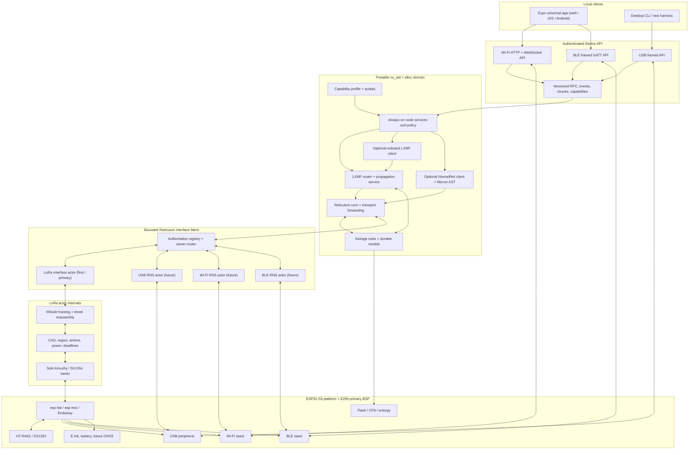

# Standalone Reticulum Firmware: Architecture and Feasibility

**Status:** accepted architecture with LoRa as the first complete transport
vertical slice and transport-neutral seams reserved for later interfaces;
Vision Master E290 pair qualified at 16 MiB flash and 8 MiB PSRAM; independent
E290 HT-RA62 owner, interface fabric, ordinary router/permit service, and
ticket-aware LoRa dispatcher implemented and target-checked; the DATA router,
both permit services, permanent `NodeInterfaceSupervisor`, and narrow
pre-authentication USB/GPIO owner are composed in the first E290 three-task
firmware graph; identity-authorized first journal provisioning plus a resident
operation-scoped 128-entry PSRAM submission runtime are also composed; optional
journal boot failure before an active DATA owner isolates local durable service
while route-only LoRa continues; the exact authorized-frame request/durable-
echo handoff and interface-local active-owner fail-stop pass cross-layer host
composition tests; portable API framing, the featureless pre-authentication
initialization-control codec, immutable credential authority, qualification-
session core, and boot-lifetime authenticated-job handoff are qualified;
semantic schema 3 preserves exact authorization provenance and distinguishes
generic RNS DATA from an exact method-neutral LXMF message; ADR 0009 selects the
dedicated E290 credential range and two-sector store, and its bounded developer/
HIL pairing-admission policy is feature-free only in the permanent E290 graph;
E290 boot mounts/recovers that store immediately after flash open, and the
resident `CredentialRuntime` privately retains its exact binding, mounted
authority, policy, and initialization permit while accepting only forward
erased/interrupted trajectories; it also retains the complete transport-neutral
Begin/ProofStart/Activate/AbortCurrent lifecycle. The node schedules that
lifecycle through a bearer-neutral depth-one owning handoff and a captured-time
causal frontier shared with control and journal mutation. The third task now
composes USB Serial/JTAG, debounced GPIO21, boot-lifetime connection epochs, an
interrupt-linearized reset guard, and one exact-next decoder/sequence space for
initialization control and all four live-pairing operations. The application
also quarantines native USB at its earliest Rust entry before detached product
initialization and canonical reattachment. Current source passes the default
E290 host-library and xtask suites, strict host-client, chat-application, and
appliance-service checks, the current Rete regression lane, and the default and
runtime-measurement-HIL target gates.
Both powered boards returned `initialization-required` and
`physical-presence-required`; live Begin created no host key before physical
presence, and full USB re-enumeration restored a fresh sequence-zero epoch.
The preceding 701,744-byte image matched both address-zero readbacks, and both
boards reattached and served sequence zero after the induced hard reset while
their credential partitions remained erased after 120-second no-button
workflows. The historical powered 718,688-byte authenticated-node-foundation image, SHA-256
`e20f6191cb2bfa78fbd7f3d588eb418913da3f1f89e3b80a4db0a28abaf414ea`,
also matched exact reads from both boards. Both returned and then recovered
sequence-zero `initialization-required`, and both credential partitions
remained exactly erased. Its authenticated USB endpoint was dormant in that
exact image; this is historical bootstrap-only evidence.
The later 748,016-byte image, SHA-256
`4864180ab1d51081758ec3bec53068d6c75316209a2ccc269a0aad48c210fe2c`,
matched exact readback on MAC `ac:a7:04:e1:3e:88` and completed button-confirmed
initialization, durable Active generation 3, exact Active partition readback,
hard reset, and authenticated capabilities. The permanent source graph now also
composes the feature-free
session and handoff crates, a static depth-one authenticated request/reply
handoff, and a fair node-side lane that revalidates current authority and
dispatches synchronously through credential-disjoint submission and inbox-port
views.
The USB owner now composes the deliberately minimal first authenticated bearer:
one active session and one request at a time, idle ClientHello replacement into
a fresh session epoch on the same connection, and terminal fault handling until
reset or re-enumeration. Replacement never displaces request/reply owners.
Resumption, protocol retries, close records, encryption, rate limiting/attempt
policy, and concurrency are intentionally deferred. Credential selection,
admission handoff, and node dispatch remain transport-neutral. USB Serial/JTAG
uses the wired qualification suite, and BLE has an implemented suite-3 binding
with bounded powered iOS qualification. Wi-Fi has an implemented,
host-qualified suite-2 binding, E290 SoftAP/raw-TCP endpoint, and native proof
connector; powered field qualification remains open. Before
several bearer actors run concurrently, they must use globally unique,
bearer-qualified connection/session epochs or disjoint per-bearer reply lanes
under one global pairing-exclusivity coordinator; independent allocators must
not merge colliding epochs into the current singleton lane. The powered API 1.1
source measured 645,159 bytes text, 3,596 bytes initialized data, 469,232 bytes
BSS, and 1,117,987 bytes total by GNU size. Its 686,176-byte application was
packaged as a 751,712-byte merged image with SHA-256
`4285fcaa9df6a6f0314ed4735377ea986b0efcafafc2710ad7594489a49b4795`;
exact address-zero readbacks matched on both E290s. Live external admission in
that image reached API 1.1 capabilities, public identity, durable RNS DATA
submission, and sequential status polling. Submission 1 crossed the physical
LoRa link to the second permanent node, whose matching destination decrypted it
and returned a valid Reticulum proof. The sender projected `Delivered` in about
2.6 seconds, and a fresh authenticated session after full USB re-enumeration
returned the same 131-byte packet length and encoded-byte SHA-256. That proof
establishes Reticulum packet receipt/decryption, not receiver-side application
persistence.
Current source advances the logical protocol to API 1.2 and composes a separate
one-entry durable raw-RNS inbox qualification store, drop-newest admission, and
authenticated read-only status/peek surface. The original 761,952-byte post-
audit qualification image, SHA-256
`ba10b04408368c3f5cbcc91f5d514f454595a7812986764c1e95ef528cc71f03`,
matched both exact address-zero readbacks. A bounded powered run proves maximum-
payload commit/readback, authenticated peek before and after hard reset, and
drop-newest preservation of item 1. The final exact 2 MiB partition readback
contained one canonical 576-byte record and a completely erased remainder.
On 2026-07-19, that exact image also failed closed on four deterministic cold-
mount states: partial claim, complete precommit record, invalid digest, and a
valid record bound to the other board. Each case advertised inbox `0/0`,
returned code 7 for status and peek with no peek output, left the complete 2 MiB
fixture unchanged, and still completed one direct DATA/proof exchange to
`Delivered`. A separate 762,672-byte feature-gated image, SHA-256
`e693afad19c2eac28d958f902c1b8148ae360a6b54abb14338195ef595515239`,
suppressed its third inbox write. The triggering packet reached `Delivered`, and
the same boot then proved commit-mismatch quarantine and one drop; that packet
does not establish post-quarantine RF. Its dependency tail was identical to
the default graph; the default ELF excludes the hook and evidence symbol. The
post-fault restored default image was 761,952 bytes, SHA-256
`d26587a2506408ec40cd42facb9bb87cc9c32e79c2afd2e1ab09f0e1268641cb`;
both boards matched it exactly and booted with empty inboxes. These are bounded
exact-state and simulated-admission-fault results, not physical power-cut,
sustained-routing, LXMF, or full-mailbox qualification. A later 768,624-byte
runtime-measurement HIL matched both board readbacks and observed one durable
maximum-payload commit on each receiver, 988 bytes maximum registered-allocator
use, 72,212 bytes of raw painted stack margin, a 548,148 us worst commit, a
1,065,406 us worst radio-loop gap, and zero RX/CAD/TX actor-watchdog counters.
Only phase A reached sender `Delivered`; phase B's receiver committed the exact
item while its sender ended in `delivery-timeout`. That capture used Rete pin
`f6f5fb0637d00691e09fa0105be4df902405fee4`; the preceding `14c7b49` host
regressions cover exact reverse-interface/proof behavior, typed transactional
reverse admission, a deterministic three-node relay flow, pending-Link
expected-hop enforcement, keepalives, and atomic channel retry receipt
replacement, plus pending-handshake MessagePack LRRTT validation and
authenticated-malformed teardown. The `90570ca` predecessor adds the precise
LRRTT lifecycle/timing contract. Its `2d07818` descendant additionally adds
ordinary Link-DATA receipts and destination proof-policy parity. A later
bounded powered proof on `2d07818` forced ordinary Link DATA, observed the
durable receiver commit and returned proof, and reached sender `Delivered`. The
current `a443173` descendant adds responder-Handshake timeout reclamation; that
new lifecycle boundary remains separate from the historical capture here.
These are instrumented,
bounded-workload observations, not
closure of sustained or production-image target bounds. After that capture,
both boards returned to the new 761,792-byte
feature-free image, SHA-256
`77b6a48e71d62facf39bae380387397dcbc79417c05372bc31c4a240f326b066`,
with exact readbacks and authenticated empty-inbox status. Host,
portable-target, ESP32-S3 build, packaging and review gates pass;
the isolated
E290 same-image ANNOUNCE/DATA/proof HIL and its pre/post image readbacks passed,
and the permanent E290 node passed its first two-board powered boot/credential/
ordinary-TX smoke with exact image and credential-partition readback; Tracker
ANNOUNCE/DATA/proof and isolated storage HIL also passed<br>
**Date:** 2026-07-23<br>
**Primary full-stack target:** Heltec Vision Master E290-HF, ESP32-S3R8 + HT-RA62/SX1262<br>
**Qualified radio regression target:** Heltec Wireless Tracker V2.3, ESP32-S3FN8 + SX1262 + KCT8103L<br>
**Product goal:** an always-on, self-contained, heterogeneous-interface Reticulum transport and LXMF store-and-forward node, with optional onboard messaging and NomadNet clients controlled over USB, BLE, or Wi-Fi

Implementation is governed by [ADR 0001](adr/0001-phase-0-scaffold.md),
[ADR 0002](adr/0002-rete-provisional-foundation.md),
[ADR 0003](adr/0003-lora-first-interface-fabric.md),
[ADR 0004](adr/0004-sole-flash-coordinator.md),
[ADR 0005](adr/0005-active-data-durability-fail-stop.md),
[ADR 0006](adr/0006-authenticated-local-api-bearer.md),
[ADR 0007](adr/0007-device-api-credential-authority.md),
[ADR 0008](adr/0008-durable-authorization-provenance.md),
[ADR 0009](adr/0009-device-api-credential-store-and-pairing.md),
[ADR 0010](adr/0010-device-api-live-pairing-protocol.md),
[ADR 0011](adr/0011-durable-rns-inbox-qualification.md),
[ADR 0012](adr/0012-application-event-and-resource-ownership.md),
[ADR 0013](adr/0013-bounded-lxmf-wire-boundary.md),
[ADR 0014](adr/0014-durable-lxmf-message-ownership.md),
[ADR 0015](adr/0015-universal-expo-client-and-generated-bindings.md),
[ADR 0016](adr/0016-bound-link-data-lxmf-ingress.md),
[ADR 0017](adr/0017-reticulum-peer-discovery-and-proximity-bootstrap.md),
[ADR 0018](adr/0018-durable-lxmf-delivery-policy.md), and the
[Phase-0 validation contract](phase-0-acceptance.md). Those documents narrow
the first workspace and establish Rete as the provisional RNS foundation
without reducing the product scope described here.

## Executive decision

The full product is plausible, but no examined repository is a drop-in firmware and no build yet combines an embedded RNS transport, an embedded LXMF propagation router, durable storage, several simultaneous Reticulum interfaces, USB, Wi-Fi, BLE, and local clients. The Vision Master E290 is now the primary complete-appliance prototype: both supplied ESP32-S3R8 boards have passed powered qualification with 16 MiB flash and 8 MiB mapped octal PSRAM. The already-qualified Tracker V2.3 pair remains a valuable radio regression target and may later carry a constrained node profile; its lack of PSRAM no longer shapes full-product acceptance.

The first turnkey-client bridge now exists on the host: a single-owner service
uses the authenticated USB API, SQLite schema-2 identity-bound state, automatic
inbox/outbox work, and a bundled loopback Expo web export. Its
[one-message two-E290 proof](e290-lxmf-appliance-alpha-proof.md) closes the
application boundary from HTTP enqueue through LoRa delivery and peer import.
The later
[managed Expo first-run proof](e290-expo-appliance-first-run-proof.md) adds
credential-empty onboarding, physical-presence pairing, required USB reset,
retained-profile service restart, simultaneous two-board services, and an
Expo-enqueued message that reached exact peer import and terminal delivery.
The subsequent
[physical Expo iOS proof](e290-expo-ios-ble-lora-proof.md) qualifies a signed,
self-contained Release importing an activated credential, authenticating the
exact E290 over BLE, and exchanging one sequential LXMF message in each
direction over LoRa. A follow-up cold foreground launch automatically
reconnected and physically passed the corrected keyboard-aware composer. These
proofs do not move node identity or routing to the host and do not qualify
background restoration, Android hardware, a full mobile lifecycle matrix,
pressure/soak, a device-served Wi-Fi/USB client, NomadNet, or an embedded
propagation service.

The broader Rust survey changes the recommended path:

1. Adopt [`rete`](https://github.com/s-retlaw/rete) as the provisional **RNS** foundation and retain Leviculum as an independent protocol oracle and fallback. At the reviewed upstream selection snapshot, `rete-core`, `rete-transport`, `rete-stack`, and `rete-lxmf-core` passed a generic bare-metal check, 391 focused host tests passed, and the then-current ESP32-S3/SX1262/Wi-Fi example compiled with the installed ESP toolchain. It is pre-release, its checked-in Python peer predates Reticulum 1.3.8, and its Resource and failure paths need bounded-memory and backpressure hardening before production acceptance. Leviculum remains available for targeted differential tests and as the alternative if Rete meets an explicit ADR 0002 abandonment criterion.
2. Reuse existing LXMF work instead of starting from an empty crate. `LXMF-rs` contains directly useful constants, announce codecs, message packing/signing, delivery selection, propagation envelopes, paper messages, fixtures, and state semantics. Its full feature graph and runtime are not directly embeddable, so extract/refactor protocol pieces behind an RNS identity adapter rather than importing its Tokio/SQLite runtime. Do **not** use `rete-lxmf-core` as the compatibility authority in its present form: despite compiling `no_std`, it currently uses 2-byte stamps/tickets where current LXMF uses 32-byte stamps and 16-byte tickets, and its `u8 -> bytes` field model cannot preserve arbitrary MessagePack values. `rsLXMF` is the most complete AGPL propagation/router reference found, while `precursor-lxmfchat` is the closest embedded Rust precedent for a combined LXMF, NomadNet and Micron client.
3. Make two infrastructure roles first-class: Reticulum transport forwarding and an LXMF propagation node. Both are configurable and quota-bound, but neither is defined out of the product merely because the initial board is constrained. An infrastructure profile remains in LoRa receive and processes/forwards traffic whenever the device is powered; only an explicitly selected leaf/standby state opts out and reports that loss of reachability.
4. Treat onboard LXMF conversation UI, NomadNet browsing, and the universal Expo client/export as optional capability modules. They make the device turnkey, but the node is useful without them and constrained builds may omit them.
5. Use only the bare-metal `esp-hal`/`esp-rtos`/Embassy platform path. The working Tracker-specific `microReticulum_Firmware` checkout is sufficient evidence that the board, radio, FEM, and ESP32-S3 can support the hardware role; an additional C++/ESP-IDF comparison would not retire the important Rust risks.
6. Make the node and Rete owner interface-neutral. One bounded registry resolves stable interface IDs and hands exact packet owners to independent actors. LoRa is the first and primary complete transport vertical slice, not a global transport abstraction; do not implement speculative USB, Wi-Fi or BLE packet actors before that slice is stable.
7. Inside the LoRa actor, put `lora-phy` behind a radio trait, keep separate E290/HT-RA62 and Tracker/external-FEM board owners, and retain an explicit RNode-compatible split/reassembly layer. It must distinguish the standard 500-byte RNS MTU from RNode's 508-byte physical interface capacity.
8. Keep identities, transport/LXMF state, messages, and propagation storage on the device. USB, BLE, and Wi-Fi clients use one authenticated, versioned device API; profiles may also expose separate Reticulum packet interfaces over those bearers. Neither service duplicates or owns the node identity.
9. Model hardware profiles as feature/capability compositions. Compile-time features remove code and static memory; runtime quotas bound tables, links, resources, stored messages, local sessions, and airtime. Full-stack acceptance occurs on the E290 without requiring the same composition to fit the Tracker.

Licensing is not a foundation-selection blocker. The project accepts the Reticulum License and ordinary FOSS licenses including MIT, Apache-2.0, EPL-2.0, GPL and AGPL, provided each component's actual terms and notices are followed. The Reticulum **protocol** is public domain; the Python reference source remains under the separate Reticulum License. That license grants broad use, modification and redistribution rights subject to its no-purposeful-harm, no-AI-training-dataset and notice conditions, all of which are accepted for this product.

The preferred `rete` + LXMF-rs product path should use a straightforward multi-license layout without delaying engineering: license project-owned crates `MIT OR Apache-2.0`, consume `rete` under Apache-2.0, and keep copied or modified LXMF-rs files/crates under EPL-2.0. The firmware distribution carries all applicable notices and corresponding EPL source; it does not directly link copied AGPL implementation code. The same permissively licensed project crates can participate in a separately coherent Leviculum/rsLXMF AGPL build. Missing upstream license files or root grants remain provenance tasks for the affected source, not reasons to reject otherwise accepted license families.

## Product boundary

“Standalone” should have a precise meaning:

- The device owns its Reticulum identity and LXMF delivery destination.
- It performs path discovery, packet processing, transport forwarding, link/resource transfers, receipts, retries, and durable message queuing without a phone or computer.
- When the profile enables it, it operates an LXMF propagation destination, persists store-and-forward traffic, retrieves messages for clients, and peers with other propagation nodes.
- A client-capable profile can browse NomadNet nodes and render Micron content through a local client.
- It remains capable of receiving LoRa traffic, and traffic on every other
  enabled Reticulum interface, when no local UI is connected.
- A phone, browser, or desktop is a view/controller for the device, not a required protocol host.

This is different from an RNode. An RNode is a host-controlled modem; the proposed product is a Reticulum endpoint that directly owns the SX1262. An optional RNode-compatible bridge mode may be useful later, but it must be a separate boot/runtime mode because there can be only one owner of the radio and identity state.

The product is an infrastructure node with optional local clients, not merely a handheld endpoint:

- Reticulum transport forwarding is a core product capability. It is enabled in mains/relay profiles and can be quota-limited or disabled in a battery-constrained profile, but it must be implemented and tested early.
- A transport profile may keep several heterogeneous interfaces online at
  once. Traffic learned on LoRa can be forwarded over Wi-Fi, USB, BLE, a
  second radio, or another configured link and vice versa; no interface actor
  owns global Reticulum routing state.
- LXMF includes both the local router/client path and the propagation-server path: deposit, durable store, retrieval, peer offers/synchronisation, stamps/tickets, culling, and abuse controls. The Tracker profile may use small quotas or compile the service out if measurements require it; the full product profile may require PSRAM hardware.
- LXMF paper delivery is a later app-assisted import/export feature: the device encodes/validates the paper payload while the SPA/native app displays or scans QR/text. It is not silently omitted from the long-term client scope, but it is not required before ordinary radio delivery works.
- The optional NomadNet client browses pages and downloads bounded resources. A static NomadNet node page is reasonable; executing arbitrary remote or server-side programs remains out of scope on microcontrollers.
- GNSS is represented now by a disabled `LocationProvider` capability and board/power hooks. Actual parsing, fixes, telemetry/location fields, maps, and time-source integration are deliberately deferred until after the network, propagation, storage, and local API are stable.

## Research baseline

### Local reference snapshots

The local repositories were inspected at these revisions. These are moving projects, so the implementation should pin reviewed commits and repeat the compile/interoperability gates before adopting updates. In particular, the `reference/rete` row is the historical inspected `90570ca` snapshot, not the current dependency pin; current source uses the descendant recorded in [provenance](provenance.md).

| Reference | Snapshot | License | Useful material | Verdict |
| --- | ---: | --- | --- | --- |
| `reference/rete` | `90570cafc812b3025011cb690ec74a27f287cb3f` integration fork (designated tag `firmware-pin-90570ca`), based on `9bcb7d3e` | MIT OR Apache-2.0 declared in Cargo/README; license texts absent | Runtime-agnostic `no_std` RNS, bounded transport storage, RNode LoRa interface, compiling Embassy ESP32-S3/SX1262/Wi-Fi example, canonical local LINKREQUEST validation, transactional owned/relay-Link and H2 reverse admission, typed capacity/conflict rejections, endpoint announce policy, caller-owned DATA preparation, allocation-atomic receipt terminals, transactional fresh-ciphertext Channel retries and sole-receipt replacement, full-hash/Link-ID-bound DATA/channel terminal candidates, owned-H2 local dispatch, exact path/reverse/Link forwarding, fail-closed LRPROOF validation, authenticated owned-Link interface binding, pending-Link expected-hop enforcement, Python-compatible keepalive lifecycle, microsecond/binary64 LRRTT dispatch timing, Handshake/Active/Stale refresh, and authenticated-malformed teardown | Provisional RNS foundation; pre-release, Resource is whole-buffered, H1 interface-role classification remains explicit product work, persisted paths remain inactive without stable interface rebinding, a shared Tokio Hub lacks endpoint-aware Link identity, generic Tokio/Embassy runners remain coarse and do not confirm dispatch tokens, adaptive channel windows can exceed product receipt capacity, established-Link watchdog timeout `LINKCLOSE` emission remains open, and current LXMF is wire-incompatible; missing canonical license files are notice/provenance hygiene, not an evaluation blocker |
| `reference/leviculum` | `5fb1db0` | AGPL-3.0-or-later | Complete sans-I/O RNS core, strong tests, RNode framing, nRF Embassy firmware, current Micron parser and substantial NomadNet client | Independent RNS oracle and fallback; no LXMF |
| `reference/LXMF` | `fab12ad9` | accepted Reticulum License | Current authoritative Python LXMF behavior, router, propagation node and fixtures | Primary pinned compatibility peer; source may also be reused when useful with its conditions/notices preserved |
| `reference/LXMF-rs` | `0859680` | EPL-2.0 | Broad LXMF/RNS behavior, wire formats, parity fixtures, announce codecs, paper messages, stamps/tickets, router semantics | Approved direct-reuse source for the EPL product path; several wire/state modules are extractable, while the full runtime still needs a substantial bare-metal refactor |
| `reference/rsReticulum` + `reference/rsLXMF` | `46b699af` / `20ef8342` | AGPL-3.0-or-later | Active Rust RNS/LXMF daemon, complete delivery methods, propagation deposit/retrieve/peering/sync, stamps/tickets, persistence and culling | Best AGPL propagation/router source and host oracle; use directly in an AGPL build, or as an executable interoperability peer for the EPL product build |
| `reference/precursor-lxmfchat` | `8cd7fa46` | no root license grant; vendored Xous tree has Apache-2.0 text | Hardware-tested Rust LXMF client, links/resources and propagation sync, constant-memory stamp mining, plus a working NomadNet browser and bounded Micron parser | Closest embedded all-in-one client precedent; not a transport/propagation server, uses Xous `std`, and source reuse needs license clarification |
| `reference/doubleailes-LXMF-rs` | `81be7fdf` | AGPL-3.0-or-later | Existing LXMF-to-Leviculum adapter and direct Link/Resource bridge | Useful adapter reference; restricted field model and propagation transfer/sync/storage TODOs prevent adoption as the full layer |
| `reference/rns-rs` | `d67d1d5` | accepted Reticulum License | Current RNS 1.3.8 parity work and an ESP-IDF ESP32-S3/SX1262 firmware | Valuable ESP/reference source; `no_std` gaps, stale ESP-IDF setup and missing LXMF—not its accepted license—block adoption as the foundation |
| `reference/microReticulum` | `7a1d5b3` | Apache-2.0 | C++ RNS behavior, storage/provisioning patterns, Tracker bring-up | Secondary behavior reference, not a Rust base; incomplete protocol areas and a LoRa framing regression |
| `reference/microReticulum_Firmware` | `b846d93` | GPL-3.0-or-later | Working Tracker V2 board/radio/FEM baseline, RNode framing, USB/BLE/TCP concepts | User-verified hardware oracle; removes the need for a separate ESP-IDF/C++ feasibility build |
| `reference/NomadNet` | `ad103015` | GPL-3.0 | Authoritative page/file request behavior and Micron grammar | Black-box/source oracle; not a firmware dependency |
| `reference/micron-parser-js` | `33feb105` | Unlicense | Parser used by web Nomad browsers, current grammar and SPA behavior | Strong SPA parser/reference, still requires sanitisation and device-side limits |
| `reference/micron-rs` | `a6468af` | AGPL-3.0-or-later | Rust lexer/event parser, HTML renderer, malformed/guide corpus | Differential oracle; grammar coverage lags current NomadNet |
| `reference/micronaut` | `21c02c67` | MIT | Rust parser plus renderer-neutral forms, history, cache and partial state | Useful parser/browser-state design; `std`, missing some current grammar, two all-feature renderer tests fail |
| `reference/foxhole` | `d67fe524` | AGPL-3.0-or-later | Focused Rust LXMF terminal and Nomad browser with separate Micron parser/renderer, forms, history and tests | Useful licensed host client/UI reference and negative interop evidence; `std`/Tokio/ratatui, not firmware code |
| `reference/esp-hal` | `5e055e49` | MIT/Apache-2.0 | ESP32-S3 HAL, radio/RTOS, USB, Wi-Fi AP, BLE, coexistence, OTA examples | Preferred bare-metal platform, with unstable ancillary crates |
| `reference/embassy` | `58248a338` | MIT/Apache-2.0 | Executor, synchronization, USB, networking, embedded patterns | Preferred portable async infrastructure |

### Surveyed but not retained locally

These research clones were removed after their useful conclusions were captured here. Re-clone the pinned revision only if a future investigation needs to reproduce a specific negative case.

| Removed clone | Reviewed snapshot | Reason not retained |
| --- | ---: | --- |
| [`lelloman/lxmf-rs`](https://github.com/lelloman/lxmf-rs) | `2e312b62` | Embedded path currently fails and its useful LXMF surface is redundant with retained LXMF-rs/rsLXMF/rns-rs references; its accepted Reticulum License was not the reason for removal |
| [`TeskesLab/nomadnet-rs`](https://github.com/TeskesLab/nomadnet-rs) | `0bb60414` | Negative evidence only: host/Tokio coupling plus noncanonical request, response-matching and Micron behavior |
| [`omensealed/omenbrowser`](https://github.com/omensealed/omenbrowser) | `ce3a964c` | Host-only desktop UX, absent root license text, and redundant with the retained embedded Precursor and licensed Foxhole clients |
| [`espup`](https://github.com/esp-rs/espup) | `26bafc6` | Installed development utility, not a firmware/library dependency; upstream source can be fetched if toolchain debugging ever requires it |

The supplied Tracker V2.3 and Vision Master E290 datasheets, schematics, and pin maps were also rendered and inspected. The Tracker radio has a KCT8103L external front end, controlled power rails, and a board-specific output-power relationship. The E290 instead uses an HT-RA62 with internal DIO2 RF switching, DIO3 1.8 V TCXO control, and SX1262 DC-DC mode. Their numerically similar SPI/control pins do not make their radio owners interchangeable. See [the E290 target dossier](heltec-vision-master-e290.md).

### Reproducible compile checks

Claims in READMEs were not treated as proof of embedded portability.

| Check | Result | Meaning |
| --- | --- | --- |
| `rete-core`, `rete-transport`, `rete-stack`, and `rete-lxmf-core`, no defaults, `thumbv6m-none-eabi` | Pass | The layers are genuinely bare-metal buildable; compilation does not cure the LXMF correctness gaps documented below |
| Focused `rete` core/transport/LXMF host suites at the reviewed upstream snapshot | 391 pass | Historical selection evidence for wire, crypto, forwarding, link/resource, and LXMF codec behavior; this is not evidence for the later lifecycle patch or a complete Python/RF conformance claim |
| Historical `8b5d652` selected routing/receipt/keepalive/LXMF validation set | 635 pass | The four library targets were 174 transport, 136 stack, 143 LXMF and 84 daemon tests, totaling 537. That pin was also run through 97 transport integration tests (9 computed-vector, 43 forwarding, 40 Link-integration and 5 path-request) and one stack integration test, producing the selected 635-test total. It is not a count of every nested workspace test target. All-target host and portable `no_std` checks remain separate compile gates |
| Historical `reticulum-conformance-rete` project runner | 647 pass | The historical 235-check baseline joined 112 released-vector, adapter and direct-Link checks with 40 released-Python LRRTT MessagePack checks, 8 channel-retry lifecycle checks, 40 exact keepalive lifecycle checks and 35 deterministic three-node A--B--C checks covering learned transport routing, exact-interface LINKREQUEST/LRPROOF/LRRTT relay, pending-Link wrong-hop LRPROOF rejection before deduplication, bound endpoint output, encrypted channel DATA/proof delivery, receipt completion and separate owned/relay/reverse capacity. The recorded schema-2 lifecycle/candidate runner passed 647 checks. This is historical project-side conformance, not a current schema-3 count or powered/live-Python multi-hop qualification. |
| `reticulum-lxmf-chat-core`, `reticulum-lxmf-chat-app`, and `reticulum-lxmf-chat-service`, host | Pass | Schema-2 SQLite binding/restart tests, stepwise commit/reconcile/inbox tests, sole-actor reconnect/fault tests, loopback capability/cookie/origin/Host routing tests, authenticated USB and macOS CoreBluetooth connector tests, and strict Clippy pass. Powered two-E290 runs carried a USB-service-enqueued message and a later Expo-enqueued message to exact peer import; the latter also passed managed credential-empty pairing, real reset, and service restart. A later pair of concurrent macOS BLE services authenticated both boards and carried one sequential message in each direction through LoRa to terminal `Delivered` and exact peer import. One effectively simultaneous pair produced one success and one durable delivery timeout, so simultaneous bidirectional scheduling remains unqualified. These crates are host-client code and do not prove an embedded HTTP server, a physically installed native mobile client, another host BLE backend, or firmware memory cost |
| `reticulum-lxmf-wire`, host, generic bare-metal and ESP32-S3 Xtensa | Pass (wire/authentication foundation only) | The independently authored allocation-free `no_std` crate normalizes destination DATA, Link DATA context `NONE`, and completed Resource carriers into borrowed views with explicit byte/cardinality/value/scan/depth limits. It preserves raw exact-four hashing, admits only proven canonical first-four stamped forms, binds full RNS public keys to `lxmf.delivery` source hashes, requires public-key A and signature R to be non-identity prime-subgroup points, streams Ed25519 verification, and crosses a separate destination-bound receiver stamp-policy typestate for trusted prior tickets or streamed 3,000-round proof of work. Its first MessagePack tranche supports nil/boolean/integer/string/binary/generic-extension map keys, rejects Python-equal duplicates, and fails closed on float/container keys and timestamp extension normalization. Two unit plus eleven integration tests consume eight positive, one noncanonical inbound, and six negative pinned-Python fixtures; ten Python authority tests, strict Clippy/rustdoc, RISC-V/Xtensa checks, and an exact 15-package normal-closure policy pass. The mixed-order subgroup regression constructs its points from the dependency's basepoint and torsion constants instead of retaining third-party vector literals. This does not provide encoding, announces, durable delivery, Resource segmentation, a mailbox/router, RF interoperability, or live actor integration; proof-of-work validation remains synchronous work that must not run in the sole network actor |
| `reticulum-lxmf-ingress`, host, generic bare-metal and ESP32-S3 Xtensa | Pass (portable opportunistic and bound direct-packet admission; permanent-E290 composition) | The `no_std` adapter performs no admission-time allocation: it borrows an ADR 0012 application event, admits destination DATA or responder-side context-`NONE` Link DATA addressed to an explicitly supplied local `lxmf.delivery` destination, resolves the source public key by value, and returns a zero-copy validated carrier plus fixed scalar evidence under caller-selected wire and stamp policies. Direct Link DATA carries ADR 0016's opaque binding derived from Rete's retained authenticated Link; both that binding and the complete LXMF wire must name the local destination. The subsequent E290 durable-admission step separately requires the event owner to carry the exact explicit Link-destined packet proof covering the received RNS packet hash before store I/O. Non-`NONE` Link DATA is unrelated, initiator/backchannel direct receive is unsupported, and Resource completion remains deferred. Thirteen integration tests cover opportunistic and direct Python fixtures through the exact 431-byte direct boundary, zero-copy payloads, lookup/destination/context isolation, stamp policies, Resource deferral, owner retention, and class-preserving failures. The permanent E290 image enables Links only on its mount-gated LXMF service. Powered evidence includes one new responder-side direct Link commit/proof chain and a bounded same-message two-packet/one-row replay outcome. The receiver's exact `Replay` classification remains source-qualified because the frozen client API does not expose its internal commit-kind enum; sustained directional load, pressure, faults, and soak remain open |
| `reticulum-lxmf-model`, `reticulum-lxmf-store`, and `reticulum-lxmf-durable-ingress`, host, generic bare-metal and ESP32-S3 Xtensa | Pass (portable durable owner; mount-gated E290 receive composition) | The dependency-free model holds immutable logical identity, exact scalar metadata and borrowed contiguous or two-segment normalized wire without a message-sized buffer. The `no_std` store borrows an opaque caller-backed fixed index slot slice and uses variable 4 KiB append-only extents, isolated claim/header writes, terminal commit, commit-time and mount-time integrity readback, exact physical binding, stable non-address handles and typed replay/collision/fault outcomes. Its 30 tests cover five exact released-Python basic/rich/stamped/391-byte messages, exact zero/one/multiple caller index capacities and reconstruction, multi-record and multi-extent segmented append, range/index exhaustion, duplicate handles, unknown or committed media hidden inside an incomplete span during mount or pending retry, standalone continuation and out-of-range start rejection, programmed padding, sparse torn claims/headers, every write-prefix cut, every lost-success program call, reboot/reappend and final-verification read loss. Ten model tests and fourteen durable-ingress tests prove exact lease ownership, reset/remount replay, retained-proof ordering, and proof-required responder-side direct Link DATA new/replay commits with `LinkDataContextNone` provenance. Real Rete `Retain`/`basic_binary` coverage proves preclassification and delayed-proof capacity precede store I/O, a new commit and a freshly received retransmission recognized as `AlreadyDurable` each queue that event's retained proof, and a lost terminal-write reply followed by exact retry queues exactly one ready proof. Strict Clippy/rustdoc, RISC-V/Xtensa checks and exact normal/dev closure policies pass. The E290 product graph directly includes the four feature-free model/store/ingress owners, allocates its 512-slot opaque index, delayed-proof backing, and retry/fault/proof-holder state in validated PSRAM, validates and mounts a dedicated 2 MiB partition in its sole flash coordinator, selects per-destination `Retain` and required-proof durable admission, and drains ready packet proofs only through the ordinary transport-neutral supervisor after a new commit or a fresh retransmission recognized as `AlreadyDurable`. Sixteen internal-RAM application-event slots and sixteen external-PSRAM proof/retry slots are the current volatile-concurrency profile, not a protocol or storage ceiling. Earlier powered runs proved opportunistic and fresh-direct new commits. The bounded same-Link/direct-replay run then delivered submissions 6 and 7 with one LXMF message ID and distinct Reticulum packet hashes while the receiver added one row. The internal `Replay` enum and zero-write replay branch are source-qualified and exercised by that outcome because the frozen client API exposes neither; Resource streaming, delete/reclaim, full replay/remount, sustained directional-load balance, pressure, faults, and soak remain later owners |
| `reticulum-radio-interface`, host, generic bare-metal and ESP32-S3 Xtensa | Pass | Allocation-free RNode framing/reassembly distinguishes the 500-byte RNS, 508-byte interface and 255-byte physical limits; conservative whole-microsecond one/two-frame RF airtime ceilings use exact SX126x bandwidth-code divisors, and a permit-gated state machine enforces randomized initial contention, bounded CAD retries, clear-observation freshness, explicit setup/turnaround/reconciliation bounds, aggregate reservation and strict owner deadlines. Its 89 focused tests, strict Clippy and warning-free rustdoc pass |
| `reticulum-semantic-roundtrip-hil`, host, generic bare-metal and ESP32-S3 Xtensa | Pass (test fixture only) | The allocation-free board-independent crate owns the stable public test identities, deterministic signed-announce vector, four-step ANNOUNCE/DATA/proof state machine, exact payload and RNode-frame policy. Seven all-feature tests include a real two-Rete-node encrypted round trip and strict failure cases. Six-byte identity selectors preserve the qualified wire fixture but cannot authorize hardware; each board wrapper independently maps exact eFuse MACs to roles, and graph policy excludes this crate from permanent firmware |
| `reticulum-board-heltec-vision-master-e290`, host, generic bare-metal and ESP32-S3 Xtensa | Pass (design facts only) | The HAL-free crate is the exhaustive compiled GPIO ownership map for the supplied V0.3.1 design, validates complete channels against the fitted HT-RA62-HF 863--928 MHz range, and fixes reset-low/NSS-high inert boot with no implicit frequency or TX power. Eight focused tests cover exact pin collisions/ownership and display/radio disjointness, named aliases, RF boundaries, safe state and the conservative 8 MiB design PSRAM floor. It intentionally makes no connected-board, qualified-memory or flash-capacity claim |
| `reticulum-radio-lora-phy`, host, generic bare-metal and ESP32-S3 Xtensa | Pass (portable LoRa physical-link core) | The board-neutral crate owns one initialized `lora-phy` SX126x state machine behind `SoleRnodeRadio`: persistent continuous RX with bounded software scheduler yields, timestamped CAD, and atomic one/two-frame RNode TX with exact partial progress. Only the cancellation-safe DIO wait competes with the scheduler; receive progress holds the owner until a terminal IRQ. Taking a TX job invalidates the RX epoch, and CAD/TX quiesces standby plus IRQ routing/status before mode change. It has no ESP HAL, board pins, regional authorization, chip-variant power policy or external-FEM policy; cancellation synchronously drops the private board interface fail-closed. Strict Clippy, warning-free rustdoc and both target checks pass, while graph policy pins its five direct dependencies and keeps it outside every RF-inert product/storage graph |
| `reticulum-board-heltec-vision-master-e290-radio`, host, generic bare-metal and ESP32-S3 Xtensa | Pass (software owner plus powered functional HIL) | The independent E290 wrapper selects stock high-power `Sx1262`, 915 MHz SF7/BW125/CR4/5, private sync, requested 14 dBm output using the current Semtech optimal PA/raw-command mapping, DC-DC, internal DIO2 switching and DIO3 1.8 V TCXO with the pinned 10 ms wake command. Twelve command-log tests cover exact initialization, stock PA/no Tracker OCP, reset/SPI/cancellation containment, legacy bounded RX, CAD, one/two-frame TX and partial progress, plus two frames after one continuous `SetRx`, no intervening standby, scheduler yields without rearm, stalled-preamble rearm followed by a valid frame, invalid-frame recovery, receive-epoch invalidation, exact quiescence before CAD/TX, and 307-byte RNode split reassembly across an intervening scheduler yield. It requires monotonic-microsecond IRQ capture for `SoleRnodeRadio`, compiles on both targets and manipulates no display/battery/FEM GPIO. The isolated same-image HIL passed two clear CAD and two TX operations per board across the physical NA915 path. The permanent persistent-RX path has now carried bounded delivered chat traffic in both directions; range, calibration, sustained directional-load balance, fault, and full qualification remain open |
| `reticulum-heltec-vision-master-e290-semantic-hil`, host and ESP32-S3 Xtensa | Pass (powered same-image functional HIL) | The MAC-gated hazardous image assigned the two connected `HT-RA62-HF` E290s complementary roles and composed the E290 radio owner with a four-packet signed-ANNOUNCE/encrypted-DATA/delivery-proof exchange. Every TX required deadline-bounded clear CAD, each role used its exact two-packet budget, the DATA receipt reached `Delivered`, and both radios shut down. The dedicated fail-closed verifier bound the exact physical MAC/role pair, profile, state sequence, semantic ingress, two CAD observations per board, all four cross-board packet hashes and the DATA receipt; nineteen positive/negative tests pass. Both immediate and post-capture readbacks matched the same 421,296-byte image, SHA-256 `4584abdff80ab4b3151bf5168a364dc30016e29230f51f06195661b455a01085`. This isolated result excludes the permanent graph, storage/API/LXMF, multi-hop, range, fault and soak qualification |
| `reticulum-node-core`, generic bare-metal and ESP32-S3 Xtensa | Pass | External-buffer DATA dispatch metadata, an independent atomic ordinary-action owner with parallel permit/authorized-byte/completion/quarantine typestates, exact attempt ledger, deterministic routing, opaque interface-resource permits, exact deadlines, retained recovery, explicit proof policy and bounded announce operations compile without `std` on both targets. Direct terminal attempts retain their exact optional Link handle, and normal authenticated active/stale Link close returns an ordinary action envelope. It has no async or radio linkage and is now owned by the permanent E290 node task through `NodeInterfaceSupervisor` |
| `reticulum-nor-flash-region`, generic bare-metal and ESP32-S3 Xtensa | Pass | A checked raw-NOR partition view translates exact relative reads/programs/erases onto one caller-owned backend, forwards `MultiwriteNorFlash`, rejects range/absolute-end overflow before access, and counts mutation attempts without owning a platform driver |
| `reticulum-rns-inbox-store`, host, generic bare-metal and ESP32-S3 Xtensa | Pass (portable one-entry qualification store) | The allocation-free crate binds an exact 2 MiB range to a physical device ID, absolute offset, length, and format version. Format 1 owns one fixed 576-byte record with a claim, canonical destination/383-byte payload body plus domain-separated SHA-256, and a commit marker programmed last; every later partition byte must remain erased. Read-only mount distinguishes erased, exact occupied, interrupted, unknown, corrupt, noncanonical, and wrongly bound media without mutation. Admission reconciles exact readback, including a lost commit reply, but issues no erase and exposes no acknowledgement, deletion, or reclamation operation. Seventeen fake-NOR tests plus strict Clippy/rustdoc and generic/Xtensa `no_std` checks pass. The product composition has bounded powered commit/readback/hard-reset/drop-newest evidence, four exact fail-closed cold-mount cases, one feature-gated same-boot missing-commit quarantine, and one instrumented maximum-payload commit timing on each board. Physical power cuts, broader fault trajectories, and full target timing/high-water qualification remain open. This is ADR 0011's raw-RNS durability qualification record, not an LXMF store or product mailbox |
| `reticulum-device-identity-store`, generic bare-metal and ESP32-S3 Xtensa | Pass | The allocation-free 8 KiB format preflights without mutation, provisions or imports exact Reticulum X25519/Ed25519 private material into two commit-last 4 KiB mirrors, repairs only from a valid authority, zeroizes scratch, and fails closed on unknown bytes, committed corruption or key conflict. Generated X25519 bytes alone are clamped; reload/import bytes remain exact |
| `reticulum-announce-clock`, generic bare-metal and ESP32-S3 Xtensa | Pass | The allocation-free 8 KiB two-sector append journal commits the next 20-bit boot epoch to both sectors before return. A typed 20-bit per-boot ordinal produces the complete 40-bit announce emission order; blank media requires an explicit first-provision policy, while an existing identity with missing high-water state fails without mutation. Exhaustive write/erase cuts and lost replies never reuse a returned epoch |
| `reticulum-tx-handoff`, host, generic bare-metal and ESP32-S3 Xtensa | Pass | DATA handoff provides static one-time common-origin role splitting and pool-sized owning channels. The production ordinary path has a separate permit-only depth-one request/reply store because ticketed ordinary jobs and completions use the interface router's per-actor queues. A separate depth-one authorized-frame pair carries exact observation requests from an interface dispatcher and exact durable echoes from the node owner. All sends return complete values under pressure, and cancellation-safe waits never reserve or discard them. The E290 graph composes the permit and authorized-frame handoffs needed by `NodeInterfaceSupervisor` and the LoRa actor; the legacy DATA job/return harness remains RF-inert |
| `reticulum-tx-dispatch`, host, generic bare-metal and ESP32-S3 Xtensa | Pass | The RF-inert dispatcher, permit server, and exact-owner-bound fixed per-slot node DATA machine retain owners/control values across backpressure, synchronously prepare from parked owners, use cancellation-safe short waits, park recovered owners until exact acknowledgement, and fail closed at the permit recovery grace. The permanent E290 graph reaches these DATA machines through `NodeInterfaceSupervisor`; their legacy job/return harness remains separate and RF-inert |
| `reticulum-radio-tx-dispatch`, host, generic bare-metal and ESP32-S3 Xtensa | Pass | The firmware-includable persistent serializer consumes the interface router's ticketed DATA/ordinary actor union and retains each ticket while keeping the two typestate families separate over one `SoleRnodeRadio`. It performs randomized initial/retry backoff and CAD, validates the actor-stamped interface configuration, maps the active radio fingerprint and aggregate airtime to node-core's opaque resource-and-units permit, revalidates before permit negotiation and after grant, exposes bytes once, and makes one logical one/two-frame RNode transmit. Every post-byte-exposure DATA completion, including cancellation and fault recovery, is gated with its router ticket and exact authorized-frame observation until an identical durable acknowledgement arrives. Request pressure and cancelled waits retain ownership; unexpected or mismatched acknowledgements fail closed while retaining both observations. `DispatchReport` is copy-only diagnosis, never ownership. RX start remains an explicit idle scheduler choice even when TX is queued, and phase-aware completion-capacity readiness never moves a retained completion. Its watchdog, final-frame metadata and fail-closed recovery retain exact owners/control values across completion pressure, partial or impossible progress, stale/lost replies, configuration drift, invalid RX metadata, radio faults, and dropped CAD/TX/RX futures. Host, strict Clippy, warning-free rustdoc, generic no-std and Xtensa gates pass. Its exact direct-dependency policy keeps Embassy Futures test-only. The first permanent E290 graph instantiates it as the sole LoRa actor dispatcher; target build/review gates and one bounded powered DATA/peer-proof path pass, while powered fault/soak/full qualification remains open |
| `reticulum-tx-supervisor`, host, generic bare-metal and ESP32-S3 Xtensa | Pass | `NodeInterfaceSupervisor` is the production portable aggregate: it owns the sole node-core, authoritative interface router, DATA and ordinary coordinators, one permit server per family and actor, and one shared policy. Its sealed fixed-pool ingress validates queue origin, current lease, online state and logical MTU, recycles the exact buffer, retries only a full return queue and `Busy` action pressure, and exposes every other buffer-return or action residue as an exact takeable terminal owner for quarantine. A generation-bound Ready/Offline exchange is a pre-routing gate, with router-local fairness among actor lifecycle queues; the bounded supervisor round robin then scans completions, both coordinators and all permit services. Host coverage proves two actors becoming Ready, graceful Offline followed by legitimate return of the in-flight completion, serialized continuation through the healthy actor, fresh-route exclusion, surviving ingress, crossed/stale rejection, acknowledgement pressure, and lifecycle acknowledgement after an aggregate owner mismatch. It does not prove terminal failover: E290 retains ambiguous owners, only fresh attempts exclude the failed actor, and drain/revocation of provably unstarted queued work remains future work. The E290 node graph composes this aggregate; the older async `TxSupervisor` remains only a legacy RF-inert DATA-machine test aggregate |
| `reticulum-heltec-vision-master-e290-node`, host and ESP32-S3 Xtensa | Pass (current source/test composition plus bounded powered end-to-end proofs) | The permanent graph composes the transport-neutral node, LoRa actor, USB/BLE/Wi-Fi bearer seams, credential/session owners, durable submission runtime, raw-RNS qualification inbox, and mount-gated `lxmf.delivery` store. ADR 0016 enables local Links only on that LXMF destination and routes responder-side bound context-`NONE` Link DATA plus its exact Link packet proof through the existing fixed event/retry/store owners; the proof is withheld until durable commit or fresh `AlreadyDurable`. The primary destination and native Resource ingress remain disabled for local termination, and initiator/backchannel direct receive remains unsupported. Existing powered evidence covers opportunistic A-to-B durability/proof behavior, bounded authenticated bidirectional chat and installed Expo iOS BLE-to-LoRa operation. Current source additionally projects 32 authenticated `lxmf.delivery` announce peers with at most 256 application-data bytes each through API 1.5 and the Expo Nearby picker; a bounded iOS/two-E290 run opened an existing learned peer without endpoint entry and delivered one short opportunistic message in each direction with exact peer import. Fresh-contact creation remains open. A separate forced-oversize iOS/BLE-to-E290-to-LoRa-to-E290 run powered one fresh product-owned direct-Link transaction, new receiver commit before proof, sender `Delivered`, and board/app restart persistence. The bounded same-Link/direct-replay run then accepted direct-required submissions 6 and 7 with one LXMF message ID, delivered two distinct Reticulum packet hashes to durable `Delivered`, and added one receiver row. Exact same-`LinkHandle` reuse and the receiver `Replay` enum remain source-qualified because the frozen client API exposes neither internal value. Resource, responder/backchannel reuse, and the broader direct-Link fault/pressure matrix remain open. The 128-entry submission profile, 154-acceptance journal lifetime, single active local session, and current volatile Link/event/proof capacities remain explicit bounded alpha limits. Exact image measurements, digests, fault cases, and powered evidence are recorded in the E290 runbook; sustained routing, replay/remount, physical cuts, pressure/fault behavior, range, and soak remain open. |
| `reticulum-heltec-vision-master-e290-node --features runtime-measurement-hil` | Pass (historical measurements preserved; current continuous-RX durable-LXMF confirmation; not a product mode) | Historical evidence remains revision-bound, including the 768,624-byte two-board runtime run, the 800,480-byte pre-PSRAM checkpoint, the 868,800-byte pre-LXTE placement checkpoint, and the paired-announce discovery failure. The retained 16-entry default/HIL ELFs are 13,648,888/13,821,496 bytes with SHA-256 `92e63b60a5f4b830ee55d958fcc446a6878036212904b8748519ae210ba3da58`/`7a3fad34699f910a2050468ada6461a0f33d16641ab5425a5c795a71238861ff`; their packages are 868,656/881,456 bytes with SHA-256 `c8da2af30e2d0ee24ca4b215151d1370b7e1d242991ebbeb024079a730693a3f`/`12c6f31a7fb64485ad9220edca4ac38ba0a57867ad88ce60fa1a24ffc195d379`. The pair passes 946/962 stack records, 53,680-byte maximum frames, 175,056/174,256-byte usable stacks, exact guards, RPTE, and LXTE gates; exact HIL readbacks passed on both E290s. One and only one fresh A-to-B submission carried a 206-byte LXMF carrier in an exact 307-byte RNS packet and reached `Delivered` on its first attempt. Receiver B advanced LXTE new/ready/released/ordinary-handoff by one with zero replay/order events, emitted one confirmed TX, and stored exactly one generator-matching record; its release tag matched A's delivered tag. Receiver RPTE generated-proof metadata remained zero by design because the retained proof is intercepted before ordinary ingress metadata. Baseline and terminal captures recorded no allocation, runtime, watchdog, correlation, not-confirmed-success, saturation, or ordering fault. The exact message, packet, store, and full-wire hashes are in the E290 runbook. That artifact's policy carried 57,700 painted bytes and a 4,020-byte conservative margin; it does not qualify the current 128-entry runtime. Interrupt/nesting, sustained/forwarded traffic, direction balance, replay/remount, concurrent durable work, pressure/failure cases, range, soak, and production-image bounds remain open. |
| `reticulum-storage-model`, host, generic bare-metal and ESP32-S3 Xtensa | Pass | The allocation-free semantic journal model enforces canonical schema-3 records, exact authorization snapshots, principal-scoped idempotency across credential rotation, distinct 383-byte generic-RNS and 431-byte exact method-neutral LXMF-message intents, exact preflight/apply plans, monotonic conservative transmission uncertainty, and fail-closed complete replay. The boundary intentionally makes no physical-durability or flash-capacity claim. |
| `reticulum-submission-projector`, host, generic bare-metal and ESP32-S3 Xtensa | Pass | The fixed-capacity projector correlates volatile attempts with semantic records and withholds terminal/recovery acknowledgement behind exact persistence replies; 24 focused tests cover ordering, retries, native authorized-frame conversion, proof/timeout-before-frame races, faults and conservative reboot behavior. Completed slots deliberately do not retire without a future exact node-owner quiescence proof |
| `reticulum-storage-journal`, host, generic bare-metal and ESP32-S3 Xtensa | Pass | The allocation-free backend fixes the 1 MiB/two-bank physical format 2 with semantic schema 3, 544-byte bodies, 774 slots per bank, full-bank replay, commit-last exact-readback append, a 154-acceptance lifetime ceiling, and source-preserving handoff compaction. Schema-2/physical-1 and older media fail read-only; development migration erases only `node_journal`. The historical powered HIL remains evidence for its recorded earlier geometry, while a schema-3/physical-2 powered rerun remains open. |
| `reticulum-storage-actor`, host and ESP32-S3 Xtensa | Pass | The portable sole semantic owner mounts and fully replays through an exact device/range/layout binding before service, then borrows matching journal access per mutation while the backend stays in the product coordinator. Wrong access is rejected before I/O without poisoning valid state. It owns the live index/sole projector, projects node/TX observations without mutable-projector escape, durably finalizes conservative boot recovery, publishes only after append or exact equivalence, autonomously reconciles one ambiguous mutation, and latches invariant faults closed; 23 focused tests cover binding rejection, acceptance, boot recovery, observation/acknowledgement ordering, projector identity, lost replies, compaction recovery and fault retention, with strict host and target checks passing |
| `reticulum-submission-runtime`, host, generic bare-metal and ESP32-S3 Xtensa | Pass | The executor- and transport-neutral runtime owns boot recovery and the durability-first live scheduling order over backend-independent `StorageActor` plus `SubmissionNodePort`. Physical calls borrow exact bound access, while frame observations stay backend-free; binding is checked before recovery phase change, node preparation, or acknowledgement. It persists the no-replay preparation barrier before native DATA preparation and withholds terminal/recovery release behind committed records. Direct-required and routed-overflow work is single-flight per exact Link from `Active` attempt through unacknowledged `Terminal`: typed `DirectLinkAttemptBackpressured` keeps a follower durably `Preparing`, prevents a second same-destination Link, and reopens the same handle only after exact durable acknowledgement. Eligible short LXMF may still use opportunistic DATA, and another reusable Link remains schedulable. The timeout path evicts the exact handle only after durable `DeliveryTimeout`; a follower already waiting then requests a fresh Link rather than selecting the retired handle. Integrated regressions prove exact same-`LinkHandle` success/reuse and the timeout transition. The bounded powered run delivered submissions 6 and 7 with one message ID, distinct packet hashes, two `Delivered` terminals, and one receiver row; the frozen client API does not expose the handle itself. Strict host/generic/Xtensa gates pass. The E290 image keeps the runtime resident with a 128-entry external-PSRAM accepted-history profile. Resource, responder/backchannel reuse, and broader fault/pressure qualification remain open. |
| `reticulum-device-api-adapter`, default/experimental/dependency-unified host and ESP32-S3 Xtensa | Pass | The allocation-free authenticated dispatcher exposes public capabilities and the copy-only primary destination, plus principal-scoped submission status; it fails closed during port ambiguity/fault and restricts advertised operations to its local build. Identity is supplied as a node-owned scalar outside `SubmissionPort`, so the read performs no port I/O. The target-safe `experimental-rns-data` path converts one authorized borrowed payload plus validated non-wire dispatch provenance into an owned schema-3 acceptance candidate through the narrow port. The separate `experimental-rns-inbox` path accepts only authenticated principals, then obtains status or an owned bounded peek response through a read-only `InboundMailboxPort`; it adds no persisted permission bit and maps empty to `NotFound`. The API 1.5 peer cursor is an authenticated read-only projection and does not grant route or device-control authority. Focused tests and strict Clippy pass across the relevant host and bare-metal profiles without giving the adapter an actor, journal, raw inbox store, or flash capability. `ProductStorageCoordinator` implements disjoint short-lived submission and inbox views in the E290 graph. The node handoff lane calls them synchronously only after current-authority revalidation; powered API 1.1 supplied sequential submission/status requests and powered API 1.2 supplied bounded inbox status/peek. |
| `reticulum-device-api-framing`, host, generic bare-metal and ESP32-S3 Xtensa | Pass | The allocation-free edge owns canonical zero-delimited COBS records with a 128-bit session ID, direction-local sequence, 512-byte opaque payload and 128-bit tag slot. Its sole dependency is feature-disabled `zeroize`: decoded records, decoder scratch, encoding scratch and partial-TX wire owners wipe on terminal/reset/drop paths. The streaming decoder ignores pre-delimiter garbage, bounds overflow and resynchronizes only at a zero; established-session policy remains the later session owner. Its explicit partial-TX cursor never advances without a backend acknowledgement. Eleven tests cover empty/maximum owners, canonical authenticated bytes, dense zero patterns, malformed/overlong recovery, shared delimiters, reset, partial writes and zeroization. It contains no USB HAL, session, credential, API-dispatch or packet-interface behavior |
| `reticulum-device-api-pairing-control`, host, generic bare-metal and ESP32-S3 Xtensa | Pass (portable codec; composed only in the permanent E290 bootstrap) | The featureless allocation-free bootstrap codec depends only on framing and freezes zero-session, zero-tag status/initialize request and response kinds, exact empty/one-byte payload shapes, and coarse public status/result codes. It preserves but does not interpret sequence numbers. Eight tests cover every kind/code, exact COBS round trips, malformed fields and shapes, unknown values, and framing-fault ownership. It contains no USB HAL, GPIO, clock, connection policy, credential authority, flash, task handoff, logical API, session, or radio edge. The permanent E290 firmware now composes it behind the separate USB/GPIO owner; graph policy still excludes it from legacy products and HIL images |
| `reticulum-device-api-pairing`, host, generic bare-metal and ESP32-S3 Xtensa | Pass (portable live-pairing core; resident E290 lifecycle-composed) | The featureless allocation-free ADR 0010 core freezes zero-session/zero-tag Begin, ProofStart, Activate-continuation and identifier-free AbortCurrent records for the wired developer profile. Credential ID and Pending generation remain typed through the transcript and continuation, while proof suite 2 HMAC-binds the actual store-selected Active generation in the activation confirmation; full HMAC-SHA256 proofs use distinct client/activation domains and constant-time verification. Project-owned PSKs, challenges, proofs, confirmations, codec payload scratch, decoded records and framed wire owners zeroize on drop; secret-bearing public owners are neither copyable, cloneable nor debuggable. Upstream RustCrypto SHA-256/HMAC contexts do not implement `Zeroize`, and Rust moves may leave compiler-created copies beyond the current owner's wipe, so both remain explicit residuals for this developer profile. Fourteen Rust tests plus four compile-fail doctests and six independent standard-library Python tests cover all eight successful COBS flights, exact KATs, every transcript byte/role/length, final-generation binding, result vocabularies, malformed profiles/shapes/references, substituted continuations, secret-owner drop glue and proof rejection. The exact reviewed graph is HMAC, SHA-256, zeroize, credential authority and framing plus test-only hex; it contains no policy, entropy, store, USB, task handoff, logical API, session, firmware, Rete or radio edge. Graph policy permits it only through the permanent E290 resident credential lifecycle and still forbids it from legacy/HIL graphs |
| `reticulum-device-api-credentials`, host, generic bare-metal and ESP32-S3 Xtensa | Pass (portable immutable authority and semantic codec; no physical persistence) | The allocation-free crate owns the shared credential ID/generation types below session and validates one immutable fixed 16-record snapshot before service. Its canonical zeroizing 2,048-byte image encodes 128-byte records in strict credential-ID order, zeros every unused/reserved byte, and is consumed by a decoder that rejects noncanonical wire shapes before rebuilding the authority. Consuming builder inserts prevent a rejected record from exposing a valid prefix; live successor plans require one exact next-revision mutation and reject same-generation authorization changes or silent removal, while lifecycle-specific planners authorize only Add-`Pending`, exact Activate-`Pending`, and exact Abort-`Pending` transitions. Their opaque store candidates retain the transition plus an exact zeroizing source binding across structural and transition-specific preflight. `NewPendingCredential` consumes an existing zeroizing PSK owner; `Pending`/`Active` records zeroize distinct PSKs, while `Revoked` tombstones are PSK-free. Constant-time fixed-table lookup yields only opaque zeroizing active or exact-pending selections; exact grant revalidation supplies a non-copyable device-owned `DispatchContext` through a borrowing synchronous callback. The callback freezes the authority and prevents moving the exact context, but immediate dispatch/no fallback remain trusted sole-owner rules because linked code can reconstruct scalar facts. Twenty-three unit tests, eight public successor regressions and 18 compile-fail doctests cover canonical loading and encoding, successor and lifecycle policy, cross-predecessor rejection, stable vocabularies, image/secret/lease ownership, and the 2,048-byte E290 authority ceiling. It contains no physical raw-NOR format, mutation actor, pairing/rate policy, firmware, bearer, Reticulum identity or radio edge; see ADR 0007 |
| `reticulum-device-api-credential-store`, host, generic bare-metal and ESP32-S3 Xtensa | Pass (portable physical store; mount, initialization recovery, and resident live lifecycle source-composed on E290) | The allocation-free crate owns ADR 0009's exact 8 KiB two-sector raw-NOR format over an operation-scoped device/range/layout binding. It consumes the canonical 2,048-byte authority image, commits and re-scans a complete successor before retiring its predecessor, blocks publication while retirement is incomplete, never falls back across a retired or corrupt committed successor, and retains current/candidate owners across ambiguous backend results. Typed pairing commit/reconcile owners preserve Add/Activate/Abort provenance without exposing proof material; semantic preflight rejects both structural and exact-transition mismatches without I/O, while the supported product path selects pending proof material only through a mounted publishable authority. A repository source guard confines its two hidden unchecked integration bridges to the semantic authority and physical store. Explicit empty revision-1 provisioning has a no-erase deterministic recovery path plus a read-only four-way classifier for exactly erased, recoverably interrupted, already committed, and ineligible media; cleanup erases are bounded and exactly read back. Thirty-two fake-NOR tests cover typed lifecycle chains, cross-predecessor rejection and retry, every-byte provision/program/retire/cleanup cuts, lost replies, read faults, wrong bindings, conflicts, revision exhaustion, publication gating, and corrupt-successor non-fallback. Strict host Clippy/rustdoc plus generic and Xtensa checks pass. Its four-dependency graph contains no ESP, async, session, bearer, pairing, Reticulum, or radio edge. The E290 product supplies the exact platform binding, bounded mount recovery, read-only interrupted-initialization classification, forward-only empty-provision recovery, and a resident Add/Activate/Abort drive that retains ambiguous physical owners through reconciliation. That drive is scheduled through the node/USB causal frontier; one initialize/pair/Active happy path is powered-qualified, while Pending/Abort readbacks and mutation fault cuts remain open. Format 1 stores PSKs in plaintext for developer/HIL use |
| `reticulum-device-api-pairing-policy`, host, generic bare-metal and ESP32-S3 Xtensa | Pass (portable policy; feature-free only in permanent E290 firmware) | The allocation-free owner freezes exact 2,000 ms release-to-arm physical presence, a 60,000 ms threshold-based exclusive window, strictly increasing boot-lifetime connection epochs, a shared three-Begin/Proof budget, one non-secret pending reference, and exact operation ownership across timeout/disconnect. The third classified request closes new work while an admitted operation drains to a definite result. Trusted initialization facts distinguish `ExactlyErased` from `RecoverableInterrupted`; a single-use permit retains the admitted media trajectory for the sole physical owner to reclassify immediately before I/O. Trusted Begin facts likewise remain assertions to recheck. Proof permits expose only their exact connection, window, original exclusive deadline, and durable pending reference so the resident lifecycle can bind the continuation without duplicating policy state. Twenty-two unit tests plus four compile-fail doctests cover boundaries, both initialization trajectories, counted refusals, pending transitions, ordinary-session invalidation, faults, pending-existence privacy, continuation invalidation, and a 256-byte RAM ceiling. It has no GPIO, USB, flash, entropy, HMAC, framing, executor, or radio edge. Graph policy requires its feature-free edge only in the permanent E290 product and forbids it from legacy product/HIL graphs. `CredentialRuntime` retains its policy and initialization/live-lifecycle permits; the E290 USB/GPIO owner routes initialization plus Begin/ProofStart/Activate/AbortCurrent through the node-owned handoffs. Powered no-button Begin reached only `physical-presence-required`, and a later physical hold completed initialization plus authenticated pairing on one board; fault and alternate-lifecycle qualification remain open. |
| `reticulum-device-api-session`, host, generic bare-metal and ESP32-S3 Xtensa | Pass (portable core plus minimal E290 USB bearer composition) | The allocation-free server and public `no_std` client typestates freeze the USB Serial/JTAG-only HKDF/HMAC qualification transcript, full mutual proofs, direction-separated 128-bit record tags, exact-next sequences, partial-TX ownership, and a single-request typestate. The server's non-cloneable grant contains credential ID/generation and session routing facts but no PSK, principal or permissions; it revalidates against the portable device-owned authority to obtain a borrowing dispatch lease. The E290 USB task composes one active session and one request in flight, with fault-until-reset behavior; a canonical ClientHello can replace an idle established session with a fresh epoch on the same connection but never displaces request/reply owners. The host utility drives either one-shot operations or sequential submit/status flights in the same authenticated session. Resumption, retries, close records, encryption, rate/attempt policy, and concurrency are deferred. The portable crate itself still contains no credential persistence, pairing/rate policy, USB HAL, Rete or radio edge. Capabilities, identity, durable submission, repeated status, a fresh post-re-enumeration status session, and idle replacement across consecutive authenticated client processes on one unchanged enumeration are powered-qualified. Busy-owner non-displacement and richer established-stream fault/recovery behavior remain to qualify. |
| `reticulum-device-api-handoff`, host, generic bare-metal and ESP32-S3 Xtensa | Pass | The boot-lifetime bearer manager and node owner exchange exact authenticated jobs and replies through independent depth-one Embassy channels. An opaque non-cloneable grant crosses with the logical message; the message capacity is the authoritative device-API limit. Capacity/receive waits are cancellation-safe, pressure returns exact owners, disconnect changes only the reply-routing epoch, stale replies are drained, and accepted work remains node-owned. Eight tests cover pressure, cancellation, reconnect, stale/crossed replies, idempotent retry and full buffers. It has no framing, physical bearer, storage, Rete, radio or board dependency |
| `reticulum-heltec-tracker-v2-storage-hil`, ESP32-S3 Xtensa | Pass (target and powered clean-path HIL) | On E9:44, source `7b47113` passed strict continuous two-boot serial verification of A1 format, five appends, no-mutation retry/conflict, B2 compaction and `0/0` B2 replay after `CoreSw`; independent raw-dump replay confirmed generation 2, five records/slots, one revision-4 `Delivered` submission, erased A manifest and erased B tail. Controlled power cuts, endurance/soak, encryption and powered product-runtime integration remain open |
| `reticulum-board-heltec-tracker-v2-radio`, host and ESP32-S3 Xtensa | Pass (board policy plus powered regression) | The product-named sibling now wraps the shared `reticulum-radio-lora-phy` state machine while retaining the qualified Tracker SX1262 override, one-shot arm and external-FEM/reset policy under explicitly selected opaque NA915 configurations. Its calibrated product value is invariant under Cargo features and the diagnostic near-field value is separately exposed and selected. Fourteen default-profile tests plus one diagnostic-profile test cover the exact PA path, arm, fail-closed ownership, CAD cleanup, bounded RX and atomic split TX; strict normal/diagnostic Clippy passes, and the earlier powered same-image regression repeated the signed-announce/encrypted-DATA/proof exchange on both boards. Dispatcher composition, regional authorization and permanent firmware integration remain outside this crate |
| `reticulum-heltec-tracker-v2-tx-hil --features semantic-announce-hil`, ESP32-S3 to RNode 1.86 plus pinned Python RNS 1.3.8 | Pass (powered conformance HIL) | E9 emitted one deterministic signed ANNOUNCE and became radio-inert; E0 delivered exactly one 167-byte ordinary RNode packet and Python validated its first-hop signature and destination binding. This does not exercise a product identity, full Reticulum instance, live transport admission, node-core RX/router ownership or LXMF |
| `reticulum-heltec-tracker-v2-tx-hil --features semantic-roundtrip-hil`, same ESP32-S3 image on E9/E0 | Pass (powered product-surface Rete HIL) | The two roles exchanged signed ANNOUNCEs, encrypted DATA and a delivery proof through RNode framing and the real radio owner; the exact DATA receipt reached `Delivered`, the table ended empty, each board completed two TX operations and both shut down. The mode uses hardware TRNG but fixed public HIL identities, excludes storage/API/node-core/LXMF, and is not durability, multi-hop, sustained-memory or production-policy evidence |
| `reference/rete/examples/esp32s3`: `cargo +esp check --release` | Pass with warnings | Current bare-metal ESP32-S3/SX1262/Wi-Fi integration compiles with the installed ESP toolchain; it targets Heltec WiFi LoRa 32 V3/V4 pins, not the Tracker BSP |
| Precursor `reticulum-core`/`lxmf` host suites; `micron` host suite | 70 pass; 17 pass | Strong embedded-client interop and hostile-input evidence, including real Nomad/Micron fixtures; the Xous crates still use `std` and are not a bare-metal dependency as-is |
| `foxhole-micron` host suite | 24 pass | Focused confirmation of links, fields, colors, sections, literal/comment handling and control-character sanitisation; it remains a ratatui/`std` comparison parser |
| `cargo check -p leviculum-core --no-default-features --target riscv32imac-unknown-none-elf` | Pass | The full Leviculum core builds for this generic bare-metal target |
| `cargo +esp check -p reticulum-rns-leviculum --target xtensa-esp32s3-none-elf` | Pass | The isolated comparison graph compiles for ESP32-S3; a runtime/radio adapter is still unimplemented |
| `cargo test -p leviculum-core --target aarch64-apple-darwin` | 1,389 pass, 1 ignored | Strong host confidence, including Python vectors and property/integration tests |
| LXMF-rs `reticulum-rs-core`, no defaults, bare-metal target | Fail | `std` leaks through `hex`, `serde_core`, `signature`, and `getrandom` |
| LXMF-rs `lxmf-embedded-mini`, `rns-embedded-core`, and `rns-embedded-runtime` | Pass | Narrow profiles compile, but do not provide the requested full interoperable stack |
| LXMF-rs `rns-embedded-mininode`, no defaults | Fail | It reaches back into the non-portable full cores |
| `rns-rs` `rns-crypto`, no defaults | Pass | Crypto crate is portable |
| `rns-rs` `rns-core`, no defaults | Fail | Current source is missing required `alloc::vec`/`Vec` imports |
| `rns-rs/rns-esp32` host tests | 26 pass | Useful logic tests, but not an on-device build or RF test |

The local `rns-rs` ESP-IDF target check did not reach Rust source compilation: its managed ESP-IDF 5.2.3 environment is now deprecated and failed Python dependency setup. That is an ecosystem-maintenance warning, not evidence that ESP-IDF itself is unsuitable.

The research shell originally exposed a moving global nightly toolchain. The
scaffold now pins host Rust 1.97.0 in `rust-toolchain.toml`. The
`cargo run -p xtask -- doctor` command verifies the resulting host and
Espressif Rust 1.95.0.0 compiler fingerprints, `espflash` 4.5.0 and availability
of the Xtensa GCC linker; it does not verify the version of the `espup` installer
used to obtain them. CI bootstraps the ESP toolchain with a checksum-pinned
`espup` 0.16.0 binary and verifies the exact GCC fingerprint. Phase-1
qualification tooling performs the stricter complete compiler, Cargo,
`espflash` and Xtensa-binutils fingerprint check before building evidence.
Builds no longer rely on the developer's global default.

### Authoritative compatibility targets

Pin interoperability to current releases rather than an abstract notion of “Reticulum compatible”:

- [Reticulum 1.3.8](https://github.com/markqvist/Reticulum/releases) and the [Reticulum manual](https://reticulum.network/manual/) are the primary RNS behavior authority.
- [LXMF 0.9.6](https://github.com/markqvist/LXMF/releases) is the latest published LXMF baseline. The cloned `master` snapshot already reports 1.0.1, so CI should have a released-baseline lane and a forward-compatibility lane rather than conflating `master` with a release. Propagation compatibility changed in LXMF 0.9.0 and must have its own versioned test lane.
- [NomadNet 1.2.0](https://github.com/markqvist/NomadNet/releases) is the latest published page/Micron baseline; the cloned `master` snapshot reports 1.2.3 and belongs in the forward-compatibility lane.
- [RNode Firmware 1.86](https://github.com/markqvist/RNode_Firmware/releases) is the primary LoRa framing and RF behavior oracle.

The [Reticulum protocol was dedicated to the public domain](https://reticulum.network/manual/whatis.html), while the Python reference source uses the separate [Reticulum License](https://reticulum.network/manual/license.html). Both routes are acceptable here: independently implement public-domain protocol behavior where that is technically cleaner, and reuse reference source where it is useful while preserving its conditions and notices. Python implementations should still normally run as pinned black-box peers in CI because linking a host Python runtime into firmware is technically unattractive, not because the source license is rejected.

## Reference and alternative assessment

### rete

`rete` is the strongest missed embedded RNS candidate. Its layering closely matches this design: `rete-core` is `no_std`/no-alloc packet and crypto code, `rete-transport` is a sans-I/O `no_std + alloc` state machine with fixed-capacity embedded storage types, `rete-stack` provides runtime-neutral interfaces, and `rete-embassy` supplies the executor integration. Its LoRa adapter implements RNode-compatible 254-byte splitting and CSMA over `lora-phy`. The ESP32-S3 example drives an SX1262 directly, enables Reticulum transport, creates a Wi-Fi AP/HTTP service, persists configuration, and compiled successfully in this environment.

The current product pin includes the first three focused fixes based directly
on the reviewed upstream revision: canonical direct/local LINKREQUEST
validation in [draft PR 7](https://github.com/s-retlaw/rete/pull/7),
transactional owned-Link admission in
[draft PR 9](https://github.com/s-retlaw/rete/pull/9), and released-Python
endpoint announce-rebroadcast policy in
[draft PR 11](https://github.com/s-retlaw/rete/pull/11). It also includes the
later fork-local receipt lifecycle, exact-interface routing, transactional
relay-Link/H2 reverse admission, typed ingress rejection, and owned-H2 dispatch
work described below. No issue or pull request was opened for those later
changes without direct user approval.

This is evidence for choosing it as the RNS phase-0 leader, not a production declaration:

- The repository calls itself pre-release, has no releases, and the reviewed snapshot has no `LICENSE`/`LICENSE-APACHE`/`LICENSE-MIT` files even though Cargo and the README declare `MIT OR Apache-2.0`. Record that declaration and include canonical MIT/Apache texts in third-party notices when vendoring; an upstream license-file commit would improve provenance but is not a technical-selection gate.
- Its ESP example targets Heltec WiFi LoRa 32 V3/V4. The radio SPI pins happen to align, but it does not implement the Tracker TFT/GNSS/Vext/KCT8103L BSP.
- Transport tables have useful fixed-capacity storage abstractions, but Resource send/receive still clones segments, retains all parts, and materializes an assembled buffer. It needs the same flash-streaming and allocation-failure work required of Leviculum.
- `rete-lxmf-core` compiles on an MCU but is not a current LXMF correctness base: `STAMP_SIZE` and `TICKET_LENGTH` are both 2 instead of 32 and 16; all field keys are forced to `u8`, all values to MessagePack binary, and already-encoded ticket arrays are wrapped inside binary values. Its tests mostly use empty/simple fields and did not catch this. The hosted outbound queue also explicitly leaves propagated delivery unimplemented.

Rete now sits behind the owning `EmbeddedNode` boundary in `crates/rns-rete`.
The raw `NodeCore` and mutable transport do not escape into firmware. The
adapter caps base-profile ingress at 500 bytes, resolves source-relative
routing while the source interface is known, quotas additional destinations,
preflights product quotas for owned Links and receipt tables, and exposes
allocation-free numeric metrics. Native owned- and relay-Link admission is
transactional, relay occupancy is independently observable, and H2 reverse
full/conflict failures are typed. The adapter deliberately rejects Resource
contexts. It admits the narrow exact-path H2 DATA/SINGLE and
LINKREQUEST/SINGLE relay paths but keeps arbitrary remote H1 LINKREQUEST
fail-closed until interface roles distinguish it from local-origin injection;
H1 DATA uses a guarded compatibility shim for the same role boundary. These
temporary capability gates are recorded in the
[upstream hardening backlog](rete-upstream-backlog.md), not reductions of the
full product requirements. If Rete's RNS parity or memory gates ultimately
fail, switch the adapter to Leviculum rather than carrying two active cores.

The reviewed upstream base had a sustained outbound-DATA blocker:
`NodeCore::build_data_packet()` could release a packet after silently failing
to retain its receipt, and proof/timeout terminal state was not reclaimed
through a caller-reservable boundary. The current project pin,
`a443173b0829c2637ce23531a8cde15fdfec185e`, descends through
`2d0781838aa03370b739d4003bcd1bdd5bbb0c6c` from
`90570cafc812b3025011cb690ec74a27f287cb3f` and retains that generic lifecycle
fix. DATA
preparation can write into caller-owned storage, returns a full receipt token,
and rejects bounded-table admission transactionally. Valid-proof processing
first identifies the exact DATA or channel candidate, while destination-DATA
timeout processing identifies the exact DATA candidate. Both reserve terminal
capacity; if reservation fails the receipt and proof/dedup state remain unchanged, while
a successful candidate-bound reservation makes removal and notification commit
infallible. Link-typed channel proofs are disambiguated before ordinary DATA
receipts, so even a colliding truncated DATA key cannot bind the wrong terminal
record. A channel terminal also requires the stored full outbound hash and
destination Link ID, while HEADER_2 proofs handled by the relay path do not
reserve local terminal capacity.

The same pin makes reliable Channel mutation receipt-atomic. Initial send
preflights MDU, pending-window allocation, receipt capacity, and output before
entropy or sequence/window/timestamp mutation. Maintenance discovers a
session- and generation-bound immutable retry token; NodeCore first resolves
the authoritative Link route, then a fresh-ciphertext retry atomically replaces
the envelope's sole live H0 receipt with H1 before retry/window/timestamp state
commits. Route failure consumes neither entropy nor retry state. Exact-hash and
truncated-hash collisions reject without mutation, replacement succeeds even
when the table is full, and stale tokens fail closed across teardown, sequence
reuse, and Link-session reincarnation. Once H1 is current an H0 proof cannot
reserve or commit a terminal; the H1 proof completes exactly once through the
same product-owned receipt sink. Every owned-Link removal path reclaims its
channel receipts. The current descendant additionally correlates ordinary
Link-DATA receipts and applies the receiving destination's proof policy.
Adaptive channel windows can still exceed the product's `L`
receipt capacity; that is typed backpressure and a sizing/throughput decision,
not an unmatchable-proof state.

The hosted LXMF router separately retains every live application retry hash and
accepts delayed sibling proofs. Its
core-aware handler, used by the daemon, cancels remaining receipts after
delivery and emits one final failure only after the last live attempt fails;
the legacy handler without mutable core access leaves siblings to timeout.

The same pin removes implicit interface-zero/broadcast fallbacks from transport
forwarding. A learned H1/H2 DATA path must have a recorded receiving interface
and produces an exact target, including an intentional return to the same
interface slot for shared-medium relay. Reverse entries retain ingress and
outbound interfaces; proofs are one-shot, return only from the recorded
outbound side, and are consumed and dropped on a wrong interface. Link traffic
uses stored direction and exact hop counts. LRPROOF travels only from the
responder-side interface at the stored remaining hops and is forwarded only
after the responder identity is known, reconstructable, and its signature
valid; rejected proofs do not refresh Link lifetime. A targeted HEADER_2
LRPROOF is normalized into the strict canonical checks instead of bypassing
them through the generic H2 Link path. Owned H2 local DATA, LINKREQUEST, Link,
proof and receipt traffic reaches typed dispatch. Foreign non-ANNOUNCE H2
traffic is filtered before state/statistics/dedup/raw mutation, while H2
ANNOUNCE remains eligible for ordinary validation. Transported H2 DATA/SINGLE
and LINKREQUEST/SINGLE require an exact path and admit reverse or relay-Link
state transactionally before forwarding. Stack ingress reports typed
owned/relay `LinkTableFull`, `ReverseTableFull`, and `ReverseRouteConflict`
without forwarding or partial route state; H2 LINKREQUEST retains a Link route
rather than a redundant reverse entry. The previously validated 235-check
project conformance run added 40 released-Python LRRTT MessagePack checks and
exercised a complete
A--B--C relayed Link handshake and encrypted channel proof flow, including
wrong-hop LRPROOF rejection before replay admission. Remaining
routing work includes live-Python multi-hop, explicit H1 interface roles, and
stable persisted-interface rebinding.

Locally owned Links now bind to one runtime interface without trusting the
initiator's preliminary path selection as authenticated Link state. A
responder binds to LINKREQUEST ingress; an initiator remains unbound until a
valid LRPROOF arrives. Once bound, application calls and asynchronous
keepalive, retransmit, request/response and Resource output carry
`PacketRouting::BoundInterface`, which the project adapter resolves to an exact
physical target. Within the owned-Link lifecycle, only the initial LINKREQUEST
may use `All`, and only when no learned path interface exists. Link DATA and
`RESOURCE_PRF` arriving on another interface fail before dedup admission, so a
subsequent authoritative-interface copy is not poisoned by the earlier one.

Pending-Link expected hops now follow Python's admission shape. An initiator
snapshots the current known path's hops when it creates the Link, so later path
changes cannot alter that expectation; an unknown path stores the
`PATHFINDER_M = 128` wildcard. LRPROOF compares its post-ingress hop with that
snapshot before deduplication or Link-state mutation. A responder begins
without an expected hop and records the post-ingress hop only after LRRTT has
been authenticated and decrypted. LRRTT payload parity covers canonical
MessagePack float64 output, Python u-msgpack numeric scalar families and
first-object/trailing-byte behavior, and Python's greater-local-or-peer RTT
ordering. The request anchor is immutable. Link time uses microsecond
`MonotonicInstant`/`MonotonicDuration` and binary64 RTT. An opaque,
non-repeating eight-byte token accepts only the first successful interface
confirmation for each LINKREQUEST or LRPROOF. The confirmed egress interval's
start anchors an initiator and its completion anchors a responder. The firmware
confirmation point is generic ordinary-router/interface acceptance, not
physical LoRa RF `TxDone`, so the contract remains transport-neutral.

Fresh authenticated LRRTT is handled in `Handshake`, `Active`, and `Stale`.
Initial activation emits `LinkEstablished` once; Active updates and Stale
reactivation refresh RTT, activation, hop, and keepalive state and emit
`LinkRttUpdated` without another establishment statistic. Exact raw replay is
deduplicated. Authenticated malformed or nonnumeric LRRTT tears down all three
states; only a Handshake failure increments `links_failed`. A measured zero RTT
stays zero and uses 5-second keepalive and 10-second stale floors. Nonzero RTT
uses dynamic stale grace `4 * RTT + 5 seconds`.

Responder establishment maintenance closes and reclaims an owned Link at
`360 + 6 * max(1, post-ingress hops)` seconds. Confirmed LRPROOF completion is
the preferred timing origin and LINKREQUEST admission is the fallback. The
closure changes aggregate `closed_links`/`links_closed`, not `links_failed`;
initiator expiry remains the product-owned deadline and exact-abort boundary.

Rete intentionally authenticates before mutating liveness, so corrupt stale
LRRTT does not revive a Link; released Python 1.3.8 samples liveness before
decrypting. Rete also accepts one precise pre-decrypt ingress sample for its
bounded synchronous handler rather than reproducing Python's three internal
samples. The firmware adapter invokes precise `*_at` ingress/tick paths and
confirms output at ordinary-router acceptance. Rete's generic Tokio and Embassy
runners retain coarse/unconfirmed compatibility paths.

The released-Python schema-2 corpus source-hash-binds `Link.py` and `Packet.py`.
It executes the released request/proof/send methods through a recorded
`Transport.outbound` boundary, then drives five case-unique packets directly
through released `Link.receive`: valid Handshake, Active repeat, Stale repeat,
Stale decrypt failure, and authenticated malformed Active LRRTT. Its declared
scaffolding means this is a method/lifecycle oracle, not a complete network
run: `Transport` exact-replay deduplication and the full teardown's external
side effects are outside that Python probe and covered separately in Rust.

The stored binding is still only a transient `u8` interface slot. Rete's Tokio
shared `Hub` can target the source client for synchronous output, but
asynchronous owned-Link output has no retained client endpoint and therefore
broadcasts to the Hub's siblings. Endpoint-aware identity must include the
client and its reconnect generation before this can match Python's per-client
isolation. Keepalive parity is now part of the pin: the wire packets are exact
unencrypted 20-byte Link DATA with initiator-only `0xff` requests and
responder-only `0xfe` replies; initiator scheduling waits for both a full
inbound-silence interval and a full interval since the previous probe, and valid role-specific
repeats bypass dedup only after bound-interface admission. NodeCore consumes the
lifecycle result without an application event, preflights and retains the bound
route before committing the probe timer, and starts Stale after two intervals
with a `4 * RTT + 5 seconds` revival window from the actual transition/final
probe (five seconds when RTT is zero). Valid bound Link traffic also revives
Stale. Reliable Channel retries use the
same bound-route preflight and transactional receipt replacement described
above; an unroutable retry leaves entropy, proof target, window, retry count and
timestamps unchanged. Established-Link watchdog timeout removal still emits no
`LINKCLOSE`; shared-Hub endpoint/reincarnation identity is the other owned-Link
routing residual. Responder establishment timeout intentionally emits no
`LINKCLOSE`.

The preceding `14c7b49` pin's build-only default E290 release packages as a
776,464-byte merged image using 710,928/6,291,456 application bytes (11.30%),
with SHA-256
`7b11c6f6a3c039d46ab0117fd362920aaa40145e7f27cbc6fa0a8a84a7ab3571`.
It has no flashed-image readback or powered proof. The preceding pre-PSRAM
application-event ownership release links with text/data/BSS of 684,167/3,676/469,152 bytes
(1,156,995 bytes total). Its 12,345,320-byte ELF has SHA-256
`ebb34e7176a8e61b6969ebf99d7dac97c6e674ef5e583bbf931a34e8b6e970a2`.
The explicit 16 MiB package is a 789,504-byte merged image, uses
723,968/6,291,456 application bytes (11.51%), and has SHA-256
`1796f161c480d0348e3d47fd8f3cda5fda5b51aa38ad6024aaad04c8ba1751ce`.
That image matched an exact address-zero readback on `3e:88`, and an
authenticated `identity-summary` succeeded. This is one-board boot/API
evidence, not current two-board lifecycle/RF qualification; `3f:88` did not
enumerate. The matching pre-PSRAM runtime-measurement HIL rebuild retains
text/data/BSS of 695,315/4,180/468,648 bytes (1,168,143 bytes total). Its
12,498,348-byte ELF has SHA-256
`c84363dff0801a1679dd786b5070c4662962d299f0269efc0cd72ff9c09b8e2a`.
Its 800,480-byte merged image uses 734,944/6,291,456 application bytes (11.68%)
and has SHA-256
`058a969e0b9e099f6a5febd1b59f4a70cfd3ea932e8f0738a2ddb4b3e5569119`.
That HIL matched an exact `3e:88` readback. At uptime 108,940 ms, one
authenticated API checkpoint observed 8 MiB PSRAM, 928 bytes maximum heap use,
64,608 bytes minimum internal-heap free, no external-heap use, and 63,828 bytes
of stack remaining. The unchanged 53,680-byte maximum frame leaves a
10,148-byte conservative powered margin. One API dispatch took at most 594 us;
no unexpected error, failed allocation, RX/CAD/TX watchdog timeout, or
correlation fault was observed, and both transmissions were confirmed. The
board was then restored to an exact-readback 789,504-byte default rebuild,
SHA-256
`a67afa72681558dc02fd0575a18711b2b3c05b365a66af45441b7cb8dd3a2577`,
and authenticated `identity-summary` succeeded. Board `3f:88` remained absent,
so that historical checkpoint is not two-board lifecycle/RF qualification.

The final current default/HIL pair contains 946/962 compiler stack-size
records, a 53,680-byte maximum frame, and 175,056/174,256-byte usable stacks.
The 13,648,888-byte default ELF has SHA-256
`92e63b60a5f4b830ee55d958fcc446a6878036212904b8748519ae210ba3da58`;
its 868,656-byte package uses 803,120 application bytes and has SHA-256
`c8da2af30e2d0ee24ca4b215151d1370b7e1d242991ebbeb024079a730693a3f`.
The 13,821,496-byte HIL ELF has SHA-256
`7a3fad34699f910a2050468ada6461a0f33d16641ab5425a5c795a71238861ff`;
its 881,456-byte package uses 815,920 application bytes and has SHA-256
`12c6f31a7fb64485ad9220edca4ac38ba0a57867ad88ce60fa1a24ffc195d379`.
Both E290s matched exact identity-bound HIL readbacks. Exactly one fresh A-to-B
trial then carried 206 LXMF bytes in the exact 307-byte RNS packet with SHA-256
`060037041c91eb5999f89bf84845c19e65bf7fa680827cce9c51e8ecc5dbe0a6`
and reached `Delivered` on its first attempt. B advanced durable-new, proof-
ready, proof-released, and ordinary-handoff by one, with zero replay/order
events; release tag `0x3dc4588d3a205429` matched A's delivered tag and B
confirmed one proof TX. The exact 2 MiB B-store readback, SHA-256
`c75ab2a01b3266fda1e07e0271c70bb29c06e32636d70d8a70d977b9e8b0e21e`,
contains one record for message
`abdeec2e498f09c96a6fd56ec3558ca86c2598aaeacac81969b645de3b549dc3`
with generator-matching full-wire digest
`1c1839991401e01e15e3a3146cd3177a4fb7e5dbd52008fd119beaf091d377ba`.
No checkpoint reports an allocation failure, unexpected runtime error,
RX/CAD/TX watchdog expiry, or correlation fault. This narrowly power-confirms
persistent continuous RX across that two-frame packet and the durable-LXMF
proof chain; other directions, replay/remount, pressure, faults, range and soak
remain open. The conservative stack carry-forward remains 57,700 bytes with a
4,020-byte post-frame margin. Historical artifact and powered records elsewhere
in this document remain bound to the project and Rete revisions they name.

The project adapter exposes the new path without native Rete receipt or error
types. `EmbeddedNode::prepare_data_into()` accepts exactly one 500-byte output
array and returns Copy length/target/receipt metadata. Alongside its RNS owner,
`crates/node-core` stores fixed dispatch metadata and the fixed attempt ledger;
firmware allocates each `TxPacketBuffer`, registers it once, and supplies its
unique mutable reference to `prepare_data_into_slot()`. A
`PrepareDataRequest` whose deadline is at or before `owner_now` is rejected
before reservation, entropy use, or RNS mutation. Node-core reserves dispatch,
attempt, and hop identifiers before invoking Rete, prepares directly into the
external array, hashes the complete encoded packet, resolves the target against
an enabled-interface snapshot, and returns a unique routed `TxJob`. A sink later
independently rehashes the exact authorized frame, and projection requires both
digests to agree. Multi-interface fan-out is deterministic and
serialized through the same buffer. Candidate-bound
proof/timeout reservation changes the exact active ledger slot into a retained
`Delivered` or `DeliveryTimeout` tombstone before Rete removes its receipt.
Direct attempts retain the exact Link handle in that tombstone. Product policy
can therefore close one timed-out session through authenticated normal Link
teardown without guessing from destination or receipt hash.
Opaque non-`Copy` permit requests/replies bind node incarnation, dispatch,
hop, selected interface, an exact opaque interface-resource identity, and
nonzero actor-defined units. Node-core does not interpret those units as RF
airtime or any other link mechanism. Policy authorization carries a
reservation; node-core rejects an unknown or mismatched resource or an
under-reservation before changing transmission state. The LoRa actor maps its
radio fingerprint and aggregate airtime into that vocabulary, recomputes the
expected framing and airtime from packet length plus its authoritative
profile, and retains CAD, region, and frame count locally. Accepting a covering
reservation is the irreversible possibly-transmitted linearization point and
burns that reservation;
only the matching `AuthorizedTx::frame(now)` exposes bytes once, before the
exact deadline. A delayed grant becomes byte-inaccessible
`ExpiredAuthorizedTx`. Completion either advances deterministic fan-out,
returns an available buffer, finalizes a matching late owner as `Recovered`, or
returns an owning quarantine for a fault/invariant. A cumulative prior
authorization keeps the exact receipt live and forbids definitely-unsent
rollback. A proof or timeout may become terminal while the job remains bound,
and acknowledgement is blocked until the buffer returns. A layout regression
guard keeps packet-sized storage outside node-core. Focused tests plus strict
host Clippy, generic bare-metal, and ESP32-S3 checks cover this portable slice.

The portable codebase now has an allocation-free durable-submission semantic model,
persist-before-ack projector, independent physical flash journal, and portable
sole storage actor connecting those pieces. The actor owns one journal, the
fully replayed live index, the sole projector, one bounded pending mutation and
a fail-closed fault latch. It publishes only after commit or exact equivalence
and can retry ambiguous backend results from its own retained state. It is not
yet hosted by the permanent E290 firmware task. The in-RAM node ledger cannot
rehydrate Rete receipts after reboot, and ordinary RNS actions are still
allocation-backed. The portable `reticulum-tx-dispatch` crate drives the
typestates used by the permanent supervisor as
an RF-inert persistent state machine, with cancellation-safe short waits and a
node-side permit server. Its node DATA-owner machine validates the complete
registered pool into a fixed per-slot table, reconciles completions, withholds
recovered buffers until exact record acknowledgement, and retains/retries
serialized `Next` jobs unchanged. It now prepares fresh DATA synchronously from
the lowest available parked owner, gives known returns and continuations
priority, and preserves the exact owner through rejection, pressure, and
fresh-clock rollback. The crate has no executor, clock, TX-capable driver/HAL,
or pluggable byte sink. Node-core and its `reticulum-rns-rete` dependency have
no radio, RNode, LoRa or board edge; the physical RNode receive/reassembly
composition belongs to the separate `reticulum-rns-rete-rx` vertical-slice
adapter. The scalar dispatch record remains
authoritative when an owner misses its deadline; a matching late return
finalizes/reclaims the exact buffer, while faults and same-lease invariants
retain an owning quarantine. Missing ownership is never fabricated or
force-reused.

The portable `reticulum-tx-supervisor` crate now provides the permanent
`NodeInterfaceSupervisor` aggregate over one exact node-core owner, the
authoritative interface router, DATA and ordinary coordinators, per-actor
permit servers, and the authorization policy. Native RNS ingress is accepted
only from the sealed interface-fabric queue: `step_ingress()` validates the
current actor lease and logical MTU, consumes the initialized bytes, and
recycles the exact buffer before action admission. No public supervisor API
accepts a caller-selected `PacketInterfaceId` or a generically constructed
ingress wrapper. Busy ordinary-action admission retains the exact envelope for
a bounded retry, and only a full actor return queue retries buffer recycling.
Crossed queue, slot or fabric origins, aggregate disablement, coordinator
disablement, and envelopes larger than the fixed ordinary pool instead retain
explicitly takeable exact terminal residue for quarantine or fail-stop
handling. Automatic proofs default to off.

One synchronous `step()` performs DATA maintenance and then services a pending
interface lifecycle report before any routing lane, using a router-local cursor
for fairness among actors. If none is pending, it fairly scans shared completion
intake, both coordinators, and both permit-service families for all actors,
selecting at most one useful ownership transition. The concrete
firmware task owns scheduling, deadline wakes, protocol-second ticks and
executor yielding around this portable surface. The older async `TxSupervisor`
runner and its always-denying `RfInertTxPolicy` remain only a legacy no-RF
DATA-machine test aggregate; they are not the production composition.

The first permanent E290 source graph now composes `NodeInterfaceSupervisor`
with one `ExactLoRaAirtimePolicy` and one ticket-aware LoRa actor. Its host,
portable-target, ESP32-S3 build, package and review gates pass. It also composes
the storage actor/runtime inside a resident `ProductStorageCoordinator` whose
sole checked flash owner serves the identity, announce-clock and journal
partitions through operation-scoped views. That owner validates the exact
`api_credentials` range at `0x614000..0x616000`, binds it to the exact eFuse-
derived device ID, and immediately mounts plus performs the bounded reported
retire-then-cleanup sequence before any other product-store write. It never
auto-provisions credential media. A resident `CredentialRuntime` in the
coordinator retains the exact boot binding, mounted authority, feature-free
pairing policy, and initialization permits; it accepts only forward progress
from the erased/interrupted boot trajectory. The coordinator also compiles the
sole-owner identity preflight and short-lived bound credential-view drive. A
third task now solely owns USB Serial/JTAG bytes and debounced GPIO21, enforces
connection epochs and exact-next request sequences, and reaches that drive only
through depth-one scalar command/reply channels. The graph now hosts the exact
authorized-frame request/durable-echo handoff between its portable dispatcher
and resident runtime. It also hosts the target-safe adapter's disjoint
`SubmissionPort` and `InboundMailboxPort` semantic seams. The outbound port
uses the 128-entry external-PSRAM profile; the intentionally separate raw-RNS
inbox remains a one-entry qualification store. The minimal
authenticated session exposes it through one request at a time. Both powered
boards pass status and `physical-presence-required` control; live Begin is
routed through the same byte/sequence owner and creates no key file before a
durable offer. On one board, a later credential-bearing release completed a physical hold,
empty-store initialization, pairing through Active generation 3, exact Active
partition readback, hard reset, and authenticated capabilities exchange. Full
USB re-enumeration restores a new service and sequence-zero epoch. Exact
Pending/Abort readbacks, broader host reset compatibility, suspend/resume,
full LXMF routing/propagation and store lifecycle, an onboard or background
production client service, and long-term reclamation/retention policy remain
open.
Authenticated raw RNS DATA submission and peer proof are qualified; bounded
opportunistic LXMF receive, authenticated record reading, and exact external
SQLite-client import are now powered-qualified in both directions.
The current 8 ms missed-SOF suspension
retains its epoch and sequence until bus reset; broader powered lifecycle
qualification is still required.

The E290 library's 176-test default host suite and the dedicated source/build
gates for its opt-in inbox commit-fault and runtime-measurement HIL profiles
qualify that three-task software composition,
including the causal control/live frontier, shared pre-
authentication decoder and sequence gate, exact durable reply correlation,
reset-generation guard, policy/product/credential-boot/credential-runtime/
cross-store/USB-control/session-admission tests,
plus two cross-layer tests using
the real authenticated adapter, runtime, `NodeInterfaceSupervisor`, exact E290
LoRa policy, and dispatcher. The happy path proves zero-write authorization
rejection, one acceptance/cap, the durable preparation barrier, exact frame
persistence/echo/completion, timeout/status/principal isolation, and remount.
The fault path injects a wrong binding after frame exposure with ordinary work
queued behind it and proves `ActiveOwnerFailStopped` retains all owners with no
later host-radio TX or RX. The focused additions freeze GPIO debounce,
SOF-suspension/bus-reset connection tracking, sequence and epoch exhaustion,
bounded button/control arbitration, latched High-before-Low publication, raw-
sample continuity loss, fresh-connection publication-latch/debouncer reset,
response-FIFO ownership, pressure, stale reply, and scheduling boundaries.
Twelve separate host-client tests cover default deadlines, single-open sequence
progression, ambiguity and exhaustion. These
focused results do not claim a full workspace rerun. Scripted host radio, fake
NOR, and host-side USB state machines remain software evidence; the separate
powered result is limited to the control behavior stated above.

The USB edge releases a response only after every byte has entered the endpoint
FIFO and hardware `WR_DONE` has been requested; it does not wait for a later
completion observation that could deadlock RX after host delivery. A later
response remains backpressured on FIFO capacity. Button and control work receive
bounded turns. A stable High transition is latched ahead of a later Low, and any
raw-sample gap of at least 20 ms cancels a possible hold and suppresses Low until
a fresh debounced High has been published.

The explicit semantic TX lane now has two distinct results. The historical
conformance fixture at
`artifacts/hil/tx-hil/20260716T183805Z-e944-rete-announce-to-e040-rnode/attempt-02-coordinated`
sent one deterministic Rete ANNOUNCE from Rust to ordinary RNode 1.86, where
pinned Python RNS 1.3.8 validated its first-hop signature and destination
binding. That observer did not start a Reticulum instance, and its fixed key,
zero entropy and old timestamp remain public test material.

The later powered run at
`artifacts/hil/tx-hil/20260716T230849Z-rust-rete-semantic-roundtrip/attempt-02-post-readback`
ran the exact same merged image on both Trackers through the product
`reticulum-rns-rete` surface. E9 and E0 exchanged signed 167-byte ANNOUNCEs,
learned each other's direct path, then exchanged 147-byte encrypted DATA with
the exact 36-byte `RRH1 || initiator destination || responder destination`
plaintext and a 115-byte delivery proof. The cross-validated DATA receipt
`4ca4ed5d856f45e1abb351762a3ccb8671c9c675a6bbfa082d73010746587a4d`
reached `Delivered`; no live receipt remained. Every RNS packet fit one physical
frame, both roles logged two TX completions, and both radios shut down.

The 425,744-byte merged image, SHA-256
`93ccac552d75a27f2cec571a9f00900210b4b862f157fca57c0cc50c9641fbc5`,
was read back byte-for-byte from both boards; the application is 360,208 bytes
and the preserved ELF SHA-256 is
`e85d88a8afbf89ea2392b42505abe637da946ca4448c0b5416a2e3c53925bd11`.
Both roles used ADC-backed TRNG, fixed public HIL identities and a 64 KiB heap.
Observed heap peaks were 548 bytes on E9 and 764 bytes on E0, which are
short-path regression data rather than stack, soak or full-product memory
qualification. The passing implementation also keeps high-resolution RNode
fragment ticks separate from Rete protocol seconds; an earlier capture exposed
the unit mismatch after an initial uncoordinated attempt.

This closes the direct Rust/Rete announce, encrypted-DATA and proof path on the
real radios. That isolated run alone does not close production identity/
durability, reboot recovery, or powered operation of the permanent node-core/
radio/storage/API ownership graph; nor does it close multi-hop forwarding,
Links/Resources, LXMF, formal RF qualification, or regional policy.

`reticulum-storage-model` now defines canonical accepted intents, lifecycle and
audit records, complete-replay sealing, and exact preflight/apply plans.
`reticulum-storage-journal` implements the fixed 1 MiB two-bank physical format,
full scan and semantic replay, exact idempotent append, lifetime admission, and
source-preserving compaction. `reticulum-submission-projector` binds semantic
records to volatile
`AttemptHandle` values, prepared-frame metadata, terminal outcomes and recovery
observations; it unlocks exact acknowledgements only after the intended record
is reported committed or read-back equivalent. The semantic model and projector
do not write flash; the journal does. `reticulum-storage-actor` now translates
acceptance and actor-owned projector requests into those operations, applies the
live index only after durability, retains one ambiguous mutation for autonomous
exact reconciliation, and latches invariant failures closed. Its actual
optional pending cell is compile-time bounded to at most 544 bytes.

`reticulum-device-api-adapter` now supplies allocation-free authenticated
dispatch through narrow, target-safe `SubmissionPort` and read-only
`InboundMailboxPort` seams. Product implementations retain the storage actor,
journal/inbox views and physical backend; none of those capabilities cross into
the adapter. The default graph serves current capabilities and principal-scoped
submission status, returning the same `NotFound` for missing and foreign
records. The `experimental-rns-data` feature copies an authorized borrowed
payload into one owned acceptance candidate and publishes an ID only after
durable acceptance or exact replay. The separate `experimental-rns-inbox`
feature admits only authenticated status/peek and returns an owned bounded item;
empty is `NotFound`, and no permission bit or mutation operation is added.
Dispatcher-owned capability restriction prevents a separately unified codec
feature from advertising an absent operation.

`ProductStorageCoordinator` implements both ports through disjoint short-lived
views. Outbound submissions use the 128-entry external-PSRAM profile, while
the raw-RNS qualification inbox independently retains exactly one entry. A
static depth-one authenticated job/reply handoff is split
between the USB and node tasks. The node lane revalidates each grant against the
currently publishable authority and calls the adapter synchronously through
credential-disjoint submission and inbox-port views. Rejection performs no port
I/O and never falls back to an unauthenticated context; reply pressure retains
the exact owner, while malformed logical CBOR is terminally quarantined. The USB
task feeds this lane through a minimal single-flight session manager: one active
session, one request at a time, idle ClientHello replacement into a fresh epoch
without displacing request/reply owners, and fault-until-reset behavior.
Powered API 1.1 work exercised identity/submission/status through physical LoRa
proof, and powered API 1.2 work exercised inbox status/peek around exact durable
commit, hard reset, and drop-newest. The adapter itself still performs no
framing, credential lookup, session establishment, direct flash, node or radio
work. The opt-in BLE bearer now reuses the bearer-neutral admission/handoff
boundary under suite 3. Its fail-closed disconnect barrier is powered-qualified
by three consecutive CoreBluetooth sessions on Board B plus one independent
session on Board A, all from exact final-image flash/readback. Wi-Fi remains to
be powered-qualified, while the mobile Expo lifecycle matrix, the P2
cross-instance `BleManager` epoch, BLE pressure, and soak remain open.

The journal's isolated powered clean path passed on E9:44 from source
`7b47113`. Strict serial verification covered A1 format, five appends,
mutation-free retry/conflict, B2 compaction, a software reset, B2 replay with
raw counters `0/0`, and two final heartbeats. Independent raw-dump replay
confirmed the same five-record revision-4 `Delivered` state plus erased retired
manifest and tail regions. The evidence is preserved at
`artifacts/storage-hil/20260716T211318Z-e944-7b47113`. This result does not
qualify controlled power cuts, endurance/soak, at-rest encryption, or a product
runtime. Because the HIL calls the journal directly, it also does not qualify
the actor on hardware.

The qualified SX1262/FEM mechanics now live in the product-named
`reticulum-board-heltec-tracker-v2-radio` sibling while the frozen receive-only
crate remains incapable of TX/CAD under every feature set. Ordinary Rete
actions now have a separate atomic fixed-buffer owner plus exact
requirements/reservation-bound authorization, one-shot byte access, cumulative
transmission history, typed cancellation/fan-out and retained quarantine.
`radio-interface` provides conservative whole-microsecond one/two-frame
aggregate airtime ceilings plus a permit-gated bounded randomized CAD state
machine. `radio-tx-dispatch` now implements the persistent DATA/ordinary
ticket serializer, randomized CAD/backoff, exact airtime requirements, one
persistent continuous-RX epoch with bounded software scheduler yields,
completion-capacity readiness, and cancellation recovery through a board-
neutral `SoleRnodeRadio`. Only the droppable DIO wait competes with the
scheduler timer; preamble, sync-word, or valid-header progress holds RX until a
terminal IRQ or a separate recoverable progress deadline rearms a false-
preamble latch. Accepting a TX job invalidates the epoch, and CAD/TX explicitly
quiesces standby, IRQ routing, and pending IRQ status. The dispatcher permits
an explicit RX service choice even with queued TX; the permanent actor
scheduler, not the dispatcher, must enforce bounded TX/RX fairness.

The E290 pair has passed its flash/PSRAM probe, and its independent HT-RA62
owner now shares only board-neutral SX126x mechanics with the Tracker wrapper.
The interface-neutral Rete and node-core normal closures contain no RNode,
radio, LoRa or board package. `interface-router` now supplies the authoritative
fixed registry, online-interface snapshot, generation-safe ingress provenance,
per-actor bounded TX queues and stationary RX-buffer pools, logical-MTU
validation, exact completion demultiplexing, and cancellation-safe
capacity/completion wakes described in
[the interface-router contract](interface-router.md). The portable ingress
boundary is now composed: `tx-supervisor` has a feature-free dependency on
`interface-router` and consumes only queue-dequeued owners validated from
sealed packets. The first permanent E290 source graph instantiates that
router, the concrete E290 actor/real-radio dispatcher, and
`NodeInterfaceSupervisor`. It preserves a microsecond radio/RNode clock,
microsecond precise Link `MonotonicInstant` timing, coarse DATA/receipt
deadlines, and the packet-owner millisecond clock as distinct domains. LoRa
permit meaning stays inside the selected actor. Journal provisioning and strict
recovery occur before that graph starts;
the sole flash backend and mounted runtime then remain in an operation-scoped
coordinator driven by the node task. If optional journal mount/recovery fails
during boot, before any durability-gated DATA owner can exist, that local
service stays disabled while route-only LoRa continues. The exact authorized-
frame request/durable-echo handoff and authenticated API job/reply handoff are
composed. The node-side logical dispatch and minimal USB handshake/session
bearer now pass the bounded powered end-to-end path.

`NodeInterfaceSupervisor` permanently owns both separately constructible
coordinators after checked construction. `OrdinaryRouterCoordinator` converts
one complete Rete `NodeActions` envelope into the registered static ordinary
pool, derives eligibility from that same authoritative router, routes
independent packet owners fairly under per-actor pressure, and reconciles
ticket-bound completions back into serialized RNS fan-out or exact buffer
return. `DataRouterCoordinator` performs the parallel external-buffer DATA
ownership and receipt path. One permit-only server per family and actor
authorizes once and retains exact request/reply state under pressure. The
legacy no-RF `TxSupervisor` does not own this production graph.

The storage task now connects the product `esp-storage` partitions and boot
gates and passes host composition tests. Its first permanent-graph powered smoke
verified erased credential classification with zero credential writes/erases,
strict journal mount, resident storage, and continuing LoRa/ordinary TX on both
boards; controlled cuts and broader runtime qualification remain open.
The credential range and ADR 0009 store are boot-composed, while its
resident initialization owner and sole-owner physical port are now reached by
the third task's debounced GPIO21, sole USB byte owner, and depth-one command/
reply handoff for pre-authentication status/initialize only. Both boards have
returned `initialization-required` and `physical-presence-required`; one board
then completed button-confirmed initialization, pairing, Active readback, and
authenticated USB qualification. The portable session/handoff crates, node-
side current-authority dispatch, and minimal USB session manager are composed
and powered-qualified for the current bounded path. A send
becomes visible only after durable acceptance, and proof/timeout
acknowledgement waits for durable projection. The antenna-equipped Tracker
pair remains the qualified NA915 regression fixture; the memory-qualified
E290 pair is now the primary round-trip and permanent-composition fixture. Both
physical modules are confirmed `HT-RA62-HF`, and the isolated E290 semantic HIL
has passed. The permanent composition now has controlled peer RX/DATA/proof
evidence, while full product qualification remains open.

LXMF message and sibling-attempt state must ultimately be persisted before an
outward terminal event can be lost. The future device-API intent queue remains
separate from this prompt dispatch path: it copies an accepted request before
RNS mutation because Rete starts the receipt timeout at preparation, not at
radio completion.

### Leviculum

Leviculum 0.7.1 is the closest match to the desired internal architecture:

- `#![no_std]` plus `alloc` is real, not aspirational.
- `NodeCore` is a deterministic, sans-I/O state machine that emits actions.
- Clock, entropy, storage, and interfaces are injected.
- It covers identity, destinations, paths, transport, links, resources, channels, ratchets, tunnels, IFAC, and RNode framing.
- Its nRF52840 firmware already demonstrates a standalone core connected to LoRa, USB, and BLE through Embassy.

It is still explicitly not production-ready, has active single-maintainer risk, and lacks LXMF. Its embedded storage backend is fixed-capacity RAM storage rather than the durable store this product needs. The existing BLE and USB surfaces expose Reticulum interfaces, not a local application API.

`no_std + alloc` is not the same as bounded memory. Leviculum currently uses heap-backed `BTreeMap`, `VecDeque`, `Vec`, action outputs, and link/resource buffers in core paths. Before adoption, enumerate every allocation influenced by a packet, peer, resource, timer, or application request; set caps/eviction and maximum transient bytes; and test with a failing/counting allocator. The result may require a maintained embedded-profile fork or upstream refactor. This is part of the foundation gate, not later optimization.

Its current Resource implementation is also not flash-streaming: incoming transfers retain an option slot per part and can materialize complete ciphertext, decrypted plaintext, decompressed output, and hash input; outgoing compression/encryption similarly creates multiple full buffers. The optional BZ2 feature was not included in the generic no-default compile check. Large LXMF attachments and NomadNet pages therefore require an Xtensa compile/peak-memory experiment and probably a flash-backed, incremental Resource refactor before Leviculum satisfies this document's streaming rule.

AGPL is accepted, so Leviculum's license is not an adoption blocker. It remains the coherent foundation for an alternative AGPL build, which would carry the required notices, corresponding-source workflow and network-use compliance. Because the preferred direct LXMF-rs path is EPL-2.0 without a Secondary License notice, do not link both implementations into one binary by accident; the `rns-adapter` boundary supports choosing one coherent build path.

### LXMF-rs

LXMF-rs is substantially more reusable than a simple host-side oracle. Its `lxmf-wire` crate contains concrete protocol work that should be evaluated module by module:

- constants and packet/link/paper MDU calculations;
- delivery and state enums plus opportunistic/direct/propagated/paper selection thresholds;
- canonical message payload/wire packing, IDs, signatures, transient propagation envelopes, encryption and `lxm://` paper encoding;
- delivery and propagation announce app-data codecs, display names, stamp costs and validation;
- inbound destination restoration/normalisation, field constants and compatibility fixtures.

The full crate does not currently honour its intended `no_std + alloc` boundary. `rmp-serde`/`rmpv`, default-enabled Serde/base64/hex/ed25519 features, `getrandom`, and the full RNS core leak `std` on a real bare-metal target. Its dynamic `rmpv::Value` trees and whole-message clones are also inappropriate as-is. The minimum useful extraction is a bounded arbitrary-MessagePack value/codec, injected clock/RNG, and an identity/crypto adapter to the selected RNS core. File helpers and the host runtime remain outside the firmware.

The compiling `lxmf-embedded-mini` is only an unstamped four-item heapless codec and queue. The caller supplies signatures; it has no signing/verification, links, Resources, stamps/tickets, propagation, or durable delivery. Its RNE1 profile is explicitly not external Reticulum wire compatibility. Reuse its bounded patterns and tests, but do not treat it as a complete embedded LXMF layer.

Full propagation semantics in this repository live mainly in the `reticulumd`/RPC/SQLite application code. Deposit/retrieve, control, peer sync, stamp validation and culling logic are valuable extraction sources, but the crates are not liftable into firmware unchanged. The checked-in LXMF fixture corpus is particularly valuable. Direct reuse is approved for the EPL product path: preserve EPL headers/notices, publish modified EPL source as required, and keep copied AGPL implementation code out of that binary unless upstream later adds a compatible Secondary License or grants permission.

The repository history introduced the Rust work while the root carried Reticulum/MIT-era licensing and later changed the workspace to EPL-2.0. Both license families are accepted here, so this is provenance rather than a selection blocker: pin the adopted commit, retain the current EPL grant and the historical Reticulum license text in the third-party record, and keep copied/adapted files traceable.

### Other Rust LXMF implementations

| Project | Best use here | Limitation |
| --- | --- | --- |
| `rsLXMF` | Primary AGPL semantic implementation and executable peer for router lifecycle, all delivery methods, propagation sync, stamps/tickets, culling and persistence; it can also back a separately coherent AGPL firmware path | Host/`std`, Tokio and sibling `rsReticulum`; do not source-port it into the preferred EPL binary without a compatible grant, and redesign its allocation/storage model for firmware |
| `precursor-lxmfchat` | Hardware-tested compact MessagePack/LXMF client, direct links/proofs, Resources, propagation fallback/sync, tickets/stamps, persistent chats, and streaming SHA-256-midstate mining that generates the 256/768 KB logical workblock without retaining it | Leaf/client subset on Xous `std`; no full Reticulum transport or propagation server, and root licensing is unclear |
| `doubleailes/LXMF-rs` | Existing AGPL Leviculum adapter, especially direct Link/Resource mapping | Restricted fields and unfinished propagation transfer/sync/storage |
| [`lelloman/lxmf-rs`](https://github.com/lelloman/lxmf-rs) | Independent wire/router/propagation comparison and crates.io ecosystem evidence | Surveyed but not retained: failed embedded build and no unique implementation advantage; its accepted Reticulum License was not a factor |
| `splee/lxmf-rs` and other new host ports | Additional negative/cross-check cases | Lower provenance confidence, host-only, absent/incomplete license files, or no unique reusable boundary |

The recommended LXMF path is therefore not “write it all again”: start from a project-owned bounded codec/state model, port or adapt the verified pieces above under compatible terms, and differential-test every feature against released Python LXMF plus its current `master` lane. Precursor is especially important because it proves that one embedded Rust application can combine LXMF delivery/propagation-client behavior, durable conversations, NomadNet browsing and Micron rendering on real hardware; what it does not prove is an always-on RNS transport or LXMF propagation **server** on a bare-metal MCU.

### rns-rs

`rns-rs` has a relevant `rns-esp32` application for the Heltec WiFi LoRa 32 V3, also an ESP32-S3/SX1262 board. Its ESP-IDF initialization, LoRa driver, NimBLE NUS service, NVS state, and standalone/RNode mode controller are useful same-family references.

It has no LXMF or NomadNet client. Its current `no_std` core check fails and its ESP-IDF environment is stale. Its Reticulum License terms are accepted, so source reuse is allowed when useful; the reasons not to select it as the foundation are technical redundancy and portability/maintenance gaps.

### microReticulum and firmware

The Apache-2.0 microReticulum core contains useful behavior and tests, but an FFI integration would bring C++17, exceptions, STL containers, pervasive dynamic allocation, shared pointers, global/static state, and incomplete features into the firmware. Ratchets, Channel/Buffer, bzip2 resources, shared-instance behavior, and several cleanup paths are incomplete. It contains no LXMF router and its NomadNet example is only a hardcoded request/page demonstration, not a Micron browser.

The companion firmware is GPL-3.0-or-later. Its schema-driven, transport-neutral provisioning model is a good product idea, but the implementation's authentication boundary, dual legacy/provisioning sources of truth, and power-loss behavior should not be copied.

Its repository also contains a roughly 225 KB dependency-free web console with Serial/BLE/WebSocket transports, provisioning, and self-tests. That is a useful UX/protocol reference, not proof of an onboard Tracker SPA: the current Tracker build does not define the console/WebSocket features and its ELF contains USB/BLE plus optional single-client Wi-Fi TCP paths, not the advertised HTTP/WebSocket console.

Two local-fork findings define how to use this evidence:

- The microReticulum LoRa example implements split framing with bit `0x08` and a low-three-bit sequence. Longstanding RNode framing uses split bit `0x01` and the upper nibble as sequence. Single frames happen to interoperate; packets over 254 bytes do not. Leviculum and current rsCardputer independently match RNode. The firmware must golden-test every length boundary against real RNode behavior.
- The user has run the Tracker-targeted microReticulum firmware successfully on this hardware. That is sufficient electrical/RF/platform feasibility evidence and makes a separate ESP-IDF comparison build unnecessary. It does not validate the broken long-frame split path, prove Python/RNode interoperability at every boundary, or predict Rust memory use; retain those focused HIL gates.

### Broader ecosystem sweep

The July 2026 sweep covered GitHub/Codeberg repositories and current crates.io searches for Reticulum, RNS, LXMF, NomadNet and Micron. Among the newly found projects, `rete` uniquely combines a real `no_std` RNS core, an embedded runtime, RNode-compatible LoRa framing and a compiling ESP32-S3/SX1262 example. The rest still add useful evidence:

| Project group | What it contributes | Decision |
| --- | --- | --- |
| [rsCardputer](https://github.com/ratspeak/rsCardputer) / rsDeck / rsPager | Working C++ standalone Reticulum/LXMF products, hard resource limits, UI flows and correct split framing | Product/memory oracle only; C++/board-specific and no NomadNet browser |
| `ReticulaLabs/reticulum-sdk` and `reticulum-router` | Current MIT RNS router, SPI-LoRa and a small Nomad page server | Host Tokio/tonic stack; “direct SPI” is Linux spidev, not bare-metal firmware |
| `ferret-rns`, `rinse`, Beechat Reticulum-rs | Independent Rust RNS/shared-instance implementations and interop tests | Host-oriented; useful test/behavior references, no embedded full LXMF node advantage |
| `retinue` | Early MIT/Apache endpoint-scoped identity/announce/link/resource crate | Explicitly not a router and currently `std`; wrong product boundary |
| `styrene-rs` | Active RNS/LXMF fork and crates | Forked from EPL `LXMF-rs` while declaring MIT; provenance/relicensing needs clarification before reuse |
| FreeTAK mobile emergency management and `react-native-lxmf` | Concrete mobile consumers of split `LXMF-rs` crates through Rust FFI/JNI/Swift | Proof that the crate boundaries are reusable, but both lack a complete root license grant; architecture examples only |
| Reticulum MeshChat and newer desktop Nomad browsers | Mature conversation/page UX and client workflows | Host UX oracle; do not inherit parser/runtime or unclear derivative licensing blindly |
| [Meshtastic firmware](https://github.com/meshtastic/firmware) | Independent Tracker V2 hardware support and mature embedded product patterns | Different protocol and GPL; hardware oracle only |
| [lora-rs / lora-phy](https://github.com/lora-rs/lora-rs) | Maintained generic Rust SX126x/SX127x async PHY | Adopt behind the radio adapter; it supplies no RNode framing, Reticulum or Tracker FEM policy |

No surveyed project is a drop-in full embedded transport plus LXMF propagation server plus local Nomad client. The search nevertheless removes a large amount of greenfield work: RNS can begin from `rete`/Leviculum, LXMF from LXMF-rs/rsLXMF/Precursor, and Nomad/Micron from Precursor and Leviculum plus the differential parsers below.

## Licensing and provenance decision

License acceptance is resolved: the project may use the Reticulum License and FOSS licenses such as MIT, Apache-2.0, EPL-2.0, GPL and AGPL. Licensing is a compliance and packaging constraint, not a reason to discard `rete`, LXMF-rs, rns-rs, Python LXMF or the other technically useful sources.

Acceptance is not the same as automatic compatibility inside one statically linked firmware image. The official [EPL-2.0 FAQ](https://www.eclipse.org/legal/epl-2.0/faq/) states that EPL and GPL-family code are not compatible in a linked/derivative work unless the EPL source carries an applicable Secondary License notice. The reviewed LXMF-rs snapshot carries EPL-2.0 but no such notice. This does **not** prevent using LXMF-rs: use it under EPL-2.0 in the preferred product build, instead of trying to relicense that build wholesale as AGPL.

Recommended repository/distribution model:

| Build or source set | License treatment |
| --- | --- |
| Preferred firmware: `rete` + adapted LXMF-rs + project code | License project-owned crates `MIT OR Apache-2.0`, select Apache-2.0 for `rete`, retain copied/modified LXMF-rs files or crates under EPL-2.0, and ship the result as a documented multi-license distribution |
| Alternative firmware: Leviculum and/or directly adapted rsReticulum/rsLXMF | Permissive project code may be included in the AGPL-3.0-or-later combined work; publish corresponding source and satisfy AGPL network-use terms, while excluding EPL-only LXMF-rs source unless a compatible grant is later added |
| Reticulum/LXMF/rns-rs source under the Reticulum License | Direct reuse is accepted in a separately identified source component; preserve copyright/permission text and comply with the no-purposeful-harm and no-AI-training-dataset conditions. For an AGPL combined binary, prefer a public-domain protocol reimplementation unless compatibility of the additional conditions is affirmatively established |
| Python, desktop and test peers | May retain their own GPL, AGPL, Reticulum or other accepted licenses because they are separate executables/test fixtures rather than code linked into the firmware image |

Project-owned portable, board and platform crates should start as `MIT OR Apache-2.0`. Keep EPL-derived work in visibly separate EPL files/crates instead of blending it into permissive files. This preserves both technically plausible implementation paths without claiming that third-party EPL and AGPL code have been relicensed. Every produced binary should have a generated bill of materials and notice bundle identifying its exact third-party components and obligations.

| Source | License consequence |
| --- | --- |
| Leviculum, rsReticulum/rsLXMF, standalone Ratspeak firmware, `micron-rs` | AGPL-3.0-or-later; directly reusable in AGPL binaries/tools with corresponding-source and notice obligations |
| `rete` | Direct use is approved under the `MIT OR Apache-2.0` declaration in Cargo/README. Record the reviewed commit and ship canonical license texts/notices; still encourage upstream to add the missing files |
| LXMF-rs | Direct use and modification are approved under EPL-2.0 for the primary firmware path; keep covered source and modifications available under EPL and preserve notices |
| `micronaut` | MIT; keep its host-only dependencies out of portable crates |
| `micron-parser-js` | Unlicense; suitable as a SPA/parser source or compatibility oracle with provenance retained |
| `precursor-lxmfchat` | Useful implementation evidence, but the reviewed root lacks a clear matching grant for the added crates; acceptance of permissive licenses cannot supply a missing grant, so copy only after clarification |
| `foxhole` | AGPL-3.0-or-later with a complete license file; directly reusable in the AGPL path and as a separate host peer |
| microReticulum core | Apache-2.0; reusable with attribution, although a Rust semantic port is preferable to FFI |
| RNode Firmware, NomadNet, microReticulum firmware/UI | GPL-3.0; accepted for deliberate GPL-compatible components, otherwise convenient behavior/HIL oracles |
| Python Reticulum/LXMF and `rns-rs` | Reticulum License terms are accepted for direct reuse; distinguish that source grant from the public-domain protocol dedication and retain its conditions/notices |
| esp-rs, Embassy, lora-phy, RustCrypto | Generally MIT/Apache-2.0; suitable platform dependencies |

Recommended policy:

- Proceed with `rete` and direct LXMF-rs extraction; neither waits on a philosophical license decision.
- The repository now carries `LICENSE-MIT`, `LICENSE-APACHE`, `NOTICE` and `docs/provenance.md`. Keep that source-origin registry current for every imported constant, fixture, behavior translation and board table, including whether material is copied, adapted, independently derived or observed through interoperability.
- Keep copied/adapted code in traceable files or crates instead of blending origins. Preserve upstream copyright and license headers.
- Make CI reject a product feature graph that links EPL-only LXMF-rs source with AGPL-only implementation crates. Host interoperability tools can coexist as separate licensed executables.
- Before the first public firmware distribution, run a dependency-license allowlist (`cargo-deny` or equivalent) and emit a per-binary third-party notice bundle, an SPDX/CycloneDX-style SBOM and exact corresponding-source URLs for each release tag. Add file-level SPDX identifiers wherever copied or adapted source requires a distinct grant.
- Expose firmware version, source URL, component licenses and notices through the device API and the SPA/native application's About/Licenses view.
- Record Reticulum-Licensed reuse and its restrictions explicitly; public-domain protocol status does not erase the source-code conditions.
- A missing or ambiguous license **grant**, as with the reviewed Precursor root, remains a copying blocker for that particular source. A known accepted license family is not.

This is an engineering compliance plan, not a legal opinion. Audit the exact dependency/source graph before the first public binary, but treat that as a routine release gate rather than a phase-0 technology-selection gate.

## Proposed architecture



### Architectural rules

1. **The protocol core performs no I/O.** It accepts time, entropy, packets, and completed storage operations, then emits actions. This makes host simulation, deterministic testing, and other-MCU ports possible.
2. **Async belongs at the edge.** Embassy tasks wait on radio IRQs, USB, sockets, BLE, and flash. They translate results into bounded domain events. The core must not depend on an executor.
3. **Every queue and table is bounded in the device profile.** A heap-backed collection is allowed only when a checked runtime cap and eviction/rejection policy make its worst case explicit. No attacker-controlled `Vec`, map, message queue, attachment, page, action output, or client buffer may grow without that cap.
4. **Large data is streamed.** Resources, attachments, page responses, SPA uploads, and firmware images move through fixed chunks into flash. They are never assembled twice in RAM.
5. **One state owner per concern.** A node actor owns RNS/LXMF state; a flash actor owns mutations; each interface actor owns its driver, ingress and egress; a local-session actor owns authentication. Callbacks do not mutate these domains from arbitrary tasks.
6. **Board knowledge stops at the BSP.** Protocol and node crates cannot mention ESP GPIOs, SX1262, Heltec, Wi-Fi, or Embassy.
7. **The device API is not a Reticulum interface.** It exposes application operations and events. USB, BLE or Wi-Fi may host both services, but their API and RNS endpoints retain separate framing, authentication, flow control and ownership. An optional raw RNode bridge remains a separate capability and mode.
8. **Infrastructure does not depend on a local UI.** Transport forwarding and LXMF propagation run headless. Messaging, NomadNet, the Expo client/export, BLE and GNSS are separately removable capabilities.
9. **Profiles change capacity, not protocol truth.** A constrained profile may have fewer paths, links, stored messages or simultaneous clients, or omit a component entirely. An enabled component must remain wire-compatible; it cannot silently substitute a reduced private protocol.
10. **The interface registry is authoritative.** Node-core resolves Reticulum targets from the registry's synchronous online snapshot. Concrete actors report Ready/Offline only through their queue-bound, generation-checked lifecycle capability; a second enabled-interface list, caller-invented ingress ID, product-global readiness signal, or global concrete-radio dispatcher is prohibited.
11. **Link-specific mechanics stay in their actor.** RNode fragmentation, LoRa modulation, CAD, regional frequency, RF airtime and SX126x deadlines exist only in a LoRa branch. USB, Wi-Fi and BLE actors do not emulate a radio permit or RNode modem.
12. **Interface reincarnation is explicit.** Registry generations protect queued ownership, but Rete paths currently retain only an interface ID. Until path invalidation carries stronger provenance, a material reconfiguration either purges paths learned on that ID or reconstructs the node owner before the interface returns online.
13. **One flash coordinator owns durable transactions.** Portable store state borrows a checked, binding-verified partition only for each physical operation. Node, radio and client actors receive typed durable results, never cloneable raw read/program/erase handles. Ambiguous mutation in any store is reconciled before unrelated mutation.
14. **A session grant is a reference, not authorization truth.** It carries only
    the authenticated credential ID/generation and session route. The sole
    credential authority revalidates that generation and derives principal and
    permissions through a borrowing `DispatchLease` intended to wrap the
    immediate synchronous logical dispatch and durable mutation. Failure must
    never become an unauthenticated context. The exact context is non-copyable,
    but immediate use/no fallback is a trusted sole-owner contract because
    scalar facts remain reconstructible. [ADR 0007](adr/0007-device-api-credential-authority.md)
    owns the implemented portable contract; persistence and pairing remain separate.

## Suggested workspace layout

```text
Cargo.toml                         # workspace only
firmware/
  heltec-vision-master-e290-node/ # permanent LoRa-first E290 composition
  heltec-tracker-v2/              # constrained regression composition
crates/
  node-core/                      # orchestration, policy, capabilities
  interface-router/               # fixed registry and per-interface owner demux
  rns-adapter/                    # selected interface-neutral RNS core boundary
  rns-rete-rx/                    # RNode RX adapter and opaque receive-only façade
  rns-inbox-store/                # one-entry raw-NOR inbound DATA qualification store
  lxmf-wire/                      # allocation-free borrowed LXMF wire validation
  lxmf-ingress/                   # retained application-event admission
  lxmf-model/                     # immutable message identity and borrowed wire segments
  lxmf-store/                     # variable-extent commit-last LXMF NOR records
  lxmf-durable-ingress/           # durable receipt before event acknowledgement
  lxmf-router/                    # delivery queues, links/resources, retries
  lxmf-propagation/               # deposit/retrieve/peer sync/culling state machine
  nomad-protocol/                 # node/path/form/file/cache state, no renderer
  micron-parser/                  # bounded safe AST/event parser
  local-clients/                  # optional embedded conversation/Nomad services
  lxmf-chat-core/                 # host conversation/outbox/inbox persistence domain
  lxmf-chat-app/                  # stepwise store-to-authenticated-session use cases
  lxmf-chat-runtime/              # transport-neutral SQLite/session actor and client DTOs
  lxmf-chat-service/              # host USB/BLE connectors plus bundled Expo web export/API
  device-api/                     # request/response/event schema
  device-api-adapter/             # authenticated dispatch over storage actor
  device-api-framing/             # COBS/length framing and chunk transfer
  device-api-pairing-control/     # pre-auth status/initialization record codec
  device-api-pairing/             # live pairing records and possession proof
  device-api-credentials/         # immutable credential snapshot and dispatch lease
  device-api-credential-store/    # bound two-sector raw-NOR credential snapshots
  device-api-pairing-policy/      # physical-presence window and operation admission
  device-api-session/             # bounded PSK handshake, grants and record typestate
  device-api-handoff/             # boot-lifetime authenticated job/reply owner edge
  storage-model/                  # semantic records, index and complete replay
  submission-projector/           # persist-before-ack TX correlation
  storage-journal/                # fixed physical submission journal
  storage-actor/                  # sole NOR/index/projector persistence owner
  submission-runtime/             # transport-neutral durable orchestration
  radio-interface/                # LoRa/RNode framing and timed reassembly
  interface-lora-rnode/           # LoRa actor: ingress/egress, permit and fairness
  radio-lora-phy/                 # generic lora-phy adapter
  board-api/                      # Board, Power, Display, Entropy traits
  board-heltec-vision-master-e290/       # E290 pins, display, battery, power
  board-heltec-vision-master-e290-radio/ # HT-RA62/SX1262 RX, CAD and TX owner
  board-heltec-tracker-v2/        # pins, FEM, display, battery, Vext
  board-heltec-tracker-v2-radio/  # qualified SX1262/FEM RX, CAD and one-frame TX
  tx-handoff/                     # bounded Embassy TX ownership edge
  tx-dispatch/                    # persistent RF-inert packet-interface edge
  radio-tx-dispatch/              # persistent firmware sole-radio actor edge
  tx-supervisor/                  # portable node/router/coordinator aggregate
  platform-esp32s3/               # esp-hal/rtos/USB/radio/flash adapters
  simulator/                      # std host runtime and fault injection
clients/
  appliance/                      # universal Expo web/iOS/Android application
    src/generated/                # Rust-generated application API declarations
interop/
  python/                         # pinned RNS/LXMF/NomadNet peers
  vectors/                        # provenance-tagged golden data
xtask/                            # build, size, asset, flash, HIL commands
docs/
  firmware-architecture.md
  interface-router.md             # heterogeneous-interface ownership contract
  heltec-vision-master-e290.md    # primary target wiring and qualification
  adr/0003-lora-first-interface-fabric.md
  adr/0004-sole-flash-coordinator.md
  storage-actor.md                # portable sole journal/index/projector owner
  tx-supervisor.md                # permanent aggregate and legacy no-RF boundary
  provenance.md                   # added at implementation start
```

`node-core`, `interface-router`, `tx-handoff`, `tx-dispatch`, `tx-supervisor`,
`lxmf-wire`, `lxmf-ingress`, `lxmf-router`, `lxmf-propagation`,
`nomad-protocol`, `micron-parser`,
`device-api`, `device-api-adapter`, `device-api-framing`,
`device-api-pairing-control`, `device-api-pairing`,
`device-api-credentials`, `device-api-credential-store`,
`device-api-pairing-policy`, `device-api-session`, `device-api-handoff`,
`rns-inbox-store`,
`storage-model`, `submission-projector`, `storage-journal`,
`storage-actor`, `submission-runtime`, and `radio-interface`
should compile on at least one `*-unknown-none-*` target in CI whenever their
feature is enabled. ESP dependencies appear only in the firmware/platform/BSP
crates.

The initial `node-core` implementation now owns fixed DATA dispatch metadata
and the attempt ledger described in
[Bounded node-core external-buffer packet dispatch](node-core-outbox.md). The
500-byte `TxPacketBuffer` is caller-owned: firmware registers it once, supplies
it to a synchronous preparation transaction, and receives a unique routed
`TxJob`. Node-core resolves the target deterministically, owns the scalar
permit/completion state, enforces exact deadlines, and retains lease-scoped
recovery records including `NodeInstanceId`. Only a validated policy decision
carrying a covering same-resource `TxPermitReservation`, returned through the
matching non-`Copy` reply, can produce `AuthorizedTx`; only its one-shot
`frame(now)` accessor borrows packet bytes. Node-core remains independent of `device-api`; a later
dispatcher maps authenticated wire requests into separately bounded intents.
The permanent aggregate exposes bounded local announce queue/flush, sealed
queue-only exact-owner RNS ingress, and RNS timer maintenance without a public
caller-selected `PacketInterfaceId`. Returned ordinary actions enter the owned
ordinary coordinator. Busy pressure is retried with the exact envelope;
non-retryable ingress-action faults retain an explicitly takeable terminal
owner for firmware quarantine or fail-stop handling.

The new `OrdinaryRouterCoordinator` is the bounded next owner for those
allocation-backed actions. It atomically admits only envelopes that fit its
configured static pool, returns oversized envelopes unchanged, samples time at
the actual admission attempt, and asks `OutboundRouter` for the current
eligible-interface set instead of trusting a caller-maintained snapshot.
Recoverable expiry and unsupported-action failures return the unchanged
envelope as typed output. Permanent faults disable fresh intake while still
accepting and draining exact completions already owned by actors.

`reticulum-interface-router` now provides the first transport-neutral
multi-interface seam. Its authoritative fixed registry binds stable packet
interface IDs to generation-scoped queue leases, online state, logical MTU,
opaque configuration identity, optional advertised bitrate and relative cost.
It derives node-core's eligible `InterfaceSet` directly, moves each already-
selected DATA or ordinary owner into only its matching bounded actor queue, and
returns exact ticket-bound completions. Cancellation-safe polling reports job
queue capacity and completed owners without reserving or consuming a pending
value; LoRa-specific framing, CAD, region and airtime remain outside. The same
fixed actor capability stamps RX provenance and splits a generation-bound
Ready/Offline request and acknowledgement exchange. The node-owned router
validates observed queue plus current lease before changing eligibility;
crossed, stale, or acknowledgement-pressured reports never mutate the registry.
The production aggregate registers only offline and exposes no direct enable
operation; node policy can only disable a current lease. A terminal actor
resumes or retries its exact exchange until authoritative Offline is observed.
Offline leaves already accepted completion and ingress owners valid. The
permanent E290 actor uses this exchange instead of global startup signals and
reports Offline before terminal retention. Lifecycle is a pre-routing gate,
with fairness only among actor lifecycle queues. A graceful actor can still
return an accepted completion; terminal E290 fail-stop instead retains an
ambiguous owner, prevents that attempt from automatically advancing, and
excludes the failed actor only from fresh work. Safe drain/revocation of
provably unstarted queued work remains future work. A future restartable actor
or operator-disable feature must separate administrative enablement from actor
liveness before it permits repeated Ready transitions. Its RX provenance also
ensures node ingress never trusts an arbitrary caller-supplied interface ID. See
[Transport-neutral Reticulum interface registry and router](interface-router.md).
One caveat remains a node-owner obligation: Rete paths retain a one-byte
`received_on` ID but no registry generation. Reusing an ID after material
reconfiguration therefore requires path invalidation or node reconstruction;
until that operation exists and is tested, interface identity/configuration is
immutable for one node lifetime.

`reticulum-tx-handoff` moves legacy DATA through pool-sized job/return channels
with its own depth-one permit pair. The production ordinary path instead uses
the interface router's ticketed per-actor job/completion queues and a dedicated
permit-only depth-one split. `OrdinaryRouterCoordinator` parks exact static
owners by value in `OrdinaryBufferPool`; its short-borrow `admit_from_pool()`
and owning `park_return()` support repeated admission of the same pointers.
Ordinary types are never erased into DATA. All split-once, non-`Clone`
capabilities expose only ownership-preserving `try_send`, receive/poll, and
advisory readiness operations; pressure returns the unchanged value. Host
tests cover exact ordinary ownership, backpressure, receive cancellation, and
crossed permit replies, while the manually stepped no-RF harness exercises
representative DATA owner, permit, one-shot frame, completion, recovery, and
fan-out paths. The older combined ordinary job/completion/permit handoff has
been removed; the interface router is the sole ordinary job/completion path.
`reticulum-tx-dispatch` now owns
the dispatcher ports in a compact persistent state enum and provides the
node-side permit server plus `NodeTxDataMachine`. The latter consumes the node
job/return ports, validates and parks the full registered pool by stable slot,
reconciles completions through node-core, and retries exact `Next` continuations
under pressure. It synchronously prepares fresh DATA from the lowest available
slot after prioritizing queued returns and retained transitions; queue preflight
avoids mutation, and rejection or failed authoritative enqueue preserves the
exact owner. Synchronous one-transition steps restore exact values; short
receive waits store a ready value in persistent state before returning. On the
first dispatcher step sampling at or after its configured grace threshold, any
observable exact reply wins regardless of enqueue time. With no observable
reply, the dispatcher returns its exact owner as a recovery fault,
disables/quarantines the path, and never guesses authorization.

`reticulum-tx-supervisor` now provides `NodeInterfaceSupervisor`, the
production portable sole `NodeCore` owner surface. Checked construction consumes
the authoritative router, DATA and ordinary coordinators, one permit server per
family and actor, and the shared product policy. It forwards identity, proof
policy, bounded announce operations, queue-only sealed RNS ingress, and RNS
ticks without exposing mutable protocol state or accepting a caller-selected
raw interface ID.

Ingress buffers remain in a fixed actor pool. The router validates queue origin,
the current registry lease, online state and logical MTU before node-core
consumes the initialized packet prefix. The supervisor returns the exact buffer
to that pool, retaining it for retry if recycle pressure prevents an immediate
return. It retries only `OrdinaryRouterOfferError::Busy` with the exact action
envelope. Aggregate faults, coordinator disablement and oversized envelopes
become explicitly takeable terminal action residue for quarantine or fail-stop
handling.

One synchronous supervisor pass performs DATA maintenance, services one
pending lifecycle report as a pre-routing gate, and otherwise uses a persistent
round-robin cursor across shared completion intake, both coordinators, and every
DATA and ordinary permit server. The router separately rotates fairly among
actor lifecycle queues. The supervisor selects at most one useful ownership
transition without letting an idle, pressured or faulted lane hide another
ready lane. Ticketed jobs and completions share the router; permit
requests and replies remain separate depth-one pairs for each family. The
legacy `TxSupervisor` async runner and `RfInertTxPolicy` remain useful only for
focused no-RF tests of the older DATA-machine path.

`reticulum-storage-actor` now connects the implemented physical journal, live
replay index and sole projector. It publishes acceptance and projector progress
only after commit or exact readback equivalence, retains one bounded ambiguous
mutation for autonomous retry, and faults closed on invariant contradictions.
Its narrow actor-owned surface now accepts preparation, frame, terminal,
recovery and quarantine observations and exposes exact acknowledgements only
after their records are durable; mutable projector access remains unavailable.
The E290 product now hosts it in a resident `ProductStorageCoordinator`, drives
boot finalization before service, and schedules one live runtime step from the
node task using short-lived bound views over the sole `esp-storage` backend.
The first E290 node image also instantiates the supervisor as the permanent sole
node owner beside a separate LoRa actor task. That actor owns high-resolution
RNode reassembly, the ticket-aware radio dispatcher, CAD/backoff, the HT-RA62
radio and microsecond deadlines; the node task owns Rete protocol seconds,
drains typed action output, drives the storage lane, and consumes exact
authorized-frame requests.

For every post-byte-exposure DATA terminal path, including cancelled TX, the
portable dispatcher retains the completion, router ticket and expected
observation. Request pressure and cancellation-safe waits do not move them. The
node retains and re-offers the observation until projector persistence makes
`offer_authorized_frame()` return `Durable`, then echoes the identical scalar.
Only that echo releases completion return. An unexpected or mismatched echo
fails closed while retaining both observations and the owning completion/ticket.
The copy-only `DispatchReport` remains diagnostic and is not part of ownership.
The accepted-history profile retains 128 entries in external PSRAM; historical
one-entry composition fixtures are not the current product profile. The
resident `ProductStorageCoordinator` now
implements the target-safe device-API `SubmissionPort` and read-only
`InboundMailboxPort`. Portable framing,
the featureless pre-authentication initialization-control codec, immutable
credential authority, qualification-session and job handoff cores are composed,
and the node owns current-authority revalidation plus synchronous logical
dispatch through credential-disjoint submission and inbox-port views. The USB task owns
the other handoff endpoint and feeds it through the minimal single-flight
authenticated session manager. Capabilities, identity, durable submission,
sequential status, peer proof, and a fresh post-re-enumeration status session
are powered-qualified; the deferred session behavior remains open.
The portable pairing-admission policy owns its exact window/connection/
attempt/operation state, and schema-3 acceptance persists exact authorization
provenance. The physical credential range and portable store exist, but the
feature-free pairing policy is composed only in the permanent E290 graph. Its
resident `CredentialRuntime` privately retains the exact boot binding, mounted
authority, and admitted initialization permit; it reclassifies a fresh bound
view and accepts only forward erased/interrupted progress. The coordinator's
source-composed sole-owner port freshly reinspects identity and creates that
short-lived view. The E290's pre-authentication USB/GPIO records invoke
status/initialize and Begin/ProofStart/Activate/AbortCurrent through one decoder,
sequence gate, and the two pre-authentication handoff families. The same sole
USB owner now also invokes the logical dispatcher through the separate minimal
authenticated session. The mutually exclusive opt-in BLE profile invokes that
same boundary under suite 3; Wi-Fi remains without powered qualification.
The node orders those control/live events by captured time and withholds mutation
success until exact durable completion. Powered workflows returned
`physical-presence-required` on both boards; one later qualifying hold admitted
the physical credential drive and completed initialization, pairing, durable
activation, reboot, and authenticated capabilities. Boot never initializes
automatically.
Current source now projects transport-neutral decrypted RNS DATA into ADR
0011's one-entry durable qualification store and exposes authenticated API 1.2
status/peek through a separate read-only port. Capacity is one, the maximum
payload is 383 bytes, overflow drops newest, and no acknowledgement, deletion,
erase, or reclamation exists. This is intentionally not local LXMF intent
submission, an LXMF message store, a general mailbox, or complete client
delivery. A bounded powered run covers commit/readback, authenticated peek,
hard-reset survival, and drop-newest preservation. The 2026-07-19 extension
covers four exact fail-closed cold-mount states, each followed by one direct
DATA/proof exchange. A separate feature-gated triggering exchange reached
`Delivered` before same-boot missing-commit quarantine was observed. Physical
cuts, broader program-fault trajectories, sustained routing,
and full mailbox behavior remain open. The 2026-07-20 measurement HIL adds a
bounded single-commit timing, registered-heap, stack-watermark, scheduler and
actor-watchdog baseline on each board; sustained/forwarded and default-image
target bounds plus the reverse sender's `delivery-timeout` remain open. LoRa
remains the first and primary complete transport; later packet interfaces enter
through independent actors/adapters behind the same node and durability
contracts, not through a speculative parallel adapter now.

ADR 0012 replaces the next destructive edge rather than treating that raw
record as the application architecture. Every pinned Rete event is projected
exhaustively into a project-owned transport-neutral vocabulary, and a
caller-sized fixed outer owner provides FIFO generation-checked leases with
explicit acknowledgement, policy-discard, and quarantine outcomes. Existing
Rete payload allocations move once and are redacted from diagnostics. The
supervisor admits only complete event batches, so pressure retains the exact
ordinary action envelope while packet/completion/lifecycle work can continue.
The raw inbox remains the first explicit DATA consumer. Current source gives a
mount-gated `lxmf.delivery` destination its own durable consumer for exact
opportunistic destination DATA and responder-side context-`NONE` direct Link
DATA. Each admitted event owns its exact packet proof, which reaches the ordinary
supervisor only after a new commit or a fresh retransmission recognized as
`AlreadyDurable`. The LXMF store and raw inbox remain disjoint short-lived
coordinator views. Local Link admission is disabled on the primary destination
and enabled only on the mounted `lxmf.delivery` service; native Resource ingress
remains disabled before allocation or assembly. Initiator/backchannel direct
receive is not supported by this tranche. A mounted service emits a separately
signed `lxmf.delivery` discovery announce with canonical LXMF 1.0.1
`[nil, nil, []]` application data unless a clean fault has disabled that
service. Valid remote `lxmf.delivery` announces also enter a volatile
application projection only after Rete authenticates the announce and recalls
its public identity. The E290 profile retains the latest 32 destinations and at
most 256 authenticated application-data bytes per destination in PSRAM. Its
generation cursor is boot-scoped, reports history gaps after reset or eviction,
and never changes Rete path state.

API 1.5 exposes that table one record at a time only through an authenticated
appliance session. The Rust chat runtime bounds pagination, parses the LXMF
announce display name, and exports display-safe DTOs; the Expo **Nearby** picker
then adds or opens the existing durable contact with one tap. This is mesh peer
discovery carried through the already-authenticated BLE control connection, not
BLE appliance pairing and not a claim that the phone directly heard the peer.
The product
scheduler attempts at most one destination per event: primary, LXMF eight
seconds later, two identity-phased retry pairs, then 30-minute steady pairs. An
ambiguous pending `StoreFaultHold` retains its exact owner but
does not currently suppress discovery. The bounded responder-side direct-packet
delivery owner is present; app-level request/response, initiator/backchannel
direct delivery, and RNS Resource owners remain future consumers. Resource
ingress stays rejected before native mutation until Rete can preflight network-
controlled allocation, bound output windows, and stream accepted bodies into
durable blob handles.

The independent scheduling is a product-composition correction backed by a
historical powered failure. With primary and LXMF queued back-to-back, B
processed exactly three distinct A announces across bootstrap cycles yet a
submission to A's LXMF destination returned `no-path`. Transport mode
immediately relays the first accepted announce; on half-duplex LoRa that relay
occupies the receiver while the sender transmits the second service announce.
The replacement image passed exact readback on both boards, but both USB devices
disappeared before the required post-flash pre-submit checkpoint. No powered
LXMF success follows from that historical attempt. The final continuous-RX HIL
then passed exactly one fresh A-to-B 307-byte split-packet trial on its first
attempt: B committed one generator-matching record, released the retained proof,
confirmed its TX, and A reached `Delivered`. This narrowly confirms the
continuous-RX correction; it is not direction-balanced or sustained evidence.
Because retained LXMF proof ownership is intercepted before ordinary RNS
ingress metadata, B's `RPTE` generated tag remains zero by design; B's `LXTE`
release tag, confirmed-TX delta, and A's matching delivered tag provide the
correlation.

Broader authorized-frame fault/cut qualification, safe projector-slot retirement,
and powered product-runtime reboot recovery remain open. A boot-time optional journal
failure can leave route-only LoRa available because no gated DATA owner exists.
Under ADR 0005, a permanent fault with an unresolved authorized frame instead
enters interface-local `ActiveOwnerFailStopped`: the exact frame, completion and
ticket remain owned, the same LoRa lease goes offline without a generation
change, and fresh LoRa work remains stopped for the boot. A frame racing with
route-only degradation promotes to the same state, while an already-durable
echo waiting for channel capacity remains releasable. Dispatcher tests prove an
ack-waiting owner excludes queued ordinary work, RX, and completion, and runtime
tests prove permanent frame-persistence failure cannot unlock durability or an
acknowledgement. The five E290 policy tests cover retry deadlines, route-only
degradation, durable-echo preservation, sticky active-owner fail-stop, and the
request-after-disable race; the two cross-layer E290 tests prove the complete
happy and permanent-fault compositions described above. The isolated journal
clean-path/software-reset replay and same-image Rete HIL remain separate powered
evidence; none of the host results closes the permanent product hardware
boundary. Source `96e38aa` first added powered evidence for exact two-board
flash/readback, 8 MiB PSRAM, zero-mutation `UninitializedErased` credentials,
journal/LoRa/interface readiness, and ordinary TX. Source `5f3f259` extended
that smoke with exact 736,144-byte upgrade/readback, resident pairing-policy and
erased-initialization eligibility, continuing LoRa TX, and unchanged all-`0xff`
credential partitions. It is not powered initialization, controlled peer RX,
DATA, pairing, power-cut, high-water, or full product-hardware qualification.

## Core traits and event model

The exact Rust syntax should follow the chosen core, but the dependency direction should resemble:

```rust
trait Clock {
    fn monotonic_ms(&self) -> u64;
    fn unix_time(&self) -> Option<i64>;
}

trait Entropy {
    fn fill(&mut self, out: &mut [u8]) -> Result<(), EntropyError>;
}

struct InterfaceDescriptor {
    id: PacketInterfaceId,
    generation: InterfaceGeneration,
    online: bool,
    logical_mtu: u16,
    config: InterfaceConfigId,
    advertised_bitrate: Option<u32>,
    relative_cost: u16,
}

trait InterfaceRegistry {
    fn online_snapshot(&self) -> Result<InterfaceSet, InterfaceProfileError>;
    fn route(&mut self, owner: RoutedPacketOwner)
        -> Result<DispatchReceipt, RetainedRouteFailure>;
}

trait InterfaceIngressQueue {
    fn try_receive_ingress(&mut self)
        -> Result<Option<ValidatedIngress>, IngressRouteFailure>;
    fn try_return_ingress_buffer(&mut self, packet: SealedIngressPacket)
        -> Result<(), IngressBufferReturnFailure>;
}

trait InterfaceActor {
    fn descriptor(&self) -> InterfaceDescriptor;
    fn try_receive_job(&mut self) -> Option<InterfacePacketOwner>;
    fn try_return_completion(&mut self, completion: InterfaceCompletion)
        -> Result<(), RetainedCompletionFailure>;
}

trait DurableStore {
    fn submit(&mut self, op: StoreOp) -> Result<StoreToken, Backpressure>;
}

trait RadioPhy {
    fn configure(&mut self, profile: ValidatedRadioProfile) -> Result<(), RadioError>;
    fn start_rx(&mut self) -> Result<(), RadioError>;
    fn start_tx(&mut self, frame: RadioTxFrame) -> Result<TxToken, RadioError>;
}
```

The first two traits sketch the transport-neutral fabric; concrete syntax is
already narrower in `reticulum-interface-router`. `RadioPhy` exists only below
a LoRa actor and is not a requirement for USB, Wi-Fi, BLE or another
non-radio interface. All operations that can block return tokens and later
completion events. `RadioTxFrame` is an owning handle into a fixed pool; the
LoRa actor retains or explicitly returns it only after the hardware has copied
the frame or TX-done has completed. No nonblocking operation retains a caller's
temporary borrow. Domain actions should be explicit enough to record and
replay in the simulator.

## Reticulum layer

The RNS core must cover both the complete endpoint path and an always-on transport node:

- identity, destination, announces, path discovery, proofs, receipts;
- encryption/signatures and identity recall;
- links, channels, requests, resources, ratchets;
- transport identity, path/reverse/link tables, announce/path-request propagation and forwarding between enabled interfaces;
- interface modes, IFAC, announce rate limiting, duplicate suppression;
- MTU discovery and the fixed hardware constraints of LoRa.

Recommended runtime model:

- A single project-owned `reticulum-node-core::NodeCore` owns the adapter's
  private `EmbeddedNode`, which in turn owns Rete's mutable protocol state;
  `NodeInterfaceSupervisor` is the implemented portable aggregate for that sole
  owner, and firmware has no `inner_mut`, `Deref`, or raw transport escape
  hatch.
- A periodic tick plus input events produces outgoing packets, storage changes, timers, and application events.
- The implemented supervisor forwards proof policy, bounded local announce
  admission/flush, queue-only sealed ingress, and RNS tick. Its bounded
  synchronous steps retain every pressured owner; the permanent task schedules
  them fairly with actor RX/completion work and protocol timers.
- Ordinary action packets returned by announce flush, ingress, and tick remain
  allocation-backed until atomically admitted into the implemented fixed-owner
  staging boundary; they must not be silently dropped when a downstream queue
  is full.
- Ingress resolves Rete's `SourceInterface`, `ExactInterface`, and
  `AllExceptSource` actions into concrete `Only(source)`, `Only(target)`, and
  `AllExcept(source)` identifiers before an action can enter an asynchronous
  queue. `ExactInterface(source)` remains exact; it is not suppressed as an
  accidental echo.
- Interface adapters report exact MTU, bitrate estimate, RSSI/SNR metadata, and online state.
- Path/announce/receipt/resource tables use compile-time or profile bounds and explicit eviction policies.
- Outbound intent admission reserves both the product queue and a prepared-
  packet slot before protocol mutation. A successful RNS packet build commits
  into that reservation without a fallible second enqueue; queue-full paths do
  not consume entropy, touch paths or register receipts.
- `transport_enabled` is a profile capability. It is on by default for the intended powered node/full-appliance profiles and may be off for a deliberately constrained portable/leaf build.

Ordinary announce/data forwarding is available in the transport role with
exact path and reverse targets, including same-interface relay. Link forwarding
direction, hops, and LRPROOF authentication are now defined and tested in Rete,
and the narrow H2 DATA/SINGLE and LINKREQUEST/SINGLE relay paths now admit
reverse/relay-Link state transactionally. `EmbeddedNode` exposes separate
owned/relay Link occupancy and maps native typed Link-full, reverse-full and
reverse-conflict outcomes without forwarding on failure. It admits owned local
H2 dispatch and filters foreign non-ANNOUNCE H2 packets before mutation. The
remaining role gate is HEADER_1: arbitrary remote LINKREQUEST stays fail-closed,
and H1 DATA retains an explicit capacity/conflict shim, until an ingress role
distinguishes remote interface traffic from local-origin injection. Silently
forwarding a packet without retained reverse or Link state remains
unacceptable.

Do not persist everything. Identities, ratchets, tickets, durable delivery state, selected paths and the minimum state needed for correct propagation recovery matter. Duplicate caches, live links, transient CSMA state, reverse tables and most routing observations should be rebuilt unless protocol semantics require survival. Rete snapshots currently restore identities only: saved path/cached-announce observations remain inactive because their `u8` interface indices have no stable identity, generation, or restart rebind. Routes must be relearned until a versioned stable-interface mapping exists.

## LXMF layer

The first implementation boundary is fixed by
[ADR 0013](adr/0013-bounded-lxmf-wire-boundary.md):
`reticulum-lxmf-wire` owns only bounded parsing, exact-byte hashing, carrier
normalization, source-bound streaming signature verification, and explicit
receiver-owned stamp admission. Its destination-bound carrier API prevents a
forensic parse from becoming local acceptance. It borrows and structurally
validates raw MessagePack fields instead of constructing a lossy value tree;
the first tranche supports nil/boolean/integer/string/binary/generic-extension
map keys and fails closed on float/container keys and timestamp extension
normalization. A hard nesting cap of 32 and caller-selected byte, cardinality,
total-value, scan-step, and proof-of-work budgets bound work.

`reticulum-lxmf-ingress` now joins that validator to the project-owned
application-event boundary without consuming or copying the event. The caller
supplies the exact local `lxmf.delivery` destination, a by-value announced
identity resolver, bounds, and stamp policy. Opportunistic destination DATA and
ADR 0016's bound context-`NONE` Link DATA are admitted. Other Link contexts are
unrelated. A direct carrier must match both the opaque destination retained by
Rete's authenticated Link and the destination encoded in the complete LXMF
wire. Only responder-side Links bound to the local mounted service enter this
path; initiator/backchannel receive remains unsupported. The subsequent E290
durable-admission step separately requires the application-event owner to
retain the exact explicit Link packet proof covering the complete received RNS
packet hash. Completed Resources remain explicitly deferred until the bounded
Resource service exists. A missing identity or unfinished bounded stamp
calculation is deferred, while structural, signature, and policy failures stay
distinct.

[ADR 0014](adr/0014-durable-lxmf-message-ownership.md) adds the first portable
owner transition without folding an engine or Resource service into it.
`reticulum-lxmf-model` owns dependency-free logical identity, exact scalar
metadata, and borrowed contiguous or opportunistic two-segment wire views.
`reticulum-lxmf-store` streams those bytes into variable 4 KiB commit-last NOR
extents and returns a stable logical receipt only after complete readback.
`reticulum-lxmf-durable-ingress` consumes the application-event lease and can
acknowledge it only for a new commit or a fresh retransmission recognized as
`AlreadyDurable`; every other outcome returns the exact lease. A domain-
separated authenticated-material fingerprint distinguishes alternate-stamp
replay from a forced same-ID
collision without making exact wire equality the logical identity. This host-
qualified boundary remains separate from the future engine and bounded RNS
Resource service.

For proof-bearing events, the durable-ingress call requires an explicit
`Required` or `Optional` proof mode and one caller-sized delayed-proof owner.
It validates and constructs the complete borrowed candidate first, reserves
proof capacity before store I/O, returns the exact proof-bearing lease on any
reservation or store failure, and makes the proof ready only after a new or
already-durable receipt. Optional mode admits a proofless event but never skips
reservation for a proof that is present. The operation neither drains nor
transmits ready proofs. The E290 LXMF product selects `Required` for both
opportunistic destination DATA and responder-side direct Link DATA.

The streaming Ed25519 path requires the signing key and signature `R` point to
be non-identity members of the prime-order subgroup before verification. This
matches RNS's bundled pure25519 security profile and deliberately fails closed
on weak or mixed-torsion cases that some host PyCA/OpenSSL providers accept;
normal Python-generated identities and signatures remain interoperable.

The permanent E290 image keeps the primary destination's immediate-proof policy
but disables local Link admission there. When the dedicated 2 MiB LXMF store
mounts successfully into its 512-slot PSRAM index, the image also registers a
derived `lxmf.delivery` destination with local Links enabled and per-destination
`Retain`. Opportunistic destination DATA and bound direct Link DATA cross the
portable ingress and durable owner. Each carrier must own its exact retained
packet proof. For direct DATA this is the explicit Link-destined proof covering
the complete received RNS packet hash. Only a new commit or a fresh
retransmission recognized as `AlreadyDurable` makes that proof ready for the
ordinary transport-neutral supervisor. Initiator/backchannel direct receive is
unsupported. Native Resource ingress remains disabled. Volatile
delayed-proof state is not reconstructed after reboot.
Signatures remain mandatory under
the initial `StampPolicy::NotRequired` profile. An absent stamp is allowed and a
supplied stamp remains wire-well-formed and preserved, but ticket trust and proof
of work are not yet verified. Sixteen static internal-RAM application-event
slots bound ingress admission. Sixteen delayed-proof slots plus the bounded
retry/fault owners and packet-action holder live in explicitly validated PSRAM
with no internal fallback. Together they form the current E290 volatile-
concurrency profile rather than a protocol, store-capacity or full-feature
ceiling. Exact reconciliation and fault
owners survive pressure; clean collision/capacity results are candidate-local.
A missing source identity currently retries without an age/attempt expiry so a
later announce can make the exact event verifiable. RAM remains bounded, but
sixteen unresolved sources can occupy the entire event profile until reboot;
source discovery/retention and an explicit expiry policy remain required.
A clean invariant or pre-pending media fault fail-stops only LXMF admission. A
post-pending mutation fault additionally blocks every other flash mutation until
reset/remount because the exact ambiguous LXMF store owner must remain exclusive;
routing and nonmutating consumers continue. Mount-disabled boots omit the
destination and continue routing. Mounted service discovery independently
schedules distinct signed primary and `lxmf.delivery` events. It sends primary
first and LXMF eight seconds later, follows with two short retry pairs whose
first primary uses `13 + (u32_le(primary[0..4]) mod 23)` seconds of delay after
the initial pair, and then enters the 30-minute cadence. The qualified A/B phases
also separate Rete's five-second native retransmissions by at least three seconds;
protocol rejection retains the selected destination behind bounded retry instead
of spending the bootstrap attempt. A later forced-oversize run physically
qualifies one fresh outbound direct Link and responder-side new-commit/proof
path. The later
[same-Link/direct-replay run](e290-same-link-reuse-replay-powered-proof.md)
accepts direct-required submissions 6 and 7 with one LXMF message ID, reaches
`Delivered` for two distinct Reticulum packet hashes, and leaves one receiver
row. Portable regressions qualify exact same-`LinkHandle` reuse and receiver
`Replay`; the frozen client API exposes neither internal value, so the powered
outcome exercises rather than independently telemeters those facts. Exact
direct-timeout Link retirement is also source-qualified.
The broader direct fault/pressure matrix, responder/backchannel reuse, Resource
delivery, initiator/backchannel receive, propagated LXMF, ticket/PoW
requirements, generic capacity-driven eviction and complete client APIs remain
unqualified.

The eventual LXMF engine should be a first-class state machine, not a thin
`pack()` helper. It owns:

- delivery identity/destination and announce application data;
- message envelope encoding, signing, validation, message IDs, and field bounds;
- opportunistic, direct, and propagated delivery state;
- path discovery, link/resource selection, receipts, retry/backoff, cancellation;
- incoming deduplication and replay policy;
- tickets, stamps, ratchets, propagation-node selection, and versioned persistence;
- propagation-node deposit/retrieve endpoints, peer offers/synchronisation, message culling, access policy, size/stamp enforcement and recovery after reboot;
- user-visible delivery states that survive reboot.

Delivery state is message-scoped but receipt state is attempt-scoped. A
message may have several released attempts under loss, so its durable record
contains a bounded set of receipt tokens and accepts a proof for any member.
Queue-full, receipt-full and interface-backpressure results do not create an
attempt. Retry deadlines must not overlap outstanding receipts unless policy
explicitly permits redundant transmission, and delivery/cancellation/final
failure reclaims every associated receipt.

LXMF signatures and message IDs depend on exact serialized bytes. A convenient
Serde/MessagePack encoding is not automatically canonical or compatible. The
long-term fields model must preserve Python-compatible heterogeneous keys,
values, and unknown extensions; forcing every key to `u8` or every value to
binary corrupts current tickets and structured fields. The first wire tranche
is intentionally narrower where allocation-free Python key equality or
timestamp normalization is not yet proven, and rejects those forms by typed
error rather than rewriting them. Extend that bounded codec deliberately, or
prove every encoding choice against golden Python bytes, including integer
width, array shape, map ordering, optional fields, 32-byte stamps, 16-byte
tickets, and unknown values. Add explicit regression vectors for the current
`rete-lxmf-core` failures so a merely self-consistent Rust round trip cannot
pass.

Implementation order should be wire/announce compatibility, opportunistic receive/send, direct Link/Resource delivery, remote propagation client, then the durable propagation server and peer sync. App-assisted paper import/export and onboard conversation UX can follow. This is an implementation sequence, not a permanent feature reduction.

Stamp generation and validation are special embedded problems. A normal
3,000-round workblock is roughly 768 KB and a propagation-node workblock is
roughly 256 KB, both larger than this MCU's useful internal RAM. The Precursor
implementation demonstrates the correct direction: generate each HKDF block,
fold it into a SHA-256 midstate, discard it, then mine 32-byte candidates from
the cached midstate. Port and cross-check that constant-memory construction
instead of allocating the logical workblock. The first wire crate validates a
regular stamp with the same streamed 3,000-round expansion, but the helper is
synchronous and only carries explicit CPU authorization; do not invoke it in
the sole network actor. Run all stamp work through cooperative or dedicated
bounded jobs so mining or hostile validation cannot starve LoRa RX, forwarding,
or watchdog service.

Attachments are flash-backed blobs with size policy. The message database contains metadata and content hashes, not repeated owned byte vectors. Initial caps should be conservative and surfaced through the device capability response.

The propagation store is also flash-backed. Define `MessageStore`, `PeerStore`, `TicketStore`, `Clock`, `Entropy`, `TransportPort` and culling-policy traits around a cooperative router. Deposits become durable before acknowledgement; retrieval deletion/confirmation and peer offers are journalled idempotently; storage-full behavior culls or rejects according to an explicit weighted policy. A RAM-only `HashMap<Vec<u8>>` implementation is suitable only for host simulation.

## NomadNet layer

NomadNet has two related but separate application paths:

- Messaging uses LXMF.
- Page browsing uses an RNS link request/resource response to a `nomadnetwork.node` destination, commonly beginning with `/page/index.mu`.

The embedded client therefore needs:

1. node discovery and remembered destinations;
2. link establishment and bounded request/response/resource handling;
3. canonical path/form-variable handling;
4. a streaming Micron parser producing a safe, normalized AST;
5. link/action nodes represented as structured device-API objects;
6. a renderer in the universal Expo app;
7. bounded file downloads written directly to the blob store.

The device must not send arbitrary HTML or executable content from a remote NomadNet node to the browser. The parser should reject excessive nesting, element counts, line lengths, decoded image sizes, and malformed escape sequences. The local renderer maps the safe AST into fixed components and sanitizes every URI/action.

The existing Rust work removes most of the grammar-discovery burden:

- Leviculum's `leviculum-micron` is the primary parser starting point. It is render-agnostic, dependency-free, well tested, and covers tables, partials, anchors, fields, current `FT`/`BT` truecolor, literals, comments and lenient malformed input. Its portability work is mainly replacing `std` collections/memory imports with `alloc`/core and adding bounds.
- Leviculum's `lnomad` already contains useful URL/form handling, discovery, fetch state, history/cache, anchor navigation, partial refresh and download semantics. Extract those pure state/protocol pieces; keep its Tokio and concrete RNS shell host-only.
- `micronaut` contributes a clean renderer/browser abstraction with forms, history, cache and partial state, but is `std` and lacks some current tables/anchors/truecolor/control behavior. Its 161 passing all-feature tests plus two failing renderer alignment tests make it a useful differential/negative corpus, not the primary parser.
- `micron-rs` contributes an independent AGPL lexer/event parser, HTML renderer and malformed/guide corpus. Its 37 tests pass, but its grammar is older.
- `micron-parser-js`, identified by the Reticulum manual as the parser used by most web Nomad browsers, is the best SPA compatibility reference. Remote content still passes through a device-side validator and bounded AST; do not trust DOM output or an old vendored sanitizer as the firmware security boundary.
- Precursor's embedded browser is the closest end-to-end precedent: it discovers `nomadnetwork.node`, opens anonymous links, handles small and Resource-backed pages, URL variables, history/cache/bookmarks and bounded Micron input. Its parser caps pages at 64 KiB/2,000 lines and passed its real-page/hostile-input suite. Port the flow and limits, not its Xous `std` shell, and clarify its root license before copying source.
- `foxhole` contributes a properly AGPL-licensed host browser flow and a focused `foxhole-micron` parser/ratatui renderer with links, fields/forms, colors, sections, sanitisation and history. It also documents a direct-delivery proof issue in its pinned Rust stack, making it useful as a regression/negative-interoperability source rather than a firmware dependency.
- [`nomadnet-rs`](https://github.com/TeskesLab/nomadnet-rs) was inspected but not retained locally. It emits several noncanonical Micron constructs, encodes form convenience data differently from the reference MessagePack request, and matches responses FIFO per link rather than by request ID; the retained sources cover all of its useful behavior more accurately.

The current Leviculum parser still consumes a full `&str` and builds an owned document tree; it is not the streaming parser proposed here. Until an incremental/arena-backed parser exists, enforce a small raw-page limit and budget raw bytes, owned AST and API serialization simultaneously. The preferred refactor emits bounded/paginated AST events, keys pending requests by request ID, preserves canonical MessagePack form values/file metadata, and spills large text/assets to the blob store rather than retaining three representations.

Current NomadNet peers can deliver BZ2-compressed Reticulum resources. Leviculum has a pure-Rust `libbz2-rs-sys` feature, but its convenient resource wrappers allocate whole output vectors. Precursor is the better constrained-memory reference here: its decoder was patched to avoid the roughly 3.6 MiB allocation induced by Python-compatible `BZh9` blocks, cap hostile output, and operate within a 256 KiB application Resource limit. Port and differential-test that technique, not the product-specific 256 KiB ceiling. Treat compressed-resource receive as a measured streaming/bounded-memory milestone; disabling compression permanently would make otherwise normal NomadNet pages fail, as seen in the local microReticulum example.

Nomad hosting is a separate optional capability from browsing. A small static `/page/index.mu` and bounded file service are reasonable for a full appliance profile. Dynamic executable pages are not: do not embed a general Python/Rhai/shell equivalent merely to mimic host NomadNet nodes.

## LoRa and RNode PHY compatibility

Reticulum uses raw LoRa P2P, not LoRaWAN. A compatible radio profile includes frequency, bandwidth, spreading factor, coding rate, preamble, explicit/implicit header mode, low-data-rate optimization, chip-specific sync-word register encoding, CRC, IQ mode, TX power, and access/airtime behavior. The Tracker BSP must additionally lock regulator mode, PA configuration, ramp time, OCP, TCXO timing, RX boost/calibration, and FEM sequencing to characterized values. Two devices that merely contain SX1262 chips will not interoperate safely unless the wire-affecting settings match and the remaining RF settings are valid for the hardware.

The SX1262 accepts at most 255 payload bytes. The standard Reticulum MTU is 500, while RNode advertises a physical `HW_MTU` of 508 because two physical frames can carry `2 × 254` data bytes. RNode solves this below RNS:

- Each physical LoRa packet begins with a one-byte RNode header.
- The upper nibble is a random/rolling split sequence value.
- Low bit `0x01` marks a split packet.
- Up to 254 bytes of RNS data follow the header.
- A 255–508-byte interface frame is sent as two LoRa packets carrying the same header and reassembled before RNS sees it. Normal RNS packets remain bounded by the protocol's 500-byte MTU.

This must be a named `RNodePhyCompat` layer with a timeout, loss behavior, half-duplex locking, and buffer ownership. Test lengths `0`, `1`, `253`, `254`, `255`, `256`, `499`, `500`, `501`, `507`, `508`, `509`, and malformed/duplicate/reordered fragments against real RNode Firmware. The adapter must reject 509; the RNS layer must separately reject packets over 500. Both halves carry the same four-bit sequence and no fragment index, so official framing cannot reliably distinguish every duplicate or reordering; compatibility tests must match official behavior and ensure ambiguous state times out/resets safely rather than promising robust reordering. The local microReticulum example is specifically not an oracle for split packets. If the selected core already contains this framing, keep it behind this explicit boundary and run the same tests rather than reimplementing it gratuitously.

The receive boundary now lives in `crates/radio-interface` as a fixed-capacity
`RnodeRxReassembler` wrapped by `TimedRnodeRx`. The ingress actor owns that
state, its caller-owned 508-byte scratch buffer, the monotonic expiry timer and
RSSI/SNR aggregation; Rete `NodeCore` sees only a completed packet after the
independent 500-byte RNS guard. The Phase 1 `ReceiveOnlyRete` façade and its
private `ReceiveOnlyIngress` composition live in `crates/rns-rete-rx`. This
RNode-specific adapter also owns a five-second Rete maintenance schedule, fixes endpoint/Link policy,
drops stale queue items and exact-deadline collision frames, and exhaustively
destroys every Rete action before returning scalar diagnostics. The underlying
`reticulum-rns-rete` crate and therefore `reticulum-node-core` have no normal or
transitive radio-interface or LoRa dependency. The permanent E290 graph joins
timed RNode receive to the interface-neutral `NodeCore` through the sealed
interface-router ingress boundary. This small local boundary is presently
necessary because Rete's `SplitReassembler::feed()`
uses `None` for empty input, pending continuation, and output-buffer failure,
and `LoRaInterface::recv()` has no pending-fragment deadline. Those generic
error/timeout improvements are candidates to contribute upstream before the
hardware adapter is collapsed onto Rete's interface crate.

[`lora-phy` 3.0.1](https://docs.rs/lora-phy/3.0.1/lora_phy/) is the preferred generic radio crate: it is maintained, `no_std`, asynchronous, built on embedded-hal 1.0, and supports SX1261/2 and SX127x. Its responsibilities stop at the Semtech PHY. The project must add:

- RNode-compatible framing and exact modulation presets;
- DIO1 IRQ, BUSY, reset, DIO2/DIO3 configuration;
- board-specific RF-switch/FEM power and TX/RX sequencing;
- RSSI/noise-floor calibration, including any fitted external LNA;
- channel assessment, randomized backoff, queueing, and airtime accounting;
- regional frequency/power/duty/access enforcement;
- RF/thermal fault handling and conservative power limits.

Fallbacks exist but are less attractive: [`sx126x-rs`](https://github.com/tweedegolf/sx126x-rs) is a lower-level blocking driver, while the newer [`SX1262`](https://github.com/BroderickCarlin/SX1262) crate still depends on an embedded-hal 1.0 alpha generation. Keep the `RadioPhy` boundary narrow enough to run a driver bake-off if `lora-phy` cannot express one board's IRQ/RF-path behavior; do not let that bake-off leak Semtech types into the RNS core.

At slow rates a 500-byte RNS frame becomes two long LoRa transmissions and can occupy the channel for many seconds. All TX, including protocol control traffic, must pass through one `RegionPolicy`/`AirtimeGovernor`. Reboot must not trivially reset regulatory quota.

## Heltec Wireless Tracker V2.3 regression BSP

The qualified Tracker regression profile encodes the following rather than scattering pin constants through the radio and display drivers. The primary E290 contract is specified separately in [the E290 target dossier](heltec-vision-master-e290.md).

| Function | GPIO / behavior |
| --- | --- |
| SX1262 SCLK / MISO / MOSI / NSS | 9 / 11 / 10 / 8 |
| SX1262 reset / BUSY / DIO1 IRQ | 12 / 13 / 14 |
| SX1262 TCXO | DIO3, 1.8 V |
| SX1262 internal RF switch control | DIO2 wired directly to KCT8103L `PA_CPS`; GPIO46 is a separate header breakout |
| KCT8103L VFEM power | GPIO 7, active high |
| KCT8103L chip enable / CSD | GPIO 4, active high |
| KCT8103L CTX | GPIO 5, low RX / high TX |
| USB D- / D+ | GPIO 19 / 20 |
| TFT reset / CS / SCLK / MOSI / DC / backlight | 39 / 38 / 41 / 42 / 40 / 21 |
| Vext rail | GPIO 3, active high; supplies built-in TFT and GNSS |
| Battery ADC / divider enable | GPIO 1 / GPIO 2 active high |
| User/boot button | GPIO 0 |
| GNSS module TX → MCU RX / module RX ← MCU TX / reset / PPS | GPIO 33 / 34 / 35 / 36 |

The direct DIO2/CPS ownership and separate GPIO46 header route come from the
rendered schematic hidden netlist and pin map, whose exact digests are recorded
in [Dependency and source provenance](provenance.md#hardware-reference-evidence).

Radio initialization sequence:

1. Configure the radio SPI and control pins without glitches.
2. Reset and initialize the always-powered SX1262 while VFEM and CSD remain
   disabled; wait for BUSY, configure DIO3 for the 1.8 V TCXO and DIO2 RF
   switching, then configure raw LoRa modulation, CRC, preamble, sync word,
   regulator, calibration and IRQs.
3. Keep CTX low, assert VFEM power, wait the measured/provisional settle time,
   assert CSD, and wait again. Header GPIO46 is unrelated to the RF path.
4. Enter RX only after the external path is stable in RX state.
5. For TX, acquire the PHY lock, pass region/airtime/power policy, switch CTX to TX, transmit, wait for TX done, return CTX to RX, and re-arm receive even after errors.

The native SX1262 is limited to +22 dBm. The board's claimed +28 dBm comes from the external FEM. Adapt [Heltec's MIT-licensed board gain table](https://github.com/HelTecAutomation/Heltec_ESP32/blob/9c034ecd4afa02e624208cb45456f9e09f63ced5/src/driver/sx126x.c#L478-L499) with attribution, representing the API as requested antenna/profile power and mapping it to SX1262 conducted power. Never pass `28` to a plain SX1262 driver. Begin development at or below +22 dBm effective target until conducted/radiated output, harmonics, LNA behavior, current, and temperature are measured.

Vext powers both the display and GNSS, so a simple “display off” action may still leave GNSS powered. The power manager must model rail consumers. The panel is treated as an ST7735-compatible 160×80 TFT in the local firmware; verify controller, rotation, offsets, and maximum SPI rate on the purchased revision. Use line/tile rendering rather than a full framebuffer; even an 80×160 RGB565 buffer consumes 25.6 KB.

Treat `V2.3` as a distinct revision. At boot or manufacture, expose a board revision/capability identity and refuse unknown high-power mappings. Validate every production PCB revision against its schematic and at least one RF sample.

### Deferred GNSS/location capability

Reserve a small portable boundary now, but do not implement the GNSS stack in the initial phases:

```rust
trait LocationProvider {
    fn status(&self) -> LocationStatus;
    fn latest_fix(&self) -> Option<LocationFix>;
}
```

`LocationFix` should be a versioned domain type with latitude/longitude, optional altitude/speed/course/accuracy, fix time and source quality. It must not mention a UART, a particular GNSS sentence/protocol or LXMF fields. The Tracker BSP owns UART/reset/PPS/Vext details; a later adapter can publish selected fixes through standard LXMF telemetry/location fields and optionally raise wall-clock quality.

Until the late location phase, the implementation is a `DisabledLocationProvider`, the capability response reports unavailable/disabled, and no GNSS parser/task or always-on UART buffer is linked. Preserve the shared Vext power model so enabling the display does not accidentally make GNSS data authoritative or enabling GNSS prevent intended display/rail shutdown.

## Platform choice: bare-metal Rust

Pin compatible versions after the first working lockfile rather than floating across unstable APIs.

| Concern | Candidate | Current status / reason |
| --- | --- | --- |
| MCU HAL | `esp-hal ~1.1` | Current stable HAL line; platform-specific only |
| scheduling/radio integration | `esp-rtos 0.3`, Embassy executor/sync/time | Needed by current ESP radio stack; portable task model |
| portable I/O traits | `embedded-hal`, `embedded-hal-async`, `embedded-io-async` | Keeps drivers and stream adapters independent of ESP/Embassy executors |
| bounded/static utilities | `heapless`, `static_cell`, `portable-atomic` | Fixed-capacity collections and explicit static ownership; use only where their memory is visible in the profile |
| Wi-Fi/BLE controller | `esp-radio 0.18.0` | Exact line used by the build-qualified SoftAP proof and powered BLE proof; binary blobs, dynamic internal-RAM allocation, and unstable coexistence remain constraints |
| TCP/IP | `embassy-net` | Portable async network stack; AP/DHCP examples exist |
| USB | `embassy-usb 0.6` | CDC-ACM now; CDC-NCM/WebUSB/DFU candidates later |
| BLE host | `trouble-host 0.6.0` | Exact `bt-hci 0.8` match for `esp-radio 0.18.0`; controller/GATT startup, advertising, indications, and the fail-closed disconnect barrier are powered-qualified through three consecutive macOS CoreBluetooth sessions on Board B plus one independent Board A session, while the mobile Expo lifecycle matrix, coexistence/pressure, and soak remain open |
| HTTP/WebSocket | `picoserve 0.18` | Small `no_std` server with Embassy support; exact-pin and stress-test |
| flash | `esp-storage 0.9` | Raw, currently unencrypted flash access; storage/security supplied above it |
| boot/OTA | `esp-bootloader-esp-idf 0.5` | A/B OTA path used by current examples |
| radio | `lora-phy 3.0.1` | Maintained generic SX126x/SX127x async driver |
| physical-format-2 / semantic-schema-3 submission journal | project-owned fixed-slot log over `embedded-storage` / reviewed `esp-storage` adapter | Selected two-bank NOR design; exact readback, commit-last records, durable authorization provenance, exact method-neutral LXMF-message intent, and manifest-proved compaction |
| optional filesystem | `littlefs2 0.8` | Only if file semantics are truly needed |
| API serialization | indexed CBOR via `minicbor`, COBS/length framing | Numeric fields can be skipped for mixed-version clients; do not expose a dynamic JSON model on BLE/USB |
| RNS/LXMF MessagePack | minimal `rmp`-based or project codec | Bound depth/length and avoid dynamic `Value` trees |
| crypto | RustCrypto/dalek `no_std` crates | Match RNS byte-for-byte before optimization |
| embedded graphics | `embedded-graphics` plus a small TFT driver | Status, pairing, and diagnostics only |

Current local esp-hal examples already demonstrate ESP32-S3 Wi-Fi AP with DHCP/TCP, AP+STA, BLE GATT, Wi-Fi/BLE coexistence, USB CDC-ACM, and USB CDC-NCM serving `picoserve` at `10.42.0.1`. Those are feasibility evidence, not an assurance that their combined memory use fits this product.

The user-verified `microReticulum_Firmware` Tracker build establishes that the ESP32-S3/SX1262/FEM hardware path is viable. Phase 0 should spend its effort validating and hardening Rete against current Python, embedded memory and real RF interoperability, using Leviculum only where an independent result or fallback spike is useful, rather than reproduce the same board proof in C++/ESP-IDF. If a future bare-metal dependency presents a specific blocking defect, evaluate that defect and alternatives then; do not maintain a second platform implementation pre-emptively.

## Local Device API

The initial allocation-free logical slice is implemented in
`reticulum-device-api` and frozen in
[`docs/api/device-api-v1.md`](api/device-api-v1.md). Current API 1.2 proves the
bounded indexed-CBOR envelope, capability/submission/inbox responses, trusted
out-of-band authorization context, the target-safe `experimental-rns-data`
accepted-submission shape, and feature-gated authenticated read-only
`experimental.rns_inbox.status`/`peek`. The authenticated adapter reaches
product storage only through separate `SubmissionPort` and
`InboundMailboxPort` views; the E290 `ProductStorageCoordinator` implements
both with operation-scoped or resident read-only access. Immediate capacity exhaustion and
principal-scoped idempotency conflict are distinct from an accepted
submission's later delivery timeout, and the awaiting-delivery state does not
imply that an external packet buffer remains bound. The outbound product
profile retains 128 accepted submissions in external PSRAM. The
inbound qualification slot independently has exact capacity one, retains the
oldest item, drops newest, and exposes no consume/mutation operation. Portable framing,
the pre-authentication initialization-control codec, immutable credential
authority, raw-NOR credential store, qualification-session server,
authenticated-job handoff, and physical-presence pairing policy now exist as
separately qualified crates. ADR 0009 freezes the developer/HIL
pairing contract; the policy crate implements the exact 2,000 ms hold,
60,000 ms window, connection epoch, shared-attempt, and owned-operation
admission state without owning the ceremony's I/O or secrets. Its store is boot-
mounted/recovered and retained by the E290 coordinator. The feature-free policy
and forward-only initialization runtime are composed only in that permanent
graph, including the sole-owner fresh-identity/fresh-view port. Its third task
now composes a narrow pre-authentication USB Serial/JTAG owner, debounced GPIO21,
connection/sequence policy, and depth-one status/initialize plus secret-owning
live-pairing handoffs. That physical bootstrap bearer routes lifecycle mutation;
it is not an authenticated session and cannot feed the composed logical API
job lane.
`DispatchLease` mints validated non-wire provenance, and the adapter
persists its exact credential/policy/permission snapshot with schema-3
acceptance.
Its encoded-packet SHA-256 type is deliberately distinct from node-core's RNS
proof-correlation token. It has no framing, dispatcher, Rete dependency,
packet-byte output or radio-TX path; those boundaries remain later milestones.
The raw-RNS inbox is separately specified by
[ADR 0011](adr/0011-durable-rns-inbox-qualification.md): it stores decrypted
destination/payload bytes in plaintext for developer qualification and is not
the eventual LXMF storage or authorization model. A Reticulum delivery proof
establishes protocol receipt/decryption, not this separate durable commit.

All device-API bearers carry the same logical protocol:

- a version/capabilities handshake;
- request IDs and idempotency keys;
- typed request/response errors;
- an ordered event stream with resume cursor;
- credit-based flow control;
- chunked blob upload/download with hashes;
- session authentication and authorization;
- explicit cancellation and timeout semantics.

Suggested operation groups:

```text
system.*       version, health, time, metrics, logs, reboot, update
session.*      pair, authenticate, resume, revoke
identity.*     summary, announce, backup, restore, erase
contacts.*     list, put, remove, discovered
messages.*     list, get, send, retry, cancel, mark_read
nomad.*        nodes, fetch, submit, download, history
radio.*        profile, status, scan metrics, region policy
config.*       get, stage, validate, commit, rollback
events.*       subscribe, resume
```

Use the serializable Rust DTO as the source of truth and emit checked
TypeScript declarations from it. The current host JSON adapter uses `ts-rs`
only in its host generator; the crate must not enter a firmware dependency
graph. A future direct CBOR client should generate from the same small
`no_std` DTO crate through a host-only feature or companion generator. Unknown
fields and operations must be forward-compatible. The device reports hard
limits so the UI can disable impossible attachment/page sizes rather than
discovering them through OOM. See
[ADR 0015](adr/0015-universal-expo-client-and-generated-bindings.md).

Use indexed numeric CBOR fields and reserve ranges for future additions so old clients can skip unknown fields and new clients can tolerate omitted ones. `postcard` remains reasonable for explicitly version-locked internal records, not this mixed-version public device API.

`postcard-rpc` is worth studying for endpoint/schema ideas, but its current release pins older Embassy USB and embedded-I/O generations than this design, and its postcard encoding is not the desired evolution contract. Do not accept duplicate async ecosystems just to gain its macros during the initial USB/API work; use a small project-owned dispatcher over `minicbor` plus COBS/length framing, or revisit after dependency convergence.

Authentication cannot be delegated to the transport:

- USB still needs a first-use trust decision because any local process may open the device.
- BLE link encryption/pairing varies by client and does not replace application authorization.
- A Wi-Fi AP is a hostile local network boundary; protect WebSocket upgrade, origins, CSRF-sensitive actions, and session tokens.

Recommended onboarding is physical presence plus a short-lived on-screen code
or device button confirmation, producing a revocable per-client credential.
[ADR 0006](adr/0006-authenticated-local-api-bearer.md) accepts and freezes the
first bounded framing, handoff, PSK transcript and qualification-only integrity
profile. [ADR 0009](adr/0009-device-api-credential-store-and-pairing.md)
fixes the first developer/HIL ceremony as an exact 2,000 ms release-to-arm
GPIO21 hold, exclusive 60,000 ms USB Serial/JTAG window, strictly increasing
connection epochs, combined three-attempt ceiling, and durable `Pending`/HMAC-
proof/`Active` ordering. The portable admission policy is implemented, but its
feature-free firmware edge exists only in the permanent E290 graph. The
resident runtime and sole-owner port compose exact permit retention, fresh
identity/media inspection, forward-only empty-store recovery, and cross-store
mutation exclusion. The permanent E290's third task now composes the featureless
initialization-control wire codec, sole USB byte ownership, debounced GPIO21,
connection epochs, exact-next sequences, and depth-one command delivery. That
pre-authentication slice now has bounded powered status and
`physical-presence-required` evidence on both boards; full re-enumeration also
restores a clean sequence-zero epoch. The preceding boot-quarantined image
matched exact reads from both boards, and each reattached and served sequence
zero after its induced hard reset while a 120-second no-button run left
credentials erased. A later credential-bearing release additionally completed a confirmed
hold, initialization, activation, exact Active readback, reboot, and
authenticated capabilities exchange on one board. Exact Pending/Abort
readbacks, broader host-reset compatibility, suspend/resume, mutation cuts, and
the pre-application boot-chain residual remain open.
[ADR 0010](adr/0010-device-api-live-pairing-protocol.md) now fixes and
implements the portable Begin/ProofStart/Activate/AbortCurrent records,
credential-bound HMAC transcript, activation confirmation, independent vectors,
and secret zeroization. E290 durable lifecycle mutation, bounded entropy, and a
bearer-neutral secret-owning handoff are implemented and routed between the sole
USB owner and node. The causal frontier generalizes cross-store exclusion;
partial-TX/reset ownership is guarded by the ISR reset generation and detectable
scrubbed reattachment. The minimal authenticated USB session/API bearer is
source-composed, and capabilities, identity, durable submission, sequential
status, peer proof, and a fresh post-re-enumeration status session are powered-
qualified; mutation faults and deferred session behavior remain open.
Private Reticulum keys never leave the device by default. Identity
export is an explicit, encrypted, physically confirmed flow.

There are two local-client trust profiles:

- **Convenience browser:** the device remains the SoftAP and uses a unique random per-device WPA2 passphrase revealed through physical access. HTTP plus application authorization is protected only by that local Wi-Fi trust domain. It does not defend against an active attacker who already knows the AP credential and can spoof/relay the HTTP application.
- **High assurance:** USB or a native app pins the device public key during physically confirmed pairing, then the device API uses an authenticated encrypted session. Identity export/restore, trust-root changes, security provisioning, and other secret-bearing administration require this profile. A browser loaded over unauthenticated HTTP cannot securely bootstrap it.

If the web client must perform high-assurance operations, the device-served
Wi-Fi Expo milestone must first solve device HTTPS certificate/name enrollment
or another independently reviewed pinned-origin design. Do not claim that a
login token alone closes this gap.

## USB, Wi-Fi, BLE, and client strategy

### USB

Start with the ESP32-S3's hardwired USB Serial/JTAG CDC function. The permanent
E290 image now uses it for framed pre-authentication status/initialize and
credential-pairing bootstrap records. The deliberately minimal authenticated
logical bearer is also composed and its API 1.1 capabilities/identity/outbound-
submission/status path has powered evidence; API 1.2 inbox status/peek now also
has bounded powered commit/readback/hard-reset/drop-newest evidence. This is
the lowest-risk first path for qualification, preserves ROM flashing/recovery,
and gives a deterministic test harness. This backend has no separate project-
defined CDC interface. The current image selects `esp-println`'s no-op backend
and does not initialize its logger, so application, framework, and panic log
text cannot share the FIFO. Future authenticated service must preserve that
sole-owner rule or move diagnostics to a separately reviewed sink. Raw logs are
never multiplexed into framed records.

The programmable USB OTG peripheral is the later backend for custom
descriptors, composite API/diagnostic endpoints, WebUSB or networking. OTG and
USB Serial/JTAG share GPIO19/20 and the internal PHY; they are mutually
exclusive profiles rather than simultaneous owners.

The Tracker and E290 use the ESP32-S3's native USB rather than a separate
USB/UART bridge. A broken descriptor/USB task can therefore remove the normal
control path. The current macOS path accepts writes but does not deliver them to
the endpoint unless the host asserts DTR; the host tool asserts DTR and clears
RTS. Opening or closing that TTY does not delimit the firmware sequence epoch,
and DTR itself is not a connection signal. Only USB bus reset retires an epoch;
an 8 ms missed-SOF interval merely suspends it, and a later SOF resumes the same
sequence. Preserve a documented GPIO0 ROM-download recovery path, test every
supported host's reconnect behavior, and never tie one-time identity generation
to an ordinary USB-induced reset. A powered macOS `USBDeviceReEnumerate` cycle
replaced the service and restored sequence zero after the firmware's reset-
generation block, explicit pull-off, USB-RAM scrub, and reattachment. A non-
seizing `ResetDevice` cycle left the same BSD service stale until full re-
enumeration; it is not an accepted host recovery primitive. Suspend/resume and
other host matrices remain required before this becomes the final lifecycle
contract. Because a `WR_DONE` response is then hardware-owned, every application
boot quarantines native USB at its earliest Rust entry: pad off, USB-memory
power cycle, detached product initialization, ISR installation, then canonical
reattachment and one expected clean reset before admission. Runtime reset uses
the same detach/scrub gate. The ROM/bootloader interval before that entry is a
boot-chain residual and is not a claimed secret-erasure point. The no-op-
logging image has no native USB boot-log evidence surface. Any cold-power
diagnostic build must use a separately reviewed sink such as UART0 with USB data
disconnected and an RX-only, non-back-powering capture on the exposed GPIO43/
U0TXD pin.

The host client defaults standalone status to 15 seconds and physical-presence
workflows to 120 seconds. It keeps each workflow on one open TTY while
monotonically advancing the exact-next sequence. Before Begin, `pair` creates,
synchronizes, and read-verifies an owner-only secret-free Reserved marker. It
atomically replaces that marker with a verified complete Pending file before
ProofStart. `resume` reopens only that exact Pending file, uses a fresh nonce,
and validates device ID plus credential continuation. Serial/state scratch is
zeroized; secure pair/resume persistence is currently Unix-only. Pair requires
three usable request sequences and resume requires two.

A post-send I/O failure or request timeout leaves the last sent sequence
consumed-or-ambiguous, so the client requires a confirmed USB reset epoch before
restarting at zero instead of guessing reuse or increment. A lost ProofStart
may resume in a fresh physically confirmed window. A lost Begin offer leaves
only the Reserved marker and requires assessment plus physically confirmed
AbortCurrent. After ambiguous Activate, authenticated-session reconciliation is
not yet composed: retain the file and do not guess Active, blindly resume, or
abort. Firmware refuses `u64::MAX` and exhausts that epoch.

CDC-NCM USB Ethernet is attractive later: the current esp-hal example serves an
HTTP page directly at a fixed address, which could provide the Expo web export
over USB. Host behavior across macOS, Windows, Linux, Android, iOS, and browser
captive-network handling needs a dedicated compatibility matrix. Do not make
it a phase-1 requirement.

A USB Reticulum interface is a separate endpoint from both the framed device
API and logs. It is a strong candidate for the second concrete RNS actor
because it can provide deterministic host interoperability without another RF
stack. Its framing and host-peer mode must be selected deliberately; merely
opening the API CDC port does not add a route to the mesh.

### Wi-Fi

Initial UI mode is a per-device WPA2 SoftAP with DHCP, DNS convenience, static
compressed assets, and a binary WebSocket device API. Optional station mode
and AP+STA bridging come later. The Expo web export must work fully offline and
never depend on a CDN. Current bare-metal `esp-radio` does not support WPA3, so
application authentication remains necessary even when the AP passphrase is
strong.

An HTTP page at a private device address is not a browser “secure context”.
Service workers, installability, and some device APIs will be unavailable, so
the first web target is an offline static export rather than a promised PWA.
HTTPS on an appliance introduces certificate enrollment and name-discovery UX;
evaluate it as a separate security/product spike. A native app can pin device
credentials, but a general browser cannot silently trust a self-signed
certificate.

The Wi-Fi management network is not implicitly a Reticulum interface. A future
TCP/UDP/AutoInterface bridge must be a separately configured interface actor
with its own stable ID, mode, IFAC, MTU, rate limits, firewall, lifecycle and
loop tests. This avoids silently exporting the local control AP into the
Reticulum topology or treating an authenticated device API session as a
network peer.

Compile the precompressed Expo web export into the application image so OTA
updates code and UI atomically. Serve immutable hashes with long cache
lifetimes and a tiny uncached bootstrap. Avoid a writable filesystem just for
assets. In the convenience-browser profile, keep secret export/restore and
security provisioning out of the web client; accept only signed update images
and require physical confirmation for disruptive administration.

Author the first-party client as one Expo React Native application in
TypeScript/TSX and use an exactly pinned Bun toolchain for package management,
tests, scripts, and command orchestration. Expo's Metro pipeline is the
framework-required platform bundler invoked by Bun; it is not a separate
project-owned scripting surface. Plain JavaScript is permitted only as a
reproducibly generated bundle checked against its TypeScript source. Cargo and
firmware builds consume checked static exports and do not invoke Bun or Metro
implicitly. Rust serde DTOs generate the app's TypeScript wire declarations;
the app must not maintain parallel handwritten API unions.

### BLE

The opt-in BLE device-API profile uses a custom GATT service carrying the
unchanged ordered RDA1 stream: client-to-device fragments are
write-with-response and device-to-client fragments are indications. The first
bounded profile fixes each fragment at 20 bytes and admits one application
connection. A later larger-MTU/bulk profile needs explicit sequencing and
credits, and reconnect/resume remains first-class. Do not expose an
unauthenticated serial pipe.

In pinned esp-radio 0.18, `Config::with_max_connections` writes Espressif's
total `ble_max_act` controller-activity count, not just the application link
limit. The official ESP32-S3
[`CONFIG_BT_CTRL_BLE_MAX_ACT` reference](https://docs.espressif.com/projects/esp-idf/en/v5.5.3/esp32s3/api-reference/kconfig-reference.html#config-bt-ctrl-ble-max-act)
and
[multi-connection guide](https://docs.espressif.com/projects/esp-idf/en/release-v5.1/esp32c3/api-guides/ble/ble-multiconnection-guide.html)
count advertising separately from a connection. The application limit remains
one, while one connectable advertiser plus the eventual link requires
controller activity count two.

The 2026-07-23 powered activity-2 diagnostic proved controller, Trouble/GATT,
runner, and advertising startup with the unchanged 72 KiB reclaimed heap and
41,040 internal-heap bytes free after advertising. Its one immediate
post-disconnect HCI `0x07` re-advertise result is historical to that older
activity-2 artifact; its 100 ms retry recovered.

The final fail-closed barrier image/ELF hashes are
`74ce5f8a8ef5ddb1eec105a843c4fd633753585eaf81b592738f3f7b5c14b8ea` and
`39789a94cf060056f320765bbece079410e7352b953169e400e4bad48a712891`.
Exact identity-safe flash/readback passed on both 16 MiB `HT-RA62-HF` boards:
Board A is USB serial `AC:A7:04:E1:3E:88` / eFuse
`ac:a7:04:e1:3e:88`, and Board B is `AC:A7:04:E1:3F:88` /
`ac:a7:04:e1:3f:88`. Board B completed three consecutive direct macOS
CoreBluetooth suite-3 sessions in 10,907 ms, 12,351 ms, and 11,595 ms; Board A
independently completed the same 20-byte-fragment,
write-with-response/indication path in 12,193 ms. This powered-qualifies the
bounded disconnect/drain/drop/re-advertise sequence across reconnect and both
hardware identities. Exact returned identifiers, evidence filenames, and
flash/readback binding are in the
[E290 runbook](e290-node.md#powered-ble-startup-and-corebluetooth-proof).
The later [physical Expo iOS proof](e290-expo-ios-ble-lora-proof.md) qualifies
one signed credential-import, exact-board authenticated foreground-BLE path,
one sequential LXMF message in each LoRa direction, automatic cold-launch
foreground reconnect, and the corrected keyboard UX. It does not cover a full
mobile lifecycle matrix, background restoration, Android hardware, pressure,
or soak; the P2 cross-instance `BleManager` ownership epoch and pre-bearer BLE
controller-init panic isolation remain open.

If BLE later carries Reticulum traffic, expose a distinct packet service/actor
with its own credits, interface identity, MTU and reconnect generation. It
must not turn a paired device-API client into an RNS peer implicitly, and it
must invalidate or reconstruct paths when a reused interface identity changes
incarnation.

Web Bluetooth is not a universal mobile answer, especially on iOS. The Expo
application is therefore the BLE client as well as the web client. Shared
components and domain hooks consume a transport interface; a native Rust
module provides BLE and background lifecycle behavior on iOS/Android while the
web target uses HTTP/SSE or WebSocket. The first Rust bridge spike uses
the pinned UniFFI `0.31.0` and `uniffi-bindgen-react-native` `0.31.0-3` local
TurboModule behind Expo development builds. Its Android/iOS immutable-contract
round trip and host transport suites pass. The four direct macOS sessions across
both boards close a bounded physical BLE transport/authentication and firmware
disconnect-barrier proof. The later signed-iOS run additionally closes one
foreground credential-import/authenticated-BLE/LXMF path plus cold-launch
automatic reconnect and keyboard UX. The full powered Expo lifecycle matrix,
cancellation, background/restoration behavior, Android hardware, pressure, and
soak remain. Nitro remains a measured-performance fallback.

Nearby contact selection reuses that same authenticated BLE device-API session.
The phone does not scan for remote Reticulum peers: its own E290 reports signed
`lxmf.delivery` announces learned over LoRa or any future Reticulum interface.
The app shows the public identity fingerprint and route-age hints, then one tap
uses the existing SQLite contact mutation. Public peer discovery is separate
from privileged appliance onboarding; neither an announce nor a future contact
card grants a session credential.

For peers without a current Reticulum path, ADR 0017 reserves one canonical
signed public contact-card envelope. QR/deep links, an explicit E290-mediated
BLE share window, Google Nearby Connections, Apple Network/Wi-Fi Aware on
supported phones, or later NFC support may carry the same opaque envelope after
implementation and platform review. These are fallback carriers, not alternate
identity formats, and phone-to-phone raw BLE peripheral mode is not the first
implementation. Current E290 hardware is not assumed to support Wi-Fi Aware.

### Recommended order

For the turnkey local client/API:

1. USB CDC-ACM CLI/test client (complete for the bounded alpha).
2. Host companion service and Expo static web export over that USB API
   (complete for the bounded alpha).
3. Expo iOS/Android builds, native Rust chat ownership, and generated
   transport boundary (build- and simulator-qualified on both platforms;
   bounded physical foreground Release-qualified on iOS).
4. BLE device-API bearer and create-only credential import through the Expo
   native Rust module (implemented, host-tested, direct-CoreBluetooth
   firmware-qualified, and bounded physical-iOS foreground-qualified; full
   lifecycle/background restoration and Android hardware remain).
5. Device-served Wi-Fi export and native local-network transport using the
   same generated contracts and application model (raw connector implemented;
   joining and powered exchange pending).
6. Optional USB NCM device-served export and desktop packaging.

For Reticulum packet interfaces, fully qualify LoRa first, then use a USB
stream actor to prove heterogeneous forwarding before selecting Wi-Fi
TCP/UDP/discovery behavior; add BLE RNS only after its reconnect and background
lifecycle are bounded. These are independent sequences: implementing the
device-served Wi-Fi client does not require enabling Wi-Fi as a Reticulum
interface.

The default runtime profile should enable the USB device API and LoRa RNS,
bring Wi-Fi up on demand, and bring BLE up for pairing or an active configured
session. USB RNS and the later Wi-Fi/BLE RNS actors are explicit profile
choices. Wi-Fi and BLE share the ESP32-S3 2.4 GHz radio; current bare-metal
coexistence is unstable and consumes significant heap. “Supported” does not
need to mean “all active forever.”

## Capability and hardware profiles

Do not collapse product scope into one monolithic Tracker binary. Define orthogonal Cargo features plus runtime quotas:

| Capability | Role | Dependency rule |
| --- | --- | --- |
| `rns-core` | identity, endpoint protocol, links/resources | Mandatory for every network build |
| `rns-transport` | path/announce/link forwarding | Core product role; independent of LXMF and UI |
| `lxmf-router` | wire, delivery destination, direct/opportunistic/remote-PN client | Depends on RNS, not on a local conversation UI |
| `lxmf-propagation` | deposit/retrieve/store/peer sync/culling | Depends on LXMF router plus durable blob store; never depends on SPA/Nomad |
| `local-messaging` | contacts/conversations/composer/read state | Optional turnkey client over the same LXMF router |
| `nomad-client` / `micron` | node discovery, page/file requests and safe AST | Optional; depends on RNS Link/Resource, not LXMF propagation |
| `nomad-server` | bounded static pages/files | Optional and separate from browsing |
| `usb-api`, `wifi-api`, `ble-api`, `expo-web` | local administration/client transports | Independently selectable; at least USB in development/recovery builds |
| `display` | status/pairing/diagnostics | Optional; never required for headless networking |
| `gnss-location` | future location/time provider | Stub trait and capability bit only until a late phase |

Initial example compositions:

| Profile | Intended composition |
| --- | --- |
| `tracker-core-node` | LoRa RNS + USB device API, RNS endpoint/transport, durable identity/state, LXMF router; add a tightly capped propagation store only if measurement passes |
| `tracker-headless-infrastructure` | RNS transport + LXMF propagation with maximum RAM/flash left for network tables/store; no Expo web export, Nomad, BLE or local conversation UI |
| `tracker-turnkey` | RNS transport + LXMF router/local messaging + USB device API and on-demand Wi-Fi Expo web export; optional components selected from measured headroom |
| `full-appliance-psram` | RNS transport, full LXMF propagation, local messaging, Nomad client/server, Expo web/native clients, BLE/Wi-Fi/USB device APIs, optional additional packet actors, display and later GNSS |
| `portable-leaf` | Endpoint/LXMF client with forwarding/propagation deliberately disabled for battery or regulatory policy; supported but not the product-defining profile |

The full product acceptance matrix is the union enabled in `full-appliance-psram`, not whatever fits the first Tracker binary. Conversely, an enabled capability must be complete and interoperable; do not advertise a “mini LXMF” private wire format. Every published firmware reports its capabilities and hard quotas through the device API.

Compile-time removal handles code/static-RAM pressure. Runtime profiles then bound path/link/reverse/receipt tables, Resource size/window, propagation peers/messages/bytes, message history, API sessions and parser nodes. Disabling a feature must preserve or safely ignore its durable records so switching firmware profiles does not erase identities/messages unexpectedly.

## Concurrency and memory discipline

Suggested Embassy tasks/actors:

- `radio_irq_rx`: drains SX1262 IRQs and returns immediately to RX;
- `radio_tx`: serializes CSMA, airtime policy, split frames, FEM mode, and TX completion;
- `node`: sole owner of Reticulum and LXMF state;
- `storage`: sole flash writer and garbage collector;
- `usb`, `wifi`, `ble`: local client/device-API adapters with per-session
  credits; separately enabled RNS packet actors remain later composition work;
- `api`: authorization, dispatch, event fan-out, and slow-client eviction;
- `display_power`: status UI, rail control, button, battery, watchdog;
- `ota`: inactive unless an authenticated update is in progress.

Rules:

- ISRs enqueue only compact descriptors; no crypto, parsing, allocation, logging, or flash.
- Expensive signature checks, resource hashing, compression, Micron parsing, and stamp work run under explicit per-tick budgets and yield; hostile traffic cannot hold the node actor until the watchdog fires.
- Give each task an explicit stack budget and measure high-water marks.
- Use fixed pools for RNS packets, LoRa fragments, crypto scratch, API frames, and storage chunks.
- A slow browser/BLE client loses/resumes events; it cannot retain protocol-owned buffers.
- Put maximum lengths in types/configuration and validate before allocation.
- Use a tile/line display buffer, never an application-sized framebuffer.
- Compile out local clients, GNSS, page serving, display, BLE/Wi-Fi and bridge mode as needed in constrained profiles; keep transport/propagation independently selectable so infrastructure-first builds can devote memory to them.

The 2026-07-20 `runtime-measurement-hil` run is the first workload-specific
baseline, not a capacity decision. The current LoRa/node/API slice used at most
988 bytes of the registered allocator, left at least 64,548 internal heap bytes
free, and never spilled into its 8 MiB external region. Its raw painted stack
margin was 72,212 bytes, or 19,460 bytes after conservatively subtracting the
largest 52,752-byte compiler-emitted frame; interrupt/nesting allowance is still
unquantified. Those are historical powered measurements. The current release
gate requires final little-endian Xtensa executables with resolved compiler
stack-size records and exact 60-byte guard offsets. The current default/HIL
pair contains 946/962 records, has a 53,680-byte maximum frame, and leaves
175,056/174,256 usable stack bytes. Before the post-offload image was powered, its
linked-only interim policy deducted 8,584 bytes of exact post-proof internal-
RAM growth from the powered boot-only 72,020-byte raw margin, yielding
63,436/9,756 bytes under the frame ceiling. The historical pre-LXTE Stage 5
placement checkpoint measured 57,716 powered raw bytes. Current policy then
deducts the independent announce scheduler's sixteen linked bytes, carrying
forward 57,700 raw bytes with a 4,020-byte post-frame margin. The preceding pre-PSRAM pair was 165,032/164,336
with a 66,068/12,388-byte carry-forward. The linked floors do not continuously
reproduce a powered watermark. The floor qualifies the internal CPU0/main-
executor task stack, which PSRAM cannot back; it is not a compatibility ceiling
for non-PSRAM ESP32 boards. The full E290 profile already requires PSRAM for
separate product capacity, while Tracker V2 remains a reduced profile. A fresh
2026-07-21 exact-readback one-board HIL checkpoint validated the earlier placement:
163,536 live external bytes, zero allocation/error/watchdog faults and 57,716
painted stack bytes remaining. The painter precedes the one-shot 53,664-byte
`NodeCore::new` frame, so the 4,052-byte second deduction is deliberately
pessimistic rather than measured runtime remainder. Interrupt/nesting and
sustained traffic still require qualification. The final 881,456-byte HIL now
adds an exact-readback two-board checkpoint and one fresh 307-byte A-to-B
durable-LXMF/proof exchange with no allocation, runtime, watchdog, or
correlation fault; the same broader limits remain.
The zero PSRAM allocation
observation does not imply the full appliance should avoid PSRAM. It reflects
the older image's allocator order and workload. Current source explicitly
places the LXMF index, delayed proofs, and retry/fault/proof-holder state in
PSRAM; one-board boot high-water evidence passes, and one bounded remote LXMF
exchange now passes while sustained and pressure qualification remain open. Resource,
NomadNet, SPA, and wireless-stack buffers still need explicit placement. Extend this evidence under
sustained/forwarded traffic, concurrent stores, low-memory/failing-allocation
pressure and default-image diagnostics before selecting product quotas.

The subsequent proof-timeout diagnostic slice keeps the 256-byte runtime ABI
unchanged and adds a separate HIL-only 192-byte proof trace. Portable RNS
metadata records packet class, generated explicit delivery-proof count/tag,
and delivered terminal count/tag after action ownership moves; the E290 trace
adds logical radio reassembly/handoff, receipt timeout, action-pressure
observations, correlation fault, confirmed/not-confirmed-success TX-wrapper
outcomes, and Ready-gate inbox-admission boundaries. It deliberately does not
couple these protocol/storage facts to LoRa: only the reassembly/enqueue and TX
execution frontiers are interface-actor-specific. LRPROOF and forwarded
transport proofs cannot masquerade as locally generated delivery proofs.
Compact 64-bit tags are bounded-test correlation aids, not security evidence;
the TX wrapper report itself carries no proof tag, so exact attribution depends
on the clean single-action fixture.

The historical proof-trace default/HIL pair kept the 52,752-byte maximum frame
and 170,984-byte default usable stack; the initialized proof record moved the
HIL usable stack down exactly 192 bytes to 170,288. Its default ELF has no
proof-trace symbol; its HIL ELF has exactly one initialized 192-byte record.
The final 779,184-byte HIL image passed build-only qualification. Its
777,600-byte predecessor matched a powered `3e:88` readback and reported 72,020
bytes of painted margin, or 19,268 bytes after the maximum-frame deduction,
with no watchdog expiry, failed allocation, saturation, correlation, or
trace-order fault. That predecessor retained words 45 and 46 as zeros and does
not qualify the final TX-outcome instrumentation. The baseline validates the
rest of the diagnostic mechanism only. Its proposed four clean, direction-
balanced maximum-payload trials remain a raw-RNS closure plan, not a prerequisite
for the later source-level split-frame diagnosis. That diagnosis identified the
single-shot rearm gap, and the continuous-RX correction now has one exact
307-byte powered confirmation. The preceding
`8b5d652` default/HIL pair independently passed the then-current 53,152-byte
frame, 170,424/169,728-byte usable-stack, exact-guard and proof-symbol gates,
but was not flashed. The later `14c7b49` pair had 839/856 stack-size records,
passed those same bounds with an 18,308-byte conservative margin, and was
likewise unflashed. The pre-PSRAM application-event pair passed the updated
53,680-byte frame, 165,032/164,336-byte usable-stack, exact-guard and proof-
symbol gates with 856/872 records and a 12,388-byte conservative margin. Its
default package
matched an exact `3e:88` readback and served one authenticated
`identity-summary`. The target-scoped pre-PSRAM HIL rebuild then matched an exact
`3e:88` readback and, at uptime 108,940 ms, retained 63,828 painted stack bytes,
or 10,148 bytes after the unchanged maximum-frame deduction. Its authenticated
checkpoint recorded one bounded API dispatch, two confirmed transmissions,
and no unexpected error, failed allocation, watchdog timeout, or correlation
fault. The board was then
restored to an exact-readback default rebuild and served `identity-summary`.
This is not two-board lifecycle/RF qualification; `3f:88` did not enumerate.
The current source pair instead leaves 175,056/174,256 usable stack bytes with
946/962 records, a 53,680-byte maximum frame, exact guards and proof-symbol
policy. The historical pre-LXTE one-board placement
checkpoint retained 57,716 painted bytes. The scheduler's sixteen-byte linked
reduction produces a 57,700-byte current carry-forward. Policy subtracts the
53,680-byte maximum frame and therefore preserves 4,020 bytes. The
painter already includes the one-shot maximum-frame constructor invocation, so
this second subtraction is deliberately pessimistic rather than a measured
runtime remainder. Interrupt/nesting and later traffic remain unqualified.

Current `esp-radio` documentation puts ordinary Wi-Fi modes in roughly the 47–63 KiB heap range before the rest of this product; coexistence adds more dynamic pressure. Establish release gates for image size, static RAM, idle free heap, minimum-ever heap, allocation failures, and stack high-water marks. A working build that survives only under ideal traffic is not a milestone pass.

## Power modes

An always-reachable transport/propagation node cannot also spend most of its time in deep sleep. Make that tradeoff visible instead of advertising a single misleading battery-life number:

- **Powered infrastructure:** SX1262 receive, Reticulum transport and enabled LXMF propagation service remain active; larger tables/store/airtime budgets are available. This is the product-defining always-on mode and external or large-battery power is recommended.
- **Portable connected:** SX1262 remains in receive, display/GNSS off and Wi-Fi/BLE on demand. Transport/propagation follow the selected capability profile and smaller quotas; reachability still costs continuous power.
- **Leaf:** forwarding/propagation are intentionally disabled, but endpoint/LXMF delivery remains reachable. This is a battery/regulatory profile, not the definition of the full device.
- **Standby:** an explicit user-selected opt-out state in which MCU/radio sleep aggressively and local wake remains available, but the device stops being a reachable node while asleep. Powered infrastructure profiles never enter this state automatically.
- **Interactive/setup:** Wi-Fi or BLE plus display is active for a bounded session, then returns to the configured connected mode.

The supplied datasheet's tens-to-hundreds-of-milliamps Wi-Fi/BLE/GNSS operating figures and microamp battery sleep figure describe different availability states. Build per-mode current and battery-life measurements after the radio/FEM and enclosure are fixed. A battery UI should show which subsystem is preventing sleep and whether the device is currently reachable.

## Persistence and flash layout

Use one transactional/log-structured authority for application/protocol state, not a mix of NVS, loose files, and legacy EEPROM values that can disagree. Bootloader/OTA metadata, eFuses, crash data, and minimal manufacturing records necessarily remain separate platform stores; they may reference an application-state generation but must not duplicate mutable identity, radio, pairing, or message values as competing sources of truth.

Logical stores:

- `secrets`: device identity, release trust key, pairing roots; double-recorded, generation-numbered, CRC/authenticated, and recoverable after power loss;
- `config`: staged/validated/committed records with schema version and migration;
- `protocol`: ratchets, tickets, selected paths, delivery state;
- `messages`: append-only message metadata/status journal plus indexes rebuilt at boot;
- `propagation`: transient IDs, destination indexes, peer/sync cursors, stamp/culling metadata and idempotent deposit/retrieve journal;
- `blobs`: content-addressed chunks for attachments, resources, and downloaded pages;
- `telemetry`: bounded crash/health records with privacy-aware retention.

The first project-owned semantic slice is now implemented in
`reticulum-storage-model` with its persist-before-ack bridge in
`reticulum-submission-projector`; see
[Durable submissions and persist-before-ack projection](durable-submissions.md).
It provides strict canonical records, principal-scoped idempotency, an explicit
complete-replay typestate, a fixed-RAM index, and preflighted opaque mutations.
It deliberately provides no flash-capacity estimate, reservation, compaction,
retention, or durability claim. Those are supplied by the physical journal and
its sole storage actor, not properties of the semantic CBOR model.

Schema 3 has two deliberately separate accepted intents. Generic encrypted
destination DATA retains its existing 383-byte plaintext ceiling.
`LxmfMessage` instead owns the exact complete signed LXMF wire selected before
acceptance, including its 16-byte destination prefix, through 431 bytes. The
runtime's automatic policy may use bytes `16..` as the compatible
opportunistic carrier or the complete wire through a reusable direct Link;
neither path may recompose or resign the accepted message.

The physical-format-2, semantic-schema-3 backend is now implemented as
`reticulum-storage-journal`; its
complete format and recovery contract are specified in
[Physical submission journal](storage-journal.md). The dedicated 1 MiB
`retlog` contains two 4 KiB manifest sectors and two 127-sector record banks.
Each bank holds 774 fixed 672-byte slots (64-byte header, maximum-544-byte
canonical body, 32-byte SHA-256 chain value, and a separately programmed
32-byte commit marker) plus a 64-byte erased tail. The five-record schema
budget gives a hard lifetime ceiling of 154 accepted submissions; compaction
retains that history, and a profile's fixed-RAM semantic index may impose a
lower ceiling.

Append scans the entire selected bank, writes and reads back the protected
prefix, then commits and reads back the marker. Exact retry is no-write
idempotent; a conflicting record at the same logical key fails without
mutation. Compaction first seals a source-side handoff, erases and streaming-
copies only the inactive bank, and seals the target manifest last. That seal
makes the newer generation authoritative; append stays blocked until a third
erase retires only the old manifest sector, leaving its record bank intact. A
torn or complete handoff can be resumed, and retirement-only recovery keeps
the same generation. Once retirement permits appends, no older manifest remains
as a rollback fallback. Committed corruption, duplicate logical keys, an
invalid semantic replay, or inconsistent manifest/baseline fails closed. The
SHA-256 chain is corruption detection, not keyed tamper authentication or
encryption.

`reticulum-storage-actor` is the portable sole ownership boundary over that
journal. Construction completes physical mount and semantic replay before
returning a live actor. The actor owns the exact journal binding, last
established journal state, live `SubmissionIndex`, sole `SubmissionProjector`,
one optional pending mutation, and a bounded fault latch. The product
coordinator retains the backend and lends a matching bound view per physical
operation. The actor applies an acceptance or projector plan
to the live index only after append commit or exact readback equivalence. After
an ambiguous backend result, public `drive_pending()` resolves the exact actor-
owned mutation without requiring the caller to reproduce its candidate,
request, or projector. The actual optional pending cell is compile-time capped
at 544 bytes; this does not include the index, projector slots or task stack.
Busy/fault-gated actor methods now project preparation results, authorized
frames, terminal tombstones, recovered owners and quarantines, and report exact
upstream acknowledgements without exposing `&mut SubmissionProjector`.
`finalize_boot_recovery` also retains and durably commits the model's exact
conservative reset transition, including exact-plan retry after an ambiguous
backend reply. Permanent firmware must still invoke it for every replayed
submission and gate service until all results are definitive.

`reticulum-device-api-adapter` places the current authenticated logical API over
that owner without receiving direct flash or journal access. A coordinator
implements the narrow target-safe `SubmissionPort`; the adapter supplies the
authenticated principal, converts one complete borrowed
`experimental-rns-data` request into an owned candidate, and publishes its ID
only after the port reports durable acceptance or exact replay. Default and
feature-enabled target builds expose only adapter-local operations despite
dependency feature unification, with status unavailable while the port is
unavailable, busy or faulted. This experimental operation is not the product
LXMF send API.

ADR 0011 adds a separate, intentionally disposable inbound-durability slice.
`reticulum-rns-inbox-store` binds the exact E290 `message_store` range
`0x0073_0000..0x0093_0000` (2 MiB) to the physical device ID, absolute range,
and format version. Format 1 programs only one 576-byte record at relative
offset zero: an irregular claim, canonical binding/destination/nonzero item ID
1/fixed 383-byte payload area, a domain-separated SHA-256 digest, and an
irregular commit marker programmed last. Every remaining partition byte must
stay erased. Mount is read-only and fails closed on interrupted, unknown,
corrupt, wrongly bound, unsupported, or noncanonical media. Admission performs
exact readback reconciliation, including a lost commit reply, but deliberately
has no erase, acknowledgement, deletion, overwrite, or garbage collection.

The permanent source graph mounts that range through the sole flash coordinator,
projects transport-neutral decrypted DATA into a fixed owned candidate, retains
one pending candidate across cross-store deferral, and otherwise applies a
drop-newest policy. A successful mount exposes API 1.2 depth/capacity/drop-count
status and non-consuming peek only to authenticated principals; mount or
admission fault disables inbox API service while route-only LoRa can continue.
The dropped counter is saturating boot-local RAM state and the committed
destination/payload remain plaintext at rest. This record qualifies the RNS-to-
durability boundary only. It is not the logical `messages` store listed above,
an LXMF codec/router, a propagation queue, a conversation mailbox, or a format
compatibility promise for any of them. Host/fake-NOR and target-composition
gates pass. A bounded powered run proves canonical commit/readback, authenticated
peek before and after hard reset, and drop-newest while preserving item 1.

The 2026-07-19 cold-mount matrix reused the exact 761,952-byte default image,
SHA-256
`ba10b04408368c3f5cbcc91f5d514f454595a7812986764c1e95ef528cc71f03`,
against complete 2 MiB fixtures for partial claim
(`4b9e6dad1415850588c001b17053e893ab1316aaa1b6d584082170d049f871f0`),
complete precommit with no marker
(`a8a8d40f63a69c7e3df59f4af1960f241f464566a5ae9251c12209eb3334c66a`),
invalid digest
(`bb24e892d435a0b6888cc16f8733f096015a36f0f19dcd8a22e0978602e55ad5`),
and a valid record bound to the other board
(`dee21d3c72a914ac00627c49a119631999dc9e986ce18897b9a171254c79561b`).
Every cold boot advertised inbox availability/maximum `0/0`; authenticated
status and peek returned code 7, peek created no output, one direct DATA/proof
exchange reached `Delivered`, and the complete fixture remained byte-identical.
This proves read-only mount classification and local inbox-service isolation for
those four exact stable states, not a physical interruption during programming,
sustained routing, forwarding, or multi-hop behavior.

The separate feature-gated same-boot fixture produced a 762,672-byte merged
image, SHA-256
`e693afad19c2eac28d958f902c1b8148ae360a6b54abb14338195ef595515239`.
It acknowledged but suppressed only the third inbox program call. The triggering
147-byte packet, encoded SHA-256
`0084ad098f2109b390d7c4568ba4a2dcd5285ac40062e55c9709665b2aebc73a`,
reached `Delivered`. In that same boot, the fixed evidence at RAM address
`0x3fc8bf7c` reported writes/suppressed commits/expected commit mismatches/unexpected
failures/service disabled/dropped as `3/1/1/0/1/1`. USB-only re-enumeration
left that evidence unchanged while the inbox API remained unavailable. The
complete raw store, SHA-256
`ad6d549f73681da7453870606fb34eeabad75b387f081176103562d84e5700c7`,
had all 544 bytes at offsets 0 through 543 programmed and non-`0xff`, and only
`0xff` from offset 544 through partition end. The deterministic
interrupted-commit matrix separately qualifies cold-mount classification of
this state class; the contained rerun did not add a post-reset API observation.

Graph policy proves that only the product-root feature differs and that the HIL
dependency tail is identical to default; the default ELF contains neither the
hook nor its evidence symbol. The HIL module is source-contained to
feature-enabled host tests and feature-enabled Xtensa builds. After that
fault-fixture capture, the restored default image was 761,952 bytes, SHA-256
`d26587a2506408ec40cd42facb9bb87cc9c32e79c2afd2e1ab09f0e1268641cb`.
Both boards matched it exactly and booted with empty inboxes. Physical power
cuts, partial live programs, backend error-after-write trajectories, mount/
commit timing, watchdog/radio deadlines, and memory high-water were not measured
by that fault fixture. The later runtime-measurement HIL supplies only the
bounded baseline summarized above; full qualification remains open.

The physical crate uses NOR semantics through `embedded-storage`; the Tracker
HIL supplies a checked partition-relative `esp-storage` adapter and never uses
the sector-rewriting byte-storage path. The E290 product now retains the mounted
runtime and sole flash backend in a permanent `ProductStorageCoordinator`, lends
checked operation-scoped views, durably finalizes replay-unsafe interrupted
work, gates service on mount/replay/recovery, and implements `SubmissionPort`
plus read-only `InboundMailboxPort`. The current outbound accepted-history
profile retains 128 entries in external PSRAM and has a separate
154-acceptance append-only journal lifetime; the raw-RNS qualification inbox
independently remains one-entry. ADR 0009's status/initialize and ADR 0010's
live pairing paths now
compose GPIO21, one USB Serial/JTAG byte owner, connection/sequence enforcement,
and separate depth-one command/reply and secret-owning handoffs into the
permanent E290 graph. A static authenticated job/reply handoff, node-side
current-authority dispatch, and the minimal authenticated USB handshake/session
manager are now composed as well. The USB bearer is deliberately single-flight
and has completed one bounded end-to-end powered DATA/peer-proof/status path.
The mutually exclusive BLE bearer now has an explicitly enabled suite-3 binding,
exact two-board flash/readback, and bounded powered CoreBluetooth
disconnect-barrier qualification; Wi-Fi remains without a powered bearer proof.
The portable immutable authority, framing, qualification
session-machine ownership, admission, and authenticated boot-lifetime handoff
remain transport-neutral. Each additional binding still needs an explicitly
enabled and independently qualified crypto suite.
Live typed Begin, Proof, Activate, and Abort mutation/reconciliation ownership
is already resident and routed.
OTA, watchdog, other-store and radio-timing
coordination also remain qualification/design work.
`sequential-storage` remains research/
reference material, not an open contender for this first journal. A separate
small blob log can be evaluated later. Use littlefs only if later requirements
genuinely need mutable file semantics.

[`ekv`](https://github.com/embassy-rs/ekv) is a transactional, fuzzed LSM alternative worth retaining for a later benchmark, especially if the key count grows beyond roughly a thousand. Its erase behavior per write transaction makes it less attractive for the first high-churn message/status journal. Benchmark recovery time, write amplification, RAM, and schema migration with real ESP flash before changing the storage choice.

A provisional 8 MB partition plan can copy the proven shape used by rsCardputer, then change only after measuring the Rust image:

| Partition | Approximate size | Purpose |
| --- | ---: | --- |
| boot metadata/NVS/OTA data | 64–96 KiB | boot state, minimal manufacturing data |
| application A | 3 MiB | firmware + compressed SPA |
| application B | 3 MiB | OTA candidate/rollback |
| submission `retlog` | 1 MiB | selected two-superblock/two-bank physical-format-2, semantic-schema-3 journal |
| other durable data/blob log | about 0.8 MiB | identities, configuration, messages, bounded resources |
| coredump/health reserve | 64 KiB | crash triage |

This is deliberately not a promise of large attachment storage. The first release should expose a message count and byte quota, garbage-collect acknowledged/expired blobs, and support encrypted export/backup over the local API.

Flash writes are unavailable or hazardous during some execution/cache states on
ESP chips. The portable actor serializes its own journal mutations but does not
yet coordinate the surrounding runtime. Its permanent task must coordinate OTA,
GC, other flash users, radio timing, and watchdog behavior. Test power removal
at every record transition and during migration, not only clean reboots.

## Entropy, cryptography, and secret handling

Match the current [Reticulum cryptography specification](https://reticulum.network/crypto.html): X25519, Ed25519, HKDF, AES-256-CBC, HMAC-SHA256, SHA-256, and SHA-512. Use `x25519-dalek`, `ed25519-dalek`, and RustCrypto AES/CBC/HKDF/HMAC/SHA crates with default features disabled. Use `subtle` and `zeroize` where applicable. Do not substitute a hardware primitive until golden vectors and side-channel behavior are understood.

ESP32-S3 entropy has an important qualification: the hardware RNG is guaranteed true-random only while Wi-Fi/BLE RF is active, the bootloader/SAR entropy source is explicitly enabled, or during the second-stage bootloader. Entropy is therefore a boot-and-runtime service, not a one-time manufacturing concern. Every boot must acquire qualified entropy before ordinary ADC/radio sequencing, seed a reviewed DRBG with domain separation, and reseed when a qualified source is available. Later links, IVs, protocol challenges, stamps, and other random operations draw from that service even when Wi-Fi/BLE is off.

First-boot identity generation atomically persists the complete identity only after the entropy service is healthy. If qualified boot entropy fails, fail closed for key generation and outbound operations that need fresh randomness while allowing only explicitly safe diagnostics/recovery. Add repetition, rollback, rapid-power-cycle, DRBG state-compromise/reseed, and simulated entropy-failure tests. Battery sensing shares SAR-related resources, so entropy acquisition, ADC use, and radio initialization need an explicit sequence. See Espressif's [ESP32-S3 random-number guidance](https://docs.espressif.com/projects/esp-idf/en/stable/esp32s3/api-reference/system/random.html).

Raw [`esp-storage`](https://docs.espressif.com/projects/rust/esp-storage/0.9.0/esp32s3/esp_storage/) is unencrypted flash. Production at-rest protection therefore requires a separately proven design:

- validated ESP secure boot/flash-encryption integration exposed through the selected bare-metal build/provisioning flow; or
- application-layer authenticated encryption using a device-bound key.

eFuse keys, secure boot, and flash-encryption modes are irreversible manufacturing decisions. Keep them out of casual development scripts and require an audited provisioning tool plus recovery strategy.

## Time model

Protocol deadlines must use a monotonic clock and must never depend on NTP, GNSS, a phone, or an unset wall clock. Human message timestamps, LXMF ticket/stamp validity, persistence expiry, and UI ordering do need an explicit wall-time quality model.

Represent time as both a value and a provenance/quality state such as `Unset`, `RestoredApproximate`, `UserSet`, `Ntp`, or `Gnss`. Never accept remote LoRa content as authoritative clock input. Persist the last trustworthy wall time plus a generation counter and prevent time from moving backward within a boot.

Degraded behavior must be explicit. RNS receive, path discovery, and local storage can continue with wall time `Unset`; records are ordered by monotonic sequence and their human timestamp remains unknown. Outbound LXMF envelopes, new ticket issuance, and other operations that require a defensible timestamp are blocked until time is user-set, obtained from GNSS/NTP, or restored by a separately proven safe policy. After a cold reboot with uncertain off-time, treat ticket/expiry state conservatively rather than pretending the stored instant is current. Add cross-reboot/time-jump tests for tickets, retries, message ordering, and expiry.

During offline onboarding, an authenticated paired client may propose `UserSet` time; large backward/forward changes require physical confirmation and generate an audit event. GNSS or NTP can later raise the quality state without making network access a boot dependency.

## OTA, recovery, and diagnostics

The initial boot flow should follow Espressif's current [Rust OTA guidance](https://docs.espressif.com/projects/rust/book/application-development/ota.html), while treating image authenticity and rollback policy as product responsibilities:

- Use A/B application slots with a signed manifest, image hash, board/revision constraint, monotonic version policy, boot-health confirmation, and automatic rollback.
- Begin with USB and Wi-Fi updates. LoRa firmware distribution is not an initial feature.
- Keep identity/messages in a data partition unaffected by application rollback, with forward/backward storage-schema compatibility across the rollback window.
- Provide a physical recovery boot path that does not require the normal SPA or identity store.
- Separate release-signing keys from Reticulum identities.
- Record reset reason, firmware hash, schema version, minimum heap, task high-water marks, radio faults, and last safe boot phase.
- Redact keys, message bodies, tokens, and remote content from logs by construction.

## Regulatory and RF safety policy

The board's 28 dBm hardware capability is not a globally legal default. Region policy must constrain frequency, bandwidth, access method, antenna gain, conducted power plus FEM gain, EIRP, rolling airtime/duty, and invalid combinations before every TX.

In the United States, fixed 125/250 kHz LoRa at high power is not automatically permitted just because it is within 902–928 MHz. [47 CFR Part 15](https://www.govinfo.gov/link/cfr/47/15?link-type=pdf&volume=1&year=mostrecent) has different requirements for digital modulation, hopping, bandwidth, power spectral density, dwell time, antennas, spurious emissions, and product authorization. Amateur rules also generally prohibit messages encoded to obscure meaning, which conflicts with always-encrypted Reticulum traffic ([47 CFR §97.113](https://www.ecfr.gov/current/title-47/part-97/section-97.113)). European SRD limits and access rules vary by band and national implementation.

Engineering requirements:

- no free-form frequency/power UI without a validated expert/development unlock;
- immutable signed region profiles with a conservative safe default;
- rolling quota persisted often enough that reboot cannot bypass it;
- thermal/current/battery derating at high power and slow modulation;
- spectrum/power/harmonics testing with the actual enclosure, antenna, and cable;
- regulatory review and intentional-radiator certification before marketing claims.

## Security model

Threats include a hostile nearby LoRa sender, malicious NomadNet content, an untrusted Wi-Fi client, a stolen paired phone, physical flash access, malformed persisted data, interrupted update, and resource-exhaustion traffic.

Minimum controls:

- validate and bound every radio, MessagePack, Micron, API, and stored record before allocation;
- rate-limit announces before expensive signature verification;
- use bounded duplicate/replay caches and fair work budgets;
- pair clients through physical presence and support revocation;
- authorize every state-changing API call and protect browser origins/sessions;
- never render remote markup as raw HTML;
- verify updates before writing the bootable state and prevent unintended downgrade;
- make identity backup opt-in, encrypted, and physically confirmed;
- provide a secure erase operation with clear limits on flash remanence;
- fuzz all parsers and run long hostile-input/low-memory soaks.

## Verification strategy

### Host and static gates

- Bare-metal `cargo check` for every portable crate on at least one `*-unknown-none-*` target.
- `cargo tree -e features` policy that rejects accidental `std`, `getrandom`, Tokio, OS sockets, filesystem, or duplicate async generations from portable crates.
- Deterministic simulator with virtual time, seeded entropy, multiple interfaces, loss, duplication, reordering, reboot, and power-cut storage faults.
- Golden RNS/LXMF vectors tagged with source version and provenance.
- Differential tests against pinned Python Reticulum 1.3.8 and LXMF 0.9.6 peers.
- Fuzz RNS packets, RNode fragments, MessagePack/LXMF, Micron, API frames, storage recovery, and migrations.
- Release size/RAM regression budgets and dependency/license audit.

### Hardware-in-the-loop gates

- Two Vision Master E290-HF boards as the primary permanent-node pair, two
  Tracker V2.3 regression boards, an established RNode, and a Python host.
- Per-board SPI/IRQ/BUSY/TCXO/RF-switch traces, plus Tracker-only FEM traces.
- RNode on-air framing across every MTU boundary, including lost/reordered split halves.
- Frequency/BW/SF/CR/preamble/header-mode/LDRO/sync-register/CRC/IQ matrix, plus regulator/ramp/OCP/TCXO/RX-boost configuration and real cross-implementation packets.
- Path discovery, announce, proof, link, request, resource, channel, ratchet, and multi-hop cases.
- LXMF opportunistic/direct/resource/propagated delivery and paper import/export with reboot at every durable state transition.
- NomadNet pages, forms, malformed Micron, compressed and multi-segment resources, and file limits.
- USB reconnect/reset behavior on macOS, Windows, and Linux; mobile matrices later.
- Wi-Fi AP/SPA/WebSocket soak; BLE pairing/reconnect/MTU/credit soak; coexistence soak.
- Flash power-cut rig, OTA rollback, full-store GC, and migration/rollback compatibility.
- 24-hour and multi-day radio/network soaks with heap/stack high-water telemetry.
- Conducted RF power and spectrum testing at every allowed profile, plus temperature/current characterization.

Passing unit tests is not an RF interoperability claim. Every release should publish the exact compatibility matrix and known limitations.

## Staged implementation plan

### Phase 0 — RNS foundation and conformance spike

Deliverables:

- establish the project-owned `MIT OR Apache-2.0` policy, EPL-derived crate/file boundary, third-party notice/BOM format and CI feature-graph guard; record `rete`'s declared terms and LXMF-rs as an approved EPL source;
- pin Rust/ESP tools and create the workspace/CI target matrix;
- run Rete through the ESP32-S3 compile, Python 1.3.8 interop, hostile-input, code-size and peak-memory harness; use Leviculum for targeted differential evidence and retain it as the fallback rather than requiring an equal adapter;
- add Python-generated LXMF canonical vectors, including heterogeneous
  structured fields, 32-byte stamps and 16-byte tickets, so the known
  `rete-lxmf-core` errors fail immediately; stage any form whose Python
  equality/canonicalization is not yet proven behind typed rejection;
- audit/refactor Rete's network-controlled allocations, publish per-profile caps and maximum transient bytes, and pass allocator-exhaustion tests;
- compile and benchmark encrypted/compressed Resource receive/send on the real target, quantify duplicate full buffers and BZ2 working memory, and scope the flash-streaming refactor;
- adapt the existing bare-metal Rust ESP/SX1262 proof rather than build a parallel C++/ESP-IDF implementation;
- produce flash/static-RAM/heap/stack/current numbers for `tracker-core-node` and define the PSRAM full-appliance target criteria;
- create released and forward-`master` Reticulum/LXMF/Nomad compatibility lanes plus the provenance policy.

Exit: Rete passes the real ESP32-S3 target build, independent Python 1.3.8 interoperability, allocation/exhaustion tests and a realistic measured memory model; its firmware graph also emits a complete license/provenance manifest. If an ADR 0002 abandonment criterion is met instead, Phase 0 preserves the evidence and continues the failing contract and minimum product slice against Leviculum or another qualified fallback rather than weakening the gate.

### Phase 1 — Tracker BSP and interoperable LoRa interface

The first radio-bearing increment is specified separately in the
[receive-only vertical-slice contract](phase-1-rx-slice.md). It preserves the
safe-idle default and admits no transmit path.

Deliverables:

- board-owned Tracker V2.3 RF pins, reset and power interlock while unrelated
  TFT, GNSS, battery and button support remains deferred;
- opaque RX-only `lora-phy` SX1262 adapter with TCXO, DIO2 and KCT8103L
  sequencing plus independent interface-hook and SPI-opcode TX barriers;
- exact RNode receive framing, bounded split reassembly/deadline handling and
  independent enforcement of the 500-byte RNS MTU;
- sole non-cancellable radio ownership, bounded raw-frame handoff and
  endpoint-only Rete ingress with exhaustive project-owned action suppression;
- host mock-command/saturation tests and powered RF HIL qualification.

Region/power authorization, CSMA/airtime scheduling and USB are later guarded
transmit and local-interface deliverables, not receive-only Phase 1 work.

Exit: at least two Tracker samples repeatedly receive official RNode single and
split frames through the 508-byte physical boundary while the RNS layer admits
at most 500 bytes; malformed, stale and saturated traffic remains bounded over
a long soak; heap and the shared executor stack remain within measured limits;
and logic-analyzer, SPI and on-air evidence shows CTX never selects TX and the
Tracker never issues `SetTx` or emits a packet.

The separately named semantic TX lane now supplies two complementary results:
the historical deterministic ANNOUNCE crossed the Tracker/RNode link and passed
pinned Python RNS 1.3.8 validation, and the later identical-image Rust/Rete run
completed two signed ANNOUNCEs, encrypted DATA and its delivery proof on the two
Trackers. The latter exercises the product RNS adapter surface and real radio
path, but its fixed public identities and intentionally isolated dependency
graph are still bounded HIL evidence rather than evidence produced by the
permanent E290 graph. The permanent graph's first smoke was independently
bounded to boot, erased credentials, and ordinary TX; later API 1.1 and API 1.2
runs add controlled DATA/proof and raw-RNS inbox evidence under their own
explicit bounds. None of these modes
weakens or satisfies the RX-only Phase 1 exit above, nor closes Phase 2 durable
identity, forwarding, multi-hop, Resource or routing gates.

### Phase 2 — always-on RNS transport node

Current progress: the LoRa-first E290 source graph now composes the permanent
node/router aggregate, concrete radio actor, durable identity/announce clock,
resident operation-scoped storage coordinator with a 128-entry external-PSRAM
outbound profile and separate one-entry raw-RNS inbox, exact
authorized-frame request/durable-echo ownership gate, and a third narrow pre-
authentication USB/GPIO task. It is an integration
milestone inside this phase, not its exit: ADR 0005's interface-local active-
owner fail-stop and the complete LoRa software composition pass host
qualification. Credential-store boot composition now passes host and target
build gates and its erased-media path passed the first permanent-image powered
smoke; the feature-free pairing policy and initialization runtime are now
source-composed only in the permanent E290 graph. The featureless pre-
authentication control codec, cross-store mutation-exclusion gate, debounced
GPIO21/USB ownership, connection/sequence policy, and depth-one handoff now
compose a host- and target-verified control/live-pairing caller. Powered status and
`physical-presence-required` now pass on both boards. The preceding 701,744-byte
image matched exact reads from both boards; both reattached and served sequence
zero after the induced hard reset. No-button workflows remained responsive
through sequences 1102 and 1100 over 120 seconds, and both post-workflow 8 KiB
credential readbacks remained entirely erased. The historical powered 718,688-byte
authenticated-node-foundation image also matched exact reads from both boards;
both returned and recovered sequence-zero `initialization-required`, and both
credential partitions remained erased. That historical run did not admit
authenticated records. A later credential-bearing release completed button-confirmed
initialization, activation, exact Active partition readback, reboot, and an
authenticated capabilities exchange on one board. Exact Pending/Abort
readbacks, suspend/resume, controlled power cuts, and the pre-application
boot-chain residual remain open.
The lifecycle-safe credential planners/store bridge and interrupted-
initialization classifier pass portable gates, and read-only E290 boot mapping
is composed. The resident owner retains exact initialization ambiguity and
accepts only forward erased/interrupted recovery. The minimal authenticated USB
session/bearer is also source-composed, and its capabilities, identity, durable
submission, sequential status, peer proof, and fresh post-re-enumeration status
paths are powered-qualified. Remaining live-lifecycle states, application inbox
delivery, physical-power-cut and full/sustained/default-image high-water
qualification, multi-hop/Resource coverage, and sustained qualification remain
open. The powered external SQLite client now imports exact peer messages. A
host-side single-owner service also performs background inbox/outbox work and
serves a bounded loopback UI; onboard or device-served UI delivery remains
open. Current source
now narrows the application-
inbox step to ADR 0011's one-entry raw-RNS durability probe plus API 1.2
status/peek. Its host and target composition passes, and bounded powered runs
close exact commit/readback, hard-reset observation, authenticated peek,
drop-newest preservation of item 1, read-only quarantine for four exact cold-
mount states, and one same-boot missing-commit quarantine. Each cold-mount case
retained only one direct DATA/proof exchange; the HIL triggering exchange
reached `Delivered` before quarantine was observed. Physical cuts, additional live
program-fault trajectories, sustained/forwarded routing, concurrent-store and
pressure workloads, proof-timeout diagnosis, default-image timing, and full
watchdog/radio-deadline and memory-high-water exit criteria remain open. The
newer mount-gated opportunistic and responder-side direct-packet LXMF receive
path began as an early bounded Phase 3 source milestone. A later forced-direct
run now qualifies one fresh-Link/new-commit success path on powered hardware,
and the
[current-image recovery run](e290-stale-link-recovery-powered-proof.md)
qualifies exact stale-session retirement plus fresh-Link delivery by a later
sequential submission after receiver reboot. The
[same-Link/direct-replay run](e290-same-link-reuse-replay-powered-proof.md)
then qualifies the bounded powered outcome for submissions 6 and 7: one LXMF
message ID, two distinct delivered packet hashes, two durable `Delivered`
terminals, and one receiver row. Exact same-`LinkHandle` reuse and receiver
`Replay` remain source-qualified behind the frozen client API. None of these
bounded records closes Phase 2 or Phase 3's full router/message-store
deliverables.

Deliverables:

- durable identity generation/recovery;
- announces, paths, proofs, links, requests, resources, channels, ratchets;
- transport identity, announce/path-request forwarding, reverse/link tables, multi-hop forwarding and interface modes enabled in the node profile;
- flash-backed bounded Resource receive/send with incremental hash/crypto/decompression where the wire protocol permits;
- bounded tables, persistent essentials, metrics;
- powered/portable/leaf policy profiles with airtime, storage and table quotas.

Exit: a rebooting device routes traffic in a multi-hop Python/RNode topology, interoperates across all endpoint primitives and survives loss/reordering/full tables. Encrypted and BZ2-compressed Resources at the configured maximum complete without duplicate full-RAM copies or violating the measured heap floor.

### Phase 3 — embedded LXMF router plus USB API

Current progress: the permanent E290 source graph now derives and mount-gates
`lxmf.delivery`, validates signed opportunistic DATA and bound direct Link DATA
against recalled source identity, durably commits new messages or recognizes
fresh retransmissions in its separate 2 MiB store, and releases each exact
retained opportunistic or direct packet proof through the ordinary transport-
neutral supervisor only after that durable result. Its
fixed volatile owners are a tunable E290 concurrency profile,
not a feature ceiling. Host tests, dependency policy and a linked Xtensa release
image qualify the composition. Exact two-board HIL readbacks and one fresh
307-byte A-to-B durable commit/proof exchange power-qualify the first
opportunistic path. A later forced-oversize two-board run power-qualifies one
fresh outbound Link and responder-side new-commit/proof chain;
the [current-image peer-reboot run](e290-stale-link-recovery-powered-proof.md)
power-qualifies durability-first exact retirement of the timed-out session and
successful delivery of the next sequential submission over a fresh Link.
The [same-Link/direct-replay run](e290-same-link-reuse-replay-powered-proof.md)
adds two direct-required sender submissions with an identical LXMF message ID,
distinct delivered Reticulum packet hashes, and one receiver row. Exact reuse
of the same `LinkHandle` and receiver `Replay` are source-qualified and
exercised by that powered sequence because the frozen client API exposes
neither internal value. Initiator/backchannel direct receive remains
unsupported.
Independently scheduled bootstrap/30-minute `lxmf.delivery`
discovery is present. Responsive local path-request discovery, Resource delivery, richer app-level
receipts and cancellation,
propagation, complete client-facing store APIs, lifecycle/reclamation and
production USB client semantics remain open. Basic source-free method-neutral
send with automatic opportunistic delivery when eligible, durable status,
list/read, persistent host conversations, and automatic host
reconciliation/inbox import are implemented under their bounded alpha
contracts.

The first `AdmissionDeferred` policy is intentionally incomplete: it retains an
unknown-source event indefinitely within the fixed slot owner. This cannot grow
memory, but enough unresolved sources can deny later application events until
reboot. Phase 3 must bind retry expiry/attempts to source-identity discovery and
retention rather than treating the current static slot count as the remedy.

Deliverables:

- bounded heterogeneous-MessagePack LXMF wire/signature/message IDs, announces,
  32-byte stamps/16-byte tickets and persistent message model, progressively
  extending the typed first-tranche exclusions only with Python-backed tests;
- opportunistic and direct/Resource delivery, receipts/retries/cancellation, then remote-propagation client deposit/retrieval;
- authenticated framed device API over CDC-ACM;
- desktop CLI and deterministic scenario suite.

Exit: headless send/receive and remote-propagation workflows survive reboot and interoperate bidirectionally with released Python LXMF, current `master` and at least one independent client without memory growth.

### Phase 4 — LXMF propagation service

Deliverables:

- constant-memory compatible stamp generation/validation under cooperative work budgets;
- durable deposit, retrieval and delete-confirm flows with idempotent recovery;
- peer discovery, offer/sync state machines, static/autopeer policy, stamp/access enforcement and weighted culling;
- flash-backed `MessageStore`/peer/ticket journals, quotas, abuse controls, metrics and USB administration;
- power-cut, full-store, hostile-peer and cross-version propagation corpus.

Exit: released Python LXMF nodes can deposit to, retrieve from and peer/synchronise with the device across loss and reboot, without unbounded RAM, flash or CPU use. This is the core full-node milestone.

### Phase 5 — optional local messaging client and device Wi-Fi

Current progress: the host-appliance alpha factors persistent contacts,
conversations, commit-before-send outbox work, status projection, and inbox
deduplication behind a stepwise application engine. A single host actor owns
SQLite and the authenticated serial session while the bundled Expo web export
uses a capability-cookie JSON/SSE API. One message crossed that HTTP boundary, the
E290 LoRa path, and peer import. This de-risks the local-messaging model and UI
flow but does not satisfy this phase: the host computer remains required and no
SoftAP, device HTTP server, wireless security profile, update flow, or
direct/propagated message UX is implemented.

Deliverables:

- LXMF paper payload encode/decode plus app-assisted QR/text import/export;
- contacts, conversations, composer, delivery state and bounded attachments as a feature-gated service;
- on-demand SoftAP, DHCP, static compressed Expo web export and binary WebSocket using the common device API;
- pairing/authentication, event resume, slow-client handling;
- signed A/B OTA upload with physical confirmation and rollback; secret export/provisioning remains USB/native until a pinned browser origin exists.

Exit: under the documented convenience-SoftAP trust model, a new user can power on, pair, configure a legal radio profile, exchange direct/propagated messages and install a signed update using only a browser. The infrastructure-only profile still builds and runs without this phase.

### Phase 6 — optional NomadNet/Micron client

Deliverables:

- extracted bounded `nomad-protocol` state keyed by request ID;
- node discovery, canonical page/form/file requests, safe Micron AST and bounded downloads;
- current grammar differential corpus across Python NomadNet, Leviculum, JavaScript, `micron-rs` and `micronaut`;
- SPA/native renderer and optional bounded static Nomad page server.

Exit: representative released/current Nomad pages, forms, partials and files work under loss/reboot/hostile-content tests without changing RNS/LXMF infrastructure behavior.

### Phase 7 — BLE and mobile client

Current progress: a signed, self-contained iOS Release imported an activated
credential, selected and authenticated the exact E290, and carried one
sequential basic LXMF message in each direction over LoRa. A follow-up cold
foreground launch automatically reconnected and physically passed the corrected
keyboard-aware composer. Background restoration, the complete lifecycle
matrix, Android hardware, pressure, soak, coexistence, and the cross-instance
`BleManager` epoch remain open.

Deliverables:

- authenticated credit-based BLE service;
- reconnect/resume and coexistence instrumentation;
- native BLE/Rust transport integrated into the existing universal Expo app;
- iOS/Android lifecycle and background constraints documented.

Exit: BLE messaging/browsing sessions recover across disconnects without starving LoRa or exhausting memory; Wi-Fi remains the universal fallback.

### Phase 8 — product hardening and additional boards

Deliverables:

- qualify and harden the E290 full-appliance PSRAM profile plus optional RNode
  bridge mode;
- security provisioning path and manufacturing test;
- region certification work and RF/thermal characterization;
- additional radio/BSP ports, beginning with one non-ESP board to prove portability;
- recovery, migration, fuzz, soak, and release support policy.

Exit: a second MCU/radio board uses the portable protocol/application crates without forks or board conditionals in core code.

### Phase 9 — GNSS/location (deliberately deferred)

Deliverables only after the full-node and client profiles are stable:

- Tracker GNSS UART/reset/PPS adapter behind `LocationProvider`;
- fix quality, privacy/retention and explicit sharing policy;
- standard LXMF telemetry/location encoding plus client map hooks;
- optional GNSS wall-time source kept separate from monotonic protocol time;
- Vext/current/acquisition tests and a clean disabled state.

Exit: enabling location adds a bounded optional capability without changing network availability, identity, transport or propagation semantics.

## Major risks and mitigations

| Risk | Severity | Mitigation / decision gate |
| --- | ---: | --- |
| Release attribution or source-offer omission | Medium | Accepted licenses still need coherent per-binary packaging: permissive project code, isolated EPL-derived files/crates, preserved third-party terms, generated BOM/notices, exact corresponding source, and CI rejection of EPL-only + AGPL-only linkage |
| No existing full embedded transport + LXMF propagation server + Nomad client | Critical | Compose independently verified layers behind adapters and require pinned Python/RF interoperability at every milestone |
| No-PSRAM memory exhaustion on Tracker | Medium | Keep hard bounds and measured capability profiles, but qualify the complete appliance on E290; Tracker builds may omit optional modules without narrowing product scope |
| E290 flash/PSRAM metadata conflict | High | Treat ESP32-S3R8 as an 8 MB PSRAM floor and verify the complete mapped range before allocator registration. Record physical flash JEDEC capacity on both boards before flashing; select a 16 MB map only when both report more than 8 MB, with a backed-up paired-sector alias test 8 MiB apart only if independent address-uniqueness evidence is needed |
| Selected RNS core compiles `no_std` but is not memory-bounded | Critical | Phase-0 allocation audit/refactor, explicit caps/eviction, failing-allocator and hostile-peer tests |
| Selected RNS Resource path holds several complete buffers | Critical | Xtensa peak-memory gate, flash-backed parts, incremental crypto/hash/decompression, capped advertised sizes |
| `rete-lxmf-core` is self-consistent but wire-incompatible | Critical | Treat Python/current LXMF bytes as authoritative; add independent structured-field, stamp and ticket vectors before reusing any LXMF code |
| Bare-metal Wi-Fi/BLE/coexistence instability | High | Add transports sequentially, measure heap/radio impact, retain USB recovery and allow profiles to omit either local radio |
| Local SPA lacks a trusted HTTPS/secure-context story | High | Ship a basic HTTP SPA only with explicit limits; spike certificate enrollment or prefer native app for stronger trust |
| RNode split/framing mismatch | High | Dedicated compatibility layer and golden/HIL boundary suite; do not copy the known-broken microReticulum split-framing example |
| LXMF stamp working set | High | Streaming/windowed exact algorithm and policy gate before propagation claim |
| Propagation storage/peer abuse, power loss or CPU starvation | Critical | Durable-before-ack journals, idempotent recovery, quotas/stamps/access policy, weighted culling and cooperative work budgets under hostile-peer tests |
| Crypto/parser CPU starvation and watchdog resets | High | Pre-verification rate limits, incremental work budgets, priority separation, hostile-input soak |
| Incomplete/ambiguous NomadNet/Micron specification | High | Source-versioned corpus, black-box tests, safe independent AST/parser |
| Current Micron parser owns full raw page and AST | High | Small initial cap, account simultaneous representations, incremental/arena parser and paginated API |
| BZ2 resource decompression expands beyond RAM | High | Enforce advertised/absolute limits, stream to flash, test bombs/truncation before enabling NomadNet |
| Flash corruption, wear, or schema rollback failure | High | Single writer, log records, power-cut tests, versioned migrations, backup |
| Weak boot/runtime entropy or repeated DRBG state | Critical | Qualified seed every boot, domain-separated DRBG/reseed, failure-closed tests, atomic identity record |
| No trustworthy wall clock after cold boot | High | Separate monotonic/wall time, track source quality, degrade safely, test time jumps |
| External FEM power/RX path errors | Critical | Exact BSP sequence, MIT Heltec gain table, RF instrumentation, conservative cap |
| Illegal frequency/power/duty profile | Critical | Signed region policy gates every TX; regulatory review and certification |
| Slow LoRa monopolizes channel/battery/thermals | High | Profile-specific forwarding/propagation airtime quotas, priority queues/backpressure and power/thermal derating; publish when infrastructure service is curtailed |
| Moving upstream crates/protocol behavior | Medium | Exact lockfile/commit pins, compatibility matrix, controlled update cadence |
| Malicious remote content or local API client | High | Parser bounds, safe AST, auth/revocation, rate limits, fuzz/soak |

## Decisions still required

1. Does Rete clear the phase-0 production gates without meeting an ADR 0002 abandonment criterion, and what upstreamable hardening is required on that path?
2. What signed production region-policy representation, antenna/gain inventory
   and measured board power table replaces the user-authorized NA915 bench HIL
   profile?
3. What measured quotas define the initial `e290-core-node`, `e290-headless-infrastructure`, `e290-turnkey`, and constrained Tracker compositions?
4. Which allocations may use E290 PSRAM, and which synchronization, radio,
   DMA, interrupt-visible, and flash-critical state must remain internal?
5. What measured transport, lifecycle, or throughput boundary would justify
   replacing the selected UniFFI TurboModule with Nitro or a handwritten Turbo
   Module, and does the web target eventually benefit from a WASM binding?
6. Must identity/message storage resist physical flash extraction in the first hardware release, or can secure manufacturing provisioning follow a developer edition?
7. Is optional RNode bridge compatibility a product requirement or only a development/recovery aid?
8. Which USB framing and host-peer mode becomes the first non-LoRa Reticulum
   actor, and which Wi-Fi TCP/UDP/discovery mode follows it?

## Recommended immediate next steps

Do not begin by porting UI screens or by implementing speculative Wi-Fi/BLE
packet actors. The Tracker journal clean path/software-reset replay and
same-image ANNOUNCE/DATA/proof exchange are qualified on powered hardware. The
portable storage owner, reusable ordinary packet pool, real LoRa dispatcher,
interface-neutral registry/router, shared SX126x core and independent E290
HT-RA62 owner now pass their host and target gates. Both E290s have also passed
16 MiB flash and 8 MiB PSRAM qualification.

The permanent E290 source graph now exists. Its transport-neutral node task
owns `NodeInterfaceSupervisor`; its LoRa task owns timed RNode RX/reassembly,
the real ticket-aware dispatcher, CAD/backoff and the HT-RA62/SX1262. It uses
the same sealed fixed-pool ingress and exact ticket/permit paths intended for
the product. Its host, portable-target, strict ESP32-S3 build, merged-image
packaging and independent review gates pass. The resulting permanent image is
now also flashed on both erased boards with exact same-image readback. Its first
powered smoke established boot, 8 MiB PSRAM, zero-mutation erased credentials,
journal/LoRa/interface readiness, and autonomous ordinary TX. The preceding
boot-quarantined 701,744-byte image, SHA-256
`14d9fd6dd482c47baa9afd2fda6a5ba1d69f46785bf23ae29f6b9fe561e4b212`,
was packaged with the explicit 16 MiB repository partition table and matched
exact reads from both boards. It adds bounded status,
`physical-presence-required`, 120-second multi-request liveness, zero credential
mutation, and hard-reset service recovery through the application quarantine;
it does not prove a successful credential write or secret FIFO/RAM erasure.
The historical powered 718,688-byte authenticated-node-foundation image, SHA-256
`e20f6191cb2bfa78fbd7f3d588eb418913da3f1f89e3b80a4db0a28abaf414ea`,
also matched exact address-zero reads from both boards. Both returned and then
recovered sequence-zero `initialization-required`, and both credential
partitions remained entirely erased. Its authenticated USB endpoint was
dormant in that exact image, so this is bounded bootstrap/reset regression
evidence only and does not qualify the subsequently composed minimal bearer.

The Tracker result and the powered E290 semantic HIL close exploratory
compatibility plus the E290 functional PHY/framing, signed-ANNOUNCE, encrypted
DATA and delivery-proof boundary. The permanent-image evidence additionally
closes basic boot/credential/ordinary-TX, bounded control/authentication, and one
API 1.1 outbound DATA/peer-proof/status path. API 1.2 additionally closes one
bounded inbound commit/readback/authenticated-peek/hard-reset/drop-newest path,
read-only isolation for four exact cold-mount faults, and one simulated same-
boot commit fault. It does not close physical interruption recovery, other live
program-fault trajectories, sustained routing under quarantine, heterogeneous
forwarding, multi-hop behavior, Links/Resources, LXMF, sustained memory, busy-
CAD policy, formal electrical/RF, range, or regional release gates.

1. Preserve the permanent E290 image's host, portable-target, strict Xtensa,
   merged-image and dependency-graph gates in CI. Continue enforcing separate
   monotonic-microsecond radio/RNode time, precise microsecond Link instants,
   coarse DATA/receipt deadlines, the packet-owner clock, and separately
   durable 40-bit local announce-emission order, bounded
   TX/RX fairness, immutable interface configuration for the node lifetime,
   exact completion reconciliation, and explicit terminal-owner quarantine.
2. Preserve the completed E290 semantic-HIL record as the functional
   `HT-RA62-HF` CAD/RX/TX/RNode/Rete baseline, including the same-image
   immediate and post-capture readbacks. Do not infer permanent-node, storage,
   API, multi-hop, range, fault or soak behavior from that separate fixture.
   Keep the Tracker pair as the second radio regression fixture.
3. Preserve the current default E290 host-library and xtask suites, plus the
   focused host-client/chat, opt-in HIL, Rete integration, durable conformance,
   and inbox-store gates. Retain the historical
   235-check baseline only as preceding evidence,
   including credential boot
   classification/order, the authenticated
   happy path and wrong-binding `ActiveOwnerFailStopped` path. Preserve the now
   implemented immutable credential authority, bounded qualification-session
   core, recoverable operation-scoped credential store, portable pairing policy,
   and independent vectors. Preserve the store's immediate post-open boot
   composition plus the implemented lifecycle-safe planners, typed store bridge,
   mounted-store pending selection, and interrupted-initialization classifier;
   preserve its explicit read-only E290 boot state, resident exact-bound
   `CredentialRuntime`, forward-only recovery, and sole-owner initialization
   port plus cross-store mutation exclusion. Preserve the now-composed
   featureless pre-authentication control codec, exclusive physical-presence
   policy, debounced GPIO21, sole USB byte owner, boot-lifetime epochs, exact-
   next sequencing, reset-generation/pull-off/RAM-scrub guard, shared control/
   live decoder, causal frontier, and bounded command/reply handoffs. Preserve
   the bounded powered status/physical-presence-required, full re-enumeration,
   exact preceding-image readback, hard-reset reattachment, and predecessor
   one-board initialize/pair/Active-readback/reboot results; next complete exact
   Pending/Abort readbacks, mutation ambiguity/fault cuts, the host reset
   compatibility matrix, and suspend/resume qualification.
   Preserve
   the implemented credential/generation/authority/policy provenance now
   retained by schema 3,
   static authenticated handoff, current-authority node dispatch, disjoint
   submission and inbox-port views, minimal single-flight USB session bearer, and powered
   capabilities/identity/submission/status path through the durable runtime and
   real LoRa peer proof. Preserve the current API 1.2 codec/adapter and ADR
   0011 one-entry inbox-store gates: exact 2 MiB binding, commit-last format,
   capacity one, drop-newest, 383-byte maximum, authenticated read-only status/
   peek, no erase/acknowledgement/deletion path, the bounded powered commit/
   readback/hard-reset/drop-newest result, all four exact cold-mount fixtures,
   the same-boot commit-suppression HIL, and the bounded runtime-measurement
   baseline. Extend that narrow raw-RNS slice with physical cuts, additional
   live program-fault trajectories, sustained and forwarded traffic, concurrent
   durable activity, low-memory/failing-allocation cases, and production/default-
   image observation. Diagnose the reverse delivery-proof timeout before
   claiming bidirectional completion. Preserve the implemented portable LXMF
   opportunistic and responder-side direct-Link admission seam, its separate
   durable semantic owner, and the mount-gated E290 composition in which a new
   commit or fresh retransmission recognized as `AlreadyDurable` precedes event
   acknowledgement and that event's exact retained-proof release. Keep the
   admission and
   node-dispatch boundary reusable across BLE/Wi-Fi bearers. Preserve the
   bounded BLE suite-3 binding and its powered fail-closed disconnect barrier,
   and qualify Wi-Fi with its separately selected suite. Design reclamation and
   long-term retention beyond the current 128-entry resident profile and
   154-acceptance journal lifetime. Preserve durable acceptance before Rete
   preparation and durable
   terminal projection before acknowledgement.
4. Preserve ADR 0011's completed bounded powered end-to-end results without
   rewriting the historical API 1.1 proof as persistence evidence: the maximum-
   size DATA packet independently reached `Delivered`, exact status/peek and raw
   partition readback proved item 1, hard reset preserved it, and a newer packet
   incremented the boot-local drop counter without replacement. Preserve the
   exact image, fixture, API, peer-proof, RAM, and raw-store evidence for the
   four cold-mount cases and same-boot missing-commit HIL. Preserve the bounded
   2026-07-20 mount/commit, registered-heap, stack-watermark, scheduler and actor-
   watchdog baseline. Next retain equivalent evidence across physical power cuts
   and additional partial-program/backend-error trajectories while extending it
   to sustained/forwarded traffic, concurrent durable work, low-memory/failing-
   allocation cases and production/default-image observation; diagnose the
   reverse proof timeout. Do not call this LXMF or a full mailbox.
5. Qualify the implemented durable identity/announce-clock and resident
   operation-scoped storage coordinator across reset and controlled physical
   power cuts,
   including inbox claim/body/commit boundaries and cross-store exclusion.
   Optional journal failure before an active DATA owner must continue to isolate
   only local durable service while route-only LoRa remains available. Preserve
   the demonstrated inbox behavior: each of the four exact mount faults and the
   one injected admission fault disabled only its API capability while one
   direct Reticulum DATA/proof exchange completed. Extend that evidence to
   physical cuts and sustained ordinary receive/transmit/routing.
6. After the complete LoRa-first permanent path is stable, select and add one
   non-LoRa Reticulum actor to prove heterogeneous ingress, learned-path
   selection and forwarding. A USB stream actor is the leading candidate, but
   that choice and implementation are deliberately deferred; no second
   transport is a prerequisite for the LoRa graph or HIL.
7. In parallel, extend powered storage evidence with actor-on-target,
   controlled power cuts and endurance/soak, and finish
   stack/heap/electrical/fault/backpressure/soak qualification. Measure E290
   internal/PSRAM allocations and treat the Tracker `16/4/32/2` capacity
   profile as a constrained regression profile, not the full-appliance ceiling.
   Before claiming full stack safety, replace or bound the one-shot 53,680-byte
   `NodeCore::new` construction path and measure interrupt/nesting plus later
   traffic call chains. Do not recover margin by silently shrinking the full
   E290 routing/link feature profile.

Keep LXMF wire, ingress, durable-owner, and future Resource work independently
host-qualified while the direction-balanced permanent-node RF trial remains
separate; do not couple protocol qualification to a SPA/mobile client choice.
The portable durable-owner slice
now retains accepted bytes/state before acknowledging the application-event
lease and does not inherit the temporary raw-inbox schema or capacity. Its
delayed-proof transaction is also complete: a retained proof becomes ready only
after the durable receipt. Current E290 source now mount-gates the LXMF
destination with `Retain`, supplies explicit event/proof/store owners for
opportunistic and responder-side direct-packet receive, and drains ready proofs
through the ordinary transport-neutral supervisor without sending from durable
ingress. The physical evidence below remains opportunistic-only.
One exact A-to-B RNS delivery proof now implies durable LXMF delivery under the
bounded powered evidence above. Do not generalize it to reverse direction,
replay/remount, other LXMF carriers, pressure, faults, range, or soak.

## Primary sources

- [Reticulum repository](https://github.com/markqvist/Reticulum), [manual](https://reticulum.network/manual/), and [cryptography](https://reticulum.network/crypto.html)
- [Reticulum public-domain protocol statement](https://reticulum.network/manual/whatis.html) and [Reticulum source license](https://reticulum.network/manual/license.html)
- [EPL-2.0 license](https://www.eclipse.org/legal/epl-2.0/) and [official compatibility FAQ](https://www.eclipse.org/legal/epl-2.0/faq/)
- [LXMF repository and releases](https://github.com/markqvist/LXMF/releases)
- [NomadNet repository and releases](https://github.com/markqvist/NomadNet/releases)
- [RNode Firmware releases](https://github.com/markqvist/RNode_Firmware/releases)
- [rete](https://github.com/s-retlaw/rete) and [Leviculum](https://codeberg.org/Lew_Palm/leviculum) embedded Rust RNS candidates
- [LXMF-rs](https://github.com/FreeTAKTeam/LXMF-rs), [rsReticulum](https://github.com/ratspeak/rsReticulum), [rsLXMF](https://github.com/ratspeak/rsLXMF), and [doubleailes/LXMF-rs](https://github.com/doubleailes/LXMF-rs)
- [Precursor LXMF/Nomad client](https://github.com/neutralinsomniac/precursor-lxmfchat) and [Foxhole](https://github.com/doubleailes/foxhole)
- [Micron Parser JS](https://github.com/RFnexus/micron-parser-js), [micron-rs](https://codeberg.org/kujeger/micron-rs), and [micronaut](https://github.com/cyypherus/micronaut)
- [Heltec Wireless Tracker V2](https://heltec.org/project/wireless-tracker-v2/) and [official V2.3 schematic](https://resource.heltec.cn/download/Wireless_Tracker_V2/Schematic/HTIT-Tracker_V2.3.pdf)
- [Heltec ESP32 driver](https://github.com/HelTecAutomation/Heltec_ESP32) for the MIT-licensed Tracker V2 power mapping
- [Semtech SX1262](https://www.semtech.com/products/wireless-rf/lora-connect/sx1262)
- [ESP Rust documentation](https://docs.espressif.com/projects/rust/) and [esp-hal](https://github.com/esp-rs/esp-hal)
- Espressif [`CONFIG_BT_CTRL_BLE_MAX_ACT`](https://docs.espressif.com/projects/esp-idf/en/v5.5.3/esp32s3/api-reference/kconfig-reference.html#config-bt-ctrl-ble-max-act) and [BLE multi-connection guidance](https://docs.espressif.com/projects/esp-idf/en/release-v5.1/esp32c3/api-guides/ble/ble-multiconnection-guide.html)
- [lora-rs / lora-phy](https://github.com/lora-rs/lora-rs)
- [picoserve](https://github.com/sammhicks/picoserve), [sequential-storage](https://github.com/tweedegolf/sequential-storage), and [littlefs2](https://github.com/trussed-dev/littlefs2)
- [ESP32-S3 random-number guidance](https://docs.espressif.com/projects/esp-idf/en/stable/esp32s3/api-reference/system/random.html)
- [ESP32-S3 security guidance](https://docs.espressif.com/projects/esp-idf/en/latest/esp32s3/security/security.html)
- [Rust on ESP OTA guidance](https://docs.espressif.com/projects/rust/book/application-development/ota.html)
- [47 CFR Part 15](https://www.govinfo.gov/link/cfr/47/15?link-type=pdf&volume=1&year=mostrecent) and [47 CFR §97.113](https://www.ecfr.gov/current/title-47/part-97/section-97.113)
