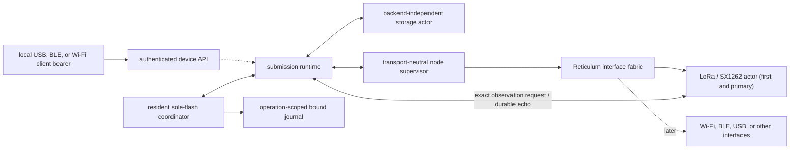

# Transport-neutral durable submission runtime

**Status:** `reticulum-submission-runtime` implements the portable, `no_std`
ordering loop between the sole storage actor and the permanent node supervisor.
The E290 image now keeps it in a resident sole-flash coordinator after strict
mount and explicit bounded-history recovery over the checked `node_journal`
partition. The node task gives that coordinator at most one operation-scoped
runtime attempt per outer loop beside the `NodeInterfaceSupervisor` and now
composes the exact radio authorized-frame request/durable-echo handoff. The
current E290 product profile retains 128 accepted-history entries in PSRAM and
rejects a 129th novel submission without mutation; an earlier one-entry
cross-layer fixture remains only historical composition qualification. Focused
runtime and E290 cross-layer tests, strict Clippy, and generic/ESP32-S3 target
checks pass. Portable API framing, immutable credential authority and store, the
qualification-session core, and job handoff are qualified. E290 boot now mounts,
performs bounded deterministic retire-then-cleanup recovery, and retains the
credential store without provisioning it. Authenticated USB and BLE session/API
lanes are composed and have bounded powered ADR 0009 credential/
API/DATA/peer-proof/status path.
Semantic schema 3 preserves exact authorization provenance through runtime
acceptance, remount, and replay while distinguishing generic RNS DATA from an
exact complete method-neutral LXMF-message intent. Current source additionally
composes the first outbound-initiator direct-Link packet path. Its fresh-Link,
one-packet success path has a
[bounded two-board powered record](e290-direct-link-powered-proof.md), and the
later
[same-Link reuse and replay record](e290-same-link-reuse-replay-powered-proof.md)
exercises two delivered submissions carrying one identical direct-only LXMF
wire through the composed reuse/replay path.

## Boundary

`SubmissionRuntime` owns the backend-independent mounted `StorageActor`, the
boot-recovery cursor, and the service phase. Mount, recovery, acceptance, and
live drive calls borrow one exact `BoundJournalAccess`; frame observations stay
backend-free. It does not own an executor, board, radio, RNode framing,
local USB/BLE/Wi-Fi session, or Reticulum interface implementation. A permanent
firmware task supplies those product concerns and advances the runtime one
bounded step at a time.

The node side is the narrow `SubmissionNodePort`. Its preparation request has
the native Reticulum destination and payload plus protocol/owner clocks and a
lease deadline; it deliberately has no interface identifier. The production
implementation for `NodeInterfaceSupervisor` asks the authoritative router to
choose from its eligible interfaces and exposes exact terminal, recovered, and
quarantined owners until durable projection allows acknowledgement. The same
port exposes only opaque Link lifecycle operations: poll one product Link,
query whether one exact Link has an active or unacknowledged terminal DATA
attempt, abort one exact unestablished Link, and prepare the complete durable
LXMF wire over one active Link. A direct terminal observation retains that
exact Link handle. On Link-DATA `DeliveryTimeout`, the runtime first persists
the failed submission's final record, then evicts the matching reusable entry
and returns a typed control step; permanent firmware closes the Link through
the normal authenticated supervisor path and routes any resulting ordinary
action. The runtime does not expose a LoRa radio or interface choice.



This keeps the immediate vertical slice LoRa-first without putting LoRa or the
SX1262 into the durable lifecycle contract. Adding another Reticulum interface
should change the interface fabric and product composition, not submission
records or runtime ordering. Local client connectivity is a separate boundary:
USB, BLE, or Wi-Fi may serve the device API without necessarily becoming a
Reticulum routing interface.

## Ordering contract

`SubmissionRuntime::mount` accepts only an already-formatted journal and starts
in `Recovering`. Firmware must call `recover_boot_step()` until it reports
`Complete`; live acceptance and scheduling fail closed until then. Each live
`drive_step()` performs at most one useful operation in durability-first order:

1. reconcile an ambiguous actor-owned flash mutation;
2. commit one pending projector record;
3. emit one ready post-durability Link-retirement control step, whose firmware
   consumer must synchronously close or retain every resulting ordinary action;
4. attempt one acknowledgement unlocked by a durable record;
5. observe one terminal owner, recovered owner, or new quarantine;
6. prepare one intent whose `Preparing` barrier is already durable; or
7. begin the durable `Queued -> Preparing` barrier for one queued intent.

This guarantees that packet entropy and attempt ownership are not created
before the no-replay barrier is committed, and that terminal or recovered
owners are not released before their disposition or audit is committed. The
E290 scheduler exposes a ready retirement only with an empty local ordinary
action-retention lane; a retained DATA frame may bypass quiescence only for
persistence, never for this control consequence.

## Automatic LXMF and direct-Link transaction

The current `Auto` implementation retains the exact signed LXMF wire while it
chooses a carrier. For each ready LXMF submission it:

1. prunes closed or unknown entries and reuses a matching usable
   product-initiated outbound Link from the fixed registry only when that exact
   Link has no active or unacknowledged terminal DATA attempt, while retaining
   a non-selectable `Stale` entry so it can revive;
2. otherwise tries the compatible destination-stripped opportunistic carrier
   when it fits the 391-byte Header-1 ceiling;
3. selects direct delivery when the carrier exceeds that ceiling or the actual
   routed opportunistic packet reports a smaller MDU;
4. emits and completes the ordinary tagged path-discovery transaction before
   creating a Link when no authenticated path is retained;
5. emits one generation-tagged Link-establishment offer, attaches the exact
   opaque Link handle returned by the node, and retains the identical
   LINKREQUEST through ordinary-router backpressure; and
6. starts a snapshotted hop-aware establishment deadline only after the router
   confirms the exact LINKREQUEST's first real interface dispatch. The window
   is the greater of 30 seconds or Reticulum's six-second first-hop plus
   per-retained-hop allowances, with one full-MTU serialization interval
   derived from the authoritative eligible-interface bitrate and a two-second
   guard for queue acceptance through physical radio completion.

An attached but undispatched request consumes none of the establishment
budget. An exact duplicate attachment or dispatch acknowledgement is
idempotent; a different offer, Link handle, or dispatch instant fails closed.
At the deadline, the runtime asks the node to discard that exact pending Link
before issuing a fresh generation for the still-durable message. Closed or
missing registry entries are pruned. A `Stale` entry is retained, remains
non-selectable, and continues consuming capacity while it may revive. Once a
matching Link is usable and idle, it wins over opportunistic delivery for later
short messages and the complete destination-prefixed wire is prepared as
context-`NONE` Link DATA. A busy matching Link does not prevent an otherwise
eligible short message from taking the opportunistic path. Direct-required or
routed-overflow work instead produces
`DirectLinkAttemptBackpressured { id, link }`, remains durably `Preparing`
without spinning, and does not create a second Link to the same destination.

Each direct attempt retains the exact Link handle beside its distinct
Link-DATA receipt kind. That Link remains occupied while the attempt is active
and after it becomes terminal until its exact durable acknowledgement releases
the upstream owner. A `DeliveryTimeout` retains its `PersistHandle` across both
normal append and ambiguous-I/O reconciliation; only the exact committed final
record releases the reusable-entry eviction and firmware close signal. That
signal retires the session even if native Reticulum state still reports the
Link as `Active`, covering a peer that restarted and lost its volatile half of
the session. The failed durable submission remains terminal
`Failed(DeliveryTimeout)` and is not silently retried; a waiting later direct
submission stays parked through retirement and then establishes a fresh Link.

This alpha intentionally owns only one serialized establishment transaction
and separately enforces one direct attempt per exact Link, but retains a fixed
reusable outbound-Link registry sized to the product's native Link table (four
entries for E290). It separately preflights the shared native table, where
inbound responder Links also consume capacity. If either owner is full, bounded
per-submission backpressure leaves the exact message durably `Preparing` and
the E290 retries after one second while pressure remains. Busy-Link
backpressure uses that same bounded retry schedule. Eligible short
opportunistic work and work on other usable cached Links are not head-of-line
blocked. Pressure is not a terminal submission failure. The lower node retains
its independent bounded-attempt capability; this serialization is a product
delivery policy, not a node-core limit. The alpha has no generic
capacity-pressure or LRU eviction policy and does not assume Link maintenance
will free a slot. Exact Link-DATA receipt timeout is the narrower implemented
retirement rule.
The runtime does not yet associate an authenticated responder Link with the
remote LXMF destination, so responder/backchannel reuse is deferred. A complete
wire that exceeds the active Link MDU also remains durably `Preparing` without
spinning; Resource transfer is deferred until it has bounded durable
allocation, correlation, and recovery.

Link transactions, cached Link handles, establishment/path clocks, retry
generations, and Resource-wait suppression are boot-volatile. The journal
retains the exact message bytes, but current boot recovery does not resume this
pre-I/O state: the storage model conservatively finalizes both `Preparing` and
`AwaitingDelivery` as `InterruptedByReset`. Durable pre-frame resume needs a
future schema/state distinction proving that no interface could have owned the
frame.

Within one boot, establishment expiry or loss clears the transaction and the
E290 firmware retries after its fixed one-second storage-service backoff. That
cycle is unbounded; neither a persisted retry budget nor a boot-local attempt
ceiling exists yet.

## Native authorized-frame seam

`TxFrame::observation()` produces `AuthorizedFrameObservation` from the exact
authorized native destination-DATA or Link-DATA bytes. The observation contains
the attempt correlation, selected interface, complete packet length, and a
SHA-256 recomputed from those bytes before any RNode/radio fragmentation.

The portable radio dispatcher retains every post-byte-exposure DATA completion,
its router ticket, and the exact observation. It sends a copy through a bounded
request handoff, but neither successful send nor request-channel readiness
releases the owner. The E290 node task retains and re-offers the identical value
through `offer_authorized_frame()` while it returns `Retain`. After
`drive_step()` makes the corresponding projector record durable, the same offer
returns `Durable` and the node echoes the full observation. Only an exactly
matching echo lets the dispatcher return the completion. Request pressure,
cancelled waits, and cancelled post-exposure TX preserve ownership; an
unexpected or mismatched echo disables the dispatcher while retaining the
completion, router ticket, expected value, and actual value. The copy-only
`DispatchReport` remains diagnostic and cannot stand in for this gate.

`Retain` also covers correct lifecycle races rather than treating them as
service faults: another physical mutation may temporarily own the actor, a
proof or timeout may have planned its terminal record before the frame arrives,
or an exact recovery acknowledgement may still be pending. Runtime steps clear
that pressure before the unchanged frame is re-offered. Correlation conflicts,
invalid lifecycle state, and latched storage/projector faults remain errors.

Durable state intentionally drops only the selected-interface scalar: packet
identity and attempt correlation are stable across an interface choice, while
the projector still cross-checks the complete length, frame digest, and attempt
token. A direct attempt additionally retains the distinct Link-DATA receipt
kind and Link handle through preparation, dispatch, proof, timeout,
cancellation, and terminal projection. Its receiver releases the explicit Link
proof only after the exact LXMF inbox record is durably committed (or
recognized as already durable). A portable integrated regression establishes a
real Link between two node cores, expires its direct receipt while native Link
state still appears active, injects and reconciles an ambiguous final-record
write reply, verifies durability before exact registry eviction and
authenticated close, and proves that the next direct submission requests a
fresh Link.
A second integrated regression holds a following direct-only submission while
the first attempt is active and while its terminal remains unacknowledged,
proves no second Link establishment is created, then prepares the follower on
the exact same `LinkHandle` after acknowledgement and delivers both. The
timeout variant proves that a follower remains parked until durability-first
retirement permits a fresh establishment.
The product profile owns 128 resident submissions; the one-entry harness below
remains a deliberately narrow composition fixture. Authenticated USB and BLE
clients can reach the composed handoff from a fresh local submission in the
powered E290 graph. Bounded opportunistic runs passed durable acceptance, LoRa
DATA/proof, terminal projection, exact peer import, and status recovery through
both host tools and the installed Expo client. The separate
[direct-Link run](e290-direct-link-powered-proof.md) forced a new Link with a
408-byte complete wire whose 392-byte carrier exceeded the 391-byte
opportunistic ceiling, then proved receiver commit, returned proof, sender
`Delivered`, and board/app restart persistence.
The later
[same-Link reuse and replay run](e290-same-link-reuse-replay-powered-proof.md)
started sender A from a fresh boot and delivered submissions `6` and `7`, which
used different idempotency keys but the identical direct-only 408-byte LXMF
wire and message ID beginning `9692c4`. Their 483-byte Reticulum packets had
distinct hashes and both reached `Delivered`, while the receiver projection advanced
by exactly one row. The source regressions qualify exact same-handle reuse and
`AlreadyDurable`; the client API exposes neither scalar, so the powered run
physically exercises rather than independently telemeters those properties.

## E290 cross-layer software qualification

The E290 library's two composition tests join the target-safe authenticated
adapter, one-entry acceptance service, real `SubmissionRuntime`, real
`NodeInterfaceSupervisor`, exact E290 LoRa airtime policy, authorized-frame
handoff, and real radio dispatcher around a scripted host radio and fake NOR.
They do not substitute a mock state machine for those product layers.

The happy path rejects unauthenticated and unauthorized mutation with zero NOR
writes, accepts one request, rejects a second novel request without a write,
and commits the `Preparing` barrier before the node consumes a DATA owner. It
then transmits through the LoRa dispatcher, retains the completion until exact
frame persistence unlocks the durable echo, projects a delivery timeout, checks
owner and foreign-principal status, and remounts the same durable final state.

The fault path exposes a DATA frame, queues an ordinary announce behind its
acknowledgement gate, then injects a permanent wrong journal binding.
`ActiveOwnerFailStopped` retains the frame, completion, router ticket, DATA
buffer, and queued ordinary work; it emits no durable acknowledgement and the
host radio records no later TX or RX. This closes historical
software-composition qualification for that one-entry fixture without making
an ESP32-S3, flash-power, RF, or current-capacity claim.

## Remaining product work and risks

- **E290 software composition:** boot validates the exact partition, mounts and
  recovers the runtime, allocates the current 128-entry submission profile in
  PSRAM, releases the temporary journal view, and transfers flash plus runtime
  into the resident coordinator. The coordinator then lends one fresh bound
  view per synchronous runtime call. The bounded radio request/durable-echo
  handoff, exact capacity rejection, and ADR 0005 failure states pass host and
  powered qualification. LoRa remains the first and primary Reticulum
  interface, and no second interface is a prerequisite.
- **First format:** runtime mount still never provisions storage. Before
  identity mutation, `IdentityPreflight::Vacant` is the independent durable
  authority for `provision_first(AllowFirstProvision)`. That operation accepts
  only erased media, an already-valid empty A1 journal, or monotonic-compatible
  cuts of the canonical A1 prefix/commit sequence; it never erases. Once an
  identity is committed, provisioning is skipped and strict mount alone may
  accept the journal. Flash-map, identity, announce-clock, and authorized fresh-
  journal provisioning failures remain boot-fatal. Existing-identity migration
  therefore needs a separate durable config intent.
- **Failure isolation:** after core boot, journal mount, supported-history, or
  recovery failure occurs before a gated DATA owner can exist and leaves the
  runtime unavailable inside the resident coordinator. Local durable submission
  admission stays closed, the journal is not driven, and route-only LoRa can
  continue. A permanent live runtime fault with no active gated owner can use
  the same `DisabledRouteOnly` degradation. With an unresolved authorized-frame
  owner, the E290 enters interface-local `ActiveOwnerFailStopped`: the node
  retains the observation without echoing it, the dispatcher retains its
  completion and router ticket, the same LoRa lease goes offline without a
  generation change, and fresh LoRa work stays stopped for the boot. A frame
  racing with route-only disable promotes to the same state. An identical echo
  already unlocked by durable projection remains releasable.
- **Resident flash ownership:** the E290 coordinator now owns `FlashStorage` and
  the optional mounted runtime for the life of the image. It creates only short-
  lived bound journal views, leaving one ownership point that can later
  serialize device-config, message-store, and OTA operations. The portable
  actor/runtime imposes no boot-lifetime borrow of the whole backend.
- **Projector retirement:** completed correlation slots still have no proved
  retirement handshake. A terminal final plus acknowledgement is insufficient:
  valid recovery can arrive later, and quarantine has no release action. The
  sole node owner must eventually mint an exact transport-neutral quiescence
  proof after every possible producer is terminal and drained before a slot can
  be reused.
- **Journal retention:** semantic schema 3 permanently retains every submission record
  and idempotency history, has a 154-submission lifetime admission limit, and
  has no eviction or garbage collection. A bounded retention/export/migration
  policy is required before this becomes a long-lived message service.
- **Client edge:** authenticated API dispatch, immutable credential authority,
  framing, live pairing, and boot-lifetime job handoff exist, durable
  authorization provenance reaches the journal, and the resident coordinator
  retains the boot-mounted credential store and its admission state. USB and
  BLE serving are wired to the runtime; the installed Expo client has paired,
  submitted, imported, and persisted bidirectional LXMF over BLE-to-LoRa.
  Wi-Fi serving is build/host qualified but awaits the disconnected field test.
  `ProductStorageCoordinator` implements the target-safe `SubmissionPort`
  under the current 128-entry resident profile.
- **Direct Link:** source tests cover path-first gating, exact offer/handle
  correlation, first-dispatch-started timeout and abort, active-Link reuse,
  closed/unknown pruning, non-selectable `Stale` retention, full-registry
  `Preparing` backpressure, exact-Link single-flight through terminal
  acknowledgement, same-handle reuse, timeout-follower parking, complete-wire
  Link-DATA preparation, typed receipt proof/timeout, and the authorized-frame
  durability barrier. Powered runs cover one bounded fresh-Link success plus
  two distinct submissions carrying an identical direct-only LXMF wire through
  the composed reuse/replay path. Responder/backchannel reuse, multiple
  simultaneous establishment transactions, Resource transfer, the broader
  fault/pressure matrix, durable pre-frame reset recovery, and a persisted or
  boot-local retry budget remain product work.
- **Powered qualification:** integrated power-cut/brownout, watchdog, flash
  contention, compaction, endurance, stack/static-layout, and radio-deadline
  tests remain product gates. The source-`96e38aa` two-board smoke established
  strict empty-journal mount, resident storage availability, and continuing
  ordinary TX only; no external submission or durability-gated DATA ran.

## Focused validation

```sh
cargo test --locked -p reticulum-submission-runtime
cargo clippy --locked -p reticulum-submission-runtime --all-targets -- -D warnings
cargo check --locked -p reticulum-submission-runtime \
  --target riscv32imac-unknown-none-elf
cargo +esp check --locked -p reticulum-submission-runtime \
  --target xtensa-esp32s3-none-elf
```

The runtime tests include the complete barrier/frame/terminal/ack ordering
path, retention across a lost write reply, permanent frame-persistence failure
without false durability or acknowledgement, pre-frame terminal pressure,
recovery-acknowledgement pressure, retry-versus-permanent error classification,
reboot recovery, wrong-binding rejection before node work, opportunistic
overflow escalation, path-first direct selection, exact establishment control,
active-Link registry reuse, exact-Link Active/Terminal single-flight,
same-handle reuse after acknowledgement, timeout-follower parking and fresh
establishment after retirement, closed/unknown pruning, `Stale` retention,
full-pressure, and deferred Resource behavior.
