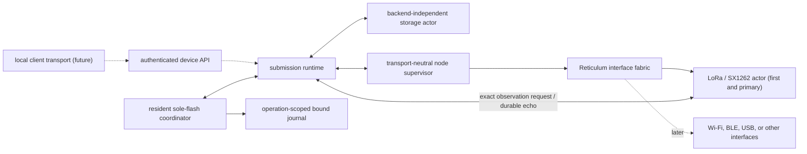

# Transport-neutral durable submission runtime

**Status:** `reticulum-submission-runtime` implements the portable, `no_std`
ordering loop between the sole storage actor and the permanent node supervisor.
The E290 image now keeps it in a resident sole-flash coordinator after strict
mount and explicit bounded-history recovery over the checked `node_journal`
partition. The node task gives that coordinator at most one operation-scoped
runtime attempt per outer loop beside the `NodeInterfaceSupervisor` and now
composes the exact radio authorized-frame request/durable-echo handoff. A
one-entry accepted-history cap exists only for composition qualification and is
not a product-capacity commitment. Eight focused runtime tests, two E290
cross-layer composition tests, strict Clippy, and generic/ESP32-S3 target checks
pass. Portable API framing, immutable credential authority, the qualification-
session core, and job handoff are qualified; live external admission remains
blocked by credential persistence/pairing, firmware composition, and a bearer.
Semantic schema 2 now preserves exact authorization provenance through runtime
acceptance, remount, and replay.

## Boundary

`SubmissionRuntime` owns the backend-independent mounted `StorageActor`, the
boot-recovery cursor, and the service phase. Mount, recovery, acceptance, and
live drive calls borrow one exact `BoundJournalAccess`; frame observations stay
backend-free. It does not own an executor, board, radio, RNode framing,
local USB/BLE/Wi-Fi session, or Reticulum interface implementation. A permanent
firmware task supplies those product concerns and advances the runtime one
bounded step at a time.

The node side is the narrow `SubmissionNodePort`. Its preparation request has
the native Reticulum destination and payload plus protocol/owner clocks and a
lease deadline; it deliberately has no interface identifier. The production
implementation for `NodeInterfaceSupervisor` asks the authoritative router to
choose from its eligible interfaces and exposes exact terminal, recovered, and
quarantined owners until durable projection allows acknowledgement.



This keeps the immediate vertical slice LoRa-first without putting LoRa or the
SX1262 into the durable lifecycle contract. Adding another Reticulum interface
should change the interface fabric and product composition, not submission
records or runtime ordering. Local client connectivity is a separate boundary:
USB, BLE, or Wi-Fi may serve the device API without necessarily becoming a
Reticulum routing interface.

## Ordering contract

`SubmissionRuntime::mount` accepts only an already-formatted journal and starts
in `Recovering`. Firmware must call `recover_boot_step()` until it reports
`Complete`; live acceptance and scheduling fail closed until then. Each live
`drive_step()` performs at most one useful operation in durability-first order:

1. reconcile an ambiguous actor-owned flash mutation;
2. commit one pending projector record;
3. attempt one acknowledgement unlocked by a durable record;
4. observe one terminal owner, recovered owner, or new quarantine;
5. prepare one intent whose `Preparing` barrier is already durable; or
6. begin the durable `Queued -> Preparing` barrier for one queued intent.

This guarantees that packet entropy and attempt ownership are not created
before the no-replay barrier is committed, and that terminal or recovered
owners are not released before their disposition or audit is committed.

## Native authorized-frame seam

`TxFrame::observation()` produces `AuthorizedFrameObservation` from the exact
authorized native DATA bytes. The observation contains the attempt correlation,
selected interface, complete packet length, and a SHA-256 recomputed from those
bytes before any RNode/radio fragmentation.

The portable radio dispatcher retains every post-byte-exposure DATA completion,
its router ticket, and the exact observation. It sends a copy through a bounded
request handoff, but neither successful send nor request-channel readiness
releases the owner. The E290 node task retains and re-offers the identical value
through `offer_authorized_frame()` while it returns `Retain`. After
`drive_step()` makes the corresponding projector record durable, the same offer
returns `Durable` and the node echoes the full observation. Only an exactly
matching echo lets the dispatcher return the completion. Request pressure,
cancelled waits, and cancelled post-exposure TX preserve ownership; an
unexpected or mismatched echo disables the dispatcher while retaining the
completion, router ticket, expected value, and actual value. The copy-only
`DispatchReport` remains diagnostic and cannot stand in for this gate.

`Retain` also covers correct lifecycle races rather than treating them as
service faults: another physical mutation may temporarily own the actor, a
proof or timeout may have planned its terminal record before the frame arrives,
or an exact recovery acknowledgement may still be pending. Runtime steps clear
that pressure before the unchanged frame is re-offered. Correlation conflicts,
invalid lifecycle state, and latched storage/projector faults remain errors.

Durable state intentionally drops only the selected-interface scalar: packet
identity and attempt correlation are stable across an interface choice, while
the projector still cross-checks the complete length, frame digest, and attempt
token. The product has a one-entry qualification cap but no external admission
lane, so production cannot yet reach the composed handoff from a fresh local
submission; the host composition harness drives the same semantic boundaries
directly.

## E290 cross-layer software qualification

The E290 library's two composition tests join the target-safe authenticated
adapter, one-entry acceptance service, real `SubmissionRuntime`, real
`NodeInterfaceSupervisor`, exact E290 LoRa airtime policy, authorized-frame
handoff, and real radio dispatcher around a scripted host radio and fake NOR.
They do not substitute a mock state machine for those product layers.

The happy path rejects unauthenticated and unauthorized mutation with zero NOR
writes, accepts one request, rejects a second novel request without a write,
and commits the `Preparing` barrier before the node consumes a DATA owner. It
then transmits through the LoRa dispatcher, retains the completion until exact
frame persistence unlocks the durable echo, projects a delivery timeout, checks
owner and foreign-principal status, and remounts the same durable final state.

The fault path exposes a DATA frame, queues an ordinary announce behind its
acknowledgement gate, then injects a permanent wrong journal binding.
`ActiveOwnerFailStopped` retains the frame, completion, router ticket, DATA
buffer, and queued ordinary work; it emits no durable acknowledgement and the
host radio records no later TX or RX. This closes software composition
qualification for the one-entry profile without making an ESP32-S3, flash-power,
or RF claim.

## Remaining product work and risks

- **E290 software composition:** boot validates the exact partition, mounts and
  recovers the runtime, permits at most one accepted historical submission for
  composition qualification, releases the
  temporary journal view, and transfers flash plus runtime into the resident
  coordinator. The coordinator then lends one fresh bound view per synchronous
  runtime call. The bounded radio request/durable-echo handoff, one-entry cap,
  and ADR 0005 failure states now pass cross-layer host composition tests. LoRa
  remains the first and primary interface, and no second interface is a
  prerequisite.
- **First format:** runtime mount still never provisions storage. Before
  identity mutation, `IdentityPreflight::Vacant` is the independent durable
  authority for `provision_first(AllowFirstProvision)`. That operation accepts
  only erased media, an already-valid empty A1 journal, or monotonic-compatible
  cuts of the canonical A1 prefix/commit sequence; it never erases. Once an
  identity is committed, provisioning is skipped and strict mount alone may
  accept the journal. Flash-map, identity, announce-clock, and authorized fresh-
  journal provisioning failures remain boot-fatal. Existing-identity migration
  therefore needs a separate durable config intent.
- **Failure isolation:** after core boot, journal mount, supported-history, or
  recovery failure occurs before a gated DATA owner can exist and leaves the
  runtime unavailable inside the resident coordinator. Local durable submission
  admission stays closed, the journal is not driven, and route-only LoRa can
  continue. A permanent live runtime fault with no active gated owner can use
  the same `DisabledRouteOnly` degradation. With an unresolved authorized-frame
  owner, the E290 enters interface-local `ActiveOwnerFailStopped`: the node
  retains the observation without echoing it, the dispatcher retains its
  completion and router ticket, the same LoRa lease goes offline without a
  generation change, and fresh LoRa work stays stopped for the boot. A frame
  racing with route-only disable promotes to the same state. An identical echo
  already unlocked by durable projection remains releasable.
- **Resident flash ownership:** the E290 coordinator now owns `FlashStorage` and
  the optional mounted runtime for the life of the image. It creates only short-
  lived bound journal views, leaving one ownership point that can later
  serialize device-config, message-store, and OTA operations. The portable
  actor/runtime imposes no boot-lifetime borrow of the whole backend.
- **Projector retirement:** completed correlation slots still have no proved
  retirement handshake. A terminal final plus acknowledgement is insufficient:
  valid recovery can arrive later, and quarantine has no release action. The
  sole node owner must eventually mint an exact transport-neutral quiescence
  proof after every possible producer is terminal and drained before a slot can
  be reused.
- **Journal retention:** semantic schema 2 permanently retains every submission record
  and idempotency history, has a 162-submission lifetime admission limit, and
  has no eviction or garbage collection. A bounded retention/export/migration
  policy is required before this becomes a long-lived message service.
- **Client edge:** authenticated API dispatch, immutable credential authority,
  framing, the qualification-session core, and boot-lifetime job handoff exist,
  and durable authorization provenance now reaches the journal. Persistent
  provisioning/pairing, firmware composition, and USB/BLE/Wi-Fi serving are not
  wired to the runtime.
  `ProductStorageCoordinator`
  implements the target-safe `SubmissionPort` under the one-entry qualification
  cap, but no external caller reaches it.
- **Powered qualification:** integrated power-cut/brownout, watchdog, flash
  contention, compaction, endurance, stack/static-layout, and radio-deadline
  tests remain product gates.

## Focused validation

```sh
cargo test --locked -p reticulum-submission-runtime
cargo clippy --locked -p reticulum-submission-runtime --all-targets -- -D warnings
cargo check --locked -p reticulum-submission-runtime \
  --target riscv32imac-unknown-none-elf
cargo +esp check --locked -p reticulum-submission-runtime \
  --target xtensa-esp32s3-none-elf
```

The eight runtime tests include the complete barrier/frame/terminal/ack ordering
path, retention across a lost write reply, permanent frame-persistence failure
without false durability or acknowledgement, pre-frame terminal pressure,
recovery-acknowledgement pressure, retry-versus-permanent error classification,
reboot recovery, and wrong-binding rejection before node work.
